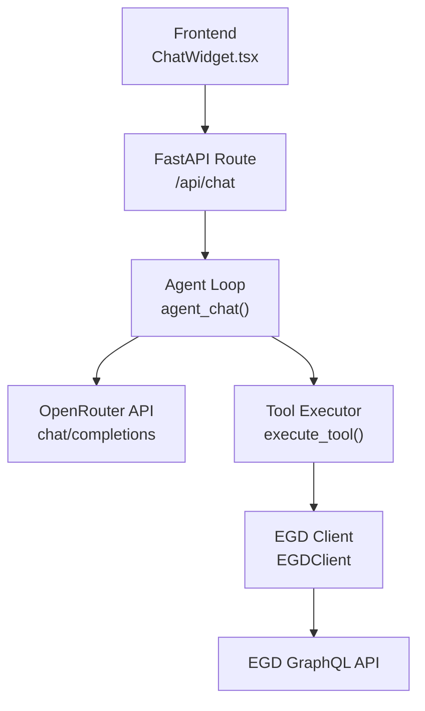
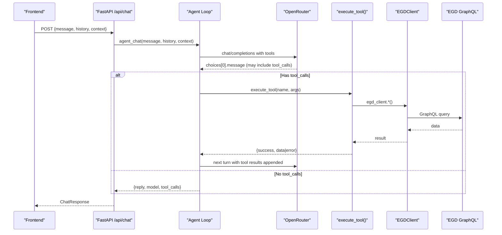
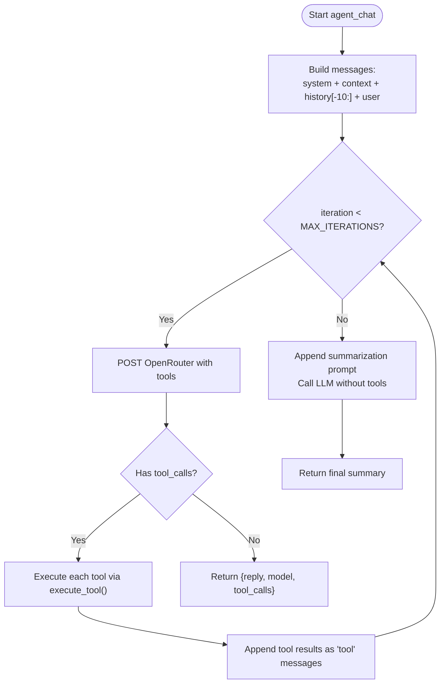
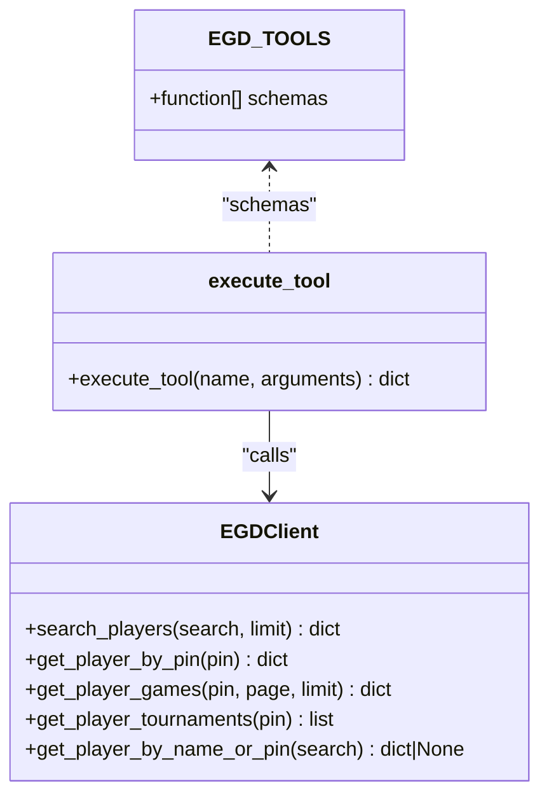
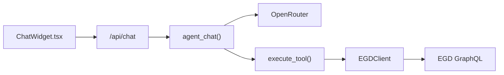

# Chat Agent

<cite>
**Referenced Files in This Document**
- [chat_agent.py](file://backend/app/services/chat_agent.py)
- [egd_tools.py](file://backend/app/services/egd_tools.py)
- [egd_client.py](file://backend/app/services/egd_client.py)
- [chat.py](file://backend/app/routers/chat.py)
- [chat.py](file://backend/app/models/chat.py)
- [ChatWidget.tsx](file://frontend/src/components/ChatWidget.tsx)
- [client.ts](file://frontend/src/api/client.ts)
- [ARCHITECTURE.md](file://docs/ARCHITECTURE.md)
- [AGENT_DESIGN.md](file://docs/AGENT_DESIGN.md)
</cite>

## Table of Contents
1. [Introduction](#introduction)
2. [Project Structure](#project-structure)
3. [Core Components](#core-components)
4. [Architecture Overview](#architecture-overview)
5. [Detailed Component Analysis](#detailed-component-analysis)
6. [Dependency Analysis](#dependency-analysis)
7. [Performance Considerations](#performance-considerations)
8. [Troubleshooting Guide](#troubleshooting-guide)
9. [Conclusion](#conclusion)
10. [Appendices](#appendices)

## Introduction
This document explains the agentic chat system that powers GoNow’s AI assistant. The agent uses OpenRouter’s native tool calling to autonomously decide when and how to query the European Go Database (EGD). It maintains conversation context, iteratively reasons through user queries, executes tools, and synthesizes a final answer. The system is designed for clarity, reliability, and cost efficiency while providing rich insights into Go player statistics and performance.

## Project Structure
The chat feature spans backend services, API routes, models, and a lightweight frontend widget:
- Backend services implement the agent loop, tool schemas and execution, and EGD GraphQL client with caching.
- A FastAPI route exposes an endpoint that delegates to the agent.
- Pydantic models define request/response contracts.
- Frontend provides a floating chat UI that sends messages and displays responses.

**Diagram sources**
- [chat.py:1-95](file://backend/app/routers/chat.py#L1-L95)
- [chat_agent.py:1-154](file://backend/app/services/chat_agent.py#L1-L154)
- [egd_tools.py:1-212](file://backend/app/services/egd_tools.py#L1-L212)
- [egd_client.py:1-197](file://backend/app/services/egd_client.py#L1-L197)
- [ChatWidget.tsx:1-240](file://frontend/src/components/ChatWidget.tsx#L1-L240)
- [client.ts:1-86](file://frontend/src/api/client.ts#L1-L86)

**Section sources**
- [ARCHITECTURE.md:1-99](file://docs/ARCHITECTURE.md#L1-L99)

## Core Components
- Agentic chat loop: orchestrates message building, OpenRouter calls, tool invocation, and response synthesis.
- Tool definitions and executor: declares OpenAI-compatible function schemas and dispatches to EGD operations.
- EGD client: GraphQL wrapper with in-memory caching and typed queries.
- API route: validates requests and returns structured responses.
- Models: Pydantic types for chat messages and responses.
- Frontend widget: minimal UI for sending messages and displaying results.

Key responsibilities:
- Maintain conversation history and optional page context.
- Decide when to call tools versus provide direct answers via LLM reasoning.
- Enforce iteration limits to prevent infinite loops.
- Handle errors from network timeouts, LLM API failures, and tool execution issues.

**Section sources**
- [chat_agent.py:1-154](file://backend/app/services/chat_agent.py#L1-L154)
- [egd_tools.py:1-212](file://backend/app/services/egd_tools.py#L1-L212)
- [egd_client.py:1-197](file://backend/app/services/egd_client.py#L1-L197)
- [chat.py:1-95](file://backend/app/routers/chat.py#L1-L95)
- [chat.py:1-21](file://backend/app/models/chat.py#L1-L21)
- [ChatWidget.tsx:1-240](file://frontend/src/components/ChatWidget.tsx#L1-L240)
- [client.ts:1-86](file://frontend/src/api/client.ts#L1-L86)

## Architecture Overview
The agent follows a ReAct-like pattern implemented via OpenRouter’s native tool calling:
- Build messages including system prompt, optional context, recent history, and current user message.
- Send to OpenRouter with tool schemas attached.
- If the model responds with tool_calls, execute them server-side and append results as tool messages.
- Repeat until the model produces a text-only response or max iterations are reached.
- On reaching max iterations, force a final summarization turn without tools.

**Diagram sources**
- [chat.py:1-95](file://backend/app/routers/chat.py#L1-L95)
- [chat_agent.py:1-154](file://backend/app/services/chat_agent.py#L1-L154)
- [egd_tools.py:1-212](file://backend/app/services/egd_tools.py#L1-L212)
- [egd_client.py:1-197](file://backend/app/services/egd_client.py#L1-L197)

## Detailed Component Analysis

### Agentic Chat Loop
Responsibilities:
- Compose messages array with system prompt, optional context, last N history entries, and user message.
- Call OpenRouter with tool schemas; parse response for tool_calls vs. final text.
- Execute tool calls sequentially, append results, and continue loop.
- Enforce maximum iterations; if exceeded, make one final call without tools to force a summary.
- Return reply, model name used, and list of executed tool names.

Key behaviors:
- Iterative reasoning loop implements ReAct: Reason → Act → Observe → Repeat.
- Context management caps history to last 10 messages to control token usage.
- Model selection is configurable via environment variable; default is optimized for speed/cost.
- Error handling includes HTTP status checks and JSON parsing fallbacks.

**Diagram sources**
- [chat_agent.py:1-154](file://backend/app/services/chat_agent.py#L1-L154)

**Section sources**
- [chat_agent.py:1-154](file://backend/app/services/chat_agent.py#L1-L154)

### Tool Calling Mechanism
Tool definitions:
- search_player(query): Search by name or PIN.
- get_player_details(pin): Full profile with rating history.
- get_player_rating_history(pin): Rating evolution over time.
- get_player_games(pin, limit?): Recent games.
- compare_players(pin1, pin2): Side-by-side comparison.

Execution:
- execute_tool(name, arguments) dispatches to EGDClient methods.
- Each tool returns a standardized dict with success flag and payload or error details.
- Errors are wrapped to ensure robustness even if underlying calls fail.

Decision-making:
- The LLM decides when to call tools based on its understanding of the user’s intent and available information.
- Tools are only invoked when necessary; otherwise, the LLM directly answers.

**Diagram sources**
- [egd_tools.py:1-212](file://backend/app/services/egd_tools.py#L1-L212)
- [egd_client.py:1-197](file://backend/app/services/egd_client.py#L1-L197)

**Section sources**
- [egd_tools.py:1-212](file://backend/app/services/egd_tools.py#L1-L212)
- [egd_client.py:1-197](file://backend/app/services/egd_client.py#L1-L197)

### Context Management
- System prompt defines persona, domain knowledge, and guidance for presenting data.
- Optional context can be injected (e.g., current page/player data) to ground responses.
- History is limited to the last 10 messages to balance continuity and token budget.
- Messages are appended in order: system, optional context, history, then user.

Benefits:
- Keeps responses relevant to ongoing conversations.
- Reduces unnecessary tool calls by providing immediate context.
- Prevents unbounded growth of conversation state.

**Section sources**
- [chat_agent.py:1-154](file://backend/app/services/chat_agent.py#L1-L154)

### Integration with OpenRouter API
- Endpoint: https://openrouter.ai/api/v1/chat/completions
- Authentication via Bearer token from environment.
- Model selection via CHAT_MODEL env var; default chosen for speed/cost.
- Max tokens capped per call to control output size.
- Tool schemas provided alongside messages to enable function calling.

Model selection strategies and cost optimization:
- Default model is optimized for fast responses and low cost while supporting tool calling.
- Environment configuration allows switching to other models if needed.
- Limiting history length and using concise prompts reduce token consumption.

**Section sources**
- [chat_agent.py:1-154](file://backend/app/services/chat_agent.py#L1-L154)
- [AGENT_DESIGN.md:230-249](file://docs/AGENT_DESIGN.md#L230-L249)

### Decision-Making Process: Tools vs Direct Responses
- The LLM evaluates whether it has sufficient information to answer directly.
- If external data is required, it emits tool_calls with appropriate parameters.
- After receiving tool results, it may call additional tools or synthesize a final answer.
- The agent enforces a maximum number of iterations to avoid infinite loops.

Practical implications:
- Simple factual questions often yield direct answers without tool calls.
- Complex queries involving specific players or comparisons trigger multi-step tool orchestration.

**Section sources**
- [chat_agent.py:1-154](file://backend/app/services/chat_agent.py#L1-L154)
- [AGENT_DESIGN.md:70-124](file://docs/AGENT_DESIGN.md#L70-L124)

### Error Handling
Network and API errors:
- HTTP responses raise status exceptions; caught and surfaced to callers.
- Timeouts are configured for both OpenRouter and EGD clients.

Tool execution errors:
- Unknown tool names return explicit error payloads.
- Missing or invalid parameters handled gracefully; JSON decoding errors fall back to empty args.
- EGD client raises ValueError on GraphQL errors; tools wrap exceptions and return failure payloads.

Fallback behavior:
- If max iterations are reached, the agent appends a summarization prompt and forces a final text response.

User-facing behavior:
- Frontend shows a generic error message on failures and clears loading states.

**Section sources**
- [chat_agent.py:1-154](file://backend/app/services/chat_agent.py#L1-L154)
- [egd_tools.py:1-212](file://backend/app/services/egd_tools.py#L1-L212)
- [egd_client.py:1-197](file://backend/app/services/egd_client.py#L1-L197)
- [ChatWidget.tsx:1-240](file://frontend/src/components/ChatWidget.tsx#L1-L240)

### Examples of Autonomous Behavior and Tool Orchestration
- Player lookup and rating insight:
  - User asks about a specific player’s rating; agent searches, retrieves details, and summarizes trends.
- Multi-step comparison:
  - User requests comparing two players; agent fetches profiles and constructs a side-by-side analysis.
- Game history exploration:
  - User asks for recent games; agent retrieves game records and highlights patterns.

These scenarios demonstrate the agent’s ability to plan tool calls, interpret results, and produce coherent narratives.

**Section sources**
- [AGENT_DESIGN.md:54-68](file://docs/AGENT_DESIGN.md#L54-L68)

## Dependency Analysis
High-level dependencies:
- FastAPI route depends on agent service.
- Agent depends on tool executor and OpenRouter.
- Tool executor depends on EGD client.
- EGD client depends on httpx and environment variables.
- Frontend depends on axios and backend endpoints.

**Diagram sources**
- [chat.py:1-95](file://backend/app/routers/chat.py#L1-L95)
- [chat_agent.py:1-154](file://backend/app/services/chat_agent.py#L1-L154)
- [egd_tools.py:1-212](file://backend/app/services/egd_tools.py#L1-L212)
- [egd_client.py:1-197](file://backend/app/services/egd_client.py#L1-L197)
- [ChatWidget.tsx:1-240](file://frontend/src/components/ChatWidget.tsx#L1-L240)
- [client.ts:1-86](file://frontend/src/api/client.ts#L1-L86)

**Section sources**
- [ARCHITECTURE.md:1-99](file://docs/ARCHITECTURE.md#L1-L99)

## Performance Considerations
- In-memory caching in EGD client reduces repeated API calls with TTL-based expiration.
- Limiting conversation history to last 10 messages controls token usage and latency.
- Configurable model selection enables balancing quality and cost.
- Sequential tool execution avoids concurrency complexity; suitable for single-API use cases.
- Timeouts protect against slow or unresponsive external services.

Recommendations:
- Monitor token usage and adjust history cap or max_tokens as needed.
- Consider parallel tool calls only if multiple independent data sources are introduced.
- Use cheaper models for simple queries and reserve higher-quality models for complex tasks.

[No sources needed since this section provides general guidance]

## Troubleshooting Guide
Common issues and resolutions:
- Missing OpenRouter key:
  - Symptom: Response indicates chat not configured.
  - Resolution: Set OPENROUTER_API_KEY in backend environment.
- Network timeouts:
  - Symptom: Requests hang or fail with timeout.
  - Resolution: Increase timeouts or check network connectivity; verify OpenRouter and EGD availability.
- GraphQL errors:
  - Symptom: Tool execution fails due to invalid queries or permissions.
  - Resolution: Validate EGD_API_TOKEN and query fields; inspect error payloads.
- Unknown tool names:
  - Symptom: Tool execution returns unknown tool error.
  - Resolution: Ensure tool schema matches execute_tool implementation.
- Frontend errors:
  - Symptom: Generic “encountered an error” message.
  - Resolution: Check backend logs and network tab; confirm CORS and endpoint paths.

Operational tips:
- Enable logging around agent loop and tool execution for diagnostics.
- Inspect returned tool_calls list to understand agent decisions.
- Use quick prompts in the UI to validate typical flows.

**Section sources**
- [chat_agent.py:1-154](file://backend/app/services/chat_agent.py#L1-L154)
- [egd_tools.py:1-212](file://backend/app/services/egd_tools.py#L1-L212)
- [egd_client.py:1-197](file://backend/app/services/egd_client.py#L1-L197)
- [ChatWidget.tsx:1-240](file://frontend/src/components/ChatWidget.tsx#L1-L240)

## Conclusion
The GoNow chat agent leverages OpenRouter’s native tool calling to deliver autonomous, data-driven insights about Go players. Its iterative reasoning loop, robust context management, and clear separation of concerns make it reliable and maintainable. With configurable models and efficient caching, the system balances performance and cost while offering rich functionality through well-defined tools.

[No sources needed since this section summarizes without analyzing specific files]

## Appendices

### API Endpoints
- POST /api/chat
  - Request body: message, optional context, optional history
  - Response: reply, model, tool_calls

**Section sources**
- [chat.py:1-95](file://backend/app/routers/chat.py#L1-L95)
- [client.ts:1-86](file://frontend/src/api/client.ts#L1-L86)

### Configuration Variables
- OPENROUTER_API_KEY
- CHAT_MODEL
- CHAT_MAX_ITERATIONS
- EGD_API_TOKEN

**Section sources**
- [AGENT_DESIGN.md:230-249](file://docs/AGENT_DESIGN.md#L230-L249)