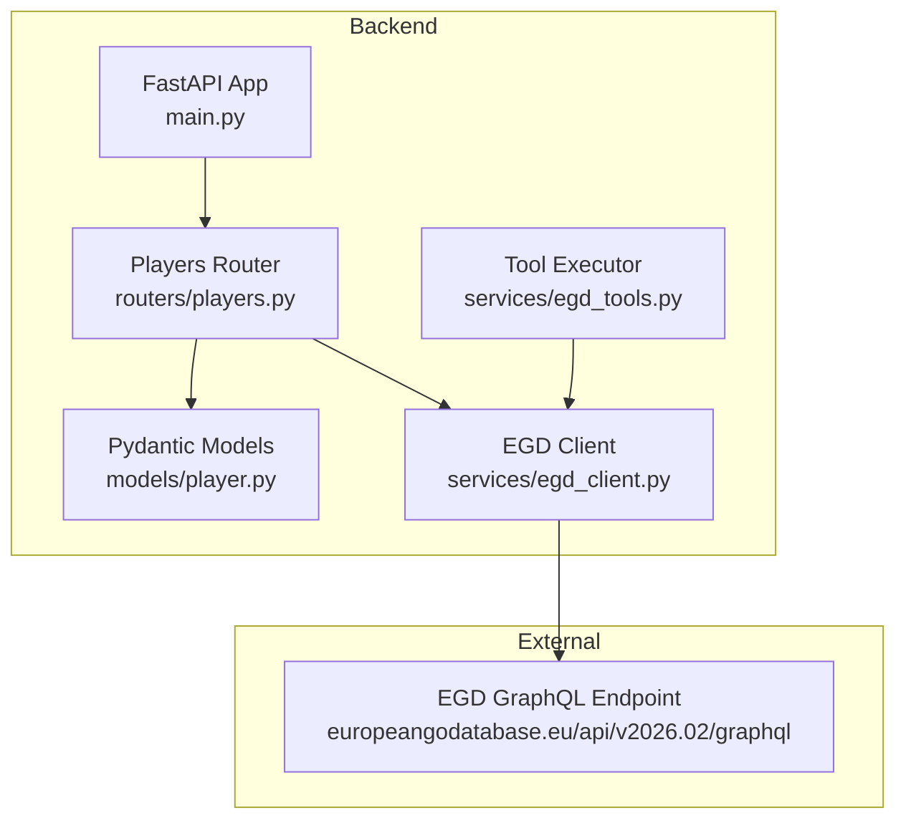
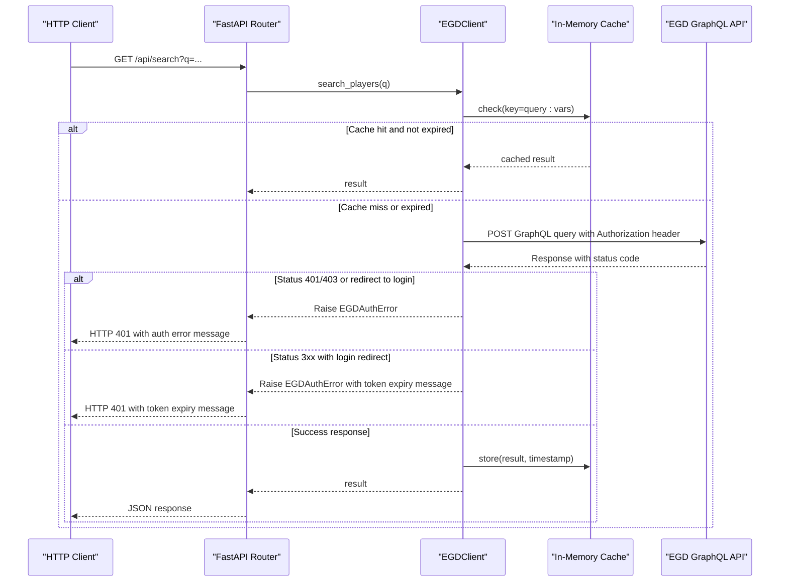
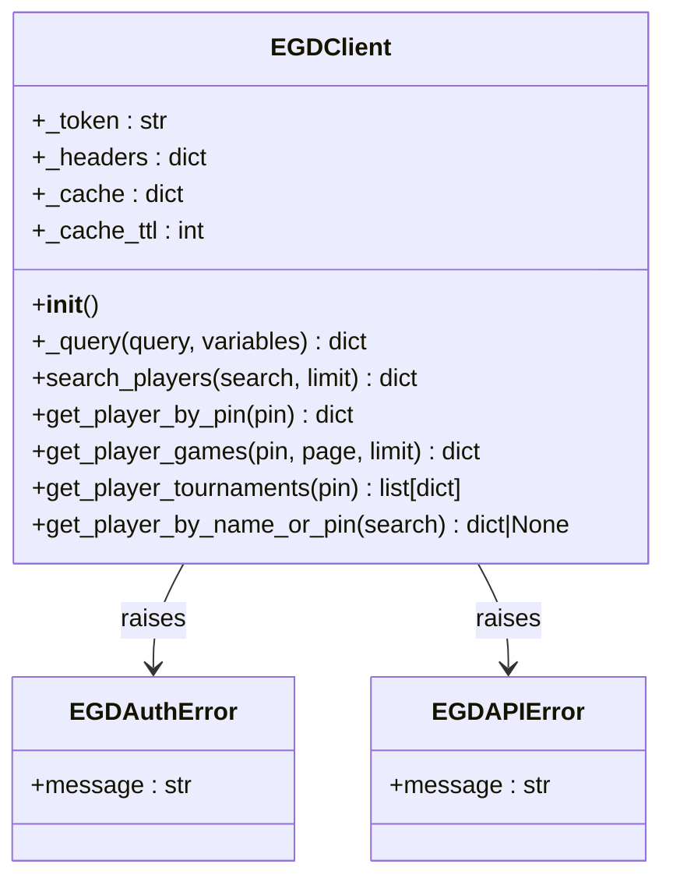
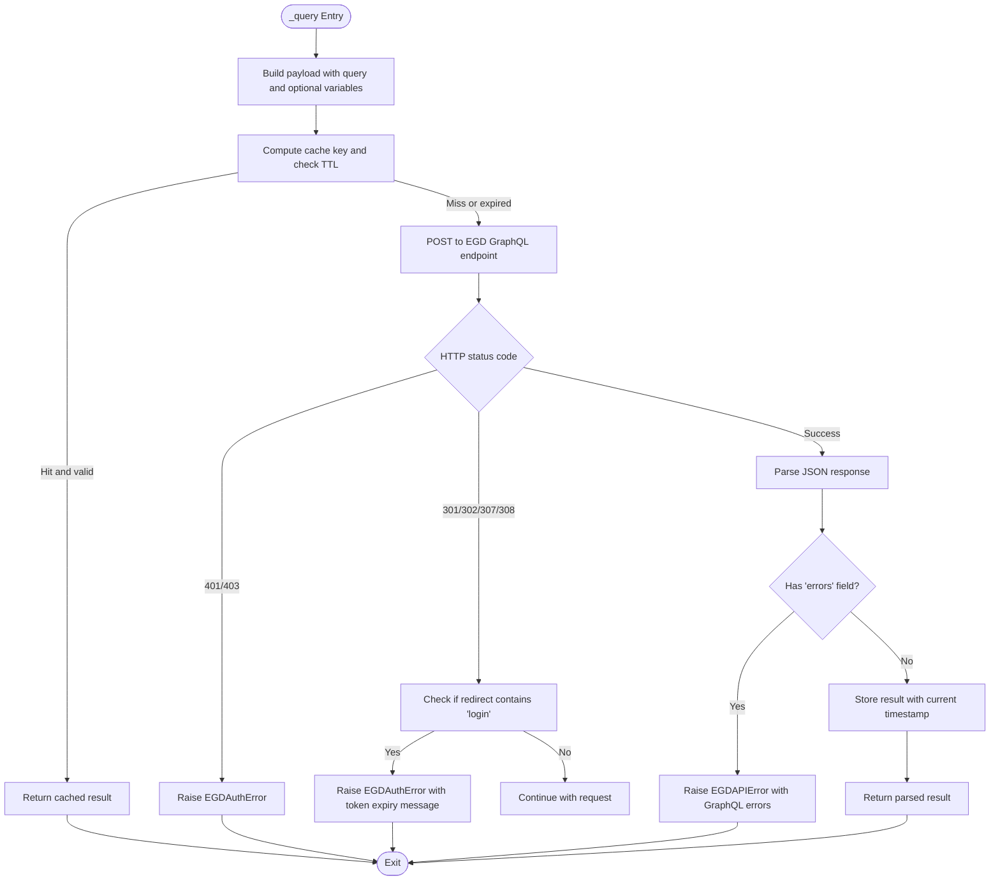
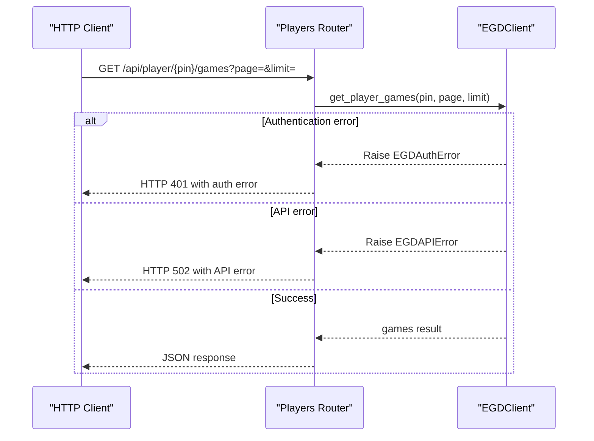
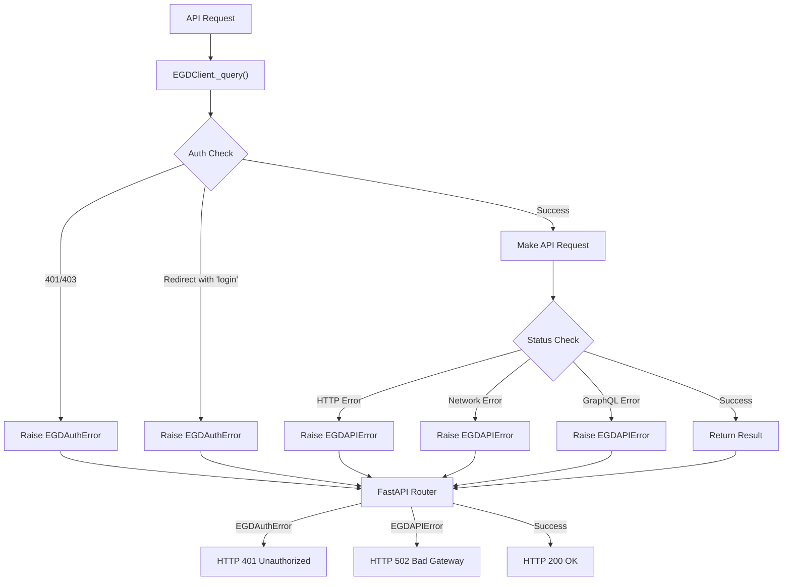
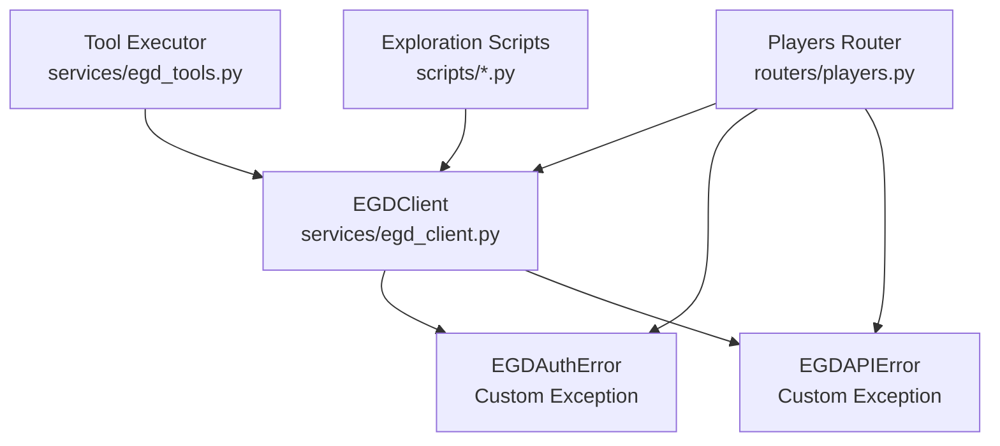

# EGD Client

<cite>
**Referenced Files in This Document**
- [egd_client.py](file://backend/app/services/egd_client.py)
- [players.py](file://backend/app/routers/players.py)
- [player.py](file://backend/app/models/player.py)
- [EGD_API.md](file://docs/EGD_API.md)
- [explore_api.py](file://scripts/explore_api.py)
- [explore_player.py](file://scripts/explore_player.py)
- [egd_tools.py](file://backend/app/services/egd_tools.py)
</cite>

## Update Summary
**Changes Made**
- Added comprehensive custom exception handling with EGDAuthError and EGDAPIError classes
- Enhanced authentication error detection including redirect-based token expiration checks
- Updated all router endpoints to properly handle authentication and API errors
- Improved error handling patterns for HTTP status codes 401/403 and network errors
- Added detailed error messages with actionable guidance for users

## Table of Contents
1. [Introduction](#introduction)
2. [Project Structure](#project-structure)
3. [Core Components](#core-components)
4. [Architecture Overview](#architecture-overview)
5. [Detailed Component Analysis](#detailed-component-analysis)
6. [Exception Handling Framework](#exception-handling-framework)
7. [Dependency Analysis](#dependency-analysis)
8. [Performance Considerations](#performance-considerations)
9. [Troubleshooting Guide](#troubleshooting-guide)
10. [Conclusion](#conclusion)
11. [Appendices](#appendices)

## Introduction
This document provides comprehensive documentation for the European Go Database (EGD) GraphQL API client implementation used by the backend service. It focuses on the EGDClient class architecture, authentication with Bearer tokens, asynchronous HTTP communication using httpx, and a TTL-based in-memory caching strategy. The client now includes robust custom exception handling for authentication failures and API errors, providing clear error messages and actionable guidance for troubleshooting. It also documents all provided GraphQL query methods: search_players, get_player_by_pin, get_player_games, and get_player_tournaments. Error handling patterns, timeout configuration, and rate limiting considerations are included, along with usage examples showing how to integrate the client into other services and transform response data.

## Project Structure
The EGD client is implemented as an async Python module that encapsulates HTTP calls to the EGD GraphQL endpoint. It is consumed by FastAPI routes and tooling utilities. The repository includes:
- A dedicated client module implementing the EGDClient class with enhanced error handling
- FastAPI routers exposing endpoints that use the client with proper exception handling
- Pydantic models describing player-related data structures
- Documentation for the EGD GraphQL schema
- Exploration scripts demonstrating direct API usage
- Tool executor functions for AI-driven workflows



**Diagram sources**
- [main.py](file://backend/app/main.py)
- [players.py](file://backend/app/routers/players.py)
- [player.py](file://backend/app/models/player.py)
- [egd_client.py](file://backend/app/services/egd_client.py)
- [egd_tools.py](file://backend/app/services/egd_tools.py)

**Section sources**
- [main.py](file://backend/app/main.py)
- [players.py](file://backend/app/routers/players.py)
- [player.py](file://backend/app/models/player.py)
- [egd_client.py](file://backend/app/services/egd_client.py)
- [egd_tools.py](file://backend/app/services/egd_tools.py)

## Core Components
- **EGDClient**: An async client providing typed methods for searching players, retrieving detailed profiles, fetching game history, and extracting tournament information. It manages authentication headers, performs GraphQL queries over HTTPS, caches responses with TTL-based expiration, and implements comprehensive error handling with custom exception classes.
- **Custom Exception Classes**: 
  - `EGDAuthError`: Raised when authentication fails due to invalid/expired tokens or HTTP 401/403 responses
  - `EGDAPIError`: Raised for general API errors including network issues, GraphQL errors, and HTTP status errors
- **FastAPI Routers**: Expose REST endpoints that delegate to EGDClient methods with proper exception handling and response transformation
- **Pydantic Models**: Define structured schemas for player summaries, placements, tournaments, and search responses
- **Tool Executor**: Provides OpenAI-compatible function calling interfaces for AI-driven workflows

Key responsibilities:
- Authentication via Bearer token from environment variables with enhanced error detection
- Asynchronous HTTP requests with httpx and comprehensive error handling
- In-memory cache keyed by query string and variables with TTL
- Robust error handling for network, authentication, and GraphQL errors
- Data transformation helpers for downstream consumers
- Clear error messages with actionable guidance for troubleshooting

**Section sources**
- [egd_client.py](file://backend/app/services/egd_client.py)
- [players.py](file://backend/app/routers/players.py)
- [player.py](file://backend/app/models/player.py)
- [EGD_API.md](file://docs/EGD_API.md)
- [egd_tools.py](file://backend/app/services/egd_tools.py)

## Architecture Overview
The client follows a layered approach with enhanced error handling:
- Presentation layer (FastAPI routers) handles request validation, response formatting, and exception translation
- Service layer (EGDClient) encapsulates external API interactions, caching, and comprehensive error handling
- External system (EGD GraphQL API) returns JSON payloads conforming to the documented schema



**Diagram sources**
- [players.py](file://backend/app/routers/players.py)
- [egd_client.py](file://backend/app/services/egd_client.py)

## Detailed Component Analysis

### EGDClient Class Architecture
The EGDClient class encapsulates:
- Initialization with Bearer token and default headers
- Internal async method to execute GraphQL queries with caching and comprehensive error handling
- Public methods for specific operations:
  - search_players: typo-tolerant name search
  - get_player_by_pin: detailed player profile including biography and placements
  - get_player_games: paginated game history
  - get_player_tournaments: deduplicated tournament list derived from placements
  - get_player_by_name_or_pin: convenience method to resolve by PIN or name



**Diagram sources**
- [egd_client.py](file://backend/app/services/egd_client.py)

#### Authentication Mechanism
- Token source: Environment variable EGD_API_TOKEN
- Headers: Authorization set to Bearer token; Content-Type application/json
- Endpoint: https://europeangodatabase.eu/api/v2026.02/graphql
- Enhanced authentication detection:
  - Direct HTTP 401/403 status code detection
  - Redirect-based token expiration detection (301, 302, 307, 308 with "login" in location)
  - Comprehensive error messages with actionable guidance

Authentication details align with the EGD API reference documentation.

**Section sources**
- [egd_client.py](file://backend/app/services/egd_client.py)
- [EGD_API.md](file://docs/EGD_API.md)

#### Async HTTP Communication with httpx
- Uses httpx.AsyncClient for non-blocking requests with follow_redirects=False
- Timeout configured per request (30 seconds)
- Comprehensive error handling:
  - HTTPStatusError handling with status code-specific exceptions
  - RequestError handling for network connectivity issues
  - GraphQL error parsing and conversion to EGDAPIError
- Raises appropriate custom exceptions based on error type



**Diagram sources**
- [egd_client.py](file://backend/app/services/egd_client.py)

**Section sources**
- [egd_client.py](file://backend/app/services/egd_client.py)

#### Caching Strategy with TTL-Based Expiration
- Cache storage: In-memory dictionary mapping keys to tuples of (timestamp, data)
- Key generation: Concatenation of query string and variables representation
- TTL: Default 300 seconds (5 minutes), configurable via _cache_ttl
- Behavior: On cache hit within TTL, return cached data immediately; otherwise perform network call and update cache

Memory management:
- No explicit eviction policy beyond TTL
- Suitable for single-process deployments; consider shared cache backends for multi-process setups

**Section sources**
- [egd_client.py](file://backend/app/services/egd_client.py)

#### GraphQL Query Methods

- search_players
  - Purpose: Typo-tolerant search by name with pagination
  - Input: search string, limit (default 20)
  - Output: playersSearch result object containing data array and pagination metadata

- get_player_by_pin
  - Purpose: Retrieve full player profile including biography and placements
  - Input: pin integer
  - Output: player object with nested fields
  - Enhanced: Separate biography fetch with graceful error handling

- get_player_games
  - Purpose: Fetch paginated game history filtered by player PIN
  - Input: pin, page, limit (defaults: page=1, limit=50)
  - Output: games result object with data array and pagination metadata

- get_player_tournaments
  - Purpose: Derive a deduplicated list of tournaments from player placements
  - Input: pin integer
  - Output: list of tournament records enriched with placement stats

- get_player_by_name_or_pin
  - Purpose: Convenience resolver that tries PIN lookup if numeric, otherwise name search
  - Input: search string
  - Output: player detail or None

Usage examples:
- Integrate with FastAPI routers to expose REST endpoints with proper error handling
- Use in tooling utilities for function calling workflows
- Transform responses into domain-specific structures for UI consumption

**Section sources**
- [egd_client.py](file://backend/app/services/egd_client.py)
- [players.py](file://backend/app/routers/players.py)

### FastAPI Integration and Response Transformation
All router endpoints now implement comprehensive exception handling:

- Search endpoint: Accepts query parameter q; attempts PIN lookup first if numeric, then falls back to name search with proper error handling
- Player detail endpoint: Returns player data augmented with rating_history derived from placements
- Games endpoint: Delegates to client with validated page and limit parameters
- Tournaments endpoint: Delegates to client and sorts results by date

Error handling pattern in routers:
- EGDAuthError → HTTP 401 with descriptive authentication error message
- EGDAPIError → HTTP 502 with API error details
- General exceptions → HTTP 500 with generic error message



**Diagram sources**
- [players.py](file://backend/app/routers/players.py)
- [egd_client.py](file://backend/app/services/egd_client.py)

**Section sources**
- [players.py](file://backend/app/routers/players.py)

### Pydantic Models
- PlayerSummary: Fields for basic player info returned by search
- TournamentInfo: Fields for tournament metadata
- PlacementInfo: Fields for tournament placement details
- PlayerDetail: Extended player model including placements
- SearchResponse: Standardized search result structure

These models provide type safety and consistent serialization across endpoints.

**Section sources**
- [player.py](file://backend/app/models/player.py)

### EGD API Reference Alignment
The client's GraphQL queries match the documented schema:
- player(pin): returns player fields and nested placements
- playersSearch(search, pagination): returns player list with pagination metadata
- games(filter, order, pagination): returns game list with pagination metadata

Reference documentation clarifies types and available fields used by the client.

**Section sources**
- [EGD_API.md](file://docs/EGD_API.md)

## Exception Handling Framework

### Custom Exception Classes

The EGD client now provides two specialized exception classes for better error categorization and handling:

#### EGDAuthError
- **Purpose**: Represents authentication-related failures
- **Triggers**:
  - HTTP 401 Unauthorized responses
  - HTTP 403 Forbidden responses  
  - Redirect responses (301, 302, 307, 308) containing "login" in location header
- **Error Messages**: Provide actionable guidance such as checking API tokens or obtaining new ones
- **Usage**: Handled by routers to return HTTP 401 responses

#### EGDAPIError
- **Purpose**: Represents general API failures excluding authentication issues
- **Triggers**:
  - HTTP status errors (other than 401/403)
  - Network connectivity issues (httpx.RequestError)
  - GraphQL API errors (response contains "errors" field)
- **Error Messages**: Include specific error details and status codes
- **Usage**: Handled by routers to return HTTP 502 responses

### Error Flow Diagram



**Diagram sources**
- [egd_client.py](file://backend/app/services/egd_client.py)
- [players.py](file://backend/app/routers/players.py)

### Router Exception Handling Pattern

All FastAPI router endpoints follow a consistent exception handling pattern:

```python
try:
    result = await egd_client.some_method(...)
    return result
except EGDAuthError:
    raise HTTPException(status_code=401, detail="Authentication failed")
except EGDAPIError as e:
    raise HTTPException(status_code=502, detail=str(e))
except Exception as e:
    raise HTTPException(status_code=500, detail=str(e))
```

This pattern ensures:
- Consistent error responses across all endpoints
- Proper HTTP status code mapping
- Descriptive error messages for debugging
- Graceful fallback for unexpected errors

**Section sources**
- [egd_client.py](file://backend/app/services/egd_client.py)
- [players.py](file://backend/app/routers/players.py)

## Dependency Analysis
The client depends on:
- httpx for asynchronous HTTP requests
- os and time for environment access and timestamps
- typing for type hints

Integration points:
- FastAPI routers import the singleton egd_client instance and custom exception classes
- Tool executor modules wrap client methods for function calling scenarios
- All components benefit from centralized error handling



**Diagram sources**
- [egd_client.py](file://backend/app/services/egd_client.py)
- [players.py](file://backend/app/routers/players.py)
- [explore_api.py](file://scripts/explore_api.py)
- [explore_player.py](file://scripts/explore_player.py)
- [egd_tools.py](file://backend/app/services/egd_tools.py)

**Section sources**
- [egd_client.py](file://backend/app/services/egd_client.py)
- [players.py](file://backend/app/routers/players.py)
- [explore_api.py](file://scripts/explore_api.py)
- [explore_player.py](file://scripts/explore_player.py)
- [egd_tools.py](file://backend/app/services/egd_tools.py)

## Performance Considerations
- Timeouts: Each request uses a 30-second timeout to prevent hanging connections
- Caching: TTL-based cache reduces redundant network calls; adjust TTL based on data volatility
- Pagination: Use appropriate limits to avoid large payloads; clients should handle hasMorePages for iterative fetching
- Concurrency: Async client supports concurrent requests; ensure upstream services can handle load
- Rate Limiting: The EGD API may enforce rate limits; implement exponential backoff or circuit breakers at higher layers if needed
- Error Handling: Custom exceptions minimize overhead while providing detailed error information

## Troubleshooting Guide
Common issues and resolutions:

### Authentication Issues
- **Missing or invalid Bearer token**: Ensure EGD_API_TOKEN is set in the environment; verify token scope and validity
- **Token expired**: Look for redirect responses containing "login" in the location header; obtain a new token from europeangodatabase.eu
- **HTTP 401/403 errors**: Check token permissions and account status

### Network and API Errors
- **Network errors**: Check connectivity and timeouts; inspect HTTP status codes raised by httpx
- **GraphQL errors**: Inspect the errors field in the response; validate query syntax and variable types
- **HTTP status errors**: Review specific status codes and corresponding error messages

### Cache and Performance Issues
- **Cache staleness**: Adjust _cache_ttl if data changes frequently; clear cache entries when necessary
- **Large responses**: Reduce limit parameters and paginate through results
- **Memory usage**: Monitor cache size in long-running processes

### Operational Tips
- Log request payloads and responses during development
- Use exploration scripts to reproduce issues against the live API
- Validate responses against Pydantic models to catch schema mismatches early
- Monitor custom exception types for better error tracking and alerting

**Section sources**
- [egd_client.py](file://backend/app/services/egd_client.py)
- [players.py](file://backend/app/routers/players.py)
- [explore_api.py](file://scripts/explore_api.py)
- [explore_player.py](file://scripts/explore_player.py)

## Conclusion
The EGD client provides a robust, async-first interface to the European Go Database GraphQL API with comprehensive error handling capabilities. The introduction of custom exception classes (EGDAuthError and EGDAPIError) significantly improves error categorization and user experience. The enhanced authentication error detection, including redirect-based token expiration checks, provides clearer guidance for troubleshooting common issues. Combined with secure authentication, efficient caching, and well-defined query methods, the client supports both backend services and tooling integrations while maintaining performance and resilience. By following the documented patterns for error handling, timeouts, and pagination, consumers can reliably retrieve player data, game histories, and tournament information with actionable error feedback.

## Appendices

### Usage Examples

#### Integrating with FastAPI
Use the provided routers to expose endpoints for search, player details, games, and tournaments with built-in error handling:

```python
from fastapi import FastAPI
from app.routers.players import router

app = FastAPI()
app.include_router(router)
```

#### Using the Client Directly
Instantiate EGDClient and call methods with proper exception handling:

```python
from app.services.egd_client import EGDClient, EGDAuthError, EGDAPIError

client = EGDClient()

try:
    result = await client.search_players("Zhang Wei", limit=10)
    print(f"Found {result['total']} players")
except EGDAuthError as e:
    print(f"Authentication error: {e}")
except EGDAPIError as e:
    print(f"API error: {e}")
```

#### Function Calling Tools
Wrap client methods in tool executor functions for AI-driven workflows:

```python
from app.services.egd_tools import execute_tool

result = await execute_tool("search_player", {"query": "Zhang Wei"})
if result["success"]:
    print(result["data"])
else:
    print(f"Error: {result['error']}")
```

#### Error Handling Patterns
Implement comprehensive error handling in your applications:

```python
async def safe_player_lookup(pin: int):
    try:
        player = await egd_client.get_player_by_pin(pin)
        return {"status": "success", "data": player}
    except EGDAuthError:
        return {"status": "auth_error", "message": "Please check your API token"}
    except EGDAPIError as e:
        return {"status": "api_error", "message": str(e)}
    except Exception as e:
        return {"status": "unknown_error", "message": f"Unexpected error: {str(e)}"}
```

#### Exploration Scripts
Leverage explore_api.py and explore_player.py to test authentication and query behavior:

```bash
# Test authentication
python scripts/explore_api.py

# Explore player data
python scripts/explore_player.py
```

**Section sources**
- [players.py](file://backend/app/routers/players.py)
- [player.py](file://backend/app/models/player.py)
- [egd_client.py](file://backend/app/services/egd_client.py)
- [egd_tools.py](file://backend/app/services/egd_tools.py)
- [explore_api.py](file://scripts/explore_api.py)
- [explore_player.py](file://scripts/explore_player.py)