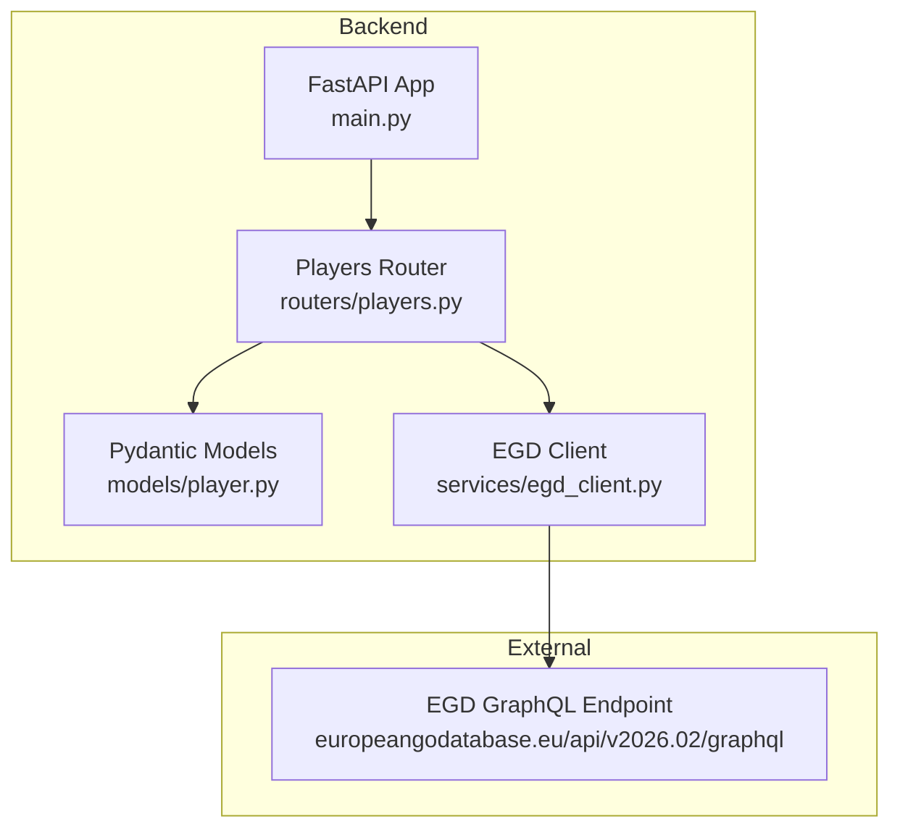
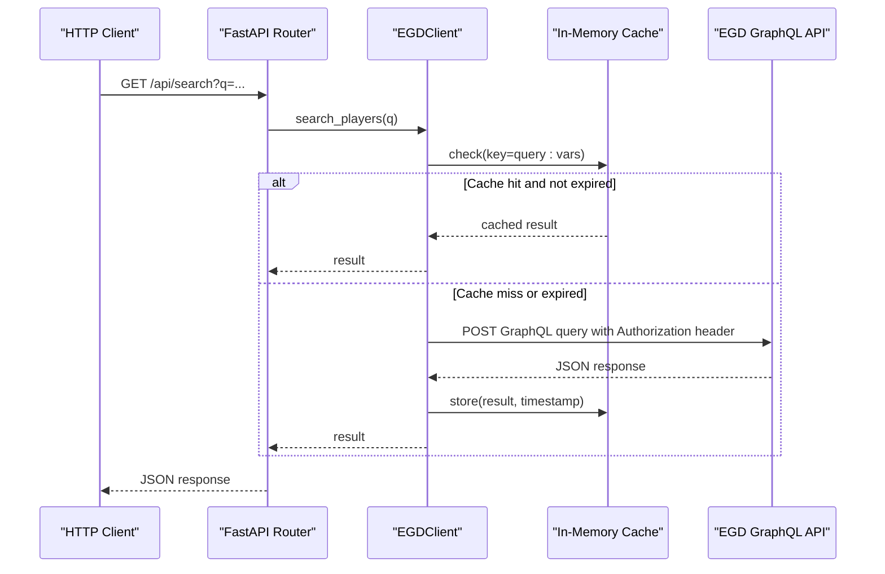
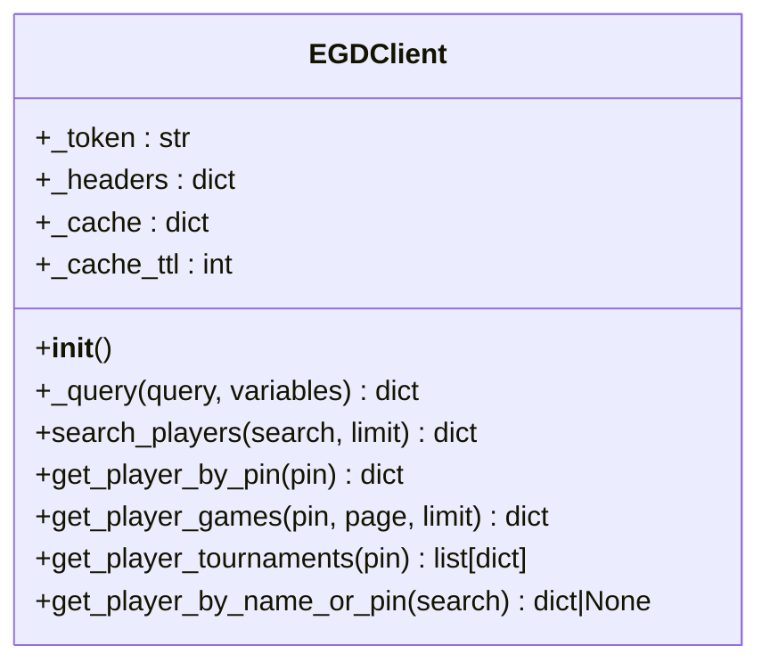
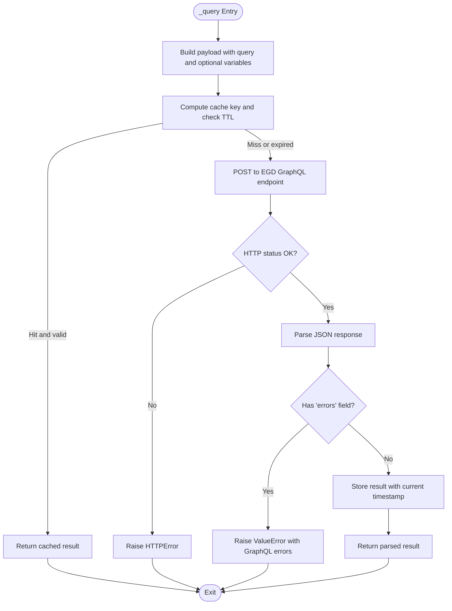
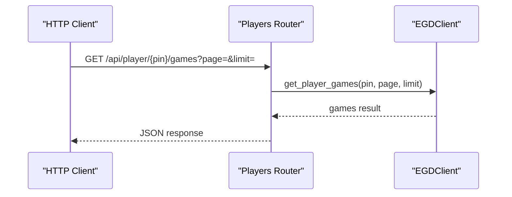
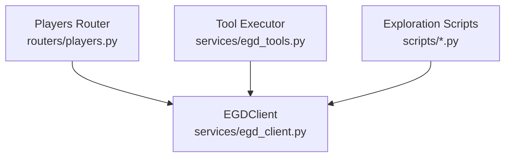

# EGD Client

<cite>
**Referenced Files in This Document**
- [egd_client.py](file://backend/app/services/egd_client.py)
- [players.py](file://backend/app/routers/players.py)
- [player.py](file://backend/app/models/player.py)
- [EGD_API.md](file://docs/EGD_API.md)
- [explore_api.py](file://scripts/explore_api.py)
- [explore_player.py](file://scripts/explore_player.py)
</cite>

## Table of Contents
1. [Introduction](#introduction)
2. [Project Structure](#project-structure)
3. [Core Components](#core-components)
4. [Architecture Overview](#architecture-overview)
5. [Detailed Component Analysis](#detailed-component-analysis)
6. [Dependency Analysis](#dependency-analysis)
7. [Performance Considerations](#performance-considerations)
8. [Troubleshooting Guide](#troubleshooting-guide)
9. [Conclusion](#conclusion)
10. [Appendices](#appendices)

## Introduction
This document provides comprehensive documentation for the European Go Database (EGD) GraphQL API client implementation used by the backend service. It focuses on the EGDClient class architecture, authentication with Bearer tokens, asynchronous HTTP communication using httpx, and a TTL-based in-memory caching strategy. It also documents all provided GraphQL query methods: search_players, get_player_by_pin, get_player_games, and get_player_tournaments. Error handling patterns, timeout configuration, and rate limiting considerations are included, along with usage examples showing how to integrate the client into other services and transform response data.

## Project Structure
The EGD client is implemented as an async Python module that encapsulates HTTP calls to the EGD GraphQL endpoint. It is consumed by FastAPI routes and tooling utilities. The repository includes:
- A dedicated client module implementing the EGDClient class
- FastAPI routers exposing endpoints that use the client
- Pydantic models describing player-related data structures
- Documentation for the EGD GraphQL schema
- Exploration scripts demonstrating direct API usage

**Diagram sources**
- [main.py](file://backend/app/main.py)
- [players.py](file://backend/app/routers/players.py)
- [player.py](file://backend/app/models/player.py)
- [egd_client.py](file://backend/app/services/egd_client.py)

**Section sources**
- [main.py](file://backend/app/main.py)
- [players.py](file://backend/app/routers/players.py)
- [player.py](file://backend/app/models/player.py)
- [egd_client.py](file://backend/app/services/egd_client.py)

## Core Components
- EGDClient: An async client providing typed methods for searching players, retrieving detailed profiles, fetching game history, and extracting tournament information. It manages authentication headers, performs GraphQL queries over HTTPS, and caches responses with TTL-based expiration.
- FastAPI Routers: Expose REST endpoints that delegate to EGDClient methods and optionally transform or enrich responses.
- Pydantic Models: Define structured schemas for player summaries, placements, tournaments, and search responses.
- EGD API Reference: Documents the GraphQL schema, types, and example queries used by the client.

Key responsibilities:
- Authentication via Bearer token from environment variables
- Asynchronous HTTP requests with httpx
- In-memory cache keyed by query string and variables with TTL
- Robust error handling for network and GraphQL errors
- Data transformation helpers for downstream consumers

**Section sources**
- [egd_client.py](file://backend/app/services/egd_client.py)
- [players.py](file://backend/app/routers/players.py)
- [player.py](file://backend/app/models/player.py)
- [EGD_API.md](file://docs/EGD_API.md)

## Architecture Overview
The client follows a layered approach:
- Presentation layer (FastAPI routers) handles request validation and response formatting
- Service layer (EGDClient) encapsulates external API interactions and caching
- External system (EGD GraphQL API) returns JSON payloads conforming to the documented schema

**Diagram sources**
- [players.py](file://backend/app/routers/players.py)
- [egd_client.py](file://backend/app/services/egd_client.py)

## Detailed Component Analysis

### EGDClient Class Architecture
The EGDClient class encapsulates:
- Initialization with Bearer token and default headers
- Internal async method to execute GraphQL queries with caching
- Public methods for specific operations:
  - search_players: typo-tolerant name search
  - get_player_by_pin: detailed player profile including biography and placements
  - get_player_games: paginated game history
  - get_player_tournaments: deduplicated tournament list derived from placements
  - get_player_by_name_or_pin: convenience method to resolve by PIN or name

**Diagram sources**
- [egd_client.py](file://backend/app/services/egd_client.py)

#### Authentication Mechanism
- Token source: Environment variable EGD_API_TOKEN
- Headers: Authorization set to Bearer token; Content-Type application/json
- Endpoint: https://europeangodatabase.eu/api/v2026.02/graphql

Authentication details align with the EGD API reference documentation.

**Section sources**
- [egd_client.py](file://backend/app/services/egd_client.py)
- [EGD_API.md](file://docs/EGD_API.md)

#### Async HTTP Communication with httpx
- Uses httpx.AsyncClient for non-blocking requests
- Timeout configured per request
- Raises HTTP status errors via raise_for_status
- Parses JSON responses and checks for GraphQL errors

**Diagram sources**
- [egd_client.py](file://backend/app/services/egd_client.py)

**Section sources**
- [egd_client.py](file://backend/app/services/egd_client.py)

#### Caching Strategy with TTL-Based Expiration
- Cache storage: In-memory dictionary mapping keys to tuples of (timestamp, data)
- Key generation: Concatenation of query string and variables representation
- TTL: Default 300 seconds (5 minutes), configurable via _cache_ttl
- Behavior: On cache hit within TTL, return cached data immediately; otherwise perform network call and update cache

Memory management:
- No explicit eviction policy beyond TTL
- Suitable for single-process deployments; consider shared cache backends for multi-process setups

**Section sources**
- [egd_client.py](file://backend/app/services/egd_client.py)

#### GraphQL Query Methods

- search_players
  - Purpose: Typo-tolerant search by name with pagination
  - Input: search string, limit (default 20)
  - Output: playersSearch result object containing data array and pagination metadata

- get_player_by_pin
  - Purpose: Retrieve full player profile including biography and placements
  - Input: pin integer
  - Output: player object with nested fields

- get_player_games
  - Purpose: Fetch paginated game history filtered by player PIN
  - Input: pin, page, limit (defaults: page=1, limit=50)
  - Output: games result object with data array and pagination metadata

- get_player_tournaments
  - Purpose: Derive a deduplicated list of tournaments from player placements
  - Input: pin integer
  - Output: list of tournament records enriched with placement stats

- get_player_by_name_or_pin
  - Purpose: Convenience resolver that tries PIN lookup if numeric, otherwise name search
  - Input: search string
  - Output: player detail or None

Usage examples:
- Integrate with FastAPI routers to expose REST endpoints
- Use in tooling utilities for function calling workflows
- Transform responses into domain-specific structures for UI consumption

**Section sources**
- [egd_client.py](file://backend/app/services/egd_client.py)
- [players.py](file://backend/app/routers/players.py)

### FastAPI Integration and Response Transformation
- Search endpoint: Accepts query parameter q; attempts PIN lookup first if numeric, then falls back to name search
- Player detail endpoint: Returns player data augmented with rating_history derived from placements
- Games endpoint: Delegates to client with validated page and limit parameters
- Tournaments endpoint: Delegates to client and sorts results by date

**Diagram sources**
- [players.py](file://backend/app/routers/players.py)
- [egd_client.py](file://backend/app/services/egd_client.py)

**Section sources**
- [players.py](file://backend/app/routers/players.py)

### Pydantic Models
- PlayerSummary: Fields for basic player info returned by search
- TournamentInfo: Fields for tournament metadata
- PlacementInfo: Fields for tournament placement details
- PlayerDetail: Extended player model including placements
- SearchResponse: Standardized search result structure

These models provide type safety and consistent serialization across endpoints.

**Section sources**
- [player.py](file://backend/app/models/player.py)

### EGD API Reference Alignment
The client’s GraphQL queries match the documented schema:
- player(pin): returns player fields and nested placements
- playersSearch(search, pagination): returns player list with pagination metadata
- games(filter, order, pagination): returns game list with pagination metadata

Reference documentation clarifies types and available fields used by the client.

**Section sources**
- [EGD_API.md](file://docs/EGD_API.md)

## Dependency Analysis
The client depends on:
- httpx for asynchronous HTTP requests
- os and time for environment access and timestamps
- typing for type hints

Integration points:
- FastAPI routers import the singleton egd_client instance
- Tooling modules wrap client methods for function calling scenarios

**Diagram sources**
- [egd_client.py](file://backend/app/services/egd_client.py)
- [players.py](file://backend/app/routers/players.py)
- [explore_api.py](file://scripts/explore_api.py)
- [explore_player.py](file://scripts/explore_player.py)

**Section sources**
- [egd_client.py](file://backend/app/services/egd_client.py)
- [players.py](file://backend/app/routers/players.py)
- [explore_api.py](file://scripts/explore_api.py)
- [explore_player.py](file://scripts/explore_player.py)

## Performance Considerations
- Timeouts: Each request uses a 30-second timeout to prevent hanging connections
- Caching: TTL-based cache reduces redundant network calls; adjust TTL based on data volatility
- Pagination: Use appropriate limits to avoid large payloads; clients should handle hasMorePages for iterative fetching
- Concurrency: Async client supports concurrent requests; ensure upstream services can handle load
- Rate Limiting: The EGD API may enforce rate limits; implement exponential backoff or circuit breakers at higher layers if needed

[No sources needed since this section provides general guidance]

## Troubleshooting Guide
Common issues and resolutions:
- Missing or invalid Bearer token: Ensure EGD_API_TOKEN is set in the environment; verify token scope and validity
- Network errors: Check connectivity and timeouts; inspect HTTP status codes raised by httpx
- GraphQL errors: Inspect the errors field in the response; validate query syntax and variable types
- Cache staleness: Adjust _cache_ttl if data changes frequently; clear cache entries when necessary
- Large responses: Reduce limit parameters and paginate through results

Operational tips:
- Log request payloads and responses during development
- Use exploration scripts to reproduce issues against the live API
- Validate responses against Pydantic models to catch schema mismatches early

**Section sources**
- [egd_client.py](file://backend/app/services/egd_client.py)
- [explore_api.py](file://scripts/explore_api.py)
- [explore_player.py](file://scripts/explore_player.py)

## Conclusion
The EGD client provides a robust, async-first interface to the European Go Database GraphQL API. It combines secure authentication, efficient caching, and well-defined query methods to support both backend services and tooling integrations. By following the documented patterns for error handling, timeouts, and pagination, consumers can reliably retrieve player data, game histories, and tournament information while maintaining performance and resilience.

[No sources needed since this section summarizes without analyzing specific files]

## Appendices

### Usage Examples

- Integrating with FastAPI:
  - Use the provided routers to expose endpoints for search, player details, games, and tournaments
  - Apply Pydantic models for input/output validation and serialization

- Using the client directly:
  - Instantiate EGDClient and call methods like search_players, get_player_by_pin, get_player_games, get_player_tournaments
  - Handle exceptions for network and GraphQL errors
  - Transform responses into domain-specific structures for UI or analytics

- Function calling tools:
  - Wrap client methods in tool executor functions to enable AI-driven workflows
  - Normalize outputs to success/error envelopes for consistent consumption

- Exploration scripts:
  - Leverage explore_api.py and explore_player.py to test authentication and query behavior
  - Save sample responses for debugging and schema validation

**Section sources**
- [players.py](file://backend/app/routers/players.py)
- [player.py](file://backend/app/models/player.py)
- [egd_client.py](file://backend/app/services/egd_client.py)
- [explore_api.py](file://scripts/explore_api.py)
- [explore_player.py](file://scripts/explore_player.py)