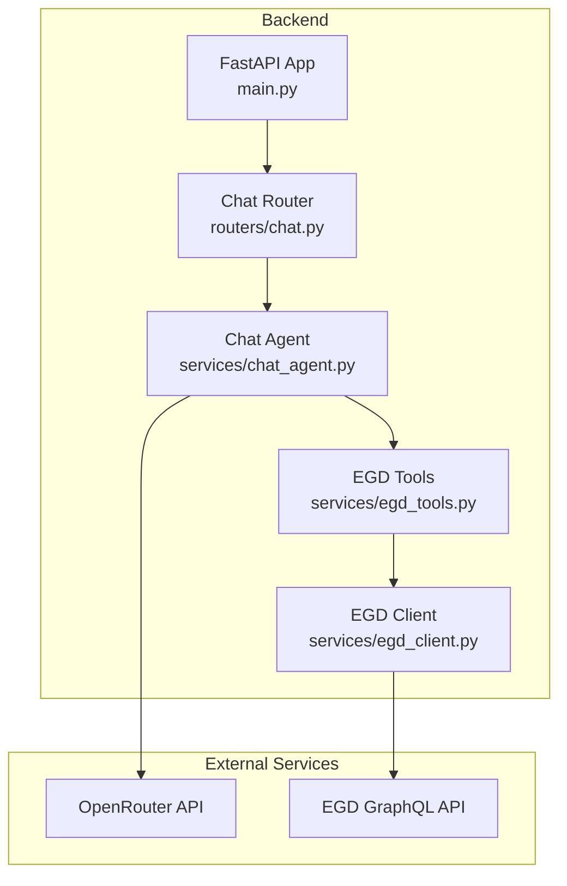
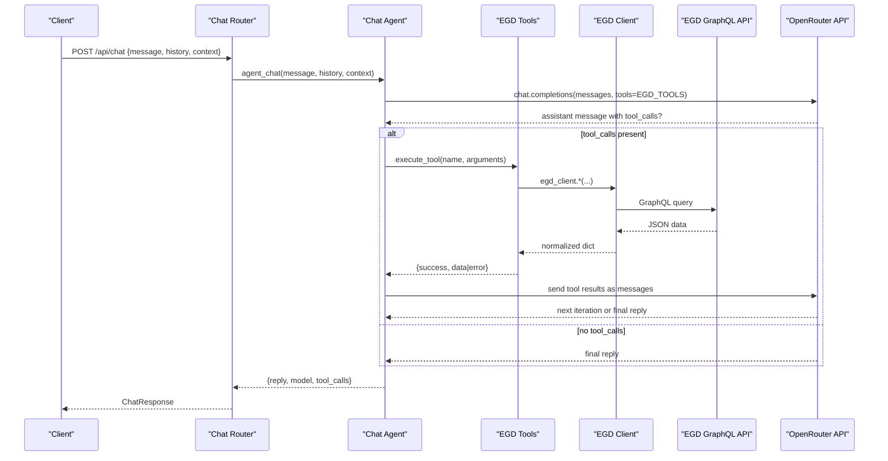
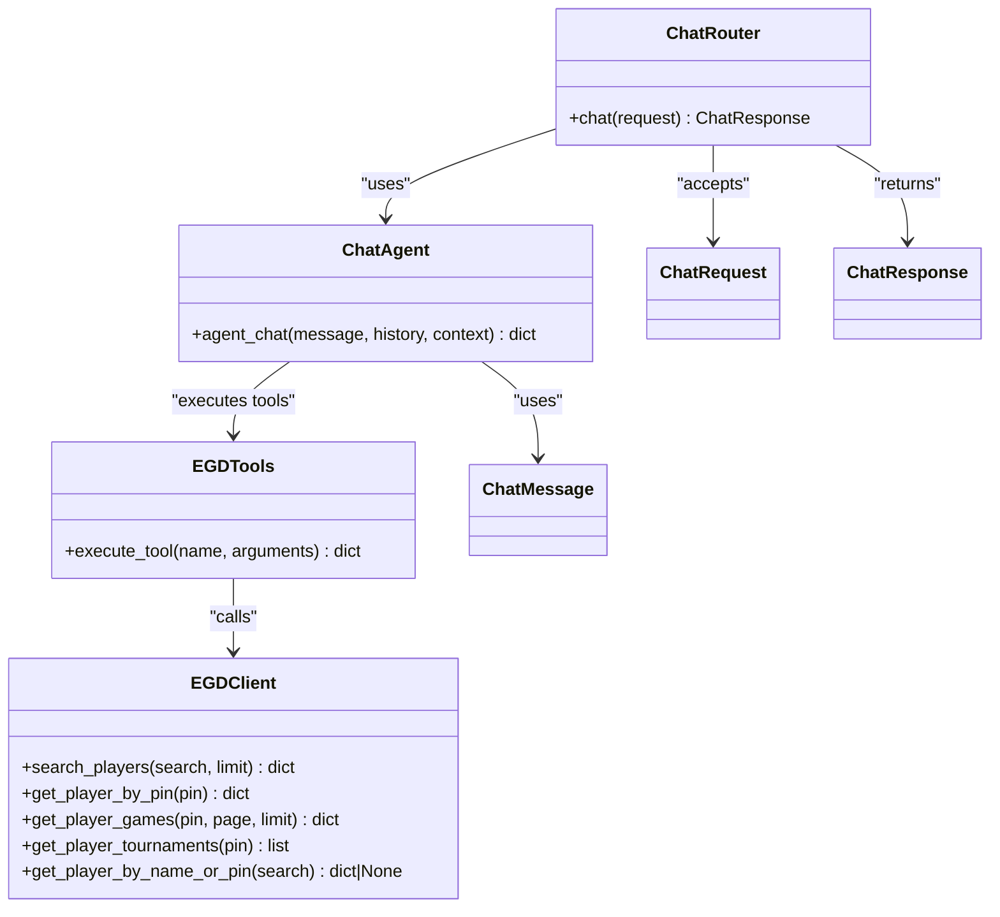
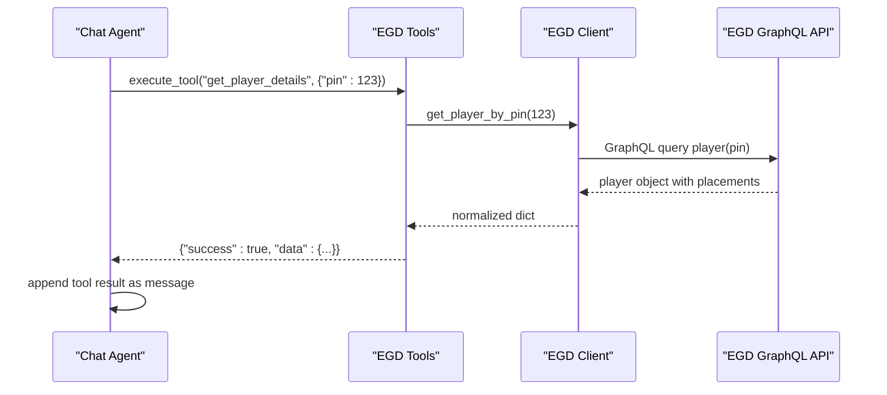
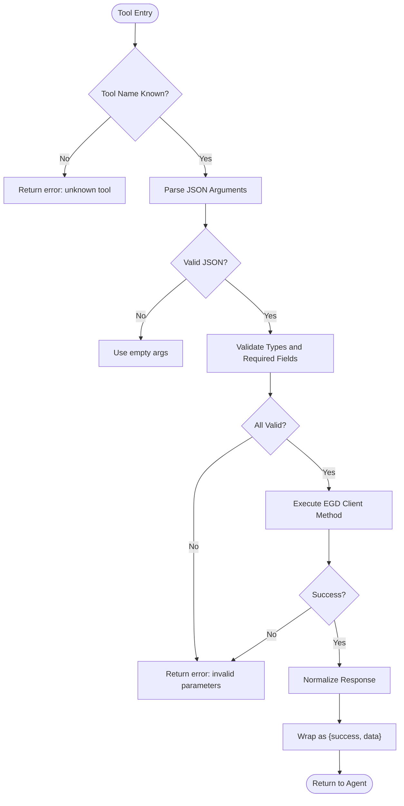
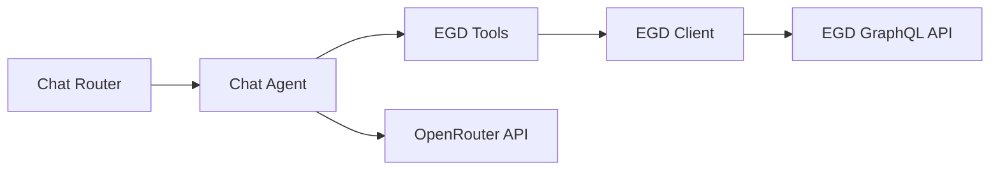

# EGD Tools System

<cite>
**Referenced Files in This Document**
- [backend/app/services/egd_tools.py](file://backend/app/services/egd_tools.py)
- [backend/app/services/egd_client.py](file://backend/app/services/egd_client.py)
- [backend/app/services/chat_agent.py](file://backend/app/services/chat_agent.py)
- [backend/app/routers/chat.py](file://backend/app/routers/chat.py)
- [backend/app/models/chat.py](file://backend/app/models/chat.py)
- [backend/app/models/player.py](file://backend/app/models/player.py)
- [backend/app/main.py](file://backend/app/main.py)
- [docs/EGD_API.md](file://docs/EGD_API.md)
</cite>

## Table of Contents
1. [Introduction](#introduction)
2. [Project Structure](#project-structure)
3. [Core Components](#core-components)
4. [Architecture Overview](#architecture-overview)
5. [Detailed Component Analysis](#detailed-component-analysis)
6. [Dependency Analysis](#dependency-analysis)
7. [Performance Considerations](#performance-considerations)
8. [Troubleshooting Guide](#troubleshooting-guide)
9. [Conclusion](#conclusion)
10. [Appendices](#appendices)

## Introduction
This document explains the EGD tools system that enables LLM function calling for Go player analytics. It covers:
- Tool registration and schema definitions for operations like player search, profile lookup, rating history, game history, and player comparison
- The execution flow from LLM tool calls to EGD API invocations
- Parameter validation, type conversion, and error propagation between tools and the chat agent
- Result formatting and integration back into conversation context
- Examples of adding custom tools and integration patterns
- Security considerations for access control and input sanitization

## Project Structure
The EGD tools system is implemented in the backend service layer and integrates with an external LLM provider (OpenRouter) and the European Go Database GraphQL API.

**Diagram sources**
- [backend/app/main.py:14-31](file://backend/app/main.py#L14-L31)
- [backend/app/routers/chat.py:9-24](file://backend/app/routers/chat.py#L9-L24)
- [backend/app/services/chat_agent.py:30-154](file://backend/app/services/chat_agent.py#L30-L154)
- [backend/app/services/egd_tools.py:102-212](file://backend/app/services/egd_tools.py#L102-L212)
- [backend/app/services/egd_client.py:11-197](file://backend/app/services/egd_client.py#L11-L197)

**Section sources**
- [backend/app/main.py:1-42](file://backend/app/main.py#L1-L42)
- [backend/app/routers/chat.py:1-95](file://backend/app/routers/chat.py#L1-L95)
- [backend/app/services/chat_agent.py:1-154](file://backend/app/services/chat_agent.py#L1-L154)
- [backend/app/services/egd_tools.py:1-212](file://backend/app/services/egd_tools.py#L1-L212)
- [backend/app/services/egd_client.py:1-197](file://backend/app/services/egd_client.py#L1-L197)

## Core Components
- EGD Tools: Declarative OpenAI-compatible tool schemas and a dispatcher that maps tool names to implementations using the EGD client.
- Chat Agent: Orchestrates the agentic loop with OpenRouter, sends tool schemas, executes returned tool calls, and feeds results back to the model.
- EGD Client: HTTP client for the EGD GraphQL API with caching and typed queries for players, games, and tournaments.
- Models: Pydantic models for chat requests/responses and player data structures used by routers and services.

Key responsibilities:
- Tool registration via a centralized list of tool schemas
- Function dispatching and result normalization
- Agentic loop handling multiple iterations until final text response
- Secure, cached access to EGD GraphQL endpoints

**Section sources**
- [backend/app/services/egd_tools.py:5-99](file://backend/app/services/egd_tools.py#L5-L99)
- [backend/app/services/egd_tools.py:102-212](file://backend/app/services/egd_tools.py#L102-L212)
- [backend/app/services/chat_agent.py:30-154](file://backend/app/services/chat_agent.py#L30-L154)
- [backend/app/services/egd_client.py:11-197](file://backend/app/services/egd_client.py#L11-L197)
- [backend/app/models/chat.py:6-21](file://backend/app/models/chat.py#L6-L21)
- [backend/app/models/player.py:6-60](file://backend/app/models/player.py#L6-L60)

## Architecture Overview
The chat agent uses native tool calling with OpenRouter. The agent sends tool schemas along with messages; when the model decides to call a tool, the agent executes it through the tools dispatcher, which invokes the EGD client. Results are serialized and appended as tool messages, allowing the model to continue reasoning and produce a final answer.

**Diagram sources**
- [backend/app/routers/chat.py:9-24](file://backend/app/routers/chat.py#L9-L24)
- [backend/app/services/chat_agent.py:67-154](file://backend/app/services/chat_agent.py#L67-L154)
- [backend/app/services/egd_tools.py:102-212](file://backend/app/services/egd_tools.py#L102-L212)
- [backend/app/services/egd_client.py:21-197](file://backend/app/services/egd_client.py#L21-L197)

## Detailed Component Analysis

### Tool Registration and Schema Definitions
- Tools are declared as OpenAI-compatible function schemas in a central list. Each tool defines name, description, parameters (types and required fields), and behavior.
- Available tools:
  - search_player: Search players by name or PIN
  - get_player_details: Get detailed profile including rating history
  - get_player_rating_history: Get rating evolution over time
  - get_player_games: Get recent game history with pagination limit
  - compare_players: Compare two players by PINs

Parameter types and constraints:
- Strings for free-text queries
- Integers for PINs and limits
- Required fields enforced by schema; optional fields have defaults handled in implementation

Result format:
- All tool executions return a consistent structure: success flag, data payload on success, or error message on failure.

Adding a new tool:
- Add a new entry to the tool schemas list with name, description, and parameter schema
- Implement logic in the tool dispatcher to handle the new name and map to EGD client methods
- Ensure consistent result wrapping with success/error semantics

**Section sources**
- [backend/app/services/egd_tools.py:5-99](file://backend/app/services/egd_tools.py#L5-L99)
- [backend/app/services/egd_tools.py:102-212](file://backend/app/services/egd_tools.py#L102-L212)

### Tool Execution Flow
- The chat agent receives user input and optionally context/history
- It posts to OpenRouter with messages and tool schemas
- If the model returns tool_calls, the agent parses arguments, logs the tool name, and executes via the tools dispatcher
- Tool results are serialized and appended as tool messages with tool_call_id
- The agent continues the loop until the model produces a final text response or max iterations are reached

Error handling:
- JSON parsing errors for malformed arguments default to empty dict
- Unknown tool names return an error response
- Exceptions during tool execution are caught and returned as error responses

**Section sources**
- [backend/app/services/chat_agent.py:67-154](file://backend/app/services/chat_agent.py#L67-L154)
- [backend/app/services/egd_tools.py:207-212](file://backend/app/services/egd_tools.py#L207-L212)

### EGD Client and Data Access
- Provides async GraphQL queries for searching players, fetching player details, games, and tournament histories
- Implements in-memory caching with TTL to reduce external calls
- Handles authentication via bearer token from environment variables
- Raises structured errors for GraphQL errors and network issues

Data transformation:
- Normalizes nested GraphQL responses into flat dictionaries suitable for tool outputs
- Extracts rating history and tournament info from placements

**Section sources**
- [backend/app/services/egd_client.py:11-197](file://backend/app/services/egd_client.py#L11-L197)
- [docs/EGD_API.md:1-274](file://docs/EGD_API.md#L1-L274)

### Chat Agent Integration
- Builds messages array with system prompt, optional context, and limited history
- Sends request with tools to OpenRouter
- Processes tool_calls and tool results iteratively
- Returns final reply, model identifier, and log of tool calls used

Configuration:
- Model selection via environment variable
- Max iterations configurable to bound tool-calling loops

**Section sources**
- [backend/app/services/chat_agent.py:1-154](file://backend/app/services/chat_agent.py#L1-L154)

### API Routers and Request Models
- Chat router exposes /api/chat endpoint accepting ChatRequest and returning ChatResponse
- Player routers expose direct EGD access endpoints for search, player details, games, and tournaments
- Models define strict shapes for chat interactions and player data

**Section sources**
- [backend/app/routers/chat.py:9-24](file://backend/app/routers/chat.py#L9-L24)
- [backend/app/routers/players.py:8-107](file://backend/app/routers/players.py#L8-L107)
- [backend/app/models/chat.py:6-21](file://backend/app/models/chat.py#L6-L21)
- [backend/app/models/player.py:6-60](file://backend/app/models/player.py#L6-L60)

### Class Diagram: Core Classes and Relationships

**Diagram sources**
- [backend/app/services/chat_agent.py:30-154](file://backend/app/services/chat_agent.py#L30-L154)
- [backend/app/services/egd_tools.py:102-212](file://backend/app/services/egd_tools.py#L102-L212)
- [backend/app/services/egd_client.py:44-197](file://backend/app/services/egd_client.py#L44-L197)
- [backend/app/routers/chat.py:9-24](file://backend/app/routers/chat.py#L9-L24)
- [backend/app/models/chat.py:6-21](file://backend/app/models/chat.py#L6-L21)

### Sequence Diagram: Tool Call and Result Integration

**Diagram sources**
- [backend/app/services/egd_tools.py:109-148](file://backend/app/services/egd_tools.py#L109-L148)
- [backend/app/services/egd_client.py:72-118](file://backend/app/services/egd_client.py#L72-L118)

### Flowchart: Parameter Validation and Type Conversion

**Diagram sources**
- [backend/app/services/egd_tools.py:102-212](file://backend/app/services/egd_tools.py#L102-L212)
- [backend/app/services/chat_agent.py:100-116](file://backend/app/services/chat_agent.py#L100-L116)

## Dependency Analysis
- Chat Router depends on Chat Agent and Chat models
- Chat Agent depends on EGD Tools and OpenRouter API
- EGD Tools depend on EGD Client
- EGD Client depends on httpx and environment configuration
- No circular dependencies observed among core components

**Diagram sources**
- [backend/app/routers/chat.py:9-24](file://backend/app/routers/chat.py#L9-L24)
- [backend/app/services/chat_agent.py:30-154](file://backend/app/services/chat_agent.py#L30-L154)
- [backend/app/services/egd_tools.py:102-212](file://backend/app/services/egd_tools.py#L102-L212)
- [backend/app/services/egd_client.py:11-197](file://backend/app/services/egd_client.py#L11-L197)

**Section sources**
- [backend/app/main.py:14-31](file://backend/app/main.py#L14-L31)
- [backend/app/routers/chat.py:9-24](file://backend/app/routers/chat.py#L9-L24)
- [backend/app/services/chat_agent.py:30-154](file://backend/app/services/chat_agent.py#L30-L154)
- [backend/app/services/egd_tools.py:102-212](file://backend/app/services/egd_tools.py#L102-L212)
- [backend/app/services/egd_client.py:11-197](file://backend/app/services/egd_client.py#L11-L197)

## Performance Considerations
- In-memory caching in EGD client reduces repeated GraphQL calls with a configurable TTL
- Limiting history length prevents excessive message payloads to the LLM
- Tool argument limits (e.g., max games limit) prevent large responses
- Async HTTP clients improve concurrency and responsiveness

[No sources needed since this section provides general guidance]

## Troubleshooting Guide
Common issues and resolutions:
- Missing API keys: Ensure OPENROUTER_API_KEY and EGD_API_TOKEN are set in environment
- GraphQL errors: Inspect error payloads from EGD client; these are raised as exceptions
- Tool not found: Verify tool name matches registered schema and dispatcher logic
- Malformed tool arguments: JSON parse failures default to empty args; validate schema and provide correct types
- Rate limits or timeouts: Adjust timeouts and consider increasing cache TTL if appropriate

Operational checks:
- Health endpoint confirms server status
- Swagger docs available at /docs for API inspection

**Section sources**
- [backend/app/services/egd_client.py:21-42](file://backend/app/services/egd_client.py#L21-L42)
- [backend/app/services/egd_tools.py:207-212](file://backend/app/services/egd_tools.py#L207-L212)
- [backend/app/main.py:34-41](file://backend/app/main.py#L34-L41)

## Conclusion
The EGD tools system provides a robust foundation for enabling LLM-driven function calling against the European Go Database. With clear tool schemas, a reliable execution dispatcher, and a well-structured agentic loop, the system supports dynamic querying and analysis while maintaining security and performance. Extending functionality involves adding tool schemas and implementing corresponding logic in the dispatcher, ensuring consistent result formats and error handling.

[No sources needed since this section summarizes without analyzing specific files]

## Appendices

### Adding a New Tool: Step-by-Step
- Define a new tool schema in the tools list with name, description, and parameter schema
- Implement the tool handler in the dispatcher to call the appropriate EGD client method
- Normalize the response into the standard {success, data} format
- Test the tool via the chat agent and verify tool result integration

**Section sources**
- [backend/app/services/egd_tools.py:5-99](file://backend/app/services/egd_tools.py#L5-L99)
- [backend/app/services/egd_tools.py:102-212](file://backend/app/services/egd_tools.py#L102-L212)

### Security Considerations
- Access Control:
  - Keep EGD API tokens server-side only; never expose them to the frontend
  - Use environment variables for secrets and avoid hardcoding credentials
- Input Sanitization:
  - Validate and constrain tool parameters (e.g., integer ranges, string lengths)
  - Enforce minimum query lengths where applicable
- Error Propagation:
  - Avoid leaking internal stack traces to clients; wrap exceptions in safe error messages
  - Log detailed errors server-side for debugging while returning sanitized responses
- LLM Safety:
  - Restrict tool invocation to predefined functions; do not allow arbitrary code execution
  - Monitor tool usage and implement rate limiting if necessary

**Section sources**
- [backend/app/services/egd_client.py:12-18](file://backend/app/services/egd_client.py#L12-L18)
- [backend/app/routers/players.py:8-40](file://backend/app/routers/players.py#L8-L40)
- [backend/app/services/chat_agent.py:42-48](file://backend/app/services/chat_agent.py#L42-L48)