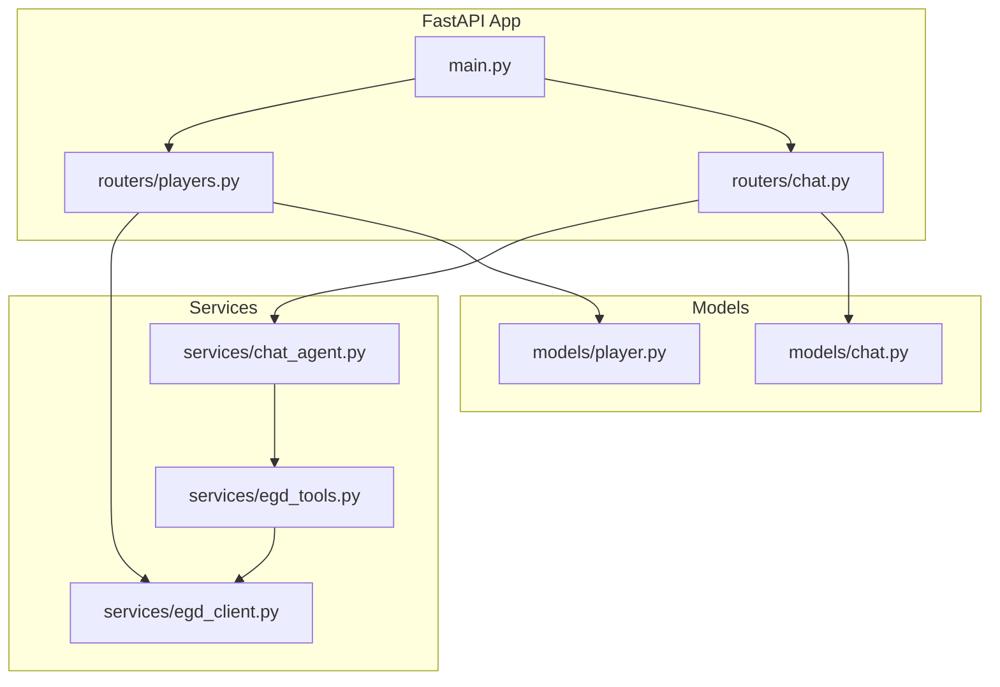
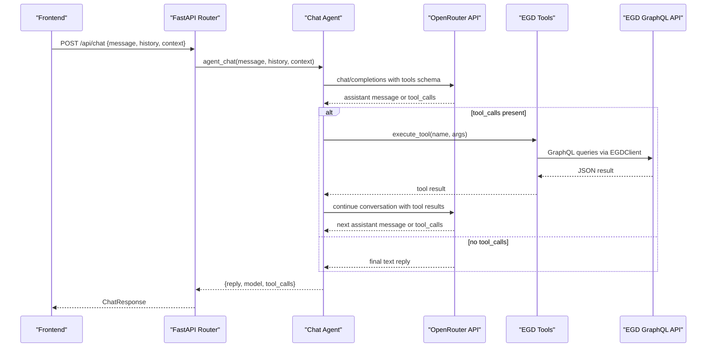
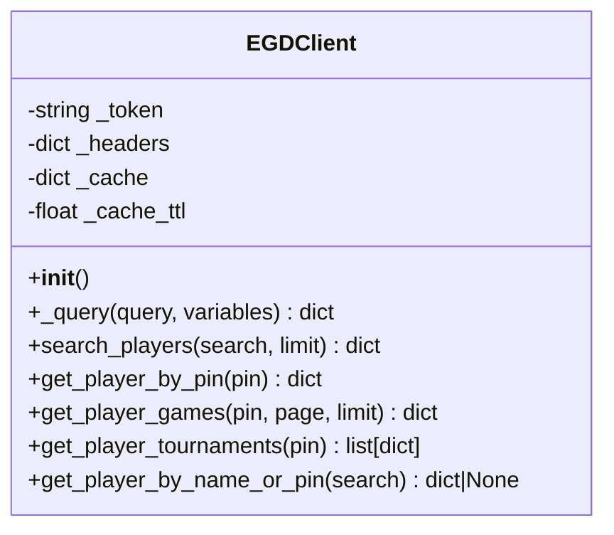
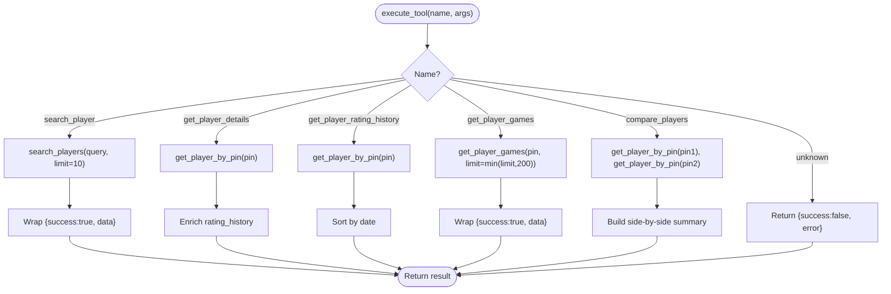
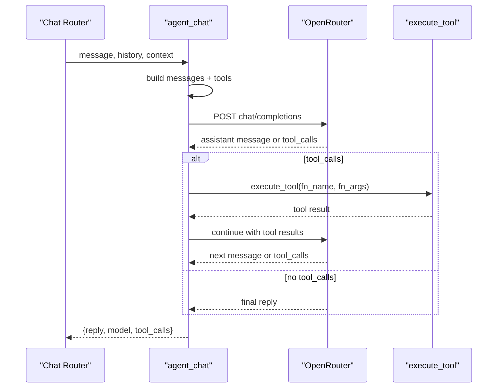
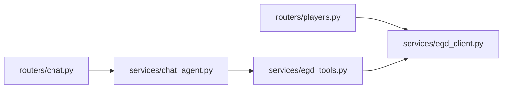
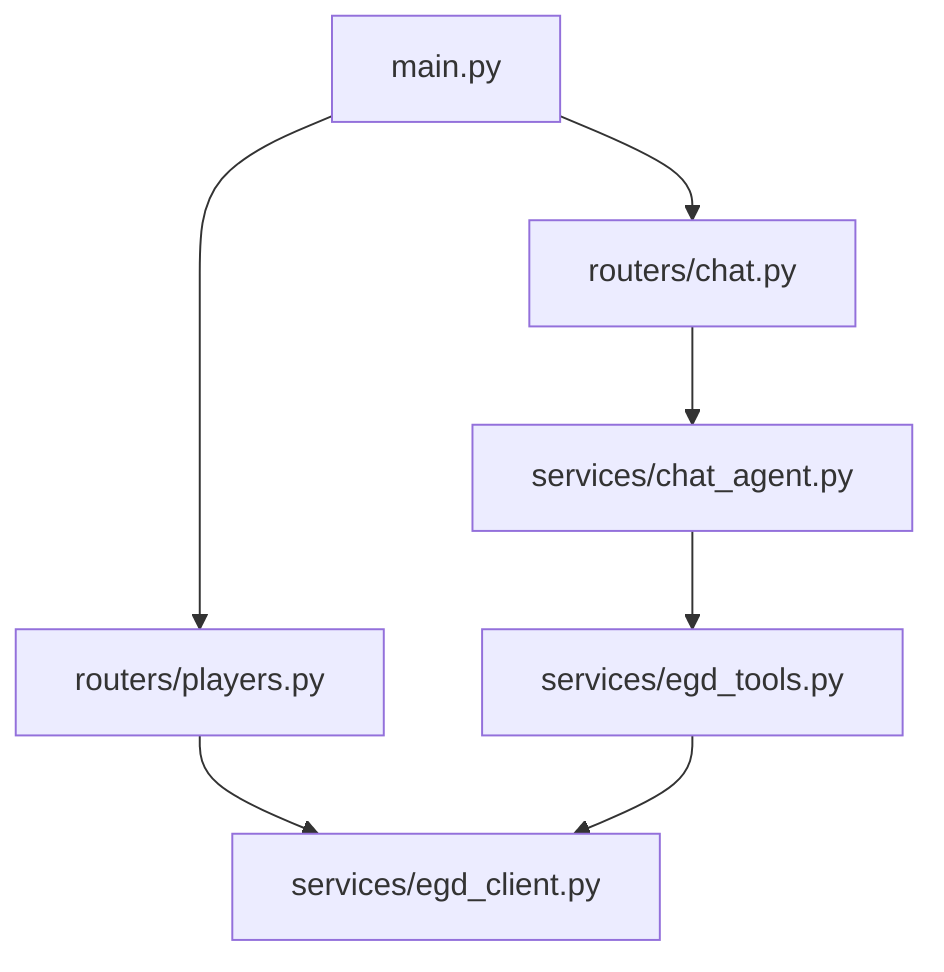

# Service Layer

<cite>
**Referenced Files in This Document**
- [main.py](file://backend/app/main.py)
- [chat.py](file://backend/app/routers/chat.py)
- [players.py](file://backend/app/routers/players.py)
- [chat_agent.py](file://backend/app/services/chat_agent.py)
- [egd_client.py](file://backend/app/services/egd_client.py)
- [egd_tools.py](file://backend/app/services/egd_tools.py)
- [chat.py](file://backend/app/models/chat.py)
- [player.py](file://backend/app/models/player.py)
- [ARCHITECTURE.md](file://docs/ARCHITECTURE.md)
- [EGD_API.md](file://docs/EGD_API.md)
</cite>

## Table of Contents
1. [Introduction](#introduction)
2. [Project Structure](#project-structure)
3. [Core Components](#core-components)
4. [Architecture Overview](#architecture-overview)
5. [Detailed Component Analysis](#detailed-component-analysis)
6. [Dependency Analysis](#dependency-analysis)
7. [Performance Considerations](#performance-considerations)
8. [Troubleshooting Guide](#troubleshooting-guide)
9. [Conclusion](#conclusion)

## Introduction
This document explains the backend service layer that powers GoNow’s player analytics and agentic chat features. It focuses on:
- EGD client implementation with GraphQL queries, caching strategies, and error handling
- Chat agent agentic loop, tool calling mechanism, and context management
- EGD tools system for LLM function calling, tool registration, and execution flow
- Service composition patterns and dependency injection approaches used across routers and services

The goal is to provide a clear mental model of how requests are routed, how data flows through services, and how external systems (EGD GraphQL API and OpenRouter) are integrated safely and efficiently.

## Project Structure
The backend is organized by feature layers:
- Routers expose HTTP endpoints and orchestrate calls into services
- Services encapsulate business logic and external integrations
- Models define request/response contracts
- The application entrypoint wires routers and middleware

**Diagram sources**
- [main.py:14-31](file://backend/app/main.py#L14-L31)
- [players.py:1-107](file://backend/app/routers/players.py#L1-L107)
- [chat.py:1-95](file://backend/app/routers/chat.py#L1-L95)
- [chat_agent.py:1-154](file://backend/app/services/chat_agent.py#L1-L154)
- [egd_client.py:1-197](file://backend/app/services/egd_client.py#L1-L197)
- [egd_tools.py:1-212](file://backend/app/services/egd_tools.py#L1-L212)
- [chat.py:1-21](file://backend/app/models/chat.py#L1-L21)
- [player.py:1-60](file://backend/app/models/player.py#L1-L60)

**Section sources**
- [main.py:14-31](file://backend/app/main.py#L14-L31)
- [ARCHITECTURE.md:43-81](file://docs/ARCHITECTURE.md#L43-L81)

## Core Components
- EGD Client: Encapsulates all GraphQL interactions with the European Go Database, including authentication, query building, caching, and error propagation.
- EGD Tools: Declares OpenAI-compatible tool schemas and maps tool names to concrete implementations using the EGD client.
- Chat Agent: Implements an agentic loop that sends messages and tool schemas to OpenRouter, executes tool calls returned by the LLM, and iterates until a final text response is produced.
- Routers: FastAPI routes that translate HTTP requests into service calls and return typed responses.
- Models: Pydantic models defining request/response shapes for chat and player data.

Key responsibilities:
- Separation of concerns: Routers handle HTTP; Services implement domain logic and integration; Models enforce contracts.
- Centralized external access: All EGD calls go through the EGD client, enabling caching and consistent error handling.
- Tool-driven AI: The chat agent uses declarative tool definitions to let the LLM decide when and how to call functions.

**Section sources**
- [egd_client.py:11-42](file://backend/app/services/egd_client.py#L11-L42)
- [egd_tools.py:5-99](file://backend/app/services/egd_tools.py#L5-L99)
- [chat_agent.py:30-154](file://backend/app/services/chat_agent.py#L30-L154)
- [players.py:8-40](file://backend/app/routers/players.py#L8-L40)
- [chat.py:9-24](file://backend/app/routers/chat.py#L9-L24)
- [chat.py:6-21](file://backend/app/models/chat.py#L6-L21)
- [player.py:6-60](file://backend/app/models/player.py#L6-L60)

## Architecture Overview
The service layer integrates two external APIs:
- EGD GraphQL API for player data
- OpenRouter API for LLM inference with native tool calling

**Diagram sources**
- [chat.py:9-24](file://backend/app/routers/chat.py#L9-L24)
- [chat_agent.py:30-154](file://backend/app/services/chat_agent.py#L30-L154)
- [egd_tools.py:102-212](file://backend/app/services/egd_tools.py#L102-L212)
- [egd_client.py:21-42](file://backend/app/services/egd_client.py#L21-L42)

## Detailed Component Analysis

### EGD Client: GraphQL Queries, Caching, Error Handling
Responsibilities:
- Authentication via Bearer token from environment
- Asynchronous HTTP client usage for GraphQL
- In-memory cache keyed by query + variables with TTL
- Error propagation for GraphQL errors and network failures

Key behaviors:
- Cache strategy: key = query + variables; TTL-based invalidation; returns cached data if within TTL
- Query methods: search players, get player details, get games, derive tournaments, resolve by name or PIN
- Error handling: raises ValueError on GraphQL errors; propagates httpx exceptions up to callers

Complexity considerations:
- Cache lookup O(1) average time
- Network latency dominates; caching reduces repeated calls
- Sorting operations on placement lists are O(n log n) where n is number of placements

**Diagram sources**
- [egd_client.py:11-197](file://backend/app/services/egd_client.py#L11-L197)

**Section sources**
- [egd_client.py:11-42](file://backend/app/services/egd_client.py#L11-L42)
- [egd_client.py:44-197](file://backend/app/services/egd_client.py#L44-L197)

### EGD Tools: Function Calling Schemas and Execution Flow
Responsibilities:
- Declare tool schemas compatible with OpenAI/OpenRouter function calling
- Map tool names to implementations using the EGD client
- Normalize and enrich results for consumption by the LLM

Tool set:
- search_player: Search by name or PIN
- get_player_details: Full profile with rating history
- get_player_rating_history: Rating evolution over time
- get_player_games: Recent game history with pagination constraints
- compare_players: Side-by-side stats for two players

Execution flow:
- Router or agent invokes execute_tool(name, arguments)
- Dispatcher routes to specific handler
- Handlers call EGD client methods and format results
- Errors are wrapped in success/failure envelopes

**Diagram sources**
- [egd_tools.py:102-212](file://backend/app/services/egd_tools.py#L102-L212)
- [egd_client.py:44-197](file://backend/app/services/egd_client.py#L44-L197)

**Section sources**
- [egd_tools.py:5-99](file://backend/app/services/egd_tools.py#L5-L99)
- [egd_tools.py:102-212](file://backend/app/services/egd_tools.py#L102-L212)

### Chat Agent: Agentic Loop, Tool Calling, Context Management
Responsibilities:
- Build conversation context from system prompt, optional page context, and recent history
- Send messages and tool schemas to OpenRouter
- Execute tool calls returned by the LLM and feed results back
- Iterate until a final text response or max iterations reached

Context management:
- System prompt defines persona and guidance
- Optional context appended as system message (e.g., current player data)
- History limited to last N messages to control payload size

Agentic loop:
- For each iteration, send messages + tools
- If tool_calls present: append assistant message with tool_calls, execute each tool, append tool results, continue
- Else: return final reply
- Fallback after max iterations: force a summarization turn without tools

Error handling:
- Missing API key returns a friendly message
- HTTP errors raised by client
- JSON parsing fallbacks for malformed arguments

**Diagram sources**
- [chat_agent.py:30-154](file://backend/app/services/chat_agent.py#L30-L154)
- [chat.py:9-24](file://backend/app/routers/chat.py#L9-L24)

**Section sources**
- [chat_agent.py:30-154](file://backend/app/services/chat_agent.py#L30-L154)
- [chat.py:9-24](file://backend/app/routers/chat.py#L9-L24)

### Routers: Composition and Dependency Injection Patterns
Patterns:
- Composition: Routers import and call service functions directly rather than instantiating classes per request
- Dependency injection via module-level singletons: egd_client is imported once and reused across routers and tools
- Request/response validation via Pydantic models

Examples:
- Player router composes egd_client methods to serve search, profile, games, and tournaments
- Chat router composes agent_chat to run the agentic loop and returns structured responses

**Diagram sources**
- [players.py:1-107](file://backend/app/routers/players.py#L1-L107)
- [chat.py:1-95](file://backend/app/routers/chat.py#L1-L95)
- [chat_agent.py:1-154](file://backend/app/services/chat_agent.py#L1-L154)
- [egd_tools.py:1-212](file://backend/app/services/egd_tools.py#L1-L212)
- [egd_client.py:1-197](file://backend/app/services/egd_client.py#L1-L197)

**Section sources**
- [players.py:8-40](file://backend/app/routers/players.py#L8-L40)
- [players.py:43-80](file://backend/app/routers/players.py#L43-L80)
- [chat.py:9-24](file://backend/app/routers/chat.py#L9-L24)

### Models: Contracts and Validation
- ChatMessage: role and content fields for conversation turns
- ChatRequest: message, optional context, optional history
- ChatResponse: reply, optional model, optional tool_calls
- Player models: summaries, tournament info, placements, detail view, and search response shape

These models ensure type safety and self-documenting APIs.

**Section sources**
- [chat.py:6-21](file://backend/app/models/chat.py#L6-L21)
- [player.py:6-60](file://backend/app/models/player.py#L6-L60)

## Dependency Analysis
External dependencies and integration points:
- httpx: Async HTTP client for both EGD GraphQL and OpenRouter calls
- Environment configuration: API keys and model selection loaded from .env
- FastAPI: Routing, CORS, and request/response handling

Internal coupling:
- Routers depend on services
- Chat agent depends on tools and indirectly on EGD client
- Tools depend on EGD client
- EGD client is a singleton shared across components

Potential risks:
- Tight coupling between tool names and implementation in execute_tool
- Global mutable state in EGD client cache (acceptable for single-process servers)

**Diagram sources**
- [main.py:14-31](file://backend/app/main.py#L14-L31)
- [players.py:1-107](file://backend/app/routers/players.py#L1-L107)
- [chat.py:1-95](file://backend/app/routers/chat.py#L1-L95)
- [chat_agent.py:1-154](file://backend/app/services/chat_agent.py#L1-L154)
- [egd_tools.py:1-212](file://backend/app/services/egd_tools.py#L1-L212)
- [egd_client.py:1-197](file://backend/app/services/egd_client.py#L1-L197)

**Section sources**
- [requirements.txt:1-6](file://backend/requirements.txt#L1-L6)
- [main.py:20-27](file://backend/app/main.py#L20-L27)

## Performance Considerations
- Caching: EGD client caches responses by query+variables with a 5-minute TTL, reducing downstream load and latency.
- Pagination limits: Tools cap game retrieval to a maximum to avoid large payloads.
- History truncation: Chat agent limits conversation history to reduce token usage and improve performance.
- Timeouts: Both EGD and OpenRouter calls use timeouts to prevent hanging requests.
- Sorting: Placement and rating history sorting is O(n log n); consider indexing or server-side ordering for very large datasets.

[No sources needed since this section provides general guidance]

## Troubleshooting Guide
Common issues and resolutions:
- Missing OpenRouter API key: Chat returns a user-friendly message indicating configuration is required.
- GraphQL errors: EGD client raises ValueError containing error details; routers convert to HTTP 500 responses.
- Network errors: httpx exceptions propagate up; ensure connectivity and valid tokens.
- Malformed tool arguments: JSON parsing fallbacks to empty dict; validate inputs at the tool level.

Operational checks:
- Health endpoint available for readiness probes
- CORS configured for local development origins

**Section sources**
- [chat_agent.py:42-48](file://backend/app/services/chat_agent.py#L42-L48)
- [egd_client.py:38-42](file://backend/app/services/egd_client.py#L38-L42)
- [chat.py:23-24](file://backend/app/routers/chat.py#L23-L24)
- [players.py:39-40](file://backend/app/routers/players.py#L39-L40)
- [main.py:39-41](file://backend/app/main.py#L39-L41)

## Conclusion
The service layer cleanly separates concerns across routers, services, and models while integrating two critical external systems:
- EGD GraphQL API for authoritative player data
- OpenRouter for LLM-powered insights with native tool calling

The design emphasizes:
- Centralized data access via a single EGD client with caching
- Declarative tool schemas enabling flexible, LLM-driven workflows
- Simple composition and module-level dependency injection for maintainability

This architecture supports rapid iteration, robust error handling, and scalable performance characteristics suitable for MVP and beyond.