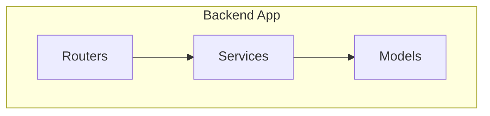
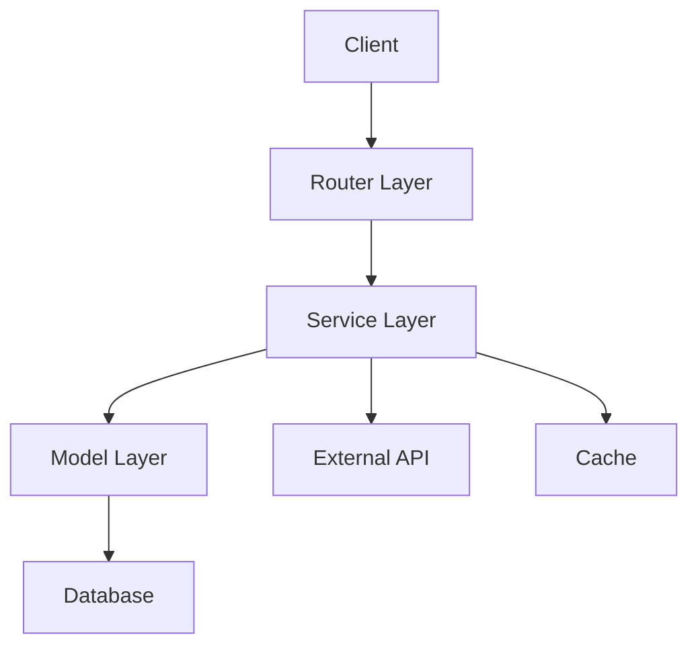
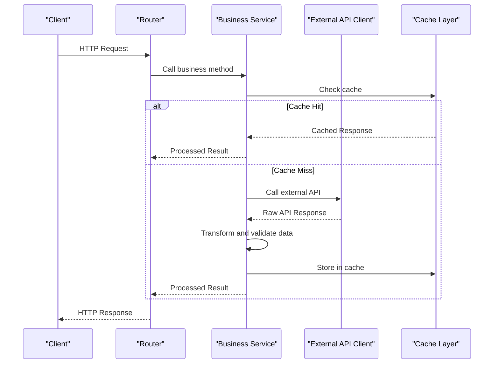
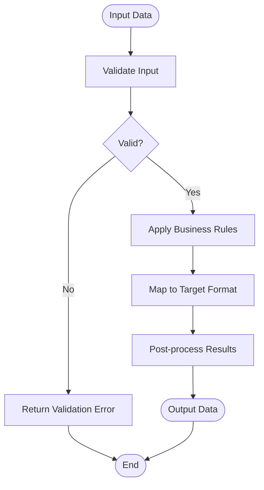
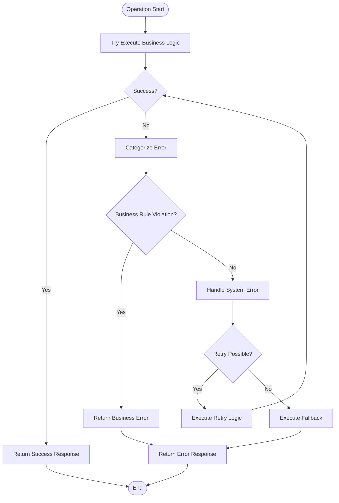
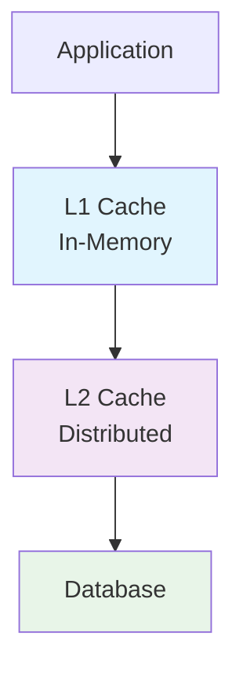
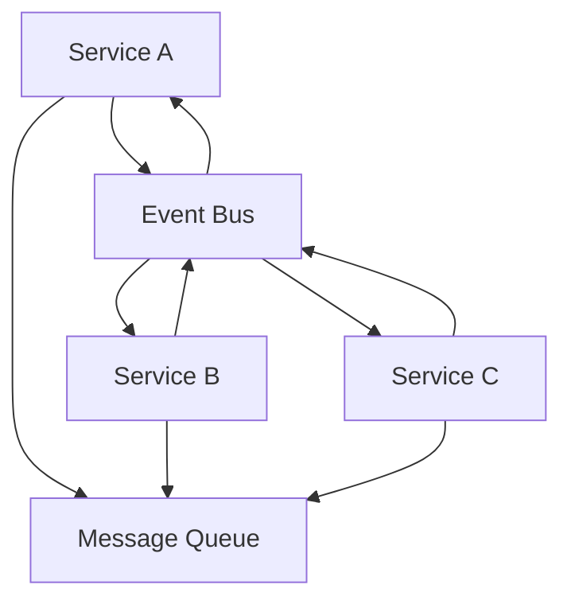

# Business Logic Implementation

<cite>
**Referenced Files in This Document**
- [__init__.py](file://backend/app/__init__.py)
- [__init__.py](file://backend/app/routers/__init__.py)
</cite>

## Table of Contents
1. [Introduction](#introduction)
2. [Project Structure](#project-structure)
3. [Core Components](#core-components)
4. [Architecture Overview](#architecture-overview)
5. [Detailed Component Analysis](#detailed-component-analysis)
6. [Dependency Analysis](#dependency-analysis)
7. [Performance Considerations](#performance-considerations)
8. [Troubleshooting Guide](#troubleshooting-guide)
9. [Conclusion](#conclusion)
10. [Appendices](#appendices)

## Introduction
This document provides comprehensive guidance for implementing business logic in the service layer of the GoNow application. It focuses on service class design patterns, method organization, and encapsulation of business rules. It also covers external integration patterns, third-party API communication, data transformation processes, dependency injection, error handling strategies, transaction management, caching strategies, performance optimization techniques, testing approaches (unit, integration, mocks), and guidelines to maintain clean separation between layers. The goal is to help developers build robust, testable, and scalable business logic while avoiding common pitfalls such as circular dependencies and poor service coordination.

## Project Structure
The repository contains a backend application with a layered structure:
- backend/app/models: Data models and domain entities
- backend/app/routers: HTTP routing and request handling
- backend/app/services: Service layer where business logic resides

[No sources needed since this diagram shows conceptual workflow, not actual code structure]

**Section sources**
- [__init__.py](file://backend/app/__init__.py)
- [__init__.py](file://backend/app/routers/__init__.py)

## Core Components
The service layer is responsible for orchestrating business operations, enforcing business rules, coordinating with models, and integrating with external systems. Key responsibilities include:
- Encapsulating business rules and workflows
- Transforming data between DTOs and domain models
- Managing transactions and consistency boundaries
- Handling errors and returning meaningful responses
- Integrating with third-party APIs and services
- Applying caching strategies for performance

Service classes should be designed with clear single responsibilities, explicit interfaces, and dependency injection to improve testability and maintainability.

**Section sources**
- [__init__.py](file://backend/app/__init__.py)
- [__init__.py](file://backend/app/routers/__init__.py)

## Architecture Overview
A typical layered architecture separates concerns across routers, services, and models:
- Routers handle HTTP requests and route them to appropriate services
- Services implement business logic and coordinate with models and external integrations
- Models represent domain entities and persistence structures

[No sources needed since this diagram shows conceptual workflow, not actual code structure]

## Detailed Component Analysis

### Service Class Design Patterns
- Single Responsibility Principle: Each service should focus on one area of business capability
- Dependency Injection: Inject dependencies (repositories, clients, caches) via constructors or setters
- Interface Segregation: Define small, focused interfaces for better testability
- Factory Pattern: Use factories to create complex objects when necessary
- Strategy Pattern: Encapsulate algorithms or policies that can vary at runtime

Example implementation approach:
- Create service classes with explicit constructor parameters for all dependencies
- Use typed interfaces for external clients and repositories
- Implement methods that encapsulate complete business workflows
- Return domain-specific result objects rather than raw data structures

**Section sources**
- [__init__.py](file://backend/app/__init__.py)
- [__init__.py](file://backend/app/routers/__init__.py)

### Method Organization and Business Rule Encapsulation
Organize service methods by business capability rather than technical concern:
- Group related operations under cohesive service classes
- Use descriptive method names that reflect business intent
- Keep methods focused on single business outcomes
- Extract complex business rules into dedicated rule classes or functions
- Validate inputs at method boundaries and enforce business constraints

Best practices:
- Avoid long methods; break down complex workflows into smaller, testable units
- Use guard clauses for early validation and error handling
- Document preconditions and postconditions for each method
- Maintain consistent error response formats across services

**Section sources**
- [__init__.py](file://backend/app/__init__.py)
- [__init__.py](file://backend/app/routers/__init__.py)

### External Integration Patterns
When integrating with third-party APIs:
- Create dedicated client classes for each external service
- Implement retry mechanisms with exponential backoff
- Handle timeouts and circuit breaker patterns
- Map external API responses to internal domain models
- Log integration calls for debugging and monitoring

Integration flow example:

**Diagram sources**
- [__init__.py](file://backend/app/__init__.py)
- [__init__.py](file://backend/app/routers/__init__.py)

**Section sources**
- [__init__.py](file://backend/app/__init__.py)
- [__init__.py](file://backend/app/routers/__init__.py)

### Data Transformation Processes
Implement clear data transformation pipelines:
- Use dedicated mapper classes for complex transformations
- Apply validation during transformation to ensure data integrity
- Handle null values and edge cases gracefully
- Maintain bidirectional transformations when needed
- Cache frequently used transformation results

Transformation flow:

**Diagram sources**
- [__init__.py](file://backend/app/__init__.py)
- [__init__.py](file://backend/app/routers/__init__.py)

**Section sources**
- [__init__.py](file://backend/app/__init__.py)
- [__init__.py](file://backend/app/routers/__init__.py)

### Dependency Injection and Configuration
Implement dependency injection using container-based or manual approaches:
- Define clear interfaces for all external dependencies
- Configure dependencies at application startup
- Use factory functions for complex object creation
- Support different configurations for development, staging, and production
- Enable easy swapping of implementations for testing

Configuration best practices:
- Centralize configuration management
- Use environment-specific settings
- Validate configuration at startup
- Provide sensible defaults for non-critical settings

**Section sources**
- [__init__.py](file://backend/app/__init__.py)
- [__init__.py](file://backend/app/routers/__init__.py)

### Error Handling Strategies
Implement comprehensive error handling:
- Define custom exception types for different error categories
- Use structured logging with context information
- Implement graceful degradation for non-critical failures
- Provide meaningful error messages to clients
- Track error rates and alert on anomalies

Error handling flow:

**Diagram sources**
- [__init__.py](file://backend/app/__init__.py)
- [__init__.py](file://backend/app/routers/__init__.py)

**Section sources**
- [__init__.py](file://backend/app/__init__.py)
- [__init__.py](file://backend/app/routers/__init__.py)

### Transaction Management
Implement proper transaction boundaries:
- Use database transactions for data consistency
- Implement distributed transactions for multi-service operations
- Handle transaction rollback on failures
- Optimize transaction scope to minimize lock duration
- Monitor transaction performance and deadlocks

Transaction patterns:
- Unit of Work pattern for coordinating multiple operations
- Saga pattern for long-running distributed transactions
- Optimistic locking for concurrent access scenarios

**Section sources**
- [__init__.py](file://backend/app/__init__.py)
- [__init__.py](file://backend/app/routers/__init__.py)

### Caching Strategies
Implement effective caching mechanisms:
- Use in-memory caching for frequently accessed data
- Implement distributed caching for horizontal scaling
- Apply cache invalidation strategies based on data changes
- Set appropriate TTL values based on data volatility
- Monitor cache hit rates and adjust strategies accordingly

Caching hierarchy:

**Diagram sources**
- [__init__.py](file://backend/app/__init__.py)
- [__init__.py](file://backend/app/routers/__init__.py)

**Section sources**
- [__init__.py](file://backend/app/__init__.py)
- [__init__.py](file://backend/app/routers/__init__.py)

### Performance Optimization Techniques
Optimize service layer performance through:
- Asynchronous processing for I/O-bound operations
- Connection pooling for database and external API connections
- Batch processing for bulk operations
- Lazy loading for expensive computations
- Profiling and monitoring to identify bottlenecks

Performance monitoring:
- Track response times and throughput metrics
- Monitor resource utilization (CPU, memory, I/O)
- Implement health checks and readiness probes
- Set up alerts for performance degradation

**Section sources**
- [__init__.py](file://backend/app/__init__.py)
- [__init__.py](file://backend/app/routers/__init__.py)

### Testing Approaches for Business Logic
Implement comprehensive testing strategies:

#### Unit Testing
- Test individual service methods in isolation
- Mock external dependencies and side effects
- Verify business rule enforcement
- Test error handling paths
- Use parameterized tests for various input scenarios

#### Integration Testing
- Test service interactions with real dependencies
- Verify database transactions and consistency
- Test external API integrations with test doubles
- Validate end-to-end business workflows

#### Mock Implementations
- Create mock clients for external APIs
- Implement fake repositories for testing
- Use stubs for predictable test behavior
- Simulate failure scenarios for resilience testing

Testing framework recommendations:
- Use assertion libraries for clear test expectations
- Implement test data builders for complex objects
- Organize tests by feature or service
- Maintain separate test databases for integration tests

**Section sources**
- [__init__.py](file://backend/app/__init__.py)
- [__init__.py](file://backend/app/routers/__init__.py)

## Dependency Analysis
Common dependency issues and solutions:

### Circular Dependencies
- Identify circular references using dependency analysis tools
- Refactor to break cycles using interface segregation
- Apply dependency inversion principle
- Use lazy initialization for cyclic dependencies

### Service Coordination
- Implement orchestration services for complex workflows
- Use event-driven architecture for loose coupling
- Apply mediator pattern for inter-service communication
- Implement saga pattern for long-running processes

### Scalability Considerations
- Design stateless services for horizontal scaling
- Implement load balancing and failover mechanisms
- Use message queues for asynchronous processing
- Apply circuit breaker patterns for external dependencies

**Diagram sources**
- [__init__.py](file://backend/app/__init__.py)
- [__init__.py](file://backend/app/routers/__init__.py)

**Section sources**
- [__init__.py](file://backend/app/__init__.py)
- [__init__.py](file://backend/app/routers/__init__.py)

## Performance Considerations
Key performance considerations for service layer implementation:
- Minimize blocking operations and use async/await patterns
- Implement connection pooling for database and external services
- Use efficient data structures and algorithms
- Apply pagination for large dataset operations
- Monitor and optimize database queries
- Implement proper indexing strategies
- Use compression for large payloads
- Apply rate limiting and throttling

## Troubleshooting Guide
Common issues and solutions:

### Debugging Service Issues
- Implement structured logging with correlation IDs
- Add detailed error contexts and stack traces
- Use distributed tracing for microservices
- Monitor service health and dependencies

### Memory Leaks and Resource Management
- Ensure proper cleanup of resources
- Implement connection lifecycle management
- Monitor memory usage patterns
- Use profiling tools to identify leaks

### Concurrency Issues
- Implement proper synchronization mechanisms
- Use thread-safe data structures
- Handle race conditions carefully
- Monitor for deadlocks and livelocks

**Section sources**
- [__init__.py](file://backend/app/__init__.py)
- [__init__.py](file://backend/app/routers/__init__.py)

## Conclusion
Implementing robust business logic in the service layer requires careful attention to design patterns, dependency management, error handling, and performance optimization. By following the guidelines outlined in this document, developers can create maintainable, testable, and scalable service implementations that effectively encapsulate business rules while maintaining clean separation from other architectural layers. Regular testing, monitoring, and refactoring will ensure the service layer remains resilient and adaptable to changing business requirements.

## Appendices

### Best Practices Checklist
- [ ] Follow single responsibility principle for service classes
- [ ] Implement dependency injection for all external dependencies
- [ ] Use comprehensive error handling and logging
- [ ] Write unit and integration tests for all business logic
- [ ] Implement proper transaction management
- [ ] Apply caching strategies appropriately
- [ ] Monitor performance and resource usage
- [ ] Document service interfaces and contracts
- [ ] Implement proper security measures
- [ ] Use versioning for API changes

### Common Anti-Patterns to Avoid
- God services that do too much
- Tight coupling between services
- Missing error handling
- Inconsistent transaction boundaries
- Hardcoded configuration values
- Insufficient logging and monitoring
- Poor test coverage
- Circular dependencies