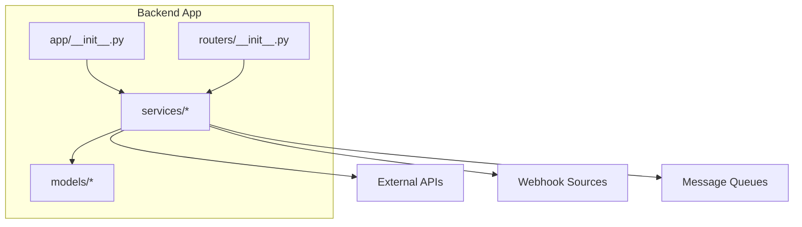
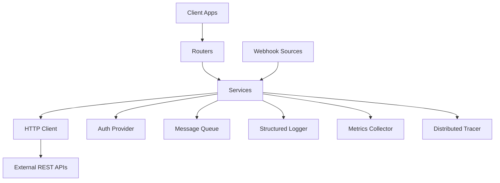
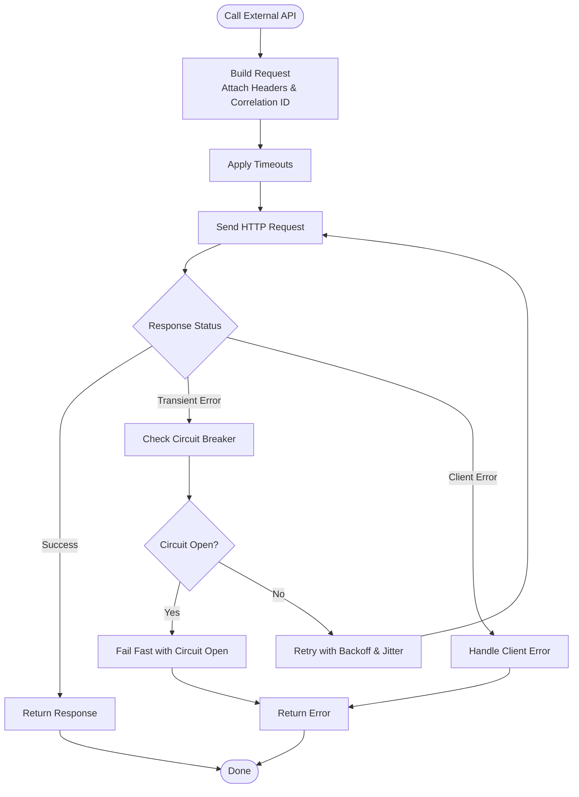
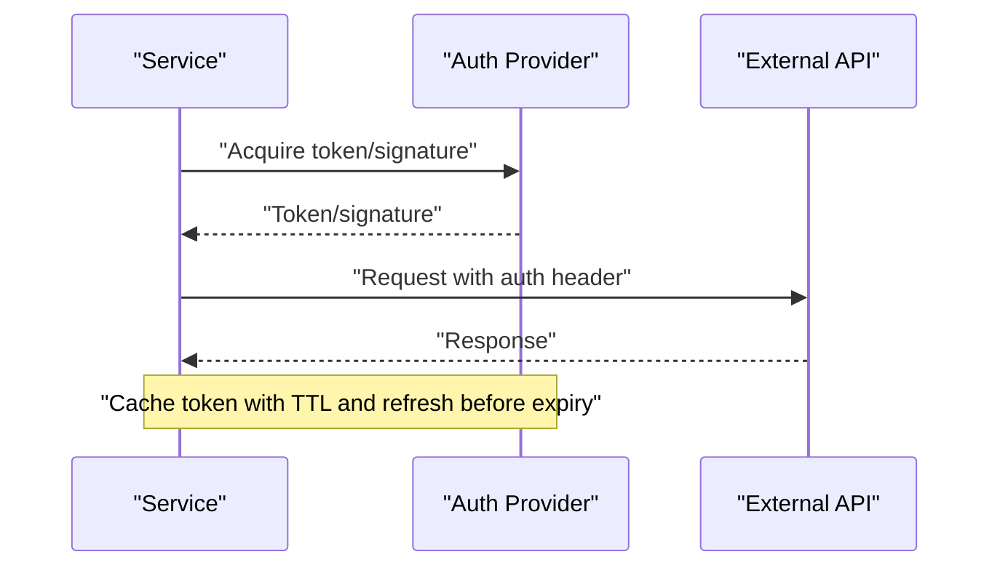
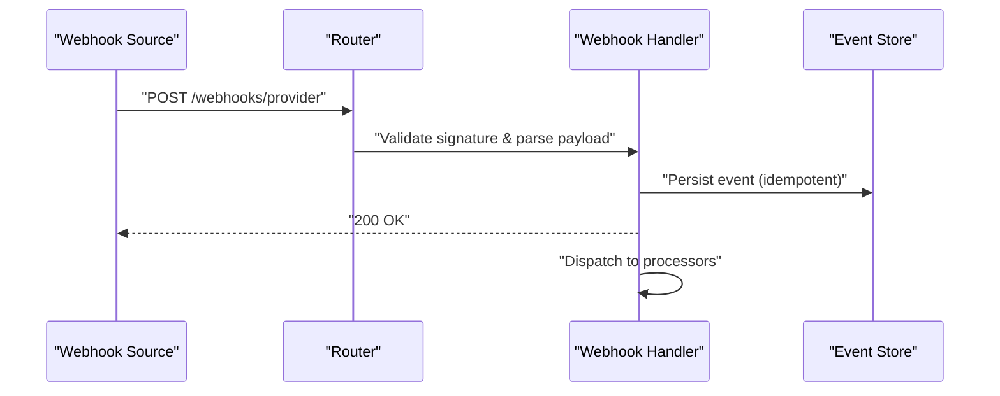
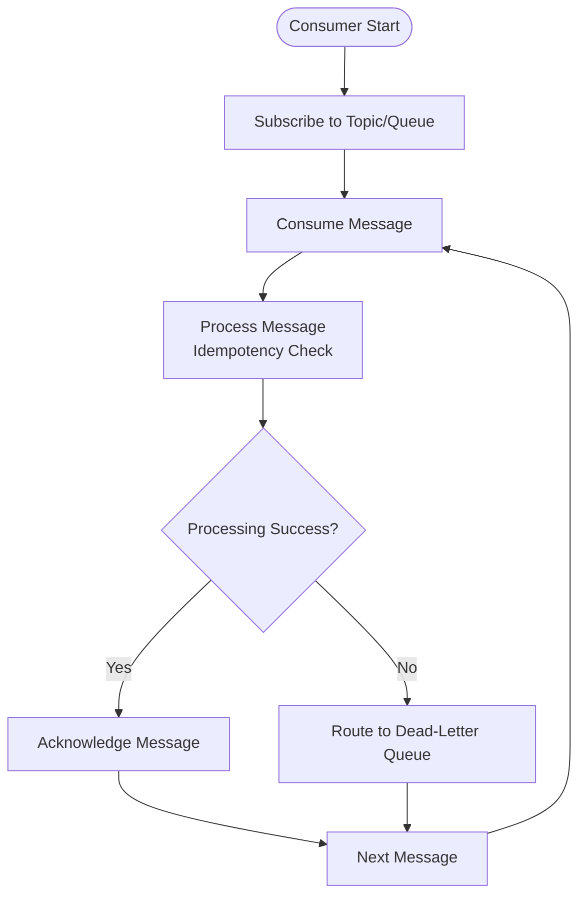
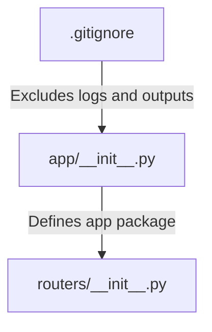

# External Integrations

<cite>
**Referenced Files in This Document**
- [backend/app/__init__.py](file://backend/app/__init__.py)
- [backend/app/routers/__init__.py](file://backend/app/routers/__init__.py)
- [.gitignore](file://.gitignore)
</cite>

## Table of Contents
1. [Introduction](#introduction)
2. [Project Structure](#project-structure)
3. [Core Components](#core-components)
4. [Architecture Overview](#architecture-overview)
5. [Detailed Component Analysis](#detailed-component-analysis)
6. [Dependency Analysis](#dependency-analysis)
7. [Performance Considerations](#performance-considerations)
8. [Troubleshooting Guide](#troubleshooting-guide)
9. [Conclusion](#conclusion)
10. [Appendices](#appendices)

## Introduction
This document provides a comprehensive guide for implementing external integrations within the GoNow service layer. It focuses on third-party API communication patterns, HTTP client usage, authentication mechanisms, retry strategies, circuit breaker patterns, timeout handling, REST API integration, webhook handling, message queue consumption, error handling, logging best practices, monitoring integration points, and fallback mechanisms. The guidance is designed to be accessible to both new and experienced contributors while ensuring robustness and observability when interacting with external services.

## Project Structure
The repository contains a minimal backend structure under backend/app with Python package markers. While no implementation files are present at this time, the following conventions should be adopted for external integrations:
- Services: Implement external integrations as reusable service modules (e.g., http_client.py, auth.py, webhooks.py, queues.py).
- Routers: Expose endpoints that orchestrate service calls and handle request/response mapping.
- Models: Define data structures for requests/responses and domain entities.
- Configuration: Centralize environment-based configuration for timeouts, retries, and credentials.

[No sources needed since this diagram shows conceptual workflow, not actual code structure]

**Section sources**
- [backend/app/__init__.py](file://backend/app/__init__.py)
- [backend/app/routers/__init__.py](file://backend/app/routers/__init__.py)

## Core Components
To implement reliable external integrations, organize functionality into focused components:
- HTTP Client Service: Encapsulates HTTP operations, timeouts, retries, and metrics.
- Authentication Provider: Manages tokens, signing, and secret rotation.
- Webhook Handler: Validates signatures, parses payloads, and dispatches events.
- Message Queue Consumer: Subscribes to topics/queues, processes messages, and acknowledges completion.
- Error Handling and Logging: Standardized exceptions, structured logs, and correlation IDs.
- Monitoring Integration: Metrics, traces, and health checks for external dependencies.

Best practices:
- Use dependency injection to swap implementations during tests or different environments.
- Keep configuration externalized via environment variables.
- Ensure idempotency for outbound requests and inbound processing where applicable.
- Instrument all external calls with metrics and distributed tracing.

[No sources needed since this section provides general guidance]

## Architecture Overview
A typical integration architecture includes:
- API Layer: Routes incoming requests and delegates to services.
- Service Layer: Implements business logic and orchestrates external calls.
- External Dependencies: REST APIs, webhooks, and message queues.
- Observability: Structured logging, metrics, and tracing.

[No sources needed since this diagram shows conceptual workflow, not actual code structure]

## Detailed Component Analysis

### HTTP Client Service
Responsibilities:
- Configure base URL, headers, timeouts, and connection pooling.
- Implement retry with exponential backoff and jitter.
- Enforce circuit breaker behavior for failing endpoints.
- Attach correlation IDs and propagate context across calls.
- Record metrics (latency, success rate, errors) and emit traces.

Retry Strategy:
- Retry only on transient failures (network errors, 5xx responses).
- Avoid retrying on client errors (4xx), except specific cases like 408/429.
- Use exponential backoff with jitter to reduce thundering herd.

Circuit Breaker:
- Track failure rates and latency percentiles per endpoint.
- Open circuit after threshold breaches; allow limited probes to test recovery.
- Reset circuit on successful probe responses.

Timeouts:
- Set connect, read, and idle timeouts appropriate for each external service.
- Use deadlines at the service layer to bound overall request duration.

Error Handling:
- Map network and protocol errors to typed exceptions.
- Include contextual information (endpoint, method, correlation ID).

Logging:
- Log request metadata without sensitive data.
- Include response status codes and durations.

Monitoring:
- Emit counters for successes/failures, histograms for latency, and gauges for circuit state.
- Integrate with distributed tracing libraries to propagate trace context.

[No sources needed since this diagram shows conceptual workflow, not actual code structure]

### Authentication Provider
Responsibilities:
- Manage secrets and keys securely using environment variables or secret managers.
- Generate and refresh tokens (OAuth2, JWT, API keys).
- Sign outgoing requests (HMAC, AWS SigV4) and validate incoming signatures.
- Rotate credentials without downtime.

Patterns:
- Token caching with TTL and background refresh.
- Per-service credential isolation.
- Audit logging for token issuance and rotation events.

Security:
- Never log secrets or tokens.
- Validate certificate chains and enforce TLS.

[No sources needed since this diagram shows conceptual workflow, not actual code structure]

### Webhook Handler
Responsibilities:
- Receive webhook payloads from external providers.
- Verify signatures using shared secrets or public keys.
- Parse and validate payloads against schemas.
- Dispatch events to internal handlers and acknowledge delivery.

Reliability:
- Idempotent processing keyed by event IDs.
- Dead-letter queues for failed events with retry policies.
- Rate limiting and payload size limits.

Observability:
- Log signature verification results and event types.
- Emit metrics for received, processed, and failed events.

[No sources needed since this diagram shows conceptual workflow, not actual code structure]

### Message Queue Consumer
Responsibilities:
- Subscribe to topics/queues and process messages concurrently.
- Acknowledge messages only after successful processing.
- Handle poison messages and route to dead-letter queues.
- Scale consumers based on backlog metrics.

Reliability:
- Exactly-once semantics via idempotent processing and deduplication.
- Graceful shutdown with in-flight message draining.

Observability:
- Track consumer lag, throughput, and error rates.
- Emit traces around message processing.

[No sources needed since this diagram shows conceptual workflow, not actual code structure]

### Error Handling Strategies
Principles:
- Differentiate between transient and permanent errors.
- Provide actionable error messages and codes to callers.
- Preserve original context for debugging.

Patterns:
- Wrap low-level errors with domain-specific exceptions.
- Use standardized error envelopes for API responses.
- Implement fallback responses for non-critical integrations.

[No sources needed since this section provides general guidance]

### Logging Best Practices
Guidelines:
- Use structured logging with consistent fields (timestamp, level, correlation_id, service, component).
- Redact sensitive data (tokens, PII).
- Include request/response metadata for external calls without body content.
- Maintain log levels appropriately (debug for development, info/warn/error for production).

[No sources needed since this section provides general guidance]

### Monitoring Integration Points
Recommendations:
- Metrics: Counters for successes/failures, histograms for latency, gauges for circuit state and queue depth.
- Tracing: Propagate trace context across HTTP and message boundaries.
- Health Checks: Expose readiness/liveness endpoints indicating external dependency status.
- Alerts: Threshold-based alerts for error rates, latency spikes, and circuit breaker openings.

[No sources needed since this section provides general guidance]

### Fallback Mechanisms
Strategies:
- Cache last known good responses for non-critical data.
- Serve degraded mode features when upstream services are unavailable.
- Use local defaults or stubs for optional integrations.
- Feature flags to toggle fallback behaviors safely.

[No sources needed since this section provides general guidance]

## Dependency Analysis
At this stage, the repository contains only package initialization files and a .gitignore. No concrete integration code exists yet. When adding integrations, ensure:
- Clear separation between routers and services.
- Minimal coupling between services and external clients.
- Explicit configuration management for endpoints and credentials.

**Diagram sources**
- [backend/app/__init__.py](file://backend/app/__init__.py)
- [backend/app/routers/__init__.py](file://backend/app/routers/__init__.py)
- [.gitignore](file://.gitignore)

**Section sources**
- [backend/app/__init__.py](file://backend/app/__init__.py)
- [backend/app/routers/__init__.py](file://backend/app/routers/__init__.py)
- [.gitignore](file://.gitignore)

## Performance Considerations
- Connection Pooling: Reuse connections and tune pool sizes per external service.
- Timeouts: Set conservative timeouts aligned with SLAs; avoid overly aggressive values.
- Retries: Limit maximum attempts and total retry duration; use jitter.
- Concurrency: Control parallelism for outbound calls and message processing.
- Caching: Cache stable external data with appropriate invalidation strategies.
- Backpressure: Apply flow control to prevent overwhelming downstream systems.

[No sources needed since this section provides general guidance]

## Troubleshooting Guide
Common issues and resolutions:
- Timeouts: Increase timeouts gradually; check network paths and remote service load.
- Authentication Failures: Validate secrets, token lifetimes, and clock skew.
- Signature Verification Errors: Confirm algorithm, payload encoding, and timestamp windows.
- Queue Stalls: Inspect consumer lag, dead-letter queues, and poison messages.
- High Error Rates: Review circuit breaker states and upstream health checks.

Operational tips:
- Enable detailed logs temporarily for affected requests using correlation IDs.
- Use health check endpoints to isolate failing dependencies.
- Replay failed events from dead-letter queues after fixes.

[No sources needed since this section provides general guidance]

## Conclusion
Adopting robust patterns for external integrations—structured HTTP clients, secure authentication, resilient retries, circuit breakers, timeouts, and comprehensive observability—ensures reliability and maintainability. Organize code into clear components, externalize configuration, and instrument all interactions. With these practices, the GoNow service layer can integrate confidently with diverse external systems while providing strong operational visibility and graceful degradation.

[No sources needed since this section summarizes without analyzing specific files]

## Appendices

### Configuration Checklist
- Base URLs and endpoints per environment
- Timeouts (connect, read, idle)
- Retry policy (max attempts, backoff strategy, jitter)
- Circuit breaker thresholds (failure rate, latency percentile)
- Secrets and keys (rotation schedule, access controls)
- Logging and tracing settings
- Metrics exporters and alerting rules

[No sources needed since this section provides general guidance]