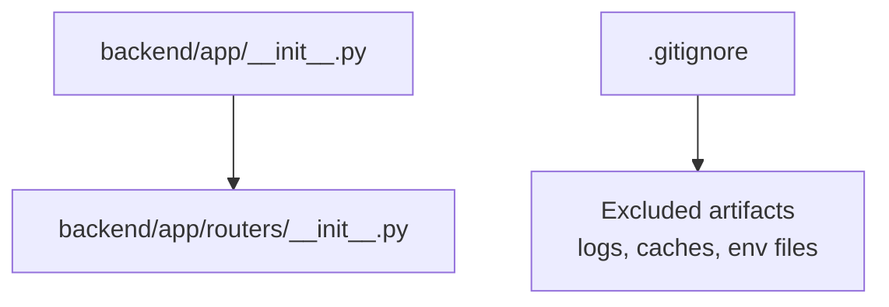
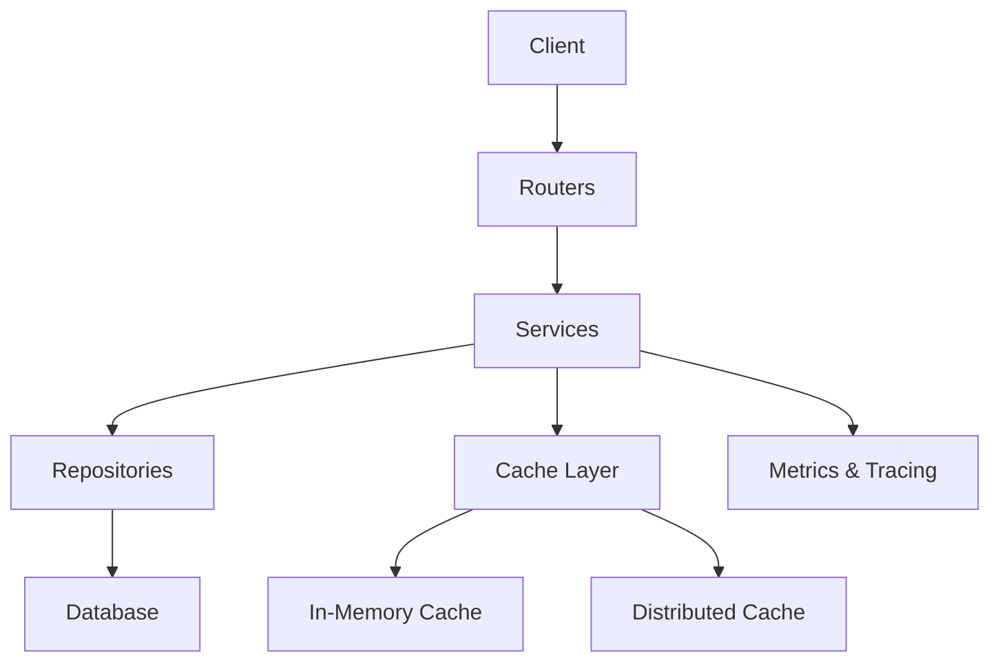
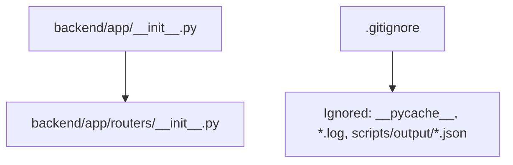

# Performance Optimization

<cite>
**Referenced Files in This Document**
- [__init__.py](file://backend/app/__init__.py)
- [routers/__init__.py](file://backend/app/routers/__init__.py)
- [.gitignore](file://.gitignore)
</cite>

## Table of Contents
1. [Introduction](#introduction)
2. [Project Structure](#project-structure)
3. [Core Components](#core-components)
4. [Architecture Overview](#architecture-overview)
5. [Detailed Component Analysis](#detailed-component-analysis)
6. [Dependency Analysis](#dependency-analysis)
7. [Performance Considerations](#performance-considerations)
8. [Troubleshooting Guide](#troubleshooting-guide)
9. [Conclusion](#conclusion)
10. [Appendices](#appendices)

## Introduction
This document provides performance optimization guidance for the service layer of the GoNow application. It focuses on caching strategies (in-memory and distributed), cache invalidation patterns, database query optimization, connection pooling, batch processing, lazy/eager loading, N+1 prevention, memory management and garbage collection considerations, resource cleanup, and monitoring/profiling practices. The repository currently contains minimal scaffolding; therefore, this guide presents actionable patterns and best practices that can be applied as the backend grows.

## Project Structure
The current repository includes a Python-based backend scaffold with placeholder modules:
- backend/app/__init__.py
- backend/app/routers/__init__.py
- .gitignore

**Diagram sources**
- [__init__.py](file://backend/app/__init__.py)
- [routers/__init__.py](file://backend/app/routers/__init__.py)
- [.gitignore](file://.gitignore)

**Section sources**
- [__init__.py](file://backend/app/__init__.py)
- [routers/__init__.py](file://backend/app/routers/__init__.py)
- [.gitignore](file://.gitignore)

## Core Components
At present, the core components are empty placeholders. As you implement the service layer, consider organizing code into:
- services/ for business logic
- models/ for data access abstractions
- routers/ for HTTP endpoints
- config/ for environment and feature flags
- utils/ for shared helpers (caching, batching, metrics)

When adding these directories, ensure they are not ignored by version control and align with your framework’s conventions.

[No sources needed since this section doesn't analyze specific files]

## Architecture Overview
A typical high-performance service architecture includes:
- API layer (routers) delegating to service layer
- Service layer orchestrating domain logic and calling repositories
- Repositories abstracting database or external APIs
- Cache layer (in-process and distributed)
- Connection pools for databases and external clients
- Metrics and tracing instrumentation

[No sources needed since this diagram shows conceptual workflow, not actual code structure]

## Detailed Component Analysis

### Caching Strategies
- In-memory caching
  - Use process-local caches for hot reads within a single worker.
  - Prefer bounded caches with TTLs and size limits to avoid unbounded growth.
  - Consider LRU policies and background refresh for expensive keys.
- Distributed caching
  - Use a shared cache (e.g., Redis) for cross-process consistency and horizontal scaling.
  - Apply cache stampede protection (singleflight/lock per key) and jittered TTLs.
- Cache invalidation patterns
  - Write-through: update cache when writing to the source of truth.
  - Write-behind: batch updates to cache asynchronously.
  - Event-driven invalidation: publish domain events to evict or update related keys.
  - Versioned keys: append entity version or timestamp to keys to simplify invalidation.

[No sources needed since this section provides general guidance]

### Database Query Optimization
- Indexing strategy
  - Add indexes for frequent filters, joins, and sort columns.
  - Monitor slow queries and adjust composite indexes accordingly.
- Query shaping
  - Select only required fields.
  - Avoid SELECT * and unnecessary subqueries.
  - Use pagination and cursor-based navigation for large datasets.
- Batch processing
  - Aggregate writes using bulk insert/update operations.
  - For reads, use IN clauses or batched requests to reduce round trips.
- Transaction boundaries
  - Keep transactions short and scoped to minimize lock contention.
  - Use read-only transactions where appropriate.

[No sources needed since this section provides general guidance]

### Connection Pooling
- Database connections
  - Configure pool size based on CPU cores, I/O characteristics, and workload.
  - Set idle timeouts and max lifetime to recycle stale connections.
- External client pools
  - Reuse HTTP/gRPC clients and configure keep-alive and timeouts.
- Resource cleanup
  - Ensure proper close/dispose lifecycle for connections and channels.
  - Use context timeouts to prevent hanging resources.

[No sources needed since this section provides general guidance]

### Lazy Loading vs Eager Loading and N+1 Prevention
- Lazy loading
  - Load associations on demand to reduce initial payload size.
  - Guard against accidental N+1 by tracking and logging additional queries.
- Eager loading
  - Preload related entities in a single query to avoid extra round trips.
- N+1 prevention
  - Identify loops over collections that trigger repeated queries.
  - Replace with batch fetches or JOINs where suitable.
  - Use query plans and profiling tools to detect hidden N+1 patterns.

[No sources needed since this section provides general guidance]

### Memory Management and Garbage Collection Considerations
- Minimize allocations
  - Reuse buffers and objects where safe.
  - Prefer streaming for large payloads instead of loading fully into memory.
- Avoid leaks
  - Close file handles, network connections, and goroutines/channels promptly.
  - Be cautious with closures capturing large objects.
- GC-friendly patterns
  - Reduce long-lived references to transient data.
  - Use object pools judiciously; measure impact before adopting.
- Profiling
  - Use memory profilers to identify hotspots and retention paths.

[No sources needed since this section provides general guidance]

### Monitoring, Profiling, and Bottleneck Identification
- Observability
  - Emit structured logs with correlation IDs.
  - Expose metrics (latency, throughput, error rates, cache hit ratio).
  - Add distributed tracing across service boundaries.
- Profiling tools
  - Use language-specific profilers to capture CPU and memory profiles.
  - Analyze flame graphs to find hot functions and allocation sites.
- Bottleneck identification
  - Focus on tail latency and p95/p99 percentiles.
  - Correlate spikes with deployments, traffic surges, and dependency changes.
  - Instrument database and cache layers to pinpoint slow paths.

[No sources needed since this section provides general guidance]

## Dependency Analysis
Current dependencies are minimal. The following diagram reflects the existing module relationships and ignores via .gitignore.

**Diagram sources**
- [__init__.py](file://backend/app/__init__.py)
- [routers/__init__.py](file://backend/app/routers/__init__.py)
- [.gitignore](file://.gitignore)

**Section sources**
- [__init__.py](file://backend/app/__init__.py)
- [routers/__init__.py](file://backend/app/routers/__init__.py)
- [.gitignore](file://.gitignore)

## Performance Considerations
- Start with measurement: baseline latency, throughput, and resource usage under realistic load.
- Optimize at the right layer: prefer algorithmic improvements and better queries before adding caches.
- Design for backpressure: apply rate limiting and circuit breakers to protect downstream systems.
- Right-size caches: tune TTLs, sizes, and eviction policies based on access patterns.
- Plan for failure: graceful degradation when caches or databases are degraded.

[No sources needed since this section provides general guidance]

## Troubleshooting Guide
- Common symptoms
  - High CPU: suspect tight loops, inefficient algorithms, or excessive serialization.
  - High memory: look for growing caches, unclosed streams, or retained references.
  - Slow responses: check database query times, cache miss storms, and external call latencies.
- Diagnostic steps
  - Enable detailed logs and traces around critical paths.
  - Capture profiles during incidents to compare with baselines.
  - Validate configuration drift (pool sizes, timeouts, feature flags).
- Recovery actions
  - Scale horizontally if stateless and compute-bound.
  - Increase cache coverage for hot paths.
  - Tune connection pools and timeouts based on observed saturation.

[No sources needed since this section provides general guidance]

## Conclusion
While the repository is in early scaffolding stages, applying the patterns outlined here will establish a strong foundation for performance. Prioritize observability and measurement, then iteratively optimize caching, queries, and resource management. As the service layer matures, continuously validate assumptions with real-world workloads and refine configurations accordingly.

[No sources needed since this section summarizes without analyzing specific files]

## Appendices

### Practical Checklists
- Caching
  - Define TTLs, size limits, and invalidation rules.
  - Implement cache warming for cold starts.
  - Measure hit ratios and adjust keys/policies.
- Database
  - Review indexes and query plans regularly.
  - Enforce pagination and field selection.
  - Batch writes and reads where possible.
- Connections and Resources
  - Configure pool sizes and lifetimes.
  - Ensure deterministic cleanup and timeout handling.
- Monitoring
  - Track SLOs and alert on regressions.
  - Maintain runbooks for common bottlenecks.

[No sources needed since this section provides general guidance]