# Service Design Patterns

<cite>
**Referenced Files in This Document**
- [__init__.py](file://backend/app/__init__.py)
- [routers/__init__.py](file://backend/app/routers/__init__.py)
</cite>

## Table of Contents
1. [Introduction](#introduction)
2. [Project Structure](#project-structure)
3. [Core Components](#core-components)
4. [Architecture Overview](#architecture-overview)
5. [Detailed Component Analysis](#detailed-component-analysis)
6. [Dependency Analysis](#dependency-analysis)
7. [Performance Considerations](#performance-considerations)
8. [Troubleshooting Guide](#troubleshooting-guide)
9. [Conclusion](#conclusion)

## Introduction
This document defines service design patterns for the business logic layer of GoNow, focusing on how services should be structured, composed, and wired together. It explains:
- Service class architecture and method organization principles
- Dependency injection implementation strategies
- Singleton services, factory patterns, and strategy patterns for encapsulating business logic
- Concrete examples of service interface design, abstract base classes, and composition
- Lifecycle management, configuration handling, and error propagation
- Guidelines to maintain clean separation between business rules and data access logic

The guidance is framework-agnostic but tailored for Python-based applications with a backend app structure similar to GoNow’s layout.

## Project Structure
At a high level, the backend application organizes code into modules such as models, routers, and services. The current repository snapshot includes initialization files that indicate package boundaries and module organization.

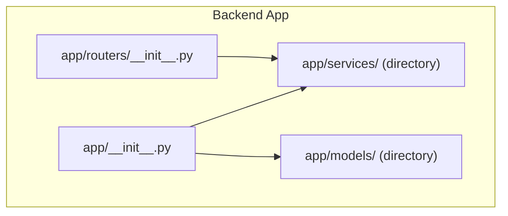

**Diagram sources**
- [__init__.py](file://backend/app/__init__.py)
- [routers/__init__.py](file://backend/app/routers/__init__.py)

**Section sources**
- [__init__.py](file://backend/app/__init__.py)
- [routers/__init__.py](file://backend/app/routers/__init__.py)

## Core Components
This section outlines the recommended components and responsibilities within the business logic layer.

- Service Interfaces
  - Define contracts for domain operations using abstract base classes or protocols.
  - Keep interfaces small, cohesive, and focused on a single responsibility.
  - Prefer explicit input/output types and clear error semantics.

- Abstract Base Classes
  - Provide shared behavior, validation helpers, logging hooks, and default implementations where appropriate.
  - Enforce consistent method signatures across concrete services.

- Concrete Services
  - Implement specific business use cases by composing multiple dependencies.
  - Avoid direct database calls; delegate persistence to repositories or data access layers.

- Factories
  - Create complex service instances with configured dependencies.
  - Centralize wiring logic to reduce duplication and improve testability.

- Strategy Pattern
  - Encapsulate interchangeable algorithms (e.g., pricing rules, notification channels).
  - Select strategies at runtime based on configuration or context.

- Configuration Handling
  - Load settings from environment variables or config files.
  - Validate configuration early and fail fast with descriptive errors.

- Error Propagation
  - Use domain-specific exceptions for business rule violations.
  - Wrap infrastructure errors with contextual messages.
  - Maintain consistent error codes and payloads across the stack.

[No sources needed since this section provides general guidance]

## Architecture Overview
The following diagram shows a typical layered architecture with clear separation between presentation, business logic, and data access.

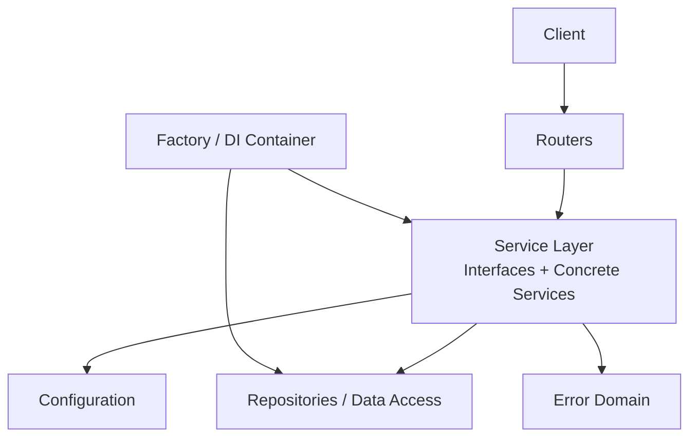

[No sources needed since this diagram shows conceptual workflow, not actual code structure]

## Detailed Component Analysis

### Service Interface Design
- Use an abstract base class or protocol to define the contract for each service.
- Methods should accept well-typed inputs and return typed outputs or results.
- Include methods for lifecycle hooks if needed (initialize, dispose).
- Keep interfaces stable; evolve via new methods rather than changing existing ones.

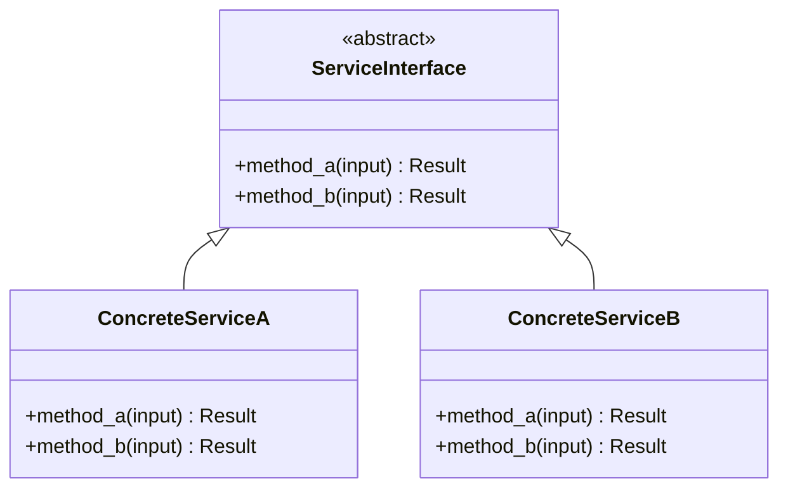

[No sources needed since this diagram illustrates conceptual interface design]

### Abstract Base Class and Composition
- Provide common validations, logging, metrics, and retry wrappers in the base class.
- Compose multiple dependencies (repositories, external clients) through constructor injection.
- Expose only necessary public methods; keep internal helpers private.

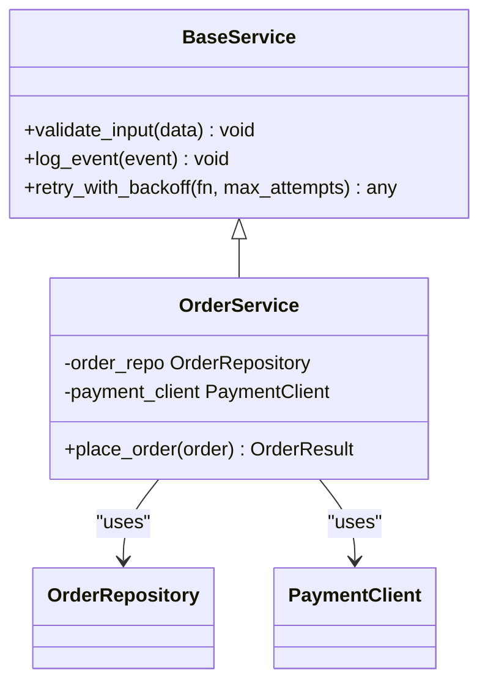

[No sources needed since this diagram illustrates conceptual composition]

### Factory Pattern and Dependency Injection
- Use a factory or DI container to assemble services and their dependencies.
- Register singletons for stateless services and scoped instances for request-scoped resources.
- Centralize configuration loading and validation in the factory.

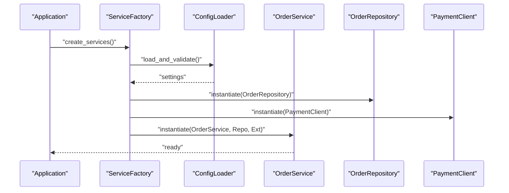

[No sources needed since this diagram illustrates conceptual DI flow]

### Strategy Pattern for Business Logic
- Define a strategy interface for pluggable algorithms (e.g., discount calculators).
- Provide multiple implementations and select one based on configuration or runtime context.
- Keep strategies pure and side-effect free when possible.

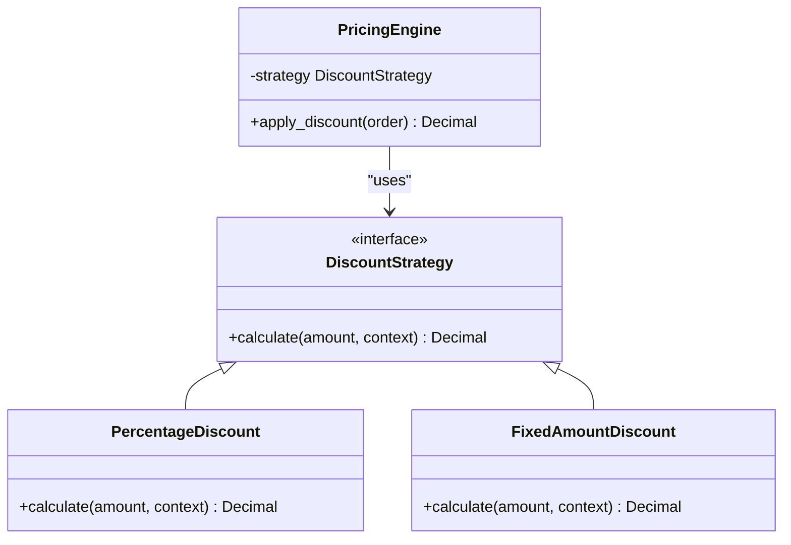

[No sources needed since this diagram illustrates conceptual strategy pattern]

### Service Lifecycle Management
- Initialization: load configuration, validate settings, prepare caches.
- Runtime: handle requests, orchestrate business flows, propagate errors.
- Shutdown: release resources, flush logs, close connections.

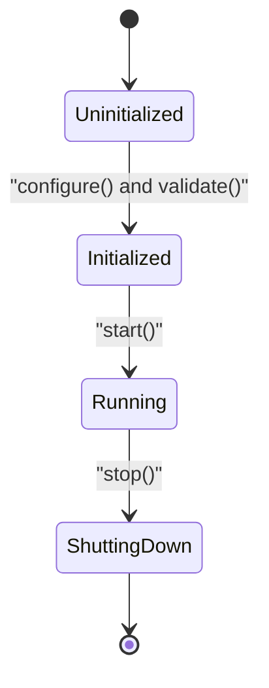

[No sources needed since this diagram illustrates conceptual lifecycle]

### Configuration Handling
- Load configuration from environment variables or config files.
- Validate required fields and provide defaults for optional ones.
- Surface configuration errors early during startup.

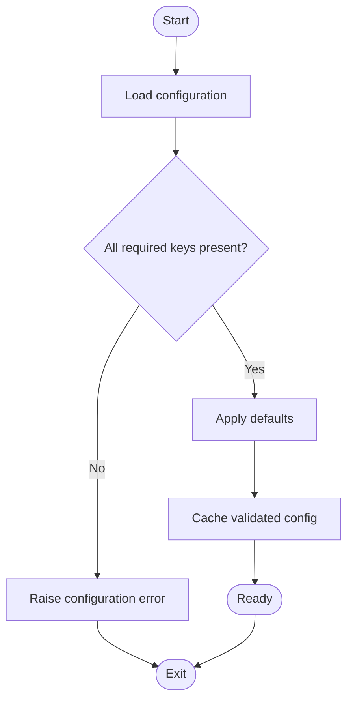

[No sources needed since this diagram illustrates conceptual configuration flow]

### Error Propagation Patterns
- Define domain-specific exceptions for business rule violations.
- Wrap lower-level exceptions with contextual information.
- Return consistent error responses to callers.

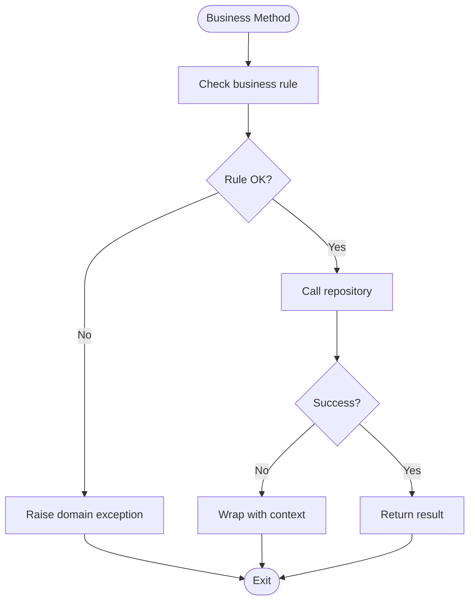

[No sources needed since this diagram illustrates conceptual error flow]

### Separation of Concerns: Business Rules vs Data Access
- Services own business rules and orchestration; repositories own persistence.
- Services should not leak persistence details into their API.
- Use DTOs or domain models to decouple service APIs from storage formats.

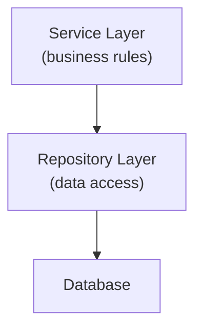

[No sources needed since this diagram illustrates conceptual separation]

## Dependency Analysis
The current repository snapshot indicates package-level organization via initialization files. These files mark module boundaries and can serve as entry points for dependency registration and configuration.

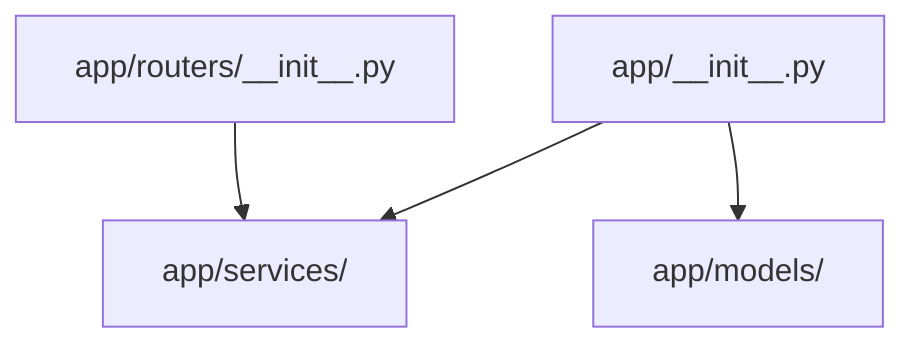

**Diagram sources**
- [__init__.py](file://backend/app/__init__.py)
- [routers/__init__.py](file://backend/app/routers/__init__.py)

**Section sources**
- [__init__.py](file://backend/app/__init__.py)
- [routers/__init__.py](file://backend/app/routers/__init__.py)

## Performance Considerations
- Prefer singleton services for stateless operations to reduce instantiation overhead.
- Use connection pooling for databases and HTTP clients.
- Cache frequently accessed read-only data with appropriate invalidation strategies.
- Batch operations where possible to minimize round trips.
- Measure and profile critical paths; avoid unnecessary allocations and deep object graphs.

[No sources needed since this section provides general guidance]

## Troubleshooting Guide
Common issues and remedies:
- Missing configuration keys: ensure all required settings are provided and validated at startup.
- Circular dependencies: refactor to break cycles using interfaces and lazy resolution.
- Resource leaks: implement proper shutdown hooks to close connections and flush buffers.
- Inconsistent errors: standardize error types and messages; log context-rich diagnostics.

[No sources needed since this section provides general guidance]

## Conclusion
Adopting clear service design patterns improves maintainability, testability, and scalability. By defining robust interfaces, leveraging factories and DI, applying strategy patterns for variability, and enforcing strict separation between business rules and data access, teams can build resilient business logic layers. Consistent lifecycle management, configuration handling, and error propagation further enhance reliability and operational clarity.

[No sources needed since this section summarizes without analyzing specific files]