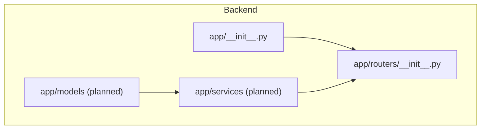
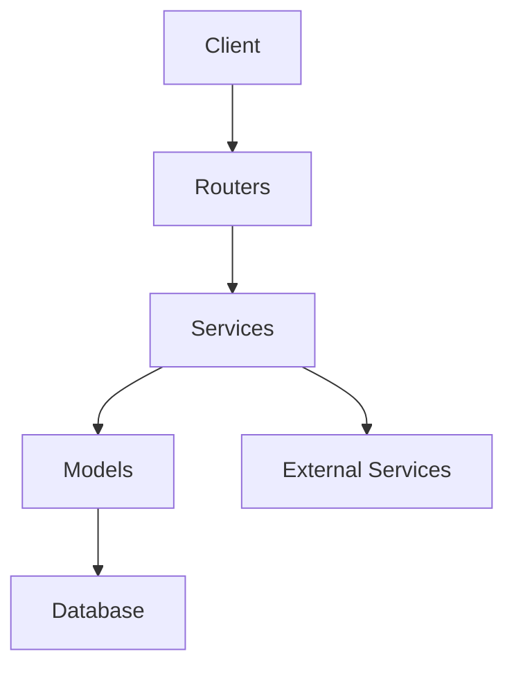
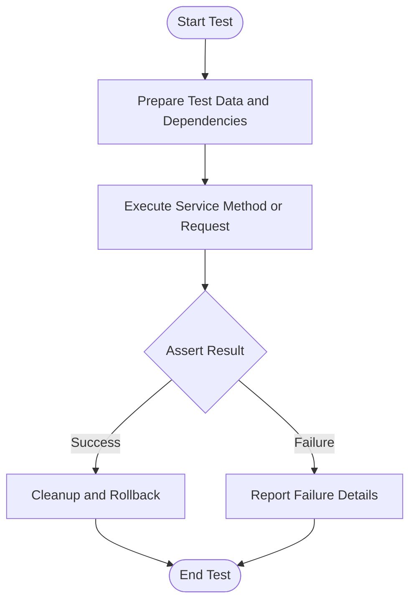
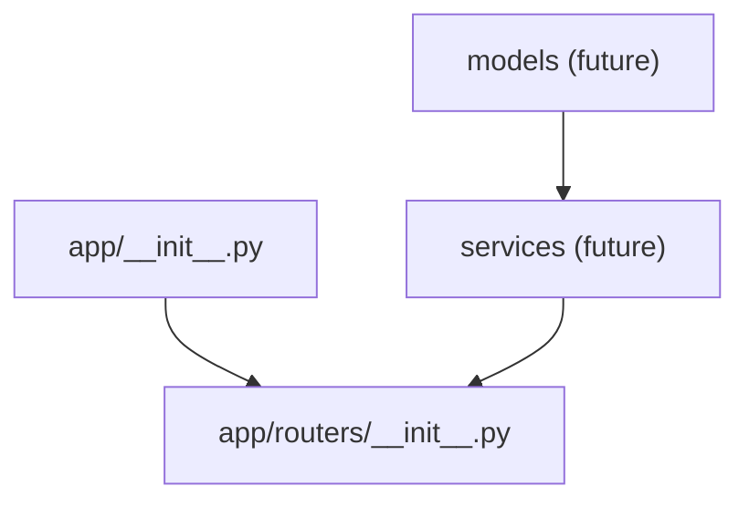

# Testing Strategies

<cite>
**Referenced Files in This Document**
- [__init__.py](file://backend/app/__init__.py)
- [routers/__init__.py](file://backend/app/routers/__init__.py)
</cite>

## Table of Contents
1. [Introduction](#introduction)
2. [Project Structure](#project-structure)
3. [Core Components](#core-components)
4. [Architecture Overview](#architecture-overview)
5. [Detailed Component Analysis](#detailed-component-analysis)
6. [Dependency Analysis](#dependency-analysis)
7. [Performance Considerations](#performance-considerations)
8. [Troubleshooting Guide](#troubleshooting-guide)
9. [Conclusion](#conclusion)
10. [Appendices](#appendices)

## Introduction
This document provides comprehensive testing strategies for business logic services in the GoNow application. It covers unit testing approaches, mocking external dependencies and database interactions, integration testing for service workflows and cross-service communication, asynchronous operations, transaction boundaries, error scenarios, test data management, environment configuration, and continuous integration setup. The guidance is designed to be accessible to both new and experienced contributors while remaining grounded in the repository’s structure.

## Project Structure
The repository contains a backend application with Python package scaffolding under backend/app. The current visible structure includes:
- backend/app/__init__.py
- backend/app/routers/__init__.py

These files indicate a modular Python application layout where routers are separated from other components such as models and services. While the specific implementation files are not present in this snapshot, the testing strategy below applies to typical Python web applications organized similarly.

[No sources needed since this diagram shows conceptual workflow, not actual code structure]

## Core Components
Given the current repository snapshot, the core components available for testing documentation are minimal. However, the following patterns apply when implementing tests for services and routers:

- Service layer testing:
  - Isolate business logic by mocking external dependencies (HTTP clients, databases, message queues).
  - Use dependency injection or interface abstractions to enable easy substitution with test doubles.
- Router-level testing:
  - Validate request/response contracts, status codes, headers, and payload shapes.
  - Mock downstream services to ensure router behavior is deterministic.

When services and models are added, adopt consistent naming and folder organization to keep tests co-located and discoverable.

[No sources needed since this section provides general guidance]

## Architecture Overview
A typical layered architecture for this project would include:
- Routers: HTTP endpoints that orchestrate requests.
- Services: Business logic encapsulated in reusable modules.
- Models: Data access and persistence abstractions.
- External integrations: Database drivers, third-party APIs, message brokers.

[No sources needed since this diagram shows conceptual workflow, not actual code structure]

## Detailed Component Analysis

### Unit Testing for Service Methods
- Objective: Verify correctness of business logic in isolation.
- Approach:
  - Identify inputs and expected outputs for each method.
  - Replace external dependencies with mocks or stubs.
  - Assert side effects (e.g., calls made to mocked objects) and return values.
- Best practices:
  - Keep tests small and focused on one behavior per test case.
  - Use parameterized tests for multiple input/output combinations.
  - Prefer explicit assertions over implicit ones for clarity.

Example patterns:
- Mocking an HTTP client used by a service to fetch remote data.
- Stubbing a database adapter to return predefined records.
- Verifying exception propagation and custom error types.

[No sources needed since this section provides general guidance]

### Integration Testing for Service Workflows
- Objective: Validate end-to-end flows across routers, services, and data stores.
- Approach:
  - Spin up a test database or use an in-memory store.
  - Seed deterministic test data before each scenario.
  - Execute full request cycles through routers and assert final state changes.
- Cross-service communication:
  - For synchronous calls, mock the client or use a test server.
  - For asynchronous messaging, use a test broker or capture events.

[No sources needed since this section provides general guidance]

### Asynchronous Operations
- Objective: Ensure correct handling of async tasks, retries, and timeouts.
- Approach:
  - Use event loops or async test runners appropriate to your framework.
  - Mock time-based behaviors deterministically.
  - Assert completion states and error paths.

[No sources needed since this section provides general guidance]

### Transaction Boundaries
- Objective: Guarantee data consistency within transactional units.
- Approach:
  - Wrap test scenarios in transactions and roll back after assertions.
  - Verify that partial failures do not leave inconsistent state.
  - Test nested transactions and savepoints if applicable.

[No sources needed since this section provides general guidance]

### Error Scenarios
- Objective: Confirm robust error handling and user-facing messages.
- Approach:
  - Inject faults into dependencies to simulate failures.
  - Validate error codes, logging, and metrics emission.
  - Ensure graceful degradation and safe defaults.

[No sources needed since this section provides general guidance]

### Concrete Examples of Test Setup, Mock Implementations, and Assertion Patterns
- Test setup:
  - Create fixtures for common entities and configurations.
  - Initialize dependency containers with test doubles.
- Mock implementations:
  - Provide deterministic responses for external APIs.
  - Simulate database constraints and edge cases.
- Assertions:
  - Check return values, raised exceptions, and side effects.
  - Validate logs and metrics using capture utilities.

[No sources needed since this section provides general guidance]

### Conceptual Overview

[No sources needed since this diagram shows conceptual workflow, not actual code structure]

## Dependency Analysis
At this stage, only package initialization files are visible. When services and routers are implemented, map their imports to identify coupling points suitable for mocking.

**Diagram sources**
- [__init__.py](file://backend/app/__init__.py)
- [routers/__init__.py](file://backend/app/routers/__init__.py)

**Section sources**
- [__init__.py](file://backend/app/__init__.py)
- [routers/__init__.py](file://backend/app/routers/__init__.py)

## Performance Considerations
- Keep unit tests fast by avoiding real I/O; prefer in-memory stores and mocks.
- Parallelize independent tests to reduce CI duration.
- Use efficient test data generation and avoid unnecessary serialization.
- Profile critical integration tests to detect bottlenecks early.

[No sources needed since this section provides general guidance]

## Troubleshooting Guide
Common issues and resolutions:
- Flaky tests due to timing:
  - Replace sleeps with deterministic waits or event-driven assertions.
- State leakage between tests:
  - Use transactions or fresh fixtures per test.
- Environment misconfiguration:
  - Centralize settings and inject them via environment variables or config files.
- Unhandled exceptions:
  - Add targeted assertions for error paths and verify logging.

[No sources needed since this section provides general guidance]

## Conclusion
Adopt a layered testing strategy that isolates business logic, validates integration flows, and ensures resilience against errors and concurrency. Maintain clear separation between unit and integration tests, invest in robust test data management, and integrate automated testing into CI to catch regressions early.

[No sources needed since this section summarizes without analyzing specific files]

## Appendices

### Test Data Management Guidelines
- Use factories or fixtures to generate realistic but minimal datasets.
- Version seed data alongside schema migrations.
- Avoid shared mutable state; reset or rollback after each test.

### Test Environment Configuration
- Separate configs for development, testing, and CI.
- Use environment variables for secrets and toggles.
- Provide a local script to bootstrap required services (DB, cache, queue).

### Continuous Integration Setup
- Run linting, type checks, and tests on every push.
- Cache dependencies to speed up builds.
- Publish test reports and artifacts for review.

[No sources needed since this section provides general guidance]