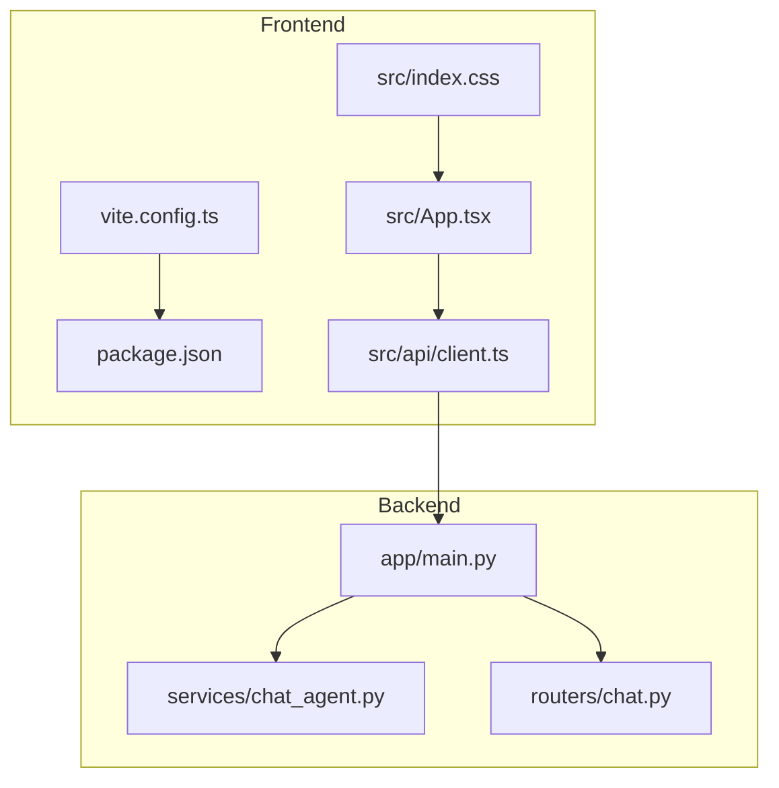
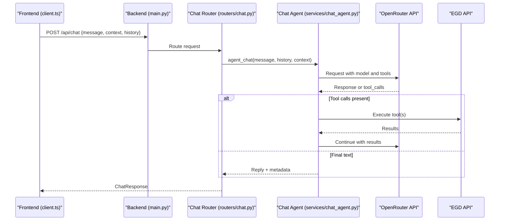
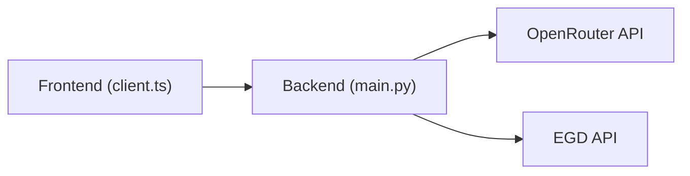

# Configuration & Customization

<cite>
**Referenced Files in This Document**
- [README.md](file://README.md)
- [main.py](file://backend/app/main.py)
- [chat_agent.py](file://backend/app/services/chat_agent.py)
- [chat.py](file://backend/app/routers/chat.py)
- [vite.config.ts](file://frontend/vite.config.ts)
- [package.json](file://frontend/package.json)
- [client.ts](file://frontend/src/api/client.ts)
- [index.css](file://frontend/src/index.css)
- [App.tsx](file://frontend/src/App.tsx)
- [Makefile](file://Makefile)
</cite>

## Update Summary
**Changes Made**
- Updated CORS configuration section to document support for multiple development environments (localhost:5174, localhost:5175)
- Enhanced troubleshooting guide with specific guidance for multi-instance development scenarios
- Added detailed explanation of development environment flexibility and best practices

## Table of Contents
1. [Introduction](#introduction)
2. [Project Structure](#project-structure)
3. [Core Components](#core-components)
4. [Architecture Overview](#architecture-overview)
5. [Detailed Component Analysis](#detailed-component-analysis)
6. [Dependency Analysis](#dependency-analysis)
7. [Performance Considerations](#performance-considerations)
8. [Troubleshooting Guide](#troubleshooting-guide)
9. [Conclusion](#conclusion)

## Introduction
This document explains how to configure and customize the application, focusing on:
- Backend environment variables for external services (EGD API token and OpenRouter chat).
- Frontend build configuration with Vite.
- Theme customization via CSS custom properties.
- Feature toggles and runtime behavior controls.
- Deployment considerations and performance tuning parameters.

The goal is to help you set up, tailor, and operate the system reliably across development and production environments.

## Project Structure
At a high level:
- Backend (FastAPI) loads secrets from a .env file and exposes REST endpoints.
- Frontend (React + Vite) builds static assets and calls backend APIs.
- Chat features integrate with OpenRouter using environment-driven model selection and iteration limits.



**Diagram sources**
- [main.py:1-42](file://backend/app/main.py#L1-L42)
- [chat_agent.py:1-154](file://backend/app/services/chat_agent.py#L1-L154)
- [chat.py:70-94](file://backend/app/routers/chat.py#L70-L94)
- [vite.config.ts:1-8](file://frontend/vite.config.ts#L1-L8)
- [package.json:1-30](file://frontend/package.json#L1-L30)
- [client.ts:1-86](file://frontend/src/api/client.ts#L1-L86)
- [index.css:1-313](file://frontend/src/index.css#L1-L313)
- [App.tsx:1-37](file://frontend/src/App.tsx#L1-L37)

**Section sources**
- [main.py:1-42](file://backend/app/main.py#L1-L42)
- [vite.config.ts:1-8](file://frontend/vite.config.ts#L1-L8)
- [package.json:1-30](file://frontend/package.json#L1-L30)

## Core Components
- Backend environment loading and CORS setup.
- Agentic chat loop that reads model and iteration settings from environment.
- Frontend build pipeline and theme system.
- API client configuration for local development.

Key environment variables:
- EGD_API_TOKEN: Required bearer token for the European Go Database GraphQL API.
- OPENROUTER_API_KEY: Optional key enabling AI chat; if missing, chat is disabled.
- CHAT_MODEL: Model identifier used by OpenRouter for chat responses.
- CHAT_MAX_ITERATIONS: Maximum number of tool-calling iterations per turn.

Security considerations:
- Keep tokens and keys out of source control; use secure secret management in production.
- Restrict CORS origins to trusted domains in production.
- Avoid logging sensitive values.

**Section sources**
- [README.md:139-167](file://README.md#L139-L167)
- [main.py:1-42](file://backend/app/main.py#L1-L42)
- [chat_agent.py:1-154](file://backend/app/services/chat_agent.py#L1-L154)
- [client.ts:1-86](file://frontend/src/api/client.ts#L1-L86)

## Architecture Overview
The frontend communicates with the backend over HTTP. The backend integrates with two external services:
- EGD API (via GraphQL) for player data.
- OpenRouter API for LLM-powered chat with tool calling.



**Diagram sources**
- [client.ts:74-86](file://frontend/src/api/client.ts#L74-L86)
- [main.py:14-31](file://backend/app/main.py#L14-L31)
- [chat.py:70-94](file://backend/app/routers/chat.py#L70-L94)
- [chat_agent.py:30-154](file://backend/app/services/chat_agent.py#L30-L154)

## Detailed Component Analysis

### Backend Environment Variables
- Location: backend/.env (loaded at startup).
- Variables:
  - EGD_API_TOKEN: Required for EGD access.
  - OPENROUTER_API_KEY: Enables chat; when empty, chat returns a configured message indicating it is not configured.
  - CHAT_MODEL: Selects the LLM provider/model string.
  - CHAT_MAX_ITERATIONS: Caps the number of tool-calling loops per user message.

Behavioral notes:
- If OPENROUTER_API_KEY is missing, the chat endpoint returns a friendly message instead of failing hard.
- CHAT_MODEL defaults to a fast, cost-effective model when not provided.
- CHAT_MAX_ITERATIONS prevents runaway tool-calling loops.

Security guidance:
- Store secrets in a secure vault or platform secret store in production.
- Do not commit .env files to version control.
- Validate and rotate tokens regularly.

**Section sources**
- [README.md:139-167](file://README.md#L139-L167)
- [chat_agent.py:1-154](file://backend/app/services/chat_agent.py#L1-L154)

### Frontend Build Configuration (Vite)
- Entry point: vite.config.ts enables React plugin.
- Scripts: package.json defines dev, build, lint, preview commands.
- TypeScript targets ES2023 with modern module resolution.

Customization options:
- Add plugins (e.g., path aliases, code splitting, analytics) in the Vite config.
- Configure build output directory, base URL, and proxy rules for production.
- Use environment variables injected by Vite where needed (not currently used in this project).

Development vs production:
- Development server runs on port 5173 by default.
- Production build outputs static assets under dist for serving.

**Section sources**
- [vite.config.ts:1-8](file://frontend/vite.config.ts#L1-L8)
- [package.json:1-30](file://frontend/package.json#L1-L30)
- [tsconfig.app.json:1-26](file://frontend/tsconfig.app.json#L1-L26)

### Theme Customization (CSS Custom Properties)
The app uses CSS custom properties for theming, including colors, fonts, and UI tokens. Key areas:
- :root variables define palette, typography, and layout tokens.
- Dark mode support via prefers-color-scheme media query.
- Reusable components reference these variables for consistent styling.

How to customize:
- Override :root variables to change colors, fonts, spacing, and accents.
- Extend or replace dark-mode overrides for alternate themes.
- Introduce new tokens for component-specific needs while keeping consistency.

Accessibility tips:
- Ensure sufficient contrast between text and background tokens.
- Test both light and dark modes for readability.

**Section sources**
- [index.css:1-313](file://frontend/src/index.css#L1-L313)

### Feature Toggles and Runtime Behavior
- Chat feature toggle: Controlled by presence of OPENROUTER_API_KEY. When absent, chat responds with an informative message.
- Iteration limit: CHAT_MAX_ITERATIONS bounds tool-calling loops to prevent excessive requests.
- Model selection: CHAT_MODEL selects which LLM to call.

Operational implications:
- Disabling chat avoids unnecessary costs and dependencies.
- Adjusting iterations balances responsiveness and depth of analysis.

**Section sources**
- [chat_agent.py:1-154](file://backend/app/services/chat_agent.py#L1-L154)
- [README.md:139-167](file://README.md#L139-L167)

### API Client and CORS Configuration

**Updated** Enhanced CORS configuration now supports multiple development environments to enable concurrent frontend instances during development.

#### CORS Origins Configuration
The backend CORS middleware is configured to allow multiple development origins:
- **Primary development**: `http://localhost:5173` (default Vite dev server)
- **Additional development instances**: `http://localhost:5174`, `http://localhost:5175` (for running multiple frontend instances)
- **Alternative development**: `http://localhost:3000` (for Create React App or other frameworks)

#### Multi-Instance Development Support
The expanded CORS configuration enables developers to:
- Run multiple frontend instances simultaneously during development
- Test different versions or branches concurrently
- Develop separate micro-frontends or companion applications
- Avoid cross-origin request blocking issues when switching between development environments

#### Production CORS Configuration
For production deployments, restrict CORS origins to your actual domain(s):
```python
allow_origins=["https://yourdomain.com", "https://www.yourdomain.com"]
```

#### Frontend API Client Configuration
- Development: Points to `http://localhost:8000/api`
- Production: Update baseURL to your deployed backend domain

**Section sources**
- [client.ts:1-86](file://frontend/src/api/client.ts#L1-L86)
- [main.py:20-27](file://backend/app/main.py#L20-L27)

### Deployment Configuration Options
- Backend:
  - Run with uvicorn in production-grade mode (workers, host/port).
  - Serve static frontend assets from the backend or a CDN after building.
- Frontend:
  - Build with npm run build to produce optimized assets.
  - Set appropriate base path if served from a subpath.
- Makefile:
  - Provides convenience tasks for install, dev, build, and stop.

Environment strategy:
- Use separate .env files or platform secret stores for dev/staging/prod.
- Ensure CORS and API base URLs match deployment topology.

**Section sources**
- [Makefile:1-54](file://Makefile#L1-L54)
- [main.py:14-31](file://backend/app/main.py#L14-L31)
- [client.ts:1-86](file://frontend/src/api/client.ts#L1-L86)

## Dependency Analysis
External integrations and their configuration:
- OpenRouter API: Auth via OPENROUTER_API_KEY; model via CHAT_MODEL; loop control via CHAT_MAX_ITERATIONS.
- EGD API: Auth via EGD_API_TOKEN.
- Frontend depends on backend REST endpoints defined in routers.



**Diagram sources**
- [client.ts:1-86](file://frontend/src/api/client.ts#L1-L86)
- [main.py:14-31](file://backend/app/main.py#L14-L31)
- [chat_agent.py:1-154](file://backend/app/services/chat_agent.py#L1-L154)

**Section sources**
- [README.md:139-167](file://README.md#L139-L167)
- [chat_agent.py:1-154](file://backend/app/services/chat_agent.py#L1-L154)

## Performance Considerations
- Chat latency:
  - Tune CHAT_MAX_ITERATIONS to reduce round-trips when deep tool usage is not required.
  - Choose a faster model via CHAT_MODEL for lower latency and cost.
- Network timeouts:
  - Backend HTTP clients have explicit timeouts; adjust if necessary based on network conditions.
- Frontend caching:
  - React Query default options include retry and staleTime; tune these for your data freshness needs.
- Build optimizations:
  - Use production builds for smaller bundles and better asset caching.
  - Consider code-splitting and lazy-loading routes/pages.

[No sources needed since this section provides general guidance]

## Troubleshooting Guide

**Updated** Enhanced troubleshooting guidance for multi-instance development scenarios.

Common issues and resolutions:
- Chat disabled:
  - Symptom: Chat replies indicate it is not configured.
  - Cause: OPENROUTER_API_KEY missing in backend .env.
  - Fix: Provide a valid key and restart the backend.
- Wrong model or behavior:
  - Check CHAT_MODEL value and ensure the selected model supports tool calling.
- Too many iterations:
  - Reduce CHAT_MAX_ITERATIONS to cap tool-calling loops.
- CORS errors in development:
  - **Multi-instance development**: Ensure your frontend instance port matches one of the allowed origins (5173, 5174, 5175, 3000).
  - **Single instance**: Verify frontend origin matches backend allow_origins list.
  - **Production**: Check that your domain is properly configured in CORS settings.
- API connectivity:
  - Verify EGD_API_TOKEN validity and network access to external APIs.
- Multiple frontend instances conflicts:
  - Each frontend instance should run on a different port (5173, 5174, 5175).
  - All instances can connect to the same backend instance due to expanded CORS configuration.
  - Use browser developer tools to verify CORS headers are being sent correctly.

**Section sources**
- [chat_agent.py:42-48](file://backend/app/services/chat_agent.py#L42-L48)
- [main.py:20-27](file://backend/app/main.py#L20-L27)

## Conclusion
You can fully configure and customize the application by:
- Setting backend environment variables for EGD and OpenRouter.
- Tailoring the frontend build and theme through Vite and CSS variables.
- Applying feature toggles and performance parameters to fit your operational needs.
- Following security best practices for secrets and CORS in production.
- Leveraging enhanced CORS configuration for flexible multi-instance development workflows.

The updated CORS configuration provides greater flexibility for development environments, allowing teams to run multiple frontend instances concurrently while maintaining security boundaries in production deployments.