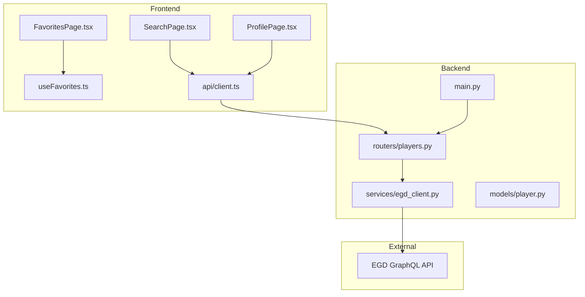
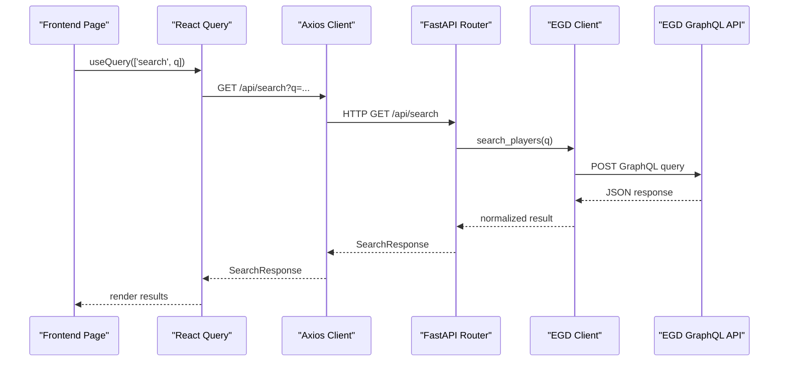
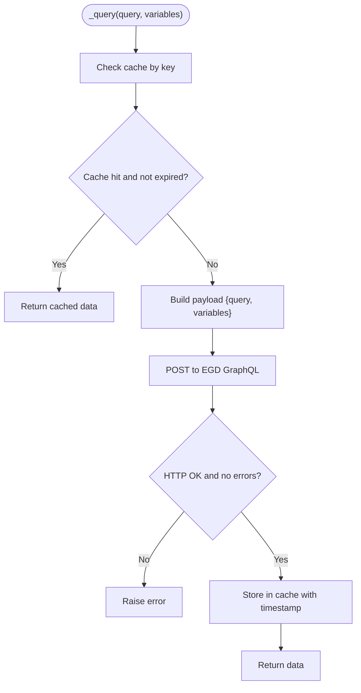
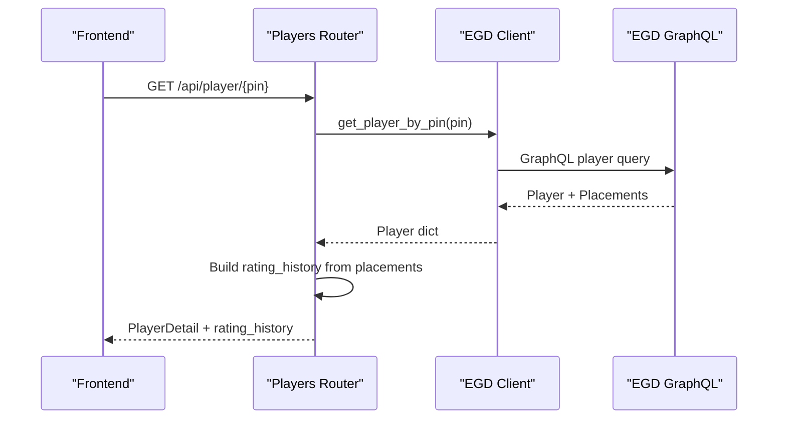
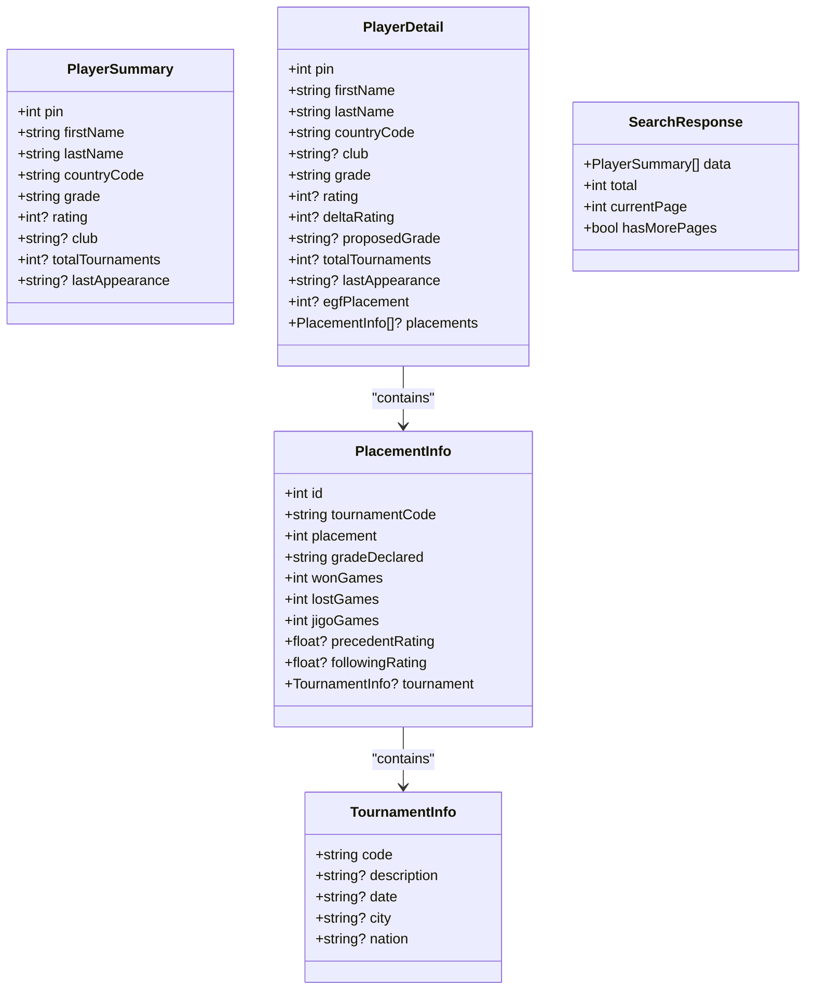
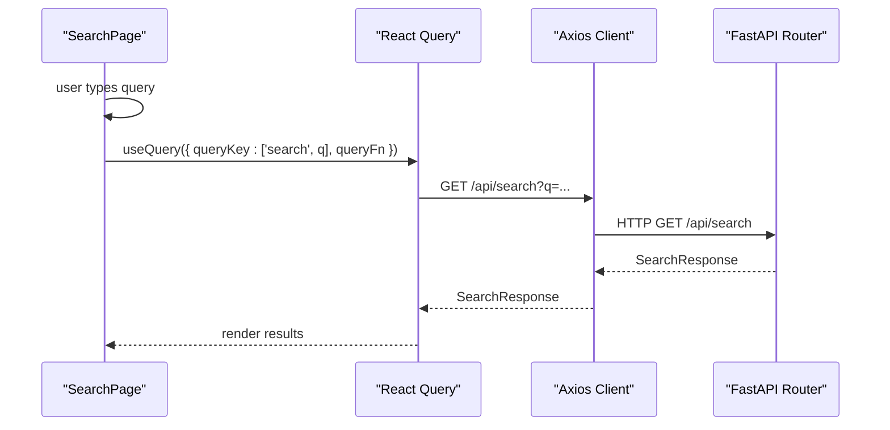
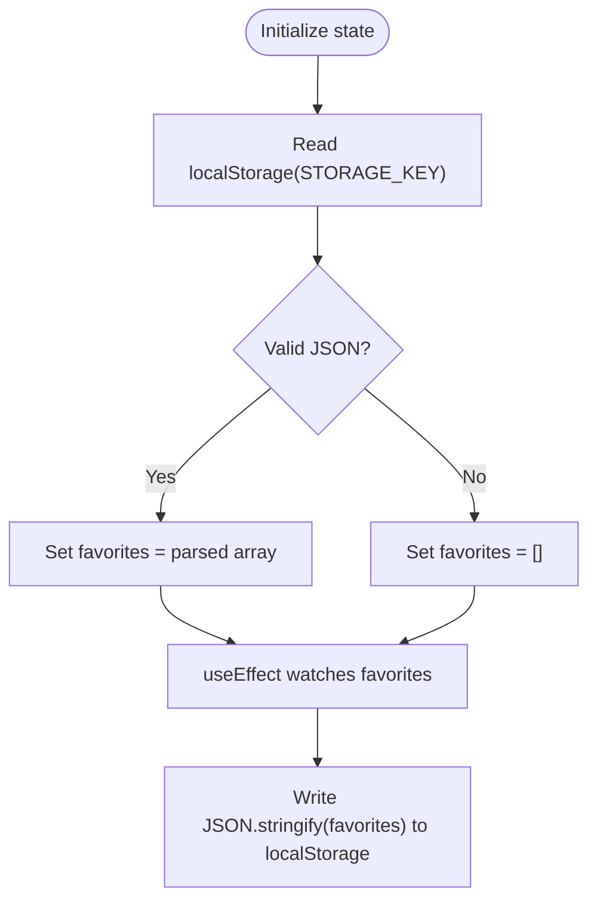
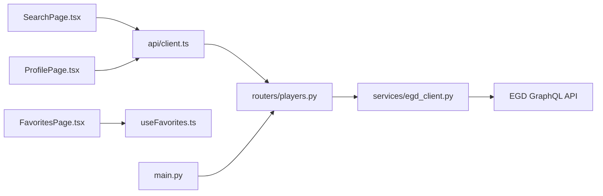

# Data Management

<cite>
**Referenced Files in This Document**
- [backend/app/services/egd_client.py](file://backend/app/services/egd_client.py)
- [backend/app/models/player.py](file://backend/app/models/player.py)
- [backend/app/routers/players.py](file://backend/app/routers/players.py)
- [backend/app/main.py](file://backend/app/main.py)
- [frontend/src/api/client.ts](file://frontend/src/api/client.ts)
- [frontend/src/hooks/useFavorites.ts](file://frontend/src/hooks/useFavorites.ts)
- [frontend/src/pages/SearchPage.tsx](file://frontend/src/pages/SearchPage.tsx)
- [frontend/src/pages/ProfilePage.tsx](file://frontend/src/pages/ProfilePage.tsx)
- [frontend/src/pages/FavoritesPage.tsx](file://frontend/src/pages/FavoritesPage.tsx)
- [docs/EGD_API.md](file://docs/EGD_API.md)
</cite>

## Table of Contents
1. [Introduction](#introduction)
2. [Project Structure](#project-structure)
3. [Core Components](#core-components)
4. [Architecture Overview](#architecture-overview)
5. [Detailed Component Analysis](#detailed-component-analysis)
6. [Dependency Analysis](#dependency-analysis)
7. [Performance Considerations](#performance-considerations)
8. [Troubleshooting Guide](#troubleshooting-guide)
9. [Conclusion](#conclusion)

## Introduction
This document explains the data management layer across the GoNow application, focusing on:
- EGD GraphQL integration for player and tournament data
- Caching strategies for API responses
- Local storage persistence for favorites
- Data modeling with TypeScript interfaces and Pydantic models
- Validation and type safety
- Synchronization patterns between frontend and backend

The system provides a FastAPI backend that proxies requests to the European Go Database (EGD) GraphQL API, and a React frontend that consumes REST endpoints, caches queries via React Query, and persists user favorites in browser localStorage.

## Project Structure
At a high level:
- Backend
  - GraphQL client to EGD with TTL-based caching
  - FastAPI routes exposing REST endpoints for search, player details, games, and tournaments
  - Pydantic models defining expected shapes for validation and documentation
- Frontend
  - Axios client calling backend REST endpoints
  - React Query for server state caching and background updates
  - Favorites hook using localStorage for persistent per-user lists
  - Pages orchestrating UI flows and data fetching

**Diagram sources**
- [frontend/src/pages/SearchPage.tsx:1-240](file://frontend/src/pages/SearchPage.tsx#L1-L240)
- [frontend/src/pages/ProfilePage.tsx:1-375](file://frontend/src/pages/ProfilePage.tsx#L1-L375)
- [frontend/src/pages/FavoritesPage.tsx:1-103](file://frontend/src/pages/FavoritesPage.tsx#L1-L103)
- [frontend/src/hooks/useFavorites.ts:1-49](file://frontend/src/hooks/useFavorites.ts#L1-L49)
- [frontend/src/api/client.ts:1-86](file://frontend/src/api/client.ts#L1-L86)
- [backend/app/main.py:1-42](file://backend/app/main.py#L1-L42)
- [backend/app/routers/players.py:1-107](file://backend/app/routers/players.py#L1-L107)
- [backend/app/services/egd_client.py:1-197](file://backend/app/services/egd_client.py#L1-L197)

**Section sources**
- [backend/app/main.py:1-42](file://backend/app/main.py#L1-L42)
- [backend/app/routers/players.py:1-107](file://backend/app/routers/players.py#L1-L107)
- [backend/app/services/egd_client.py:1-197](file://backend/app/services/egd_client.py#L1-L197)
- [frontend/src/api/client.ts:1-86](file://frontend/src/api/client.ts#L1-L86)
- [frontend/src/hooks/useFavorites.ts:1-49](file://frontend/src/hooks/useFavorites.ts#L1-L49)
- [frontend/src/pages/SearchPage.tsx:1-240](file://frontend/src/pages/SearchPage.tsx#L1-L240)
- [frontend/src/pages/ProfilePage.tsx:1-375](file://frontend/src/pages/ProfilePage.tsx#L1-L375)
- [frontend/src/pages/FavoritesPage.tsx:1-103](file://frontend/src/pages/FavoritesPage.tsx#L1-L103)

## Core Components
- EGD GraphQL Client
  - Encapsulates HTTP calls to EGD GraphQL endpoint
  - Implements TTL-based in-memory cache keyed by query and variables
  - Provides typed helpers for searching players, retrieving player details, games, and derived tournament summaries
- Backend Routes
  - Expose REST endpoints under /api for search, player detail, games, and tournaments
  - Transform EGD responses into consistent shapes consumed by the frontend
- Frontend API Client
  - Axios instance configured with base URL and typed request/response interfaces
  - Functions for search, player detail, and tournaments
- Favorites Hook
  - Manages a list of favorite players persisted in localStorage
  - Provides add/remove/toggle/isFavorite operations with deduplication by PIN
- Data Models
  - Pydantic models define expected structures for player-related data
  - TypeScript interfaces mirror the same shape on the frontend

Key responsibilities and interactions are detailed in the following sections.

**Section sources**
- [backend/app/services/egd_client.py:1-197](file://backend/app/services/egd_client.py#L1-L197)
- [backend/app/routers/players.py:1-107](file://backend/app/routers/players.py#L1-L107)
- [backend/app/models/player.py:1-60](file://backend/app/models/player.py#L1-L60)
- [frontend/src/api/client.ts:1-86](file://frontend/src/api/client.ts#L1-L86)
- [frontend/src/hooks/useFavorites.ts:1-49](file://frontend/src/hooks/useFavorites.ts#L1-L49)

## Architecture Overview
The data flow spans three layers:
- Frontend pages orchestrate UI and fetch data via React Query
- Backend routes translate REST calls into GraphQL queries against EGD
- EGD GraphQL API returns structured player and tournament data

**Diagram sources**
- [frontend/src/pages/SearchPage.tsx:1-240](file://frontend/src/pages/SearchPage.tsx#L1-L240)
- [frontend/src/api/client.ts:1-86](file://frontend/src/api/client.ts#L1-L86)
- [backend/app/routers/players.py:1-107](file://backend/app/routers/players.py#L1-L107)
- [backend/app/services/egd_client.py:1-197](file://backend/app/services/egd_client.py#L1-L197)
- [docs/EGD_API.md:1-274](file://docs/EGD_API.md#L1-L274)

## Detailed Component Analysis

### EGD GraphQL Integration and Caching
Responsibilities:
- Build and execute GraphQL queries against EGD
- Cache responses with TTL to reduce external calls
- Provide convenience methods for common operations

Caching strategy:
- In-memory dictionary keyed by query string plus serialized variables
- TTL of 300 seconds; entries older than TTL are evicted on read
- Errors from EGD raise exceptions; successful responses are cached

GraphQL query patterns:
- Player search with pagination fields
- Player detail including biography and placements
- Games listing with filters and ordering
- Derived tournament summary extracted from placements

Error handling:
- HTTP errors raised by the client
- GraphQL errors surfaced as exceptions
- Route handlers wrap calls and return HTTPException with status codes

**Diagram sources**
- [backend/app/services/egd_client.py:21-42](file://backend/app/services/egd_client.py#L21-L42)

**Section sources**
- [backend/app/services/egd_client.py:1-197](file://backend/app/services/egd_client.py#L1-L197)
- [docs/EGD_API.md:1-274](file://docs/EGD_API.md#L1-L274)

### Backend REST Endpoints and Data Transformation
Endpoints:
- GET /api/search?q=...
  - If q is numeric, attempts direct PIN lookup first; otherwise performs name search
  - Returns a SearchResponse-like structure
- GET /api/player/{pin}
  - Fetches player details and builds rating_history from placements
  - Sorts history by date
- GET /api/player/{pin}/games?page=&limit=
  - Returns paginated game history
- GET /api/player/{pin}/tournaments
  - Returns sorted tournament history derived from placements

Validation and safety:
- Input validation via Query parameters (e.g., page >= 1, limit within bounds)
- Exceptions caught and mapped to HTTPException with appropriate status codes

**Diagram sources**
- [backend/app/routers/players.py:43-80](file://backend/app/routers/players.py#L43-L80)
- [backend/app/services/egd_client.py:72-118](file://backend/app/services/egd_client.py#L72-L118)

**Section sources**
- [backend/app/routers/players.py:1-107](file://backend/app/routers/players.py#L1-L107)

### Data Modeling and Type Safety
Pydantic models:
- PlayerSummary: core fields for search results
- TournamentInfo, PlacementInfo: nested structures for tournament and placement data
- PlayerDetail: extended profile including deltaRating, proposedGrade, placements
- SearchResponse: standardized search result envelope

TypeScript interfaces:
- PlayerSummary, SearchResponse, RatingHistoryEntry, PlayerDetail, ChatMessage, ChatResponse
- Mirrors backend shapes to ensure compile-time checks and better DX

Synchronization pattern:
- Backend transforms EGD responses into stable shapes
- Frontend types align with backend payloads
- Optional fields marked nullable to reflect real-world data variability

**Diagram sources**
- [backend/app/models/player.py:6-60](file://backend/app/models/player.py#L6-L60)

**Section sources**
- [backend/app/models/player.py:1-60](file://backend/app/models/player.py#L1-L60)
- [frontend/src/api/client.ts:7-46](file://frontend/src/api/client.ts#L7-L46)

### Frontend Data Fetching and Caching
Patterns:
- Axios client configured with baseURL pointing to backend
- React Query hooks:
  - SearchPage uses useQuery with queryKey ['search', debouncedQuery], staleTime set to 60 seconds
  - ProfilePage uses useQuery with queryKey ['player', pin]
- Debounced input reduces unnecessary network requests

Caching behavior:
- React Query caches responses per queryKey
- Stale time controls when background refetch occurs
- Error states handled in UI

**Diagram sources**
- [frontend/src/pages/SearchPage.tsx:13-23](file://frontend/src/pages/SearchPage.tsx#L13-L23)
- [frontend/src/api/client.ts:59-62](file://frontend/src/api/client.ts#L59-L62)
- [backend/app/routers/players.py:8-40](file://backend/app/routers/players.py#L8-L40)

**Section sources**
- [frontend/src/pages/SearchPage.tsx:1-240](file://frontend/src/pages/SearchPage.tsx#L1-L240)
- [frontend/src/pages/ProfilePage.tsx:1-375](file://frontend/src/pages/ProfilePage.tsx#L1-L375)
- [frontend/src/api/client.ts:1-86](file://frontend/src/api/client.ts#L1-L86)

### Favorites System and LocalStorage Persistence
Behavior:
- useFavorites hook initializes state from localStorage
- Persists changes back to localStorage on state updates
- Provides add/remove/toggle/isFavorite utilities
- Deduplicates by player PIN

Data model:
- Stores PlayerSummary objects
- Keys stored under a constant STORAGE_KEY

**Diagram sources**
- [frontend/src/hooks/useFavorites.ts:6-18](file://frontend/src/hooks/useFavorites.ts#L6-L18)

Usage points:
- SearchPage toggles favorites per player card
- ProfilePage shows favorite button and toggles state
- FavoritesPage lists all favorites and allows removal

**Section sources**
- [frontend/src/hooks/useFavorites.ts:1-49](file://frontend/src/hooks/useFavorites.ts#L1-L49)
- [frontend/src/pages/SearchPage.tsx:109-116](file://frontend/src/pages/SearchPage.tsx#L109-L116)
- [frontend/src/pages/ProfilePage.tsx:93-96](file://frontend/src/pages/ProfilePage.tsx#L93-L96)
- [frontend/src/pages/FavoritesPage.tsx:1-103](file://frontend/src/pages/FavoritesPage.tsx#L1-L103)

### Data Validation and Error Handling
Backend:
- Query parameter constraints enforced (e.g., page >= 1, limit bounds)
- HTTPException used to signal client/server errors
- EGD client raises ValueError for GraphQL errors and httpx.HTTPError for transport issues

Frontend:
- React Query isError flag surfaces network or server errors
- User-friendly messages displayed in UI
- Axios errors propagate through Promise rejections

Best practices observed:
- Centralized error mapping at route boundaries
- Defensive parsing and optional fields in both backend and frontend models

**Section sources**
- [backend/app/routers/players.py:8-40](file://backend/app/routers/players.py#L8-L40)
- [backend/app/services/egd_client.py:38-42](file://backend/app/services/egd_client.py#L38-L42)
- [frontend/src/pages/SearchPage.tsx:77-81](file://frontend/src/pages/SearchPage.tsx#L77-L81)
- [frontend/src/pages/ProfilePage.tsx:33-42](file://frontend/src/pages/ProfilePage.tsx#L33-L42)

## Dependency Analysis
High-level dependencies:
- Frontend pages depend on api/client.ts and hooks/useFavorites.ts
- api/client.ts depends on axios and defines shared interfaces
- Backend main.py mounts routers
- routers/players.py depends on services/egd_client.py
- services/egd_client.py depends on httpx and environment configuration
- docs/EGD_API.md documents the external GraphQL schema and queries

**Diagram sources**
- [frontend/src/pages/SearchPage.tsx:1-240](file://frontend/src/pages/SearchPage.tsx#L1-L240)
- [frontend/src/pages/ProfilePage.tsx:1-375](file://frontend/src/pages/ProfilePage.tsx#L1-L375)
- [frontend/src/pages/FavoritesPage.tsx:1-103](file://frontend/src/pages/FavoritesPage.tsx#L1-L103)
- [frontend/src/api/client.ts:1-86](file://frontend/src/api/client.ts#L1-L86)
- [backend/app/main.py:1-42](file://backend/app/main.py#L1-L42)
- [backend/app/routers/players.py:1-107](file://backend/app/routers/players.py#L1-L107)
- [backend/app/services/egd_client.py:1-197](file://backend/app/services/egd_client.py#L1-L197)

**Section sources**
- [backend/app/main.py:1-42](file://backend/app/main.py#L1-L42)
- [backend/app/routers/players.py:1-107](file://backend/app/routers/players.py#L1-L107)
- [backend/app/services/egd_client.py:1-197](file://backend/app/services/egd_client.py#L1-L197)
- [frontend/src/api/client.ts:1-86](file://frontend/src/api/client.ts#L1-L86)
- [frontend/src/hooks/useFavorites.ts:1-49](file://frontend/src/hooks/useFavorites.ts#L1-L49)

## Performance Considerations
- Backend caching
  - TTL-based in-memory cache reduces repeated EGD calls
  - Key includes query and variables to avoid cross-contamination
- Frontend caching
  - React Query staleTime prevents frequent refetches
  - Debounced search input minimizes network load
- Pagination and limits
  - Games endpoint enforces upper bound on limit to prevent large payloads
- Data shaping
  - Backend precomputes rating_history and sorts by date to minimize frontend work

[No sources needed since this section provides general guidance]

## Troubleshooting Guide
Common issues and resolutions:
- Network or CORS errors
  - Ensure backend CORS allows frontend origins
  - Verify baseURL in axios client matches running backend
- Authentication failures
  - Confirm EGD_API_TOKEN is set in environment
  - Check Authorization header construction in client
- GraphQL errors
  - Inspect error messages returned by EGD
  - Validate query fields match schema
- Empty or partial data
  - Handle optional fields gracefully on both sides
  - Use null checks and fallbacks in UI

Operational tips:
- Use health endpoint to verify backend availability
- Leverage React Query devtools to inspect cache and refetch behavior
- Clear localStorage if favorites become inconsistent

**Section sources**
- [backend/app/main.py:20-27](file://backend/app/main.py#L20-L27)
- [backend/app/services/egd_client.py:12-18](file://backend/app/services/egd_client.py#L12-L18)
- [frontend/src/api/client.ts:3-5](file://frontend/src/api/client.ts#L3-L5)
- [frontend/src/pages/SearchPage.tsx:77-81](file://frontend/src/pages/SearchPage.tsx#L77-L81)
- [frontend/src/pages/ProfilePage.tsx:33-42](file://frontend/src/pages/ProfilePage.tsx#L33-L42)

## Conclusion
GoNow’s data management combines robust backend transformation and caching with efficient frontend caching and local persistence. The design emphasizes type safety through aligned Pydantic and TypeScript models, clear separation of concerns, and resilient error handling. The result is a responsive, reliable experience for exploring and tracking European Go players.