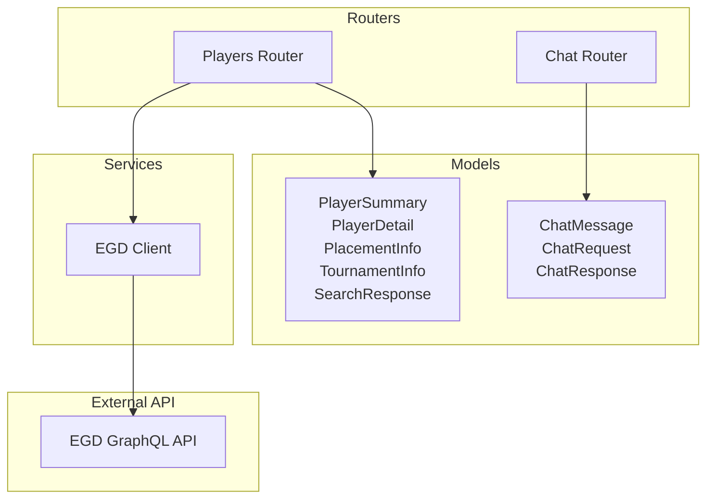
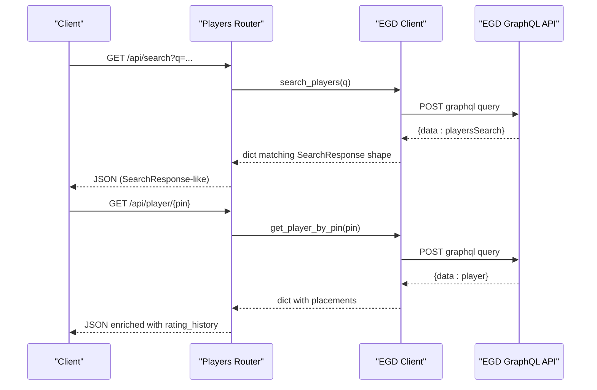
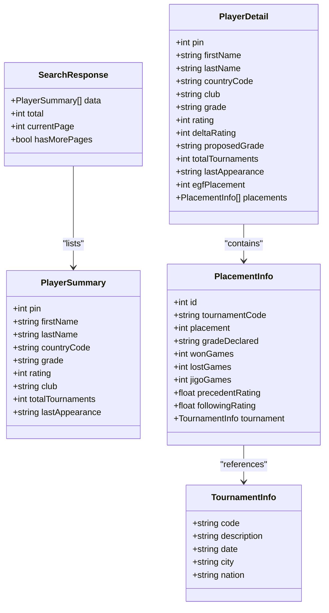
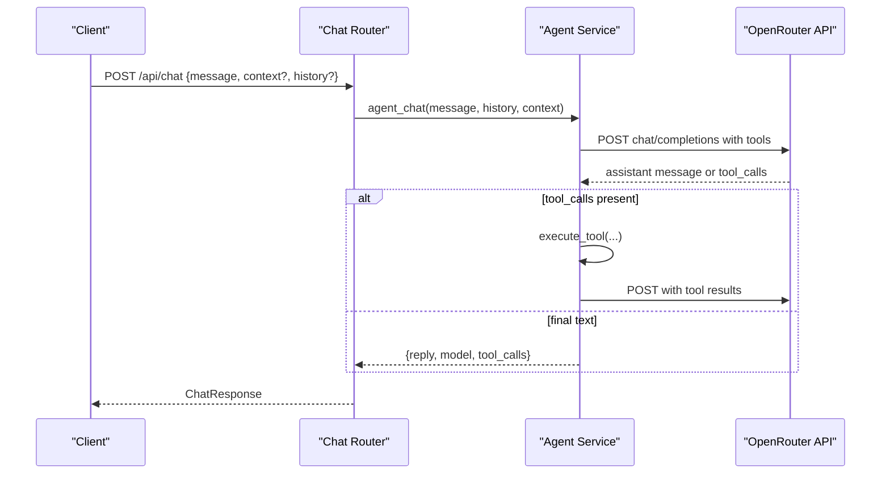
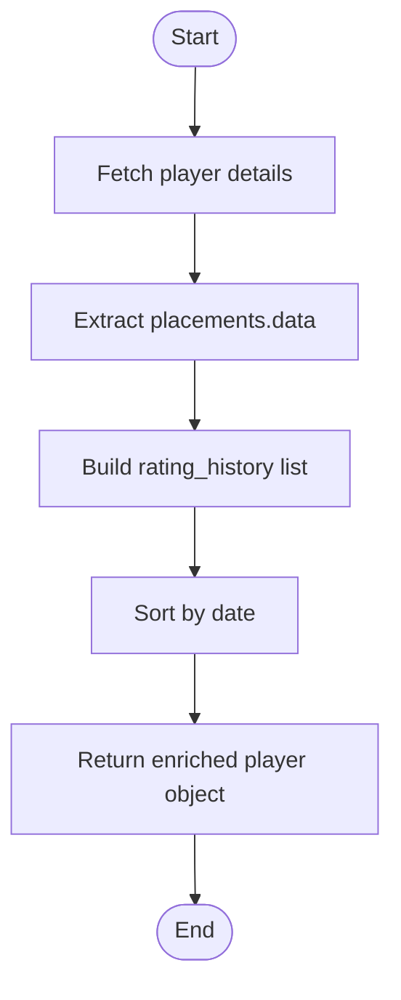
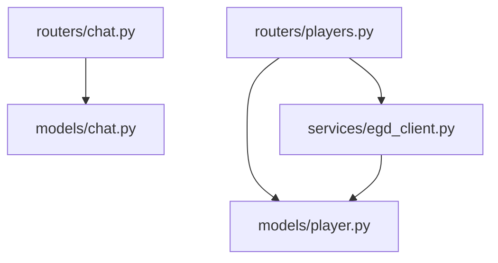

# Data Models and Validation

<cite>
**Referenced Files in This Document**
- [player.py](file://backend/app/models/player.py)
- [chat.py](file://backend/app/models/chat.py)
- [players.py](file://backend/app/routers/players.py)
- [chat.py](file://backend/app/routers/chat.py)
- [egd_client.py](file://backend/app/services/egd_client.py)
- [EGD_API.md](file://docs/EGD_API.md)
</cite>

## Table of Contents
1. [Introduction](#introduction)
2. [Project Structure](#project-structure)
3. [Core Components](#core-components)
4. [Architecture Overview](#architecture-overview)
5. [Detailed Component Analysis](#detailed-component-analysis)
6. [Dependency Analysis](#dependency-analysis)
7. [Performance Considerations](#performance-considerations)
8. [Troubleshooting Guide](#troubleshooting-guide)
9. [Conclusion](#conclusion)

## Introduction
This document provides comprehensive documentation for the Pydantic data models used throughout the GoNow backend application. It focuses on:
- PlayerSummary and PlayerDetail models, including field definitions, validation rules, and type constraints
- ChatMessage model structure for conversation history
- RatingHistory representation derived from tournament performance data
- Serialization and deserialization patterns, default values, and validation error handling
- Examples of model instantiation, field validation, and integration with FastAPI request/response schemas
- Relationships between models and how they map to external API responses (European Go Database GraphQL API)

The goal is to make these models accessible to both technical and non-technical readers while providing precise references to source files.

## Project Structure
The relevant code for data models and their usage resides under backend/app/models and backend/app/routers, with service layer interactions defined in backend/app/services. The EGD API reference is documented in docs/EGD_API.md.

**Diagram sources**
- [player.py:6-60](file://backend/app/models/player.py#L6-L60)
- [chat.py:6-21](file://backend/app/models/chat.py#L6-L21)
- [players.py:8-107](file://backend/app/routers/players.py#L8-L107)
- [chat.py:9-24](file://backend/app/routers/chat.py#L9-L24)
- [egd_client.py:44-197](file://backend/app/services/egd_client.py#L44-L197)

**Section sources**
- [player.py:1-60](file://backend/app/models/player.py#L1-L60)
- [chat.py:1-21](file://backend/app/models/chat.py#L1-L21)
- [players.py:1-107](file://backend/app/routers/players.py#L1-L107)
- [chat.py:1-95](file://backend/app/routers/chat.py#L1-L95)
- [egd_client.py:1-197](file://backend/app/services/egd_client.py#L1-L197)
- [EGD_API.md:1-274](file://docs/EGD_API.md#L1-L274)

## Core Components
This section summarizes the core Pydantic models and their responsibilities:
- PlayerSummary: Lightweight summary of a player returned by search endpoints
- PlayerDetail: Detailed player profile including optional rating evolution fields and placements
- PlacementInfo and TournamentInfo: Nested structures describing tournament placement and associated tournament metadata
- SearchResponse: Paginated search result envelope
- ChatMessage: Single message in conversation history
- ChatRequest and ChatResponse: Request and response schemas for chat endpoints

Key characteristics:
- Optional fields use Python typing.Optional with None defaults
- Field names follow camelCase to align with external API payloads
- No custom validators are implemented; Pydantic’s built-in type coercion and validation apply

**Section sources**
- [player.py:6-60](file://backend/app/models/player.py#L6-L60)
- [chat.py:6-21](file://backend/app/models/chat.py#L6-L21)

## Architecture Overview
The models integrate with FastAPI routers and an EGD client that queries the European Go Database GraphQL API. Routers construct or return dictionaries that match the shape of the Pydantic models. While some endpoints return raw dicts, the chat router explicitly uses ChatRequest and ChatResponse as request and response models.

**Diagram sources**
- [players.py:8-41](file://backend/app/routers/players.py#L8-L41)
- [players.py:43-81](file://backend/app/routers/players.py#L43-L81)
- [egd_client.py:44-118](file://backend/app/services/egd_client.py#L44-L118)

**Section sources**
- [players.py:8-107](file://backend/app/routers/players.py#L8-L107)
- [egd_client.py:44-197](file://backend/app/services/egd_client.py#L44-L197)

## Detailed Component Analysis

### Player Summary and Detail Models
These models represent player data returned by search and detail endpoints. They mirror the EGD schema fields and include optional fields where appropriate.

- PlayerSummary fields:
  - pin: integer identifier
  - firstName: string
  - lastName: string
  - countryCode: ISO country code string
  - grade: current rank string
  - rating: optional integer
  - club: optional string
  - totalTournaments: optional integer
  - lastAppearance: optional date string

- PlayerDetail fields:
  - pin: integer identifier
  - firstName: string
  - lastName: string
  - countryCode: ISO country code string
  - club: optional string
  - grade: current rank string
  - rating: optional integer
  - deltaRating: optional integer change
  - proposedGrade: optional string
  - totalTournaments: optional integer
  - lastAppearance: optional date string
  - egfPlacement: optional integer
  - placements: optional list of PlacementInfo

- PlacementInfo fields:
  - id: integer
  - tournamentCode: string
  - placement: integer
  - gradeDeclared: string
  - wonGames: integer
  - lostGames: integer
  - jigoGames: integer
  - precedentRating: optional float
  - followingRating: optional float
  - tournament: optional TournamentInfo

- TournamentInfo fields:
  - code: string
  - description: optional string
  - date: optional string
  - city: optional string
  - nation: optional string

- SearchResponse fields:
  - data: list of PlayerSummary
  - total: integer
  - currentPage: integer
  - hasMorePages: boolean

Validation behavior:
- Required fields must be present and correctly typed; otherwise, Pydantic raises validation errors during serialization/deserialization
- Optional fields default to None if absent
- Type coercion applies (e.g., numeric strings may be coerced to int/float depending on context)

Integration notes:
- The search endpoint returns a dictionary shaped like SearchResponse
- The player detail endpoint returns a dictionary augmented with rating_history; this is not a Pydantic model but follows a consistent shape

Examples:
- Instantiation examples and field validation behaviors can be verified by constructing instances of PlayerSummary and PlayerDetail with valid and invalid inputs. See the model definitions for exact field types and optionality.

**Section sources**
- [player.py:6-60](file://backend/app/models/player.py#L6-L60)
- [EGD_API.md:135-158](file://docs/EGD_API.md#L135-L158)

#### Class Diagram: Player Models

**Diagram sources**
- [player.py:6-60](file://backend/app/models/player.py#L6-L60)

### Chat Message Model and Conversation History
The chat subsystem defines a simple message model and request/response schemas for the chat endpoint.

- ChatMessage fields:
  - role: string ("user" or "assistant")
  - content: string

- ChatRequest fields:
  - message: string (required)
  - context: optional string (optional player or page context)
  - history: optional list of ChatMessage (conversation history)

- ChatResponse fields:
  - reply: string
  - model: optional string
  - tool_calls: optional list of strings

Behavior:
- The chat router uses ChatRequest as the request body and ChatResponse as the response model
- The agent builds messages arrays from ChatMessage entries and appends system/context/user messages before calling the LLM provider

Examples:
- Constructing a ChatRequest with a message and optional history allows clients to maintain conversation state across requests

**Section sources**
- [chat.py:6-21](file://backend/app/models/chat.py#L6-L21)
- [chat.py:9-24](file://backend/app/routers/chat.py#L9-L24)

#### Sequence Diagram: Chat Flow

**Diagram sources**
- [chat.py:9-24](file://backend/app/routers/chat.py#L9-L24)
- [chat_agent.py:30-154](file://backend/app/services/chat_agent.py#L30-L154)

### RatingHistory Representation
While there is no dedicated Pydantic model named RatingHistory, the player detail endpoint constructs a rating_history list from placement data. Each entry includes:
- date: string
- tournament: string
- city: string
- nation: string
- placement: integer
- grade: string
- rating_before: optional float
- rating_after: optional float
- won: integer
- lost: integer
- jigo: integer

Processing logic:
- Extracts placements from player details
- Builds a flat list of rating_history items
- Sorts by date

**Diagram sources**
- [players.py:43-81](file://backend/app/routers/players.py#L43-L81)

**Section sources**
- [players.py:43-81](file://backend/app/routers/players.py#L43-L81)

### Serialization and Deserialization Patterns
- FastAPI automatically serializes Pydantic models to JSON when used as response models
- For request bodies, FastAPI validates incoming JSON against the Pydantic model and raises HTTP 422 errors on validation failures
- In the chat router, ChatRequest is validated on input and ChatResponse is enforced on output
- In the players router, responses are constructed as dictionaries; while not strictly typed via response_model, the shapes align with the Pydantic models defined in the models package

Default values:
- Optional fields default to None when omitted
- Non-optional fields must be provided; otherwise, validation fails

Error handling:
- Pydantic validation errors produce detailed messages indicating which fields failed and why
- Routers wrap exceptions and raise HTTPException with status 500 for unexpected server-side errors

**Section sources**
- [chat.py:9-24](file://backend/app/routers/chat.py#L9-L24)
- [players.py:8-41](file://backend/app/routers/players.py#L8-L41)
- [players.py:43-81](file://backend/app/routers/players.py#L43-L81)

### Integration with External API Responses
The models reflect the EGD GraphQL schema:
- PlayerSummary fields correspond to the search result fields
- PlayerDetail fields correspond to the player query fields
- PlacementInfo and TournamentInfo map to nested placement and tournament objects
- SearchResponse mirrors the pagination envelope returned by playersSearch

Mapping highlights:
- Field names are preserved in camelCase to match the external API
- Optional fields account for missing data in the external API

**Section sources**
- [EGD_API.md:135-158](file://docs/EGD_API.md#L135-L158)
- [EGD_API.md:179-198](file://docs/EGD_API.md#L179-L198)
- [EGD_API.md:262-274](file://docs/EGD_API.md#L262-L274)

## Dependency Analysis
The models have minimal internal dependencies and serve as contracts between routers and services. The primary coupling is through routers returning dictionaries shaped like the models and the chat router using explicit Pydantic models.

**Diagram sources**
- [player.py:6-60](file://backend/app/models/player.py#L6-L60)
- [chat.py:6-21](file://backend/app/models/chat.py#L6-L21)
- [players.py:8-107](file://backend/app/routers/players.py#L8-L107)
- [chat.py:9-24](file://backend/app/routers/chat.py#L9-L24)
- [egd_client.py:44-197](file://backend/app/services/egd_client.py#L44-L197)

**Section sources**
- [player.py:6-60](file://backend/app/models/player.py#L6-L60)
- [chat.py:6-21](file://backend/app/models/chat.py#L6-L21)
- [players.py:8-107](file://backend/app/routers/players.py#L8-L107)
- [chat.py:9-24](file://backend/app/routers/chat.py#L9-L24)
- [egd_client.py:44-197](file://backend/app/services/egd_client.py#L44-L197)

## Performance Considerations
- Using Pydantic models for request/response validation adds minimal overhead and improves reliability
- The EGD client implements caching to reduce repeated network calls; this indirectly benefits model usage by reducing latency for player data retrieval
- Sorting operations on rating_history are performed in-memory; for very large datasets, consider pagination at the service layer

[No sources needed since this section provides general guidance]

## Troubleshooting Guide
Common issues and resolutions:
- Missing required fields: Ensure all non-optional fields are provided in requests or responses
- Type mismatches: Verify that numeric fields receive numbers and strings receive strings; Pydantic will coerce when possible but strict types help avoid surprises
- Optional fields: If fields are absent, they default to None; handle None checks in downstream logic
- External API errors: The EGD client raises ValueError on GraphQL errors; ensure proper exception handling in routers

**Section sources**
- [egd_client.py:21-42](file://backend/app/services/egd_client.py#L21-L42)
- [players.py:8-41](file://backend/app/routers/players.py#L8-L41)
- [players.py:43-81](file://backend/app/routers/players.py#L43-L81)

## Conclusion
The Pydantic models in GoNow provide clear, typed contracts for player data and chat interactions. They align closely with the EGD GraphQL schema and integrate seamlessly with FastAPI routers. By leveraging optional fields and Pydantic’s validation, the application ensures robust serialization and deserialization while maintaining readability and extensibility.

[No sources needed since this section summarizes without analyzing specific files]