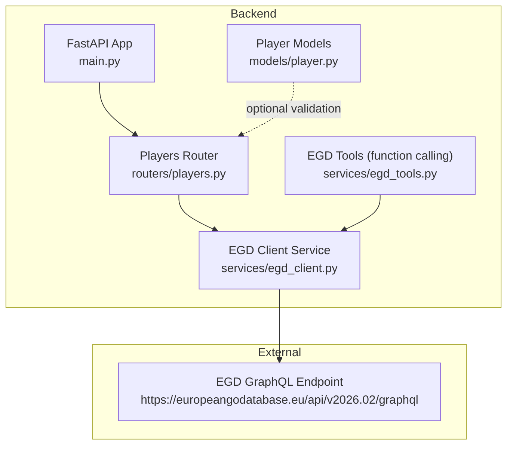
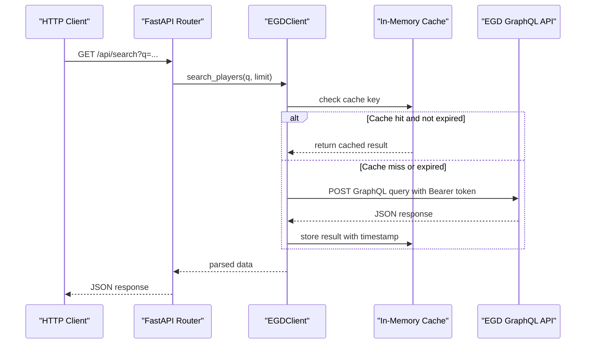
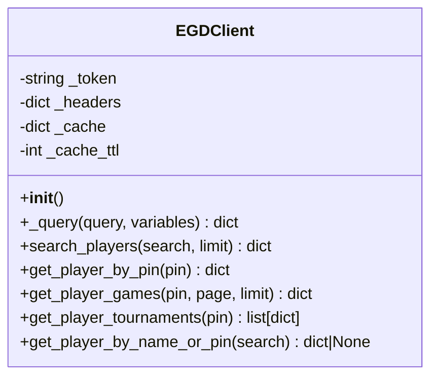
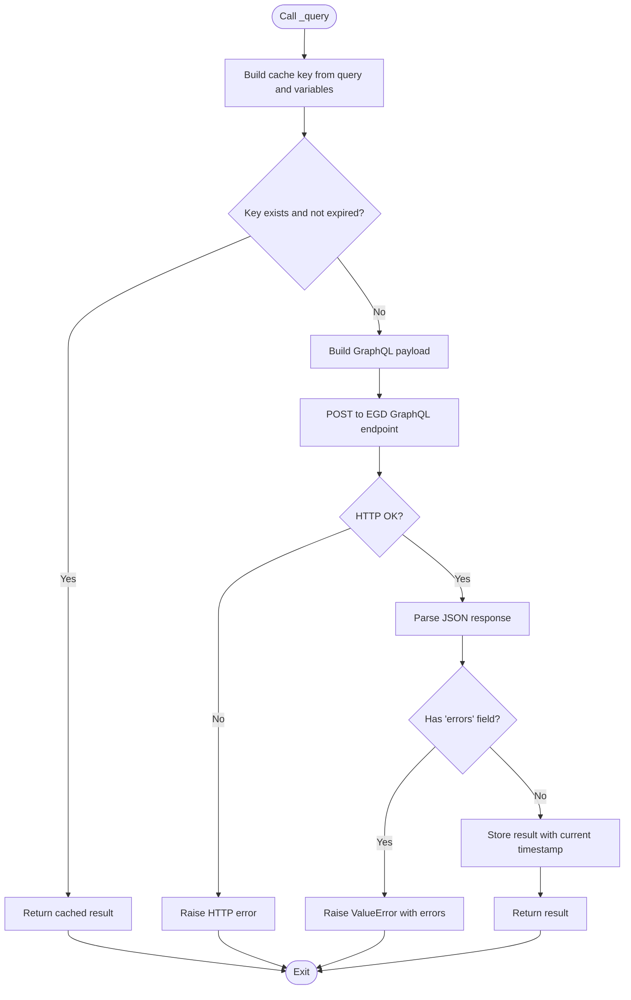
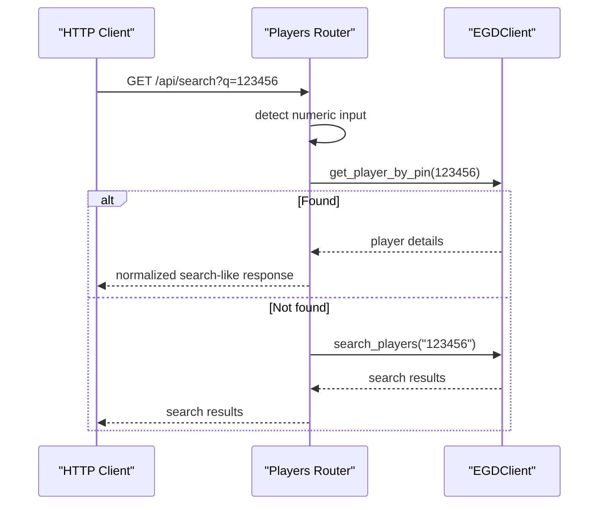
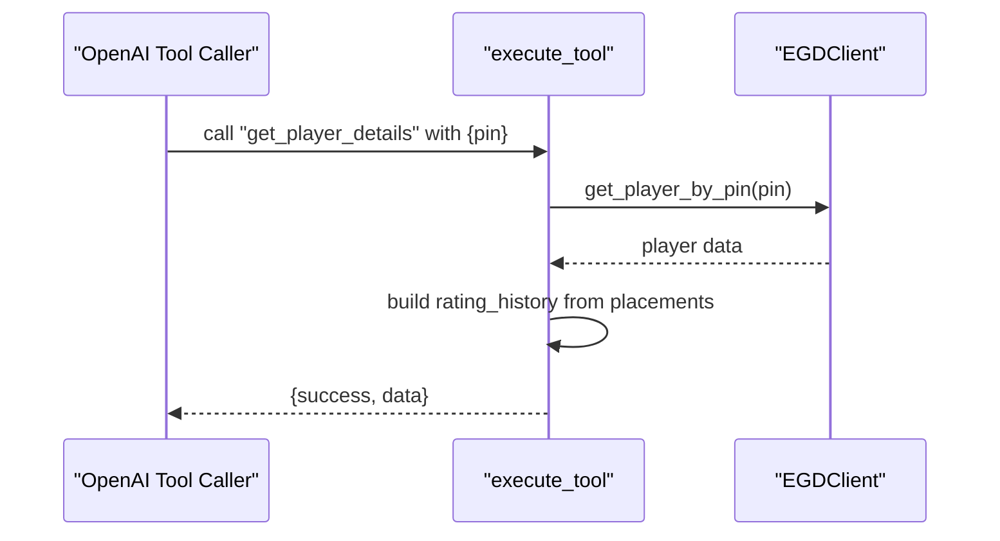
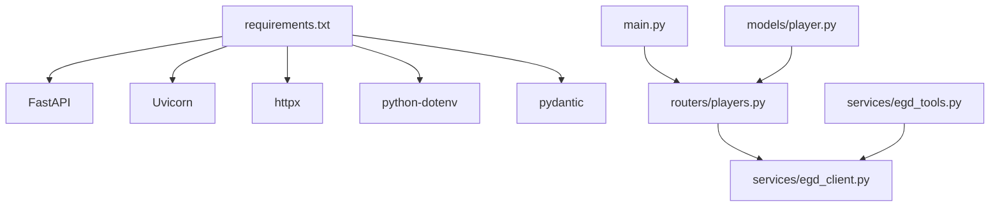

# EGD GraphQL Integration

<cite>
**Referenced Files in This Document**
- [egd_client.py](file://backend/app/services/egd_client.py)
- [egd_tools.py](file://backend/app/services/egd_tools.py)
- [players.py](file://backend/app/routers/players.py)
- [main.py](file://backend/app/main.py)
- [EGD_API.md](file://docs/EGD_API.md)
- [player.py](file://backend/app/models/player.py)
- [requirements.txt](file://backend/requirements.txt)
</cite>

## Table of Contents
1. [Introduction](#introduction)
2. [Project Structure](#project-structure)
3. [Core Components](#core-components)
4. [Architecture Overview](#architecture-overview)
5. [Detailed Component Analysis](#detailed-component-analysis)
6. [Dependency Analysis](#dependency-analysis)
7. [Performance Considerations](#performance-considerations)
8. [Troubleshooting Guide](#troubleshooting-guide)
9. [Conclusion](#conclusion)
10. [Appendices](#appendices)

## Introduction
This document explains the European Go Database (EGD) GraphQL integration used by the backend service. It focuses on the EGDClient class implementation, authentication with Bearer tokens, GraphQL query patterns for player search and details retrieval, caching with TTL-based expiration, async HTTP client usage with httpx, error handling strategies for GraphQL responses, and rate limiting considerations. It also documents all available queries exposed by the client, including parameters and response structures, and provides guidance on extending the client with new queries.

## Project Structure
The EGD integration is implemented as a dedicated client service and is consumed by API routers. The main application wires routers and loads environment variables.

**Diagram sources**
- [main.py:14-31](file://backend/app/main.py#L14-L31)
- [players.py:1-107](file://backend/app/routers/players.py#L1-L107)
- [egd_client.py:11-197](file://backend/app/services/egd_client.py#L11-L197)
- [egd_tools.py:1-212](file://backend/app/services/egd_tools.py#L1-L212)
- [player.py:1-60](file://backend/app/models/player.py#L1-L60)

**Section sources**
- [main.py:1-42](file://backend/app/main.py#L1-L42)
- [players.py:1-107](file://backend/app/routers/players.py#L1-L107)
- [egd_client.py:1-197](file://backend/app/services/egd_client.py#L1-L197)
- [egd_tools.py:1-212](file://backend/app/services/egd_tools.py#L1-L212)
- [player.py:1-60](file://backend/app/models/player.py#L1-L60)

## Core Components
- EGDClient: Async HTTP client wrapper around the EGD GraphQL endpoint. Handles authentication via Bearer token, request execution, error detection, and TTL-based in-memory caching. Exposes methods for searching players, retrieving player details, fetching games, and deriving tournament history.
- Players Router: FastAPI endpoints that delegate to EGDClient and transform results into consistent API responses.
- EGD Tools: Function-calling tool definitions and dispatcher for OpenAI-compatible function calling, built on top of EGDClient.
- Player Models: Pydantic models describing expected data shapes for player-related responses.

Key responsibilities:
- Authentication: Reads an environment variable for the Bearer token and attaches it to every request.
- Querying: Builds GraphQL payloads and posts them to the EGD GraphQL endpoint using httpx.AsyncClient.
- Caching: Stores successful responses keyed by query string and variables with a time-to-live (TTL).
- Error Handling: Raises exceptions when GraphQL errors are present or HTTP status codes indicate failure.

**Section sources**
- [egd_client.py:11-197](file://backend/app/services/egd_client.py#L11-L197)
- [players.py:1-107](file://backend/app/routers/players.py#L1-L107)
- [egd_tools.py:1-212](file://backend/app/services/egd_tools.py#L1-L212)
- [player.py:1-60](file://backend/app/models/player.py#L1-L60)

## Architecture Overview
The system uses an asynchronous HTTP client to call the EGD GraphQL API. Responses are cached per query and variables with TTL-based expiration. The FastAPI router exposes REST endpoints that call the client methods.

**Diagram sources**
- [players.py:8-40](file://backend/app/routers/players.py#L8-L40)
- [egd_client.py:21-42](file://backend/app/services/egd_client.py#L21-L42)
- [EGD_API.md:1-22](file://docs/EGD_API.md#L1-L22)

## Detailed Component Analysis

### EGDClient Class
Responsibilities:
- Initialize headers with Authorization Bearer token from environment.
- Provide async _query method to execute GraphQL requests with caching.
- Implement typed methods for common operations: search_players, get_player_by_pin, get_player_games, get_player_tournaments, and a convenience method to resolve by name or PIN.

Authentication:
- Uses an environment variable for the token and sets the Authorization header to Bearer <token>.

GraphQL Queries:
- search_players: Typo-tolerant search by name with pagination.
- get_player_by_pin: Full player profile including biography and placements.
- get_player_games: Paginated game history filtered by player PIN.
- get_player_tournaments: Derives unique tournaments from placements.

Caching Mechanism:
- In-memory dict keyed by query string plus variables.
- Each entry stores a timestamp and payload.
- TTL is configurable; default is 300 seconds.
- Expired entries are bypassed and refreshed on next access.

Async HTTP Client:
- Uses httpx.AsyncClient with a timeout.
- Posts JSON payloads to the EGD GraphQL endpoint.
- Raises HTTP errors via raise_for_status.

Error Handling:
- If the GraphQL response contains an errors array, raises a ValueError with details.
- Network or server errors propagate up to callers.

Singleton Pattern:
- A module-level instance egd_client is created and reused across the application.

Extensibility:
- Add a new method that defines a GraphQL query string and calls self._query with appropriate variables.
- Optionally add a corresponding router endpoint and/or tool definition.

**Diagram sources**
- [egd_client.py:11-197](file://backend/app/services/egd_client.py#L11-L197)

**Section sources**
- [egd_client.py:11-197](file://backend/app/services/egd_client.py#L11-L197)

### GraphQL Query Patterns and Response Structures
- search_players
  - Parameters: search (String), limit (Int)
  - Returns: Pagination object with data array of player summaries, total, currentPage, hasMorePages
- get_player_by_pin
  - Parameters: pin (Int)
  - Returns: Player object with fields like grade, rating, biography, placements
- get_player_games
  - Parameters: pin (Int), page (Int), limit (Int)
  - Returns: GamePagination with data array of games, total, currentPage, hasMorePages
- get_player_tournaments
  - Parameters: pin (Int)
  - Returns: List of normalized tournament records derived from placements

These patterns align with the EGD GraphQL schema documented in the repository.

**Section sources**
- [EGD_API.md:24-133](file://docs/EGD_API.md#L24-L133)
- [EGD_API.md:135-274](file://docs/EGD_API.md#L135-L274)
- [egd_client.py:44-177](file://backend/app/services/egd_client.py#L44-L177)

### Caching Flow
The client caches successful responses keyed by query and variables. On each call, it checks if the key exists and whether the TTL has elapsed. If valid, it returns the cached payload; otherwise, it performs the network request and updates the cache.

**Diagram sources**
- [egd_client.py:21-42](file://backend/app/services/egd_client.py#L21-L42)

**Section sources**
- [egd_client.py:21-42](file://backend/app/services/egd_client.py#L21-L42)

### API Routers Using EGDClient
The players router exposes endpoints that call EGDClient methods and normalize responses. It handles numeric queries by attempting direct PIN lookup before falling back to name search.

**Diagram sources**
- [players.py:8-40](file://backend/app/routers/players.py#L8-L40)
- [egd_client.py:179-192](file://backend/app/services/egd_client.py#L179-L192)

**Section sources**
- [players.py:8-40](file://backend/app/routers/players.py#L8-L40)

### EGD Tools (Function Calling)
The tools layer wraps EGDClient methods with OpenAI-compatible function schemas and a dispatcher. It normalizes outputs and includes error handling for unknown tools and exceptions.

**Diagram sources**
- [egd_tools.py:102-148](file://backend/app/services/egd_tools.py#L102-L148)
- [egd_client.py:72-118](file://backend/app/services/egd_client.py#L72-L118)

**Section sources**
- [egd_tools.py:1-212](file://backend/app/services/egd_tools.py#L1-L212)

## Dependency Analysis
- External dependencies:
  - httpx: Async HTTP client used to post GraphQL queries.
  - python-dotenv: Loads environment variables for configuration.
  - fastapi: Web framework exposing routes.
  - pydantic: Data modeling (used in player models).
- Internal dependencies:
  - Routers depend on EGDClient singleton.
  - Tools depend on EGDClient singleton.
  - Main app mounts routers and configures CORS.

**Diagram sources**
- [requirements.txt:1-6](file://backend/requirements.txt#L1-L6)
- [main.py:14-31](file://backend/app/main.py#L14-L31)
- [players.py:1-107](file://backend/app/routers/players.py#L1-L107)
- [egd_client.py:1-197](file://backend/app/services/egd_client.py#L1-L197)
- [egd_tools.py:1-212](file://backend/app/services/egd_tools.py#L1-L212)
- [player.py:1-60](file://backend/app/models/player.py#L1-L60)

**Section sources**
- [requirements.txt:1-6](file://backend/requirements.txt#L1-L6)
- [main.py:1-42](file://backend/app/main.py#L1-L42)
- [players.py:1-107](file://backend/app/routers/players.py#L1-L107)
- [egd_client.py:1-197](file://backend/app/services/egd_client.py#L1-L197)
- [egd_tools.py:1-212](file://backend/app/services/egd_tools.py#L1-L212)
- [player.py:1-60](file://backend/app/models/player.py#L1-L60)

## Performance Considerations
- Caching:
  - TTL-based in-memory cache reduces repeated network calls for identical queries and variables.
  - Default TTL is 300 seconds; adjust based on data volatility and performance needs.
- Concurrency:
  - httpx.AsyncClient is used per request; consider reusing a shared client instance at process level to reduce connection overhead if needed.
- Rate Limiting:
  - No explicit rate limiting is implemented in the client. To avoid throttling by the EGD API:
    - Increase cache TTL for frequently accessed queries.
    - Introduce a client-side rate limiter (e.g., semaphore or token bucket) around _query.
    - Add retry with exponential backoff for transient failures.
- Payload Size:
  - Keep GraphQL selections minimal to reduce bandwidth and processing time.
- Timeouts:
  - Current timeout is set; tune according to network conditions and SLAs.

[No sources needed since this section provides general guidance]

## Troubleshooting Guide
Common issues and resolutions:
- Missing or invalid Bearer token:
  - Ensure the environment variable for the token is set and correct.
  - Verify the token scope allows read access to the EGD API.
- GraphQL errors in response:
  - The client raises an exception when the response contains an errors array. Inspect the error message to identify invalid queries or missing fields.
- HTTP errors:
  - Non-2xx responses trigger HTTP exceptions. Check network connectivity and endpoint availability.
- Cache staleness:
  - If data appears outdated, verify TTL settings and consider reducing TTL for volatile fields.
- Rate limiting:
  - If encountering throttling, implement client-side rate limiting and retries.

Operational tips:
- Use the health endpoint to verify service readiness.
- Log request payloads and responses during development to diagnose GraphQL issues.

**Section sources**
- [egd_client.py:21-42](file://backend/app/services/egd_client.py#L21-L42)
- [main.py:39-42](file://backend/app/main.py#L39-L42)

## Conclusion
The EGD GraphQL integration provides a robust, async-first client with authentication, caching, and clear error handling. The EGDClient encapsulates GraphQL interactions and exposes convenient methods for common operations. The FastAPI routers and tools layer build on this foundation to deliver user-facing APIs and function-calling capabilities. Extending the client with new queries is straightforward: define a new method, construct the GraphQL payload, and optionally expose it through a router or tool.

[No sources needed since this section summarizes without analyzing specific files]

## Appendices

### Available Queries and Usage Examples

- search_players
  - Purpose: Search players by name with typo tolerance.
  - Parameters:
    - search: String (required)
    - limit: Integer (default provided by caller)
  - Response structure:
    - data: Array of player summaries
    - total: Integer
    - currentPage: Integer
    - hasMorePages: Boolean
  - Example path: [search_players method:44-70](file://backend/app/services/egd_client.py#L44-L70)

- get_player_by_pin
  - Purpose: Retrieve detailed player information by PIN.
  - Parameters:
    - pin: Integer (required)
  - Response structure:
    - Player object with fields such as grade, rating, biography, placements
  - Example path: [get_player_by_pin method:72-118](file://backend/app/services/egd_client.py#L72-L118)

- get_player_games
  - Purpose: Fetch paginated game history for a player.
  - Parameters:
    - pin: Integer (required)
    - page: Integer (default provided by caller)
    - limit: Integer (default provided by caller)
  - Response structure:
    - data: Array of games
    - total: Integer
    - currentPage: Integer
    - hasMorePages: Boolean
  - Example path: [get_player_games method:120-150](file://backend/app/services/egd_client.py#L120-L150)

- get_player_tournaments
  - Purpose: Derive unique tournament records from player placements.
  - Parameters:
    - pin: Integer (required)
  - Response structure:
    - List of normalized tournament objects with code, description, date, city, nation, placement, grades, wins/losses/jigo, and ratings before/after
  - Example path: [get_player_tournaments method:152-177](file://backend/app/services/egd_client.py#L152-L177)

- get_player_by_name_or_pin
  - Purpose: Convenience method to resolve by PIN if numeric, otherwise by name.
  - Parameters:
    - search: String (required)
  - Response structure:
    - Player object or None
  - Example path: [get_player_by_name_or_pin method:179-192](file://backend/app/services/egd_client.py#L179-L192)

### Best Practices for Extending the Client
- Define a new method with a descriptive name and docstring.
- Construct the GraphQL query string and variables dictionary.
- Call self._query and return the relevant portion of the response.
- Add corresponding router endpoints if exposing via REST.
- Add tool definitions in the tools module if supporting function calling.
- Consider adding tests for new queries and edge cases.

**Section sources**
- [egd_client.py:44-192](file://backend/app/services/egd_client.py#L44-L192)
- [egd_tools.py:1-212](file://backend/app/services/egd_tools.py#L1-L212)
- [players.py:1-107](file://backend/app/routers/players.py#L1-L107)