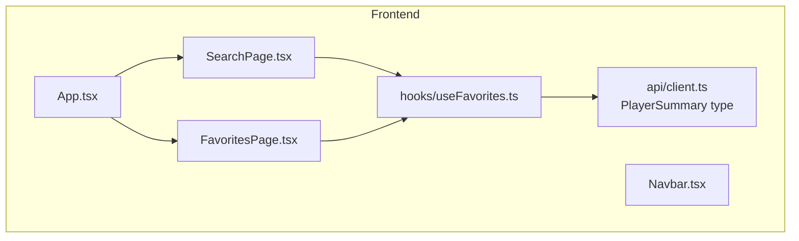
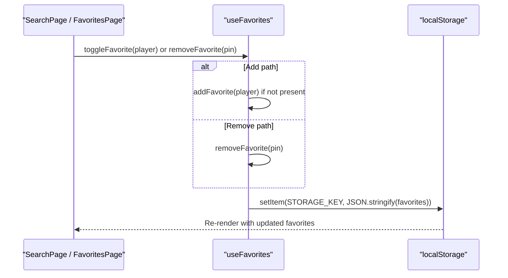
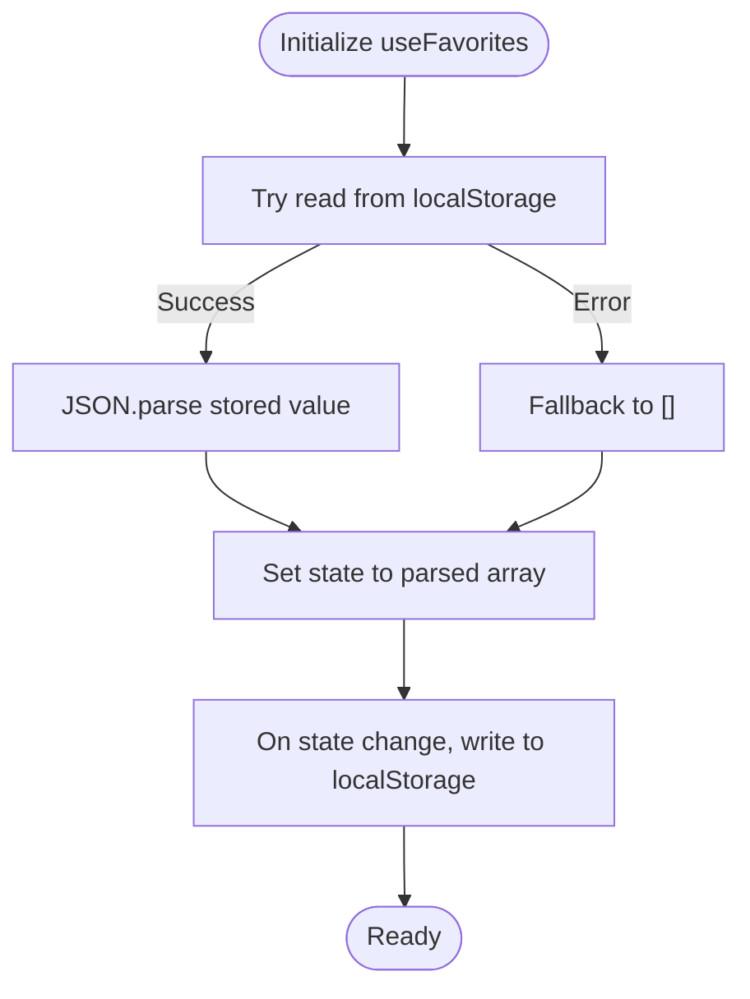
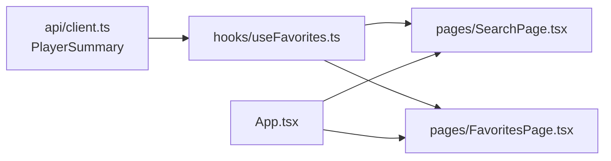

# Local Storage Management

<cite>
**Referenced Files in This Document**
- [useFavorites.ts](file://frontend/src/hooks/useFavorites.ts)
- [client.ts](file://frontend/src/api/client.ts)
- [SearchPage.tsx](file://frontend/src/pages/SearchPage.tsx)
- [FavoritesPage.tsx](file://frontend/src/pages/FavoritesPage.tsx)
- [App.tsx](file://frontend/src/App.tsx)
</cite>

## Table of Contents
1. [Introduction](#introduction)
2. [Project Structure](#project-structure)
3. [Core Components](#core-components)
4. [Architecture Overview](#architecture-overview)
5. [Detailed Component Analysis](#detailed-component-analysis)
6. [Dependency Analysis](#dependency-analysis)
7. [Performance Considerations](#performance-considerations)
8. [Troubleshooting Guide](#troubleshooting-guide)
9. [Conclusion](#conclusion)

## Introduction
This document explains the frontend local storage management system centered around the useFavorites custom hook. It covers how favorites are persisted using browser localStorage, state synchronization patterns, and the data structure used to store player information. It also documents CRUD operations for favorites, error handling for storage access, strategies for data migration, examples of adding/removing favorites and retrieving lists, handling storage quota limitations, integration with React components, and performance considerations for frequent storage operations.

## Project Structure
The local storage feature is implemented as a small, focused module:
- A custom hook encapsulates all persistence logic and exposes a simple API to components.
- The PlayerSummary type defines the shape of stored players.
- Two pages integrate the hook: SearchPage (add/remove via toggle) and FavoritesPage (list and remove).
- App wires up routing so these pages are reachable.

**Diagram sources**
- [App.tsx:18-36](file://frontend/src/App.tsx#L18-L36)
- [SearchPage.tsx:1-20](file://frontend/src/pages/SearchPage.tsx#L1-L20)
- [FavoritesPage.tsx:1-10](file://frontend/src/pages/FavoritesPage.tsx#L1-L10)
- [useFavorites.ts:1-10](file://frontend/src/hooks/useFavorites.ts#L1-L10)
- [client.ts:7-17](file://frontend/src/api/client.ts#L7-L17)

**Section sources**
- [App.tsx:18-36](file://frontend/src/App.tsx#L18-L36)
- [SearchPage.tsx:1-20](file://frontend/src/pages/SearchPage.tsx#L1-L20)
- [FavoritesPage.tsx:1-10](file://frontend/src/pages/FavoritesPage.tsx#L1-L10)
- [useFavorites.ts:1-10](file://frontend/src/hooks/useFavorites.ts#L1-L10)
- [client.ts:7-17](file://frontend/src/api/client.ts#L7-L17)

## Core Components
- useFavorites hook: Provides stateful favorites list persisted to localStorage, along with add, remove, check, and toggle operations.
- PlayerSummary type: Defines the minimal player record stored in favorites.
- SearchPage: Uses toggleFavorite and isFavorite to let users add/remove favorites from search results.
- FavoritesPage: Displays the current favorites and allows removal.

Key responsibilities:
- Persistence: Read on initialization; write on every change.
- State synchronization: Single source of truth in React state mirrored to localStorage.
- Data integrity: Deduplication by unique pin; safe JSON parse on load.

**Section sources**
- [useFavorites.ts:6-48](file://frontend/src/hooks/useFavorites.ts#L6-L48)
- [client.ts:7-17](file://frontend/src/api/client.ts#L7-L17)
- [SearchPage.tsx:10-16](file://frontend/src/pages/SearchPage.tsx#L10-L16)
- [FavoritesPage.tsx:4-12](file://frontend/src/pages/FavoritesPage.tsx#L4-L12)

## Architecture Overview
The architecture follows a unidirectional data flow pattern:
- Components call hook methods to mutate favorites.
- The hook updates React state and persists changes to localStorage.
- UI re-renders based on the new state.

**Diagram sources**
- [useFavorites.ts:20-45](file://frontend/src/hooks/useFavorites.ts#L20-L45)
- [useFavorites.ts:16-18](file://frontend/src/hooks/useFavorites.ts#L16-L18)
- [SearchPage.tsx:108-116](file://frontend/src/pages/SearchPage.tsx#L108-L116)
- [FavoritesPage.tsx:42-44](file://frontend/src/pages/FavoritesPage.tsx#L42-L44)

## Detailed Component Analysis

### useFavorites Custom Hook
Responsibilities:
- Initialize state from localStorage safely.
- Persist state to localStorage on change.
- Provide CRUD-like operations: add, remove, check, toggle.
- Ensure uniqueness by pin.

Data structure design:
- Stores an array of PlayerSummary objects.
- Each entry includes at least pin, firstName, lastName, countryCode, grade, rating, club, totalTournaments, lastAppearance.

State synchronization:
- Initial read wrapped in try/catch to handle malformed data.
- useEffect writes to localStorage whenever favorites change.

CRUD operations:
- Create: addFavorite adds only if not already present.
- Read: favorites array and isFavorite helper.
- Update: Not applicable beyond toggling membership.
- Delete: removeFavorite filters out by pin.

Error handling:
- Initialization catches exceptions during JSON parsing and falls back to an empty list.
- No explicit quota error handling currently; see Troubleshooting Guide for recommendations.

Migration strategy:
- Because initialization uses a try/catch around JSON.parse, it can tolerate schema drifts that break serialization. For future migrations, consider versioning the storage key and transforming legacy structures on load.

Examples:
- Adding a favorite: Call toggleFavorite(player) from SearchPage when user clicks the star button.
- Removing a favorite: Call removeFavorite(pin) from FavoritesPage when user clicks the remove button.
- Retrieving favorites: Use the favorites array returned by the hook.

**Diagram sources**
- [useFavorites.ts:7-14](file://frontend/src/hooks/useFavorites.ts#L7-L14)
- [useFavorites.ts:16-18](file://frontend/src/hooks/useFavorites.ts#L16-L18)

**Section sources**
- [useFavorites.ts:1-48](file://frontend/src/hooks/useFavorites.ts#L1-L48)
- [client.ts:7-17](file://frontend/src/api/client.ts#L7-L17)

### SearchPage Integration
- Uses toggleFavorite and isFavorite to render the correct star icon and update favorites.
- Prevents event propagation when toggling to avoid navigating to the profile page.

Example usage:
- Toggle favorite: onClick handler calls toggleFavorite(player).
- Check favorite: isFavorite(player.pin) determines icon state.

**Section sources**
- [SearchPage.tsx:10-16](file://frontend/src/pages/SearchPage.tsx#L10-L16)
- [SearchPage.tsx:108-116](file://frontend/src/pages/SearchPage.tsx#L108-L116)

### FavoritesPage Integration
- Displays the current favorites list and provides remove actions per item.
- Navigates to a player’s profile when clicking a card.

Example usage:
- Remove favorite: onClick handler calls removeFavorite(player.pin).

**Section sources**
- [FavoritesPage.tsx:4-12](file://frontend/src/pages/FavoritesPage.tsx#L4-L12)
- [FavoritesPage.tsx:42-44](file://frontend/src/pages/FavoritesPage.tsx#L42-L44)

### Data Model: PlayerSummary
The hook stores PlayerSummary entries. This ensures each favorite contains enough context for display and navigation without requiring additional lookups.

Fields include identifiers, names, country code, grade, rating, club, tournament count, and last appearance.

**Section sources**
- [client.ts:7-17](file://frontend/src/api/client.ts#L7-L17)

## Dependency Analysis
- useFavorites depends on React hooks and the browser’s localStorage API.
- useFavorites imports the PlayerSummary type from the API client module.
- SearchPage and FavoritesPage depend on useFavorites for state and operations.
- App orchestrates routing and renders both pages.

**Diagram sources**
- [useFavorites.ts:1-4](file://frontend/src/hooks/useFavorites.ts#L1-L4)
- [client.ts:7-17](file://frontend/src/api/client.ts#L7-L17)
- [SearchPage.tsx:1-10](file://frontend/src/pages/SearchPage.tsx#L1-L10)
- [FavoritesPage.tsx:1-10](file://frontend/src/pages/FavoritesPage.tsx#L1-L10)
- [App.tsx:18-36](file://frontend/src/App.tsx#L18-L36)

**Section sources**
- [useFavorites.ts:1-4](file://frontend/src/hooks/useFavorites.ts#L1-L4)
- [client.ts:7-17](file://frontend/src/api/client.ts#L7-L17)
- [SearchPage.tsx:1-10](file://frontend/src/pages/SearchPage.tsx#L1-L10)
- [FavoritesPage.tsx:1-10](file://frontend/src/pages/FavoritesPage.tsx#L1-L10)
- [App.tsx:18-36](file://frontend/src/App.tsx#L18-L36)

## Performance Considerations
- Synchronous writes: Every state change triggers a synchronous localStorage.setItem. For frequent updates, consider debouncing writes or batching mutations before persisting.
- Unnecessary writes: Avoid writing when the new array is identical to the previous one. A shallow equality check on the serialized string or length/content comparison can prevent redundant writes.
- Memoization: The hook already memoizes callbacks with useCallback, which helps reduce unnecessary re-renders in consumers.
- Large datasets: If the number of favorites grows significantly, consider pagination or limiting the size of stored items. Also consider compressing or trimming fields not needed for display.
- Storage quotas: Browsers enforce quotas; see the Troubleshooting Guide for graceful degradation.

[No sources needed since this section provides general guidance]

## Troubleshooting Guide
Common issues and mitigations:
- Malformed storage data:
  - Symptom: App initializes with an empty list instead of corrupted data.
  - Cause: JSON.parse throws on invalid content.
  - Current behavior: Caught and reset to an empty list.
  - Recommendation: Log errors in development and consider clearing the key if corruption persists.

- Storage quota exceeded:
  - Symptom: Writing to localStorage fails with a quota error.
  - Current behavior: Not explicitly handled; may throw.
  - Recommendation: Wrap localStorage.setItem in try/catch and degrade gracefully (e.g., show a warning, stop adding new favorites, or prompt the user to clear some favorites).

- Cross-tab synchronization:
  - Symptom: Changes made in one tab do not reflect immediately in another.
  - Current behavior: None.
  - Recommendation: Listen to storage events to sync across tabs.

- Migration scenarios:
  - Scenario: Changing the shape of PlayerSummary or STORAGE_KEY.
  - Recommendation: Version the storage key (e.g., gonow_favorites_v1) and implement a migration function that transforms old data to the new format on load.

Operational tips:
- Validate input before adding to favorites to ensure required fields exist.
- Debounce rapid toggles to minimize writes.
- Consider using a small utility to centralize storage reads/writes for consistent error handling.

**Section sources**
- [useFavorites.ts:7-14](file://frontend/src/hooks/useFavorites.ts#L7-L14)
- [useFavorites.ts:16-18](file://frontend/src/hooks/useFavorites.ts#L16-L18)

## Conclusion
The useFavorites hook provides a clean, persistent favorites layer backed by localStorage. It integrates seamlessly with React components, offering straightforward APIs for adding, removing, checking, and toggling favorites. While the current implementation handles basic error cases, enhancements such as quota-aware writes, cross-tab sync, and migration support will improve robustness and scalability.