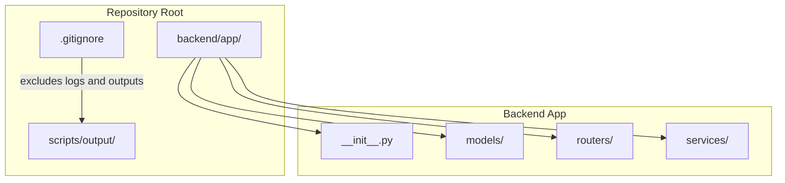
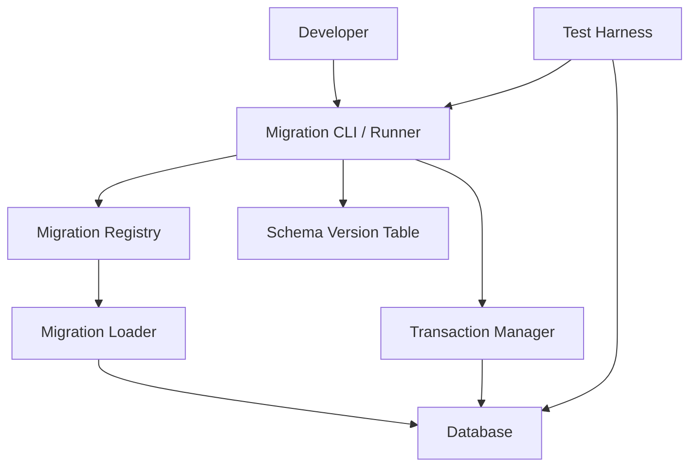
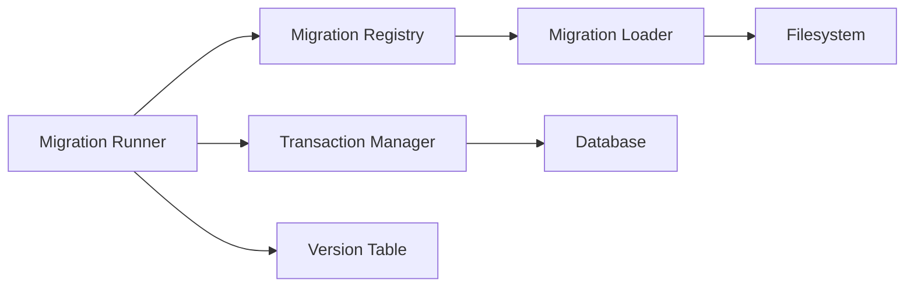

# Data Migration

<cite>
**Referenced Files in This Document**
- [__init__.py](file://backend/app/__init__.py)
- [routers/__init__.py](file://backend/app/routers/__init__.py)
- [.gitignore](file://.gitignore)
</cite>

## Table of Contents
1. [Introduction](#introduction)
2. [Project Structure](#project-structure)
3. [Core Components](#core-components)
4. [Architecture Overview](#architecture-overview)
5. [Detailed Component Analysis](#detailed-component-analysis)
6. [Dependency Analysis](#dependency-analysis)
7. [Performance Considerations](#performance-considerations)
8. [Troubleshooting Guide](#troubleshooting-guide)
9. [Conclusion](#conclusion)
10. [Appendices](#appendices)

## Introduction
This document defines the data migration strategy for the GoNow application. It covers version control for database schemas, rollback procedures, migration file organization and naming conventions, dependency management between migrations, forward/backward compatibility, safe handling of large datasets, testing strategies, staging workflows, production deployment procedures, common pitfalls, conflict resolution, disaster recovery, and coordination across distributed systems. The guidance is designed to be practical and immediately applicable as you introduce or evolve database schema changes in GoNow.

## Project Structure
The repository currently contains minimal backend scaffolding and configuration. There are no existing migration files or database configuration modules visible in the provided structure. As such, this document provides a recommended structure and practices that can be adopted when introducing migrations into the project.

**Diagram sources**
- [.gitignore:1-36](file://.gitignore#L1-L36)
- [__init__.py:1-1](file://backend/app/__init__.py#L1-L1)
- [routers/__init__.py:1-1](file://backend/app/routers/__init__.py#L1-L1)

**Section sources**
- [.gitignore:1-36](file://.gitignore#L1-L36)
- [__init__.py:1-1](file://backend/app/__init__.py#L1-L1)
- [routers/__init__.py:1-1](file://backend/app/routers/__init__.py#L1-L1)

## Core Components
As there are no existing migration-related source files in the repository snapshot, this section outlines the recommended components to implement for robust data migrations in GoNow:

- Migration registry and runner
  - Purpose: Discover, order, and execute migrations with idempotency and transactional guarantees.
  - Responsibilities: Parse metadata (version, dependencies), track applied versions, run up/down operations safely.
- Schema version table
  - Purpose: Persist applied migration versions and checksums to ensure idempotent runs and reliable rollbacks.
- Migration file loader
  - Purpose: Load migration scripts by name/version and validate ordering and dependencies before execution.
- Transaction manager
  - Purpose: Wrap each migration in a transaction; support partial rollback on failure.
- Safety utilities
  - Purpose: Provide helpers for safe DDL/DML patterns (e.g., backfilling in batches, zero-downtime patterns).
- Testing harness
  - Purpose: Run migrations against ephemeral databases, assert state transitions, and verify rollbacks.

[No sources needed since this section provides general guidance]

## Architecture Overview
Recommended high-level architecture for migration tooling within GoNow:

[No sources needed since this diagram shows conceptual workflow, not actual code structure]

## Detailed Component Analysis

### Migration File Organization and Naming Conventions
- Directory layout
  - Place all migration files under a dedicated directory (for example, backend/app/migrations/) to keep them discoverable and isolated from application logic.
- Naming convention
  - Use a sortable prefix with a monotonically increasing sequence number followed by a descriptive slug. Example pattern: 001_create_users.sql, 002_add_user_email_index.sql.
- Content boundaries
  - Each file should represent a single logical change and include both up (forward) and down (rollback) sections.
- Metadata and dependencies
  - Include explicit dependencies on prior migrations where necessary to enforce correct ordering.
- Idempotency
  - Ensure repeated runs do not alter state beyond the intended change (use conditional DDL/DML where supported).

[No sources needed since this section provides general guidance]

### Dependency Management Between Migrations
- Explicit dependencies
  - Declare dependencies at the top of each migration file so the runner can validate ordering and detect cycles.
- Ordering rules
  - Enforce strict ascending order based on version numbers; disallow concurrent modifications to the same object without coordination.
- Conflict detection
  - Implement pre-flight checks to detect conflicting changes (e.g., two migrations altering the same column) and fail fast with actionable messages.

[No sources needed since this section provides general guidance]

### Forward and Backward Compatible Migrations
- Zero-downtime principles
  - Add new columns/tables first, deploy code that writes to both old and new structures, backfill data, then switch reads/writes, and finally remove legacy structures in a subsequent migration.
- Safe defaults
  - When adding constraints or changing types, use nullable fields and default values to avoid breaking existing queries.
- Feature flags
  - Gate risky schema changes behind feature flags to enable quick toggles if issues arise.

[No sources needed since this section provides general guidance]

### Handling Large Dataset Updates Safely
- Batch processing
  - Update rows in small batches with short transactions to reduce lock contention and memory usage.
- Progress tracking
  - Record batch progress to allow resuming after interruptions.
- Read replicas
  - If available, perform heavy reads on replicas and write to primary to minimize impact on live traffic.
- Maintenance windows
  - For unavoidable long-running operations, schedule during low-traffic periods and communicate with stakeholders.

[No sources needed since this section provides general guidance]

### Rollback Procedures
- Down migrations
  - Every up migration must have a corresponding down migration that reverses the change precisely.
- Atomicity
  - Execute each migration within a transaction; on failure, the system should automatically revert to the previous consistent state.
- Manual intervention
  - Provide documented steps for manual recovery when automated rollback cannot fully restore state.

[No sources needed since this section provides general guidance]

### Testing Strategies for Migrations
- Ephemeral environments
  - Spin up temporary databases per test run to isolate side effects.
- Assertions
  - Verify schema objects exist/are removed, data transformations produce expected results, and indexes/constraints behave as intended.
- Negative tests
  - Validate that invalid migrations fail early with clear error messages.
- Performance regression
  - Benchmark critical migrations against representative dataset sizes.

[No sources needed since this section provides general guidance]

### Staging Environment Workflows
- Pre-deployment validation
  - Run full migration suite against a staging database mirroring production topology and data volume.
- Dry runs
  - Perform dry-run mode to compute plan and estimate duration without applying changes.
- Sign-off checklist
  - Require review and sign-off from responsible engineers before promoting to production.

[No sources needed since this section provides general guidance]

### Production Deployment Procedures
- Change freeze windows
  - Coordinate with release schedules and avoid deploying migrations during peak hours unless necessary.
- Blue/green or rolling updates
  - Deploy application changes alongside migrations using blue/green or rolling strategies to maintain availability.
- Post-deployment verification
  - Confirm health checks pass, key metrics are stable, and smoke tests succeed.

[No sources needed since this section provides general guidance]

### Common Pitfalls and Conflict Resolution
- Pitfalls
  - Non-idempotent migrations, missing down migrations, unbounded UPDATE statements, and implicit type conversions.
- Conflict resolution
  - Centralize ownership of schema areas, use feature branches with clear scope, and resolve conflicts via code review and automated checks.

[No sources needed since this section provides general guidance]

### Disaster Recovery Scenarios
- Backup and restore
  - Maintain recent backups and test restore procedures regularly.
- Point-in-time recovery
  - Use WAL/binlog-based PITR where supported to recover to a specific moment before a bad migration.
- Rollback playbooks
  - Document step-by-step instructions to revert to a known-good state quickly.

[No sources needed since this section provides general guidance]

### Coordinating Schema Changes Across Distributed Systems
- Contract-first design
  - Define shared schema contracts and versioning policies across services.
- Compatibility matrix
  - Track which service versions support which schema versions and plan upgrades accordingly.
- Canary releases
  - Gradually roll out schema changes and monitor for errors before full rollout.

[No sources needed since this section provides general guidance]

## Dependency Analysis
Given the current repository contents, there are no direct imports or runtime dependencies related to migrations. The following diagram reflects the conceptual relationships among recommended components.

[No sources needed since this diagram shows conceptual workflow, not actual code structure]

## Performance Considerations
- Prefer additive changes over destructive ones in the first phase of multi-phase migrations.
- Use appropriate indexing strategies to speed up large scans and joins during backfills.
- Monitor lock waits and deadlocks; adjust batch sizes and isolation levels as needed.
- Avoid long-running transactions in hot paths; break work into smaller units.

[No sources needed since this section provides general guidance]

## Troubleshooting Guide
- Symptom: Migration fails mid-way
  - Action: Inspect transaction logs, identify failed statement, fix migration, and re-run.
- Symptom: Duplicate version applied
  - Action: Clean version table entry carefully, ensure idempotency, and re-run.
- Symptom: Long-running migration blocks production
  - Action: Pause or cancel if possible, scale resources, or schedule maintenance window; consider partitioned updates.
- Symptom: Rollback incomplete
  - Action: Restore from backup, apply targeted fixes, and update migration to be fully reversible.

[No sources needed since this section provides general guidance]

## Conclusion
Adopting a disciplined approach to data migrations—clear file organization, strict versioning, explicit dependencies, idempotent and reversible changes, comprehensive testing, and careful production procedures—will significantly reduce risk and improve reliability. Even though the current repository does not yet contain migration artifacts, implementing the recommendations above will establish a strong foundation for safe and scalable schema evolution in GoNow.

## Appendices

### Appendix A: Recommended Directory Layout
- backend/app/migrations/
  - 001_initial_schema.sql
  - 002_add_user_email.sql
  - 003_backfill_user_email.sql
  - 004_drop_legacy_column.sql

[No sources needed since this section provides general guidance]

### Appendix B: Checklist Before Production
- All migrations tested in staging with production-like data
- Rollback verified for each migration
- Performance benchmarks completed
- Monitoring and alerting configured
- Stakeholders notified and maintenance window scheduled if required

[No sources needed since this section provides general guidance]