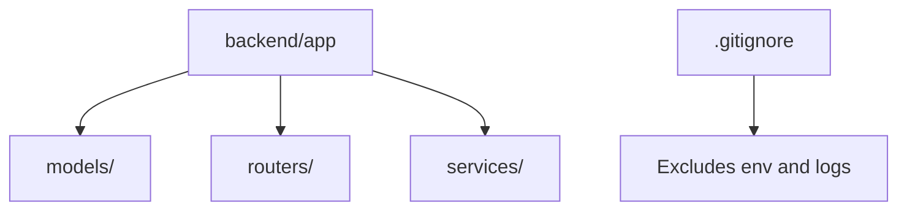
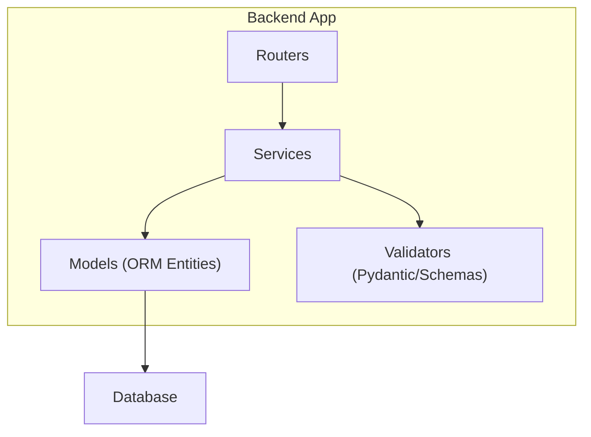
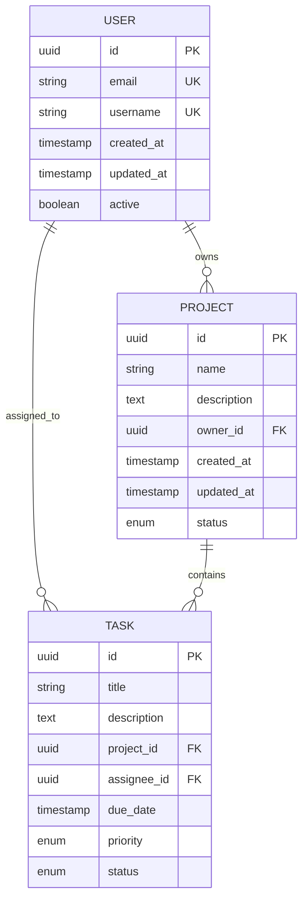
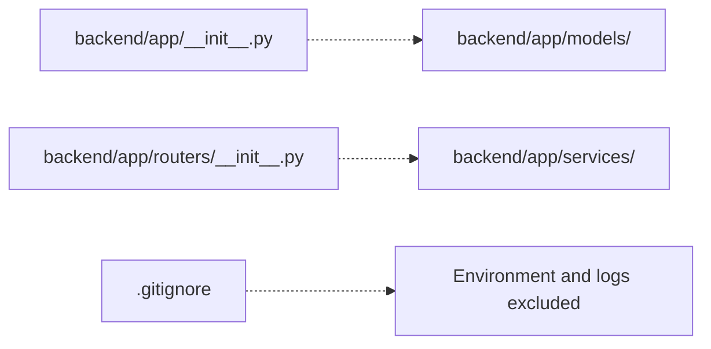

# Data Modeling

<cite>
**Referenced Files in This Document**
- [__init__.py](file://backend/app/__init__.py)
- [routers/__init__.py](file://backend/app/routers/__init__.py)
- [.gitignore](file://.gitignore)
</cite>

## Table of Contents
1. [Introduction](#introduction)
2. [Project Structure](#project-structure)
3. [Core Components](#core-components)
4. [Architecture Overview](#architecture-overview)
5. [Detailed Component Analysis](#detailed-component-analysis)
6. [Dependency Analysis](#dependency-analysis)
7. [Performance Considerations](#performance-considerations)
8. [Troubleshooting Guide](#troubleshooting-guide)
9. [Conclusion](#conclusion)
10. [Appendices](#appendices)

## Introduction
This document provides comprehensive data modeling guidance for the GoNow application’s models layer. It covers entity relationship design, field definitions and types, primary/foreign key relationships, indexes and constraints, validation rules, business rule implementation, schema evolution strategies, ORM patterns, data access methods, query optimization, lifecycle management, migration strategies, backup procedures, security and privacy considerations, access control patterns, and guidelines for creating new models while maintaining consistency across the application.

The repository currently exposes minimal Python scaffolding under backend/app with empty __init__ files and a .gitignore. As such, this document establishes a pragmatic, framework-agnostic baseline that can be adapted to common Python backends (e.g., SQLAlchemy + FastAPI or Django ORM). Where applicable, it also notes how to align with the existing structure once concrete model files are introduced.

## Project Structure
At present, the backend app contains:
- backend/app/__init__.py
- backend/app/routers/__init__.py
- backend/app/models/ (directory exists; no files detected)
- backend/app/services/ (directory exists; no files detected)

**Diagram sources**
- [__init__.py:1-1](file://backend/app/__init__.py#L1-L1)
- [routers/__init__.py:1-1](file://backend/app/routers/__init__.py#L1-L1)
- [.gitignore:1-36](file://.gitignore#L1-L36)

**Section sources**
- [__init__.py:1-1](file://backend/app/__init__.py#L1-L1)
- [routers/__init__.py:1-1](file://backend/app/routers/__init__.py#L1-L1)
- [.gitignore:1-36](file://.gitignore#L1-L36)

## Core Components
Given the current state of the repository, there are no concrete model classes or database configuration files present. The following outlines recommended core components for the models layer that should be implemented when adding persistence:

- Models package
  - Base model class providing shared fields (e.g., created_at, updated_at), audit metadata, and common validations.
  - Domain-specific entities (e.g., User, Tenant, Resource) with explicit field definitions and relationships.
- Database configuration
  - Connection settings via environment variables.
  - Engine/session or ORM session factory initialization.
- Migrations
  - Migration tooling integration (e.g., Alembic for SQLAlchemy or Django migrations).
- Validation and business rules
  - Pydantic schemas or ORM-level validators for input validation and business invariants.
- Data access layer
  - Repository or service abstractions encapsulating CRUD operations and complex queries.

No code is present yet; implement these components within backend/app/models and related directories as the project evolves.

[No sources needed since this section provides general guidance]

## Architecture Overview
A typical Python-based data architecture includes:
- API routers handling HTTP requests
- Services orchestrating business logic
- Repositories or direct ORM calls performing data access
- Database storing persistent entities

[No sources needed since this diagram shows conceptual workflow, not actual code structure]

## Detailed Component Analysis

### Entity Relationship Design
Recommended approach:
- Define clear domain entities with explicit relationships (one-to-one, one-to-many, many-to-many).
- Use surrogate integer or UUID primary keys unless natural keys are strongly justified.
- Maintain referential integrity with foreign keys and appropriate ON DELETE/ON UPDATE behaviors.
- Normalize where possible; denormalize only for performance-critical read paths with documented trade-offs.

Example ERD pattern (conceptual):

[No sources needed since this diagram shows conceptual workflow, not actual code structure]

### Field Definitions and Data Types
Guidelines:
- Prefer immutable timestamps (created_at, updated_at) with automatic defaults and on-update hooks.
- Use UUIDs for public-facing identifiers; keep internal IDs as integers if preferred by your ORM.
- Store enums as constrained strings or small integer codes depending on ORM support and portability needs.
- Avoid storing sensitive data in plain text; use encrypted fields or external secret stores.

[No sources needed since this section provides general guidance]

### Primary/Foreign Keys, Indexes, and Constraints
- Primary keys: unique, non-null, stable identifiers.
- Foreign keys: enforce referential integrity; choose cascade policies aligned with business semantics.
- Unique constraints: ensure uniqueness at the database level for critical fields (e.g., email).
- Indexes: add indexes on frequently filtered/sorted columns and foreign keys used in joins.
- Check constraints: encode simple business rules (e.g., date ranges, value bounds).

[No sources needed since this section provides general guidance]

### Data Validation Rules and Business Rule Implementation
- Validate inputs at the boundary using Pydantic models or equivalent schema validators.
- Enforce invariants at the ORM/service layer before persisting.
- Centralize error messages and validation failures for consistent API responses.

[No sources needed since this section provides general guidance]

### ORM Patterns and Data Access Methods
- Use an ORM (e.g., SQLAlchemy or Django ORM) to map models to tables.
- Encapsulate queries in repositories or services to avoid leaking ORM details into routers.
- Provide typed query builders or helper functions for complex reads.

[No sources needed since this section provides general guidance]

### Query Optimization Techniques
- Select only required columns.
- Use eager loading to prevent N+1 queries.
- Add targeted indexes based on query profiles.
- Paginate large result sets and avoid unbounded scans.

[No sources needed since this section provides general guidance]

### Data Lifecycle Management
- Soft deletes vs hard deletes: prefer soft deletes for auditability and recovery, with appropriate flags and filters.
- Audit trails: track who changed what and when for compliance.
- Archival: move cold data to archives or separate storage tiers.

[No sources needed since this section provides general guidance]

### Schema Evolution Strategies
- Versioned migrations with rollback plans.
- Backward-compatible changes first (add-only), then deprecate and remove in later releases.
- Feature flags to toggle behavior during rollout.

[No sources needed since this section provides general guidance]

### Backup Procedures
- Regular automated backups (full and incremental).
- Test restore procedures periodically.
- Encrypt backups at rest and in transit.

[No sources needed since this section provides general guidance]

### Security Considerations, Privacy Requirements, and Access Control
- Never log or expose sensitive fields.
- Apply row-level or attribute-level access controls where necessary.
- Encrypt PII at rest and in transit; manage keys securely.
- Follow least privilege for database accounts.

[No sources needed since this section provides general guidance]

### Guidelines for Creating New Models and Maintaining Consistency
- Start with a clear domain concept and responsibilities.
- Define fields, constraints, and relationships explicitly.
- Add migrations immediately after model changes.
- Write tests covering creation, updates, deletions, and edge cases.
- Document assumptions and rationale for design choices.

[No sources needed since this section provides general guidance]

## Dependency Analysis
Current repository state:
- backend/app/__init__.py and backend/app/routers/__init__.py are present but empty.
- No model or database configuration files were detected.

**Diagram sources**
- [__init__.py:1-1](file://backend/app/__init__.py#L1-L1)
- [routers/__init__.py:1-1](file://backend/app/routers/__init__.py#L1-L1)
- [.gitignore:1-36](file://.gitignore#L1-L36)

**Section sources**
- [__init__.py:1-1](file://backend/app/__init__.py#L1-L1)
- [routers/__init__.py:1-1](file://backend/app/routers/__init__.py#L1-L1)
- [.gitignore:1-36](file://.gitignore#L1-L36)

## Performance Considerations
- Profile queries and add indexes judiciously.
- Cache hot reads with short TTLs where appropriate.
- Batch writes and use transactions to reduce overhead.
- Monitor slow queries and adjust pagination limits.

[No sources needed since this section provides general guidance]

## Troubleshooting Guide
Common issues and remedies:
- Missing migrations: ensure all model changes have corresponding migration scripts and apply them in order.
- N+1 queries: enable eager loading or refactor queries to fetch related entities in bulk.
- Constraint violations: validate inputs early and provide meaningful error messages.
- Deadlocks: minimize transaction scope and order lock acquisition consistently.

[No sources needed since this section provides general guidance]

## Conclusion
While the repository currently contains minimal scaffolding, this document establishes a robust blueprint for designing and implementing the data models layer. Adopting the patterns, constraints, and processes outlined here will help ensure correctness, performance, security, and maintainability as the application grows.

[No sources needed since this section summarizes without analyzing specific files]

## Appendices

### Sample Data Structures (Conceptual)
Representative JSON-like structures for illustration:

- User
  - id: string (UUID)
  - email: string (unique)
  - username: string (unique)
  - created_at: datetime
  - updated_at: datetime
  - active: boolean

- Project
  - id: string (UUID)
  - name: string
  - description: string
  - owner_id: string (UUID, FK to User)
  - created_at: datetime
  - updated_at: datetime
  - status: enum

- Task
  - id: string (UUID)
  - title: string
  - description: string
  - project_id: string (UUID, FK to Project)
  - assignee_id: string (UUID, FK to User)
  - due_date: datetime
  - priority: enum
  - status: enum

[No sources needed since this section provides general guidance]