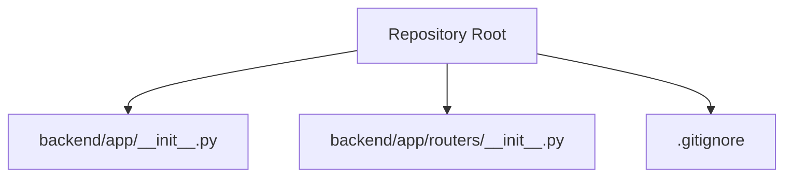
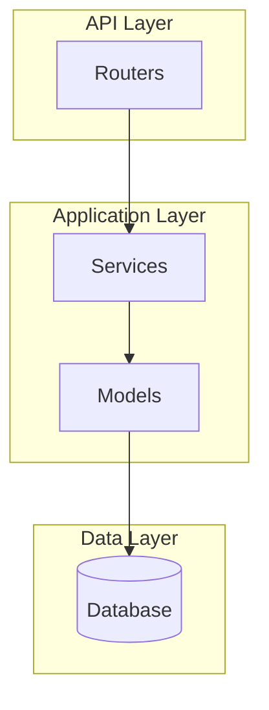
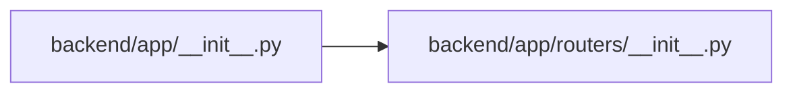
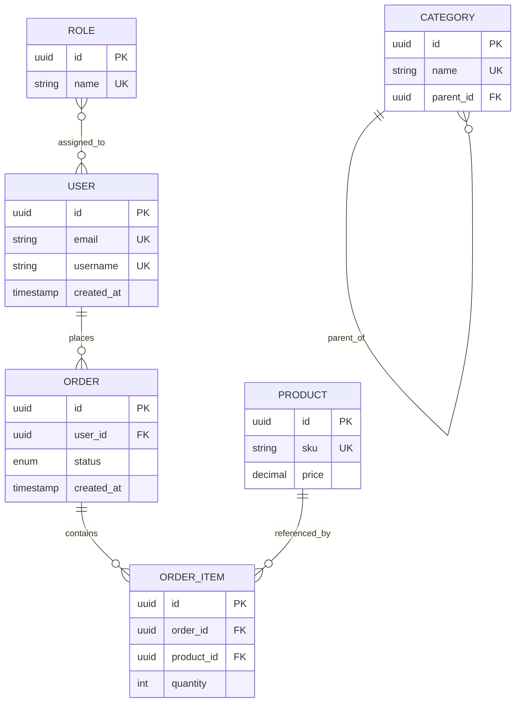

# Relationships & Constraints

<cite>
**Referenced Files in This Document**
- [backend/app/__init__.py](file://backend/app/__init__.py)
- [backend/app/routers/__init__.py](file://backend/app/routers/__init__.py)
- [.gitignore](file://.gitignore)
</cite>

## Table of Contents
1. [Introduction](#introduction)
2. [Project Structure](#project-structure)
3. [Core Components](#core-components)
4. [Architecture Overview](#architecture-overview)
5. [Detailed Component Analysis](#detailed-component-analysis)
6. [Dependency Analysis](#dependency-analysis)
7. [Performance Considerations](#performance-considerations)
8. [Troubleshooting Guide](#troubleshooting-guide)
9. [Conclusion](#conclusion)
10. [Appendices](#appendices)

## Introduction
This document provides guidance on modeling relationships and constraints for the GoNow project’s data layer. It focuses on:
- Foreign key relationships, many-to-many associations, and hierarchical structures
- Database constraints (unique, check, referential integrity)
- Practical examples for complex relationships, cascading operations, and consistency
- Query optimization for joined queries and relationship traversal
- Common anti-patterns and their solutions
- Guidelines for designing efficient schemas that support both read and write workloads

Note: The repository currently contains minimal Python scaffolding and no database model definitions. Therefore, this document presents conceptual and best-practice guidance applicable to any relational schema used by GoNow. Where relevant, it references existing files to confirm scope and boundaries.

## Project Structure
The repository includes a small Python backend scaffold with package initialization files and a router placeholder. There are no visible ORM or database migration files in the current snapshot.

**Diagram sources**
- [backend/app/__init__.py](file://backend/app/__init__.py)
- [backend/app/routers/__init__.py](file://backend/app/routers/__init__.py)
- [.gitignore](file://.gitignore)

**Section sources**
- [backend/app/__init__.py](file://backend/app/__init__.py)
- [backend/app/routers/__init__.py](file://backend/app/routers/__init__.py)
- [.gitignore](file://.gitignore)

## Core Components
At present, the codebase does not expose concrete data models or database configuration. As such, there are no explicit foreign keys, unique constraints, or cascade rules to analyze from source files. The following sections provide general-purpose guidance for implementing these patterns when models are added to the project.

[No sources needed since this section provides general guidance]

## Architecture Overview
A typical GoNow relational architecture would include:
- API routers handling requests
- Services orchestrating business logic
- Models representing entities and relationships
- A database enforcing constraints and indexes

[No sources needed since this diagram shows conceptual architecture, not actual code structure]

## Detailed Component Analysis

### Foreign Key Relationships
- Purpose: Enforce referential integrity between related tables.
- Typical usage:
  - Parent-child links via a non-null foreign key column.
  - Optional relationships using nullable foreign keys.
- Best practices:
  - Index foreign key columns to speed up joins and constraint checks.
  - Choose appropriate ON DELETE/ON UPDATE behaviors based on semantics.
  - Prefer surrogate primary keys for stable references across migrations.

[No sources needed since this section provides general guidance]

### Many-to-Many Associations
- Purpose: Model N:M relationships without duplicating data.
- Typical implementation:
  - A junction table containing two foreign keys referencing the related entities.
  - Unique composite index on the pair of foreign keys to prevent duplicate edges.
- Example scenarios:
  - Users and Roles
  - Orders and Products
- Tips:
  - Add an auto-incrementing surrogate primary key to the junction table if you need stable IDs for auditing or additional attributes.
  - Include timestamps for provenance if required.

[No sources needed since this section provides general guidance]

### Hierarchical Data Structures
- Approaches:
  - Adjacency list: simple parent_id reference; easy inserts/updates but expensive deep traversals.
  - Materialized path: store a delimited path string; good for ancestry queries; requires careful updates.
  - Closure table: separate table storing ancestor-descendant pairs; excellent for reads and complex hierarchy queries; more writes overhead.
  - Nested sets: fast subtree queries but complex updates; rarely recommended today.
- Recommendation:
  - Use adjacency lists for shallow hierarchies.
  - Use closure tables for deep hierarchies with frequent traversal queries.

[No sources needed since this section provides general guidance]

### Database Constraints
- Primary Keys:
  - Ensure every table has a single-column surrogate PK unless a natural composite key is truly immutable and short.
- Unique Constraints:
  - Apply to fields like email, username, or business keys to prevent duplicates.
  - Consider partial or functional unique indexes for conditional uniqueness.
- Check Constraints:
  - Enforce domain rules at the database level (e.g., status values, ranges).
- Referential Integrity:
  - Define foreign keys with appropriate ON DELETE/ON UPDATE actions.
  - Avoid excessive cascades; prefer application-level coordination for complex workflows.

[No sources needed since this section provides general guidance]

### Cascading Operations
- When to use:
  - Strong ownership where child records should be removed automatically (e.g., OrderItems under Order).
- When to avoid:
  - Cross-boundary cascades that can cause unintended side effects.
  - Deep cascade chains that complicate debugging and transactions.
- Alternatives:
  - Soft deletes with lifecycle hooks.
  - Scheduled cleanup jobs for orphaned records.

[No sources needed since this section provides general guidance]

### Managing Data Consistency Across Related Entities
- Use transactions to group related writes.
- Validate invariants before committing.
- Prefer idempotent operations for retries and resiliency.
- For eventual consistency across services, use outbox patterns and reliable messaging.

[No sources needed since this section provides general guidance]

### Query Optimization for Joined Queries and Relationship Traversal
- Indexing:
  - Index foreign keys and frequently filtered/joined columns.
  - Use composite indexes matching common query predicates.
- Eager vs Lazy Loading:
  - Preload necessary relationships to avoid N+1 queries.
- Pagination:
  - Use keyset pagination for large result sets.
- Read Replicas:
  - Offload heavy analytical queries to replicas.
- Denormalization:
  - Introduce carefully curated denormalized fields or materialized views for hot paths.

[No sources needed since this section provides general guidance]

### Common Relationship Anti-Patterns and Solutions
- Anti-pattern: Missing indexes on foreign keys
  - Solution: Add targeted indexes aligned with join and filter patterns.
- Anti-pattern: Overuse of cascading deletes
  - Solution: Replace with soft deletes or explicit deletion flows.
- Anti-pattern: Storing JSON blobs for structured relationships
  - Solution: Normalize into proper tables with constraints and indexes.
- Anti-pattern: Wide tables with redundant data
  - Solution: Split into focused entities and link via foreign keys.
- Anti-pattern: Unbounded recursion in application logic
  - Solution: Use closure tables or materialized paths for hierarchy traversal.

[No sources needed since this section provides general guidance]

### Design Guidelines for Efficient Relationship Schemas
- Start with clear entity boundaries and responsibilities.
- Keep relationships explicit and constrained.
- Favor small, focused tables over monolithic ones.
- Plan for future growth: anticipate cardinality changes and access patterns.
- Document assumptions and invariants alongside schema definitions.

[No sources needed since this section provides general guidance]

## Dependency Analysis
Given the current repository state, there are no database-related dependencies to visualize. The existing files indicate a Python-based backend scaffold without model definitions.

**Diagram sources**
- [backend/app/__init__.py](file://backend/app/__init__.py)
- [backend/app/routers/__init__.py](file://backend/app/routers/__init__.py)

**Section sources**
- [backend/app/__init__.py](file://backend/app/__init__.py)
- [backend/app/routers/__init__.py](file://backend/app/routers/__init__.py)

## Performance Considerations
- Index strategically based on real query profiles.
- Monitor slow queries and adjust indexes accordingly.
- Use connection pooling and prepared statements.
- Batch writes where possible to reduce round-trips.
- Cache read-heavy relationships judiciously.

[No sources needed since this section provides general guidance]

## Troubleshooting Guide
- Symptom: Constraint violations during writes
  - Action: Inspect unique and foreign key constraints; validate inputs prior to persistence.
- Symptom: Slow joins or relationship traversal
  - Action: Review execution plans; add missing indexes; consider denormalization or materialized views.
- Symptom: Orphaned records after deletions
  - Action: Audit cascade rules; implement soft deletes or scheduled cleanup.
- Symptom: Deadlocks or lock contention
  - Action: Reduce transaction scope; order writes consistently; split heavy operations.

[No sources needed since this section provides general guidance]

## Conclusion
While the current repository snapshot does not include concrete data models or database configurations, the guidance above outlines robust patterns for relationships and constraints that can be applied as the GoNow data layer evolves. Adopting strong referential integrity, thoughtful indexing, and clear cascade policies will help ensure correctness, performance, and maintainability.

[No sources needed since this section summarizes without analyzing specific files]

## Appendices

### Appendix A: Example Entity Relationship Concepts
Conceptual ERD illustrating common patterns:

[No sources needed since this diagram shows conceptual relationships, not actual code structure]