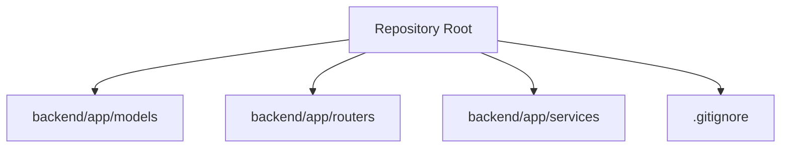
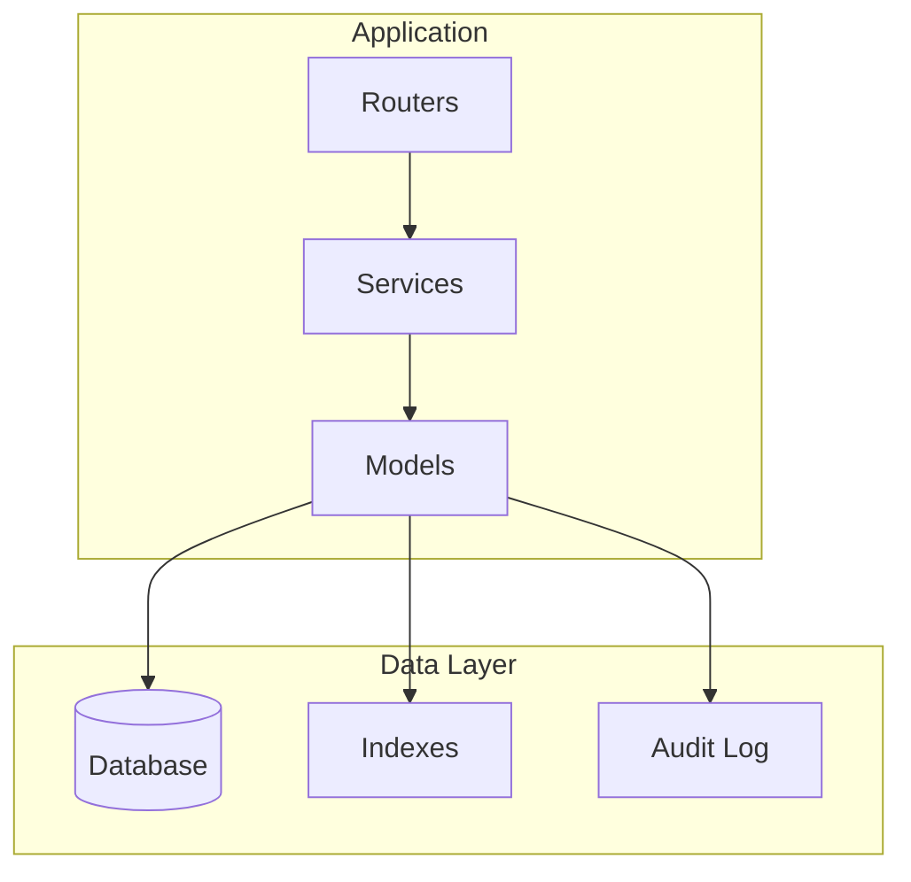
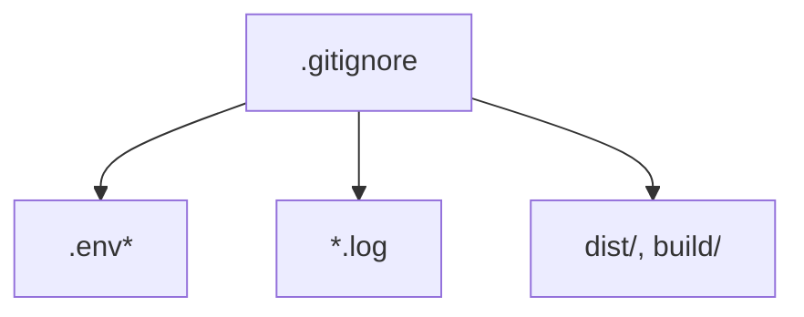

# Schema Design

<cite>
**Referenced Files in This Document**
- [.gitignore](file://.gitignore)
</cite>

## Table of Contents
1. [Introduction](#introduction)
2. [Project Structure](#project-structure)
3. [Core Components](#core-components)
4. [Architecture Overview](#architecture-overview)
5. [Detailed Component Analysis](#detailed-component-analysis)
6. [Dependency Analysis](#dependency-analysis)
7. [Performance Considerations](#performance-considerations)
8. [Troubleshooting Guide](#troubleshooting-guide)
9. [Conclusion](#conclusion)
10. [Appendices](#appendices)

## Introduction
This document provides comprehensive schema design guidance for the GoNow data models. It focuses on entity relationship principles, table structure planning, field definition best practices, normalization rules, indexing strategies, and performance optimization techniques. It also covers naming conventions, data type selection, nullable field handling, audit trail implementation, RESTful API alignment, scalability considerations, and future-proofing strategies. The goal is to establish a robust, maintainable, and scalable database foundation that supports efficient querying and evolving business requirements.

## Project Structure
The repository includes a backend application directory with placeholders for models, routers, and services. At this time, no concrete model or migration files are present in the workspace. The .gitignore file indicates Python-related artifacts and environment variables, suggesting a Python-based backend stack.

**Diagram sources**
- [.gitignore:1-36](file://.gitignore#L1-L36)

**Section sources**
- [.gitignore:1-36](file://.gitignore#L1-L36)

## Core Components
Given the absence of explicit model definitions in the current workspace, this section outlines recommended core components for GoNow’s data layer. These components should be implemented as part of the models package once code is added.

- Entities and Relationships
  - Define clear entities (e.g., User, Resource, Session, AuditLog) with well-scoped responsibilities.
  - Use foreign keys to represent relationships; prefer composite keys only when semantically required.
  - Maintain referential integrity via constraints and cascading rules where appropriate.

- Field Definition Best Practices
  - Choose precise data types aligned with domain semantics (e.g., UUIDs for IDs, timestamps for created_at/updated_at).
  - Avoid over-normalization at the expense of query performance; balance normalization with practical access patterns.
  - Prefer immutable identifiers (surrogate keys) for primary relationships.

- Naming Conventions
  - Tables: plural, snake_case (e.g., users, resources).
  - Columns: snake_case, descriptive, avoid reserved words (e.g., user_id, created_at).
  - Foreign Keys: <referenced_table>_id (e.g., owner_id referencing users.id).
  - Indexes: idx_<table>_<column(s)> (e.g., idx_users_email).

- Data Types and Nullable Fields
  - Use fixed-length types for IDs (UUID), timestamps (TIMESTAMPTZ), and numeric precision (DECIMAL for currency).
  - Mark columns NOT NULL unless business logic explicitly allows missing values.
  - Provide defaults for predictable fields (e.g., status enums, booleans).

- Audit Trails
  - Implement an audit log table capturing entity changes (entity_type, entity_id, action, payload, actor_id, occurred_at).
  - Enforce immutability and append-only behavior for audit records.
  - Ensure indexes support frequent queries by entity and time range.

- RESTful Alignment
  - Map resource-oriented endpoints to tables/entities (e.g., /users -> users table).
  - Use consistent ID formats across APIs and database layers.
  - Represent relationships via nested payloads while maintaining normalized storage.

**Section sources**
- [.gitignore:1-36](file://.gitignore#L1-L36)

## Architecture Overview
The following conceptual architecture illustrates how the data layer integrates with application components. This diagram is illustrative and not tied to specific source files.

[No sources needed since this diagram shows conceptual workflow, not actual code structure]

## Detailed Component Analysis
Since no concrete model files exist in the repository, this section provides conceptual guidance for designing key entities and their interactions.

### Entity Relationship Design Principles
- Identify bounded contexts and aggregate boundaries.
- Favor one-to-many relationships over many-to-many where possible; use junction tables for true many-to-many.
- Keep relationships shallow to reduce join complexity.

### Table Structure Planning
- Normalize to at least 3NF for transactional consistency.
- Introduce denormalized views or materialized structures for read-heavy workloads.
- Partition large tables by time or tenant if necessary.

### Field Definition Best Practices
- Use semantic column names reflecting domain concepts.
- Apply constraints (UNIQUE, CHECK) to enforce business rules at the database level.
- Standardize timestamp columns (created_at, updated_at, deleted_at for soft deletes).

### Database Normalization Rules
- First Normal Form: atomic values, no repeating groups.
- Second Normal Form: no partial dependencies on primary keys.
- Third Normal Form: no transitive dependencies.

### Indexing Strategies
- Primary Key Indexes: always present.
- Unique Indexes: for email, slugs, external IDs.
- Composite Indexes: align with common query predicates.
- Partial Indexes: filter high-selectivity subsets.

### Performance Optimization Techniques
- Covering indexes for frequent queries.
- Query plan analysis and slow query logging.
- Connection pooling and prepared statements.
- Batch operations for writes.

### Naming Conventions
- Tables: plural snake_case.
- Columns: snake_case, lowercase.
- Indexes: idx_<table>_<columns>.
- Constraints: fk_<table>_<column>, uq_<table>_<column>.

### Choosing Appropriate Data Types
- IDs: UUID v4 for distributed systems; BIGINT for simple cases.
- Timestamps: TIMESTAMPTZ with timezone awareness.
- Numeric: DECIMAL for financial data; INTEGER/BIGINT for counts.
- Text: VARCHAR with reasonable limits; TEXT for unbounded content.

### Handling Nullable Fields
- Default to NOT NULL with sensible defaults.
- Use NULL only when absence is meaningful.
- Validate nullability at both application and database layers.

### Implementing Audit Trails
- Append-only audit table with structured payload (JSONB if supported).
- Index by entity_type, entity_id, and occurred_at.
- Retention policies and archival strategies.

### RESTful API Patterns
- Map endpoints to entities consistently.
- Use stable resource identifiers.
- Represent relationships via references and include selective nesting.

### Scalability and Future-Proofing
- Plan for horizontal scaling (sharding by tenant or region).
- Versioned schemas with backward-compatible migrations.
- Feature flags for gradual rollout of new fields.

[No sources needed since this section doesn't analyze specific source files]

## Dependency Analysis
At this stage, there are no explicit model or migration files to analyze for dependencies. The .gitignore suggests a Python backend environment but does not reveal database ORM or driver choices.

**Diagram sources**
- [.gitignore:1-36](file://.gitignore#L1-L36)

**Section sources**
- [.gitignore:1-36](file://.gitignore#L1-L36)

## Performance Considerations
- Design indexes based on actual query patterns and workload profiling.
- Monitor query execution plans and optimize hot paths.
- Use connection pooling and caching layers judiciously.
- Employ pagination and cursor-based navigation for large datasets.
- Archive historical data to keep active tables lean.

[No sources needed since this section provides general guidance]

## Troubleshooting Guide
- Verify environment configuration via .env files excluded by .gitignore.
- Check logs for errors and slow queries.
- Ensure database migrations are applied in order and idempotent.
- Validate constraints and indexes after schema changes.

**Section sources**
- [.gitignore:1-36](file://.gitignore#L1-L36)

## Conclusion
This schema design guide establishes foundational principles for building a robust data layer in GoNow. While no concrete models are present in the current workspace, the recommendations provide a blueprint for entity design, normalization, indexing, and performance optimization. As models and migrations are introduced, these guidelines will help ensure consistency, scalability, and maintainability.

[No sources needed since this section summarizes without analyzing specific files]

## Appendices
- Example Entity Set (Conceptual)
  - Users: id, email, name, status, created_at, updated_at
  - Resources: id, owner_id, title, metadata, created_at, updated_at
  - Sessions: id, user_id, token, expires_at, created_at
  - AuditLog: id, entity_type, entity_id, action, payload, actor_id, occurred_at

- Example Indexes (Conceptual)
  - idx_users_email UNIQUE
  - idx_resources_owner_id
  - idx_sessions_user_id_expires_at
  - idx_audit_log_entity_type_entity_id_occurred_at

[No sources needed since this section provides conceptual examples]