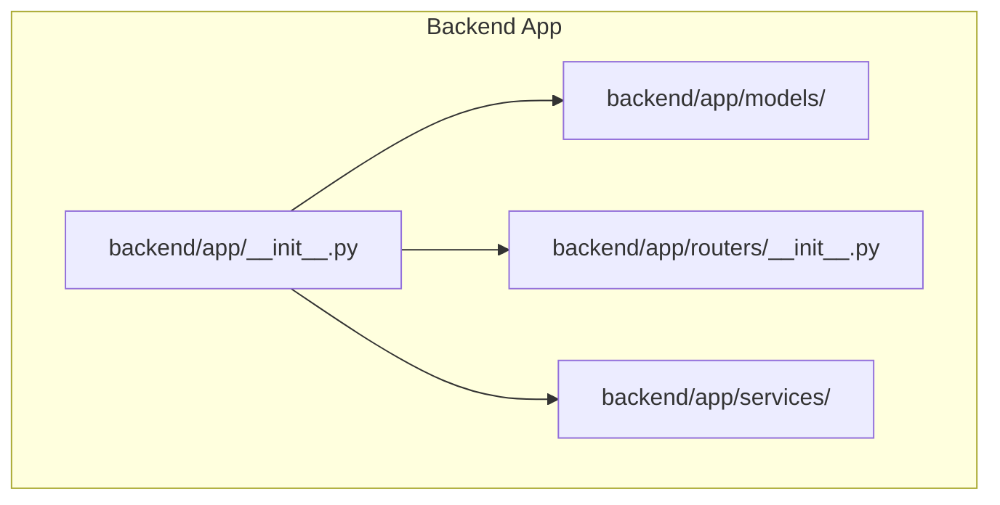
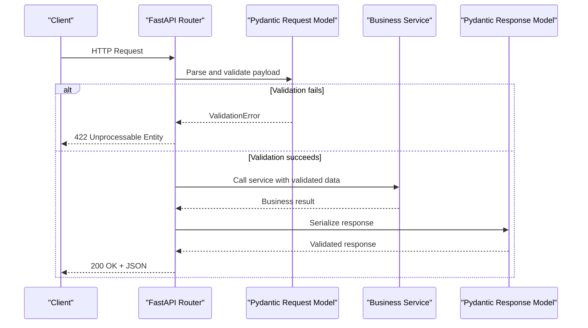
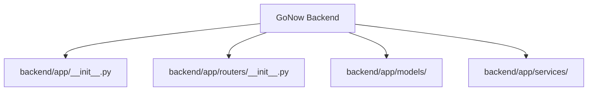

# Validation Rules

<cite>
**Referenced Files in This Document**
- [__init__.py](file://backend/app/__init__.py)
- [__init__.py](file://backend/app/routers/__init__.py)
- [.gitignore](file://.gitignore)
</cite>

## Table of Contents
1. Introduction
2. Project Structure
3. Core Components
4. Architecture Overview
5. Detailed Component Analysis
6. Dependency Analysis
7. Performance Considerations
8. Troubleshooting Guide
9. Conclusion

## Introduction
This document defines the validation rules and strategies for the GoNow data models, focusing on model-layer validation, input sanitization, and business rule enforcement. It explains how to implement Pydantic schema validation, custom validators, and conditional validation logic; provides examples of field-level, cross-field, and complex constraints; and documents error handling patterns, message customization, and integration with API request/response validation. It also covers performance considerations and caching strategies for expensive validations, along with guidelines to maintain consistency across application layers.

Note: The repository currently contains only minimal scaffolding files. Where applicable, this document provides implementation guidance and references to where code should be added.

## Project Structure
The backend is organized into modules under backend/app, including models, routers, and services. At present, the models directory exists but has no Python files committed. Routers and app initialization are present as empty packages.

**Diagram sources**
- [__init__.py](file://backend/app/__init__.py)
- [__init__.py](file://backend/app/routers/__init__.py)

**Section sources**
- [__init__.py](file://backend/app/__init__.py)
- [__init__.py](file://backend/app/routers/__init__.py)

## Core Components
- Data Models (Pydantic): Define schemas for requests, responses, and internal entities. Use strict typing, default values, and validators to enforce correctness at the boundary.
- Custom Validators: Implement field-level and model-level validators for domain-specific rules.
- Cross-Field Validation: Enforce relationships between fields using model validators.
- Error Handling: Standardize validation errors and messages for consistent API responses.
- Integration Points: Wire validation into FastAPI endpoints via dependency injection or response models.

[No sources needed since this section provides general guidance]

## Architecture Overview
The validation architecture centers on Pydantic models that act as the single source of truth for data contracts. Routers consume validated models and pass them to services. Responses are serialized through Pydantic response models to ensure output compliance.

[No sources needed since this diagram shows conceptual workflow, not actual code structure]

## Detailed Component Analysis

### Field-Level Validation Strategy
- Type coercion and strictness: Prefer explicit types and enable strict mode when necessary to prevent silent coercion.
- Constraints: Apply length, range, regex, and enum constraints directly on fields.
- Sanitization: Normalize strings (trim, lowercase), coerce numeric formats, and strip unsafe characters before validation.
- Defaults and required flags: Use defaults for optional fields and mark required fields explicitly.

Implementation guidance:
- Place field definitions and constraints in Pydantic models within the models package.
- Use built-in validators for common checks and custom validators for domain rules.

[No sources needed since this section provides general guidance]

### Custom Validators and Conditional Logic
- Field validators: Validate a single field’s value against domain rules.
- Model validators: Validate multiple fields together and enforce cross-field dependencies.
- Conditional validation: Enable/disable certain rules based on other field values.

Patterns:
- Use model-level validators to coordinate complex conditions.
- Raise descriptive validation errors with clear messages.

[No sources needed since this section provides general guidance]

### Cross-Field Validation Examples
- Date ordering: Ensure start date precedes end date.
- Mutual exclusivity: Only one of several related fields may be set.
- Consistency: Validate that dependent fields match expected combinations.

[No sources needed since this section provides general guidance]

### Complex Business Constraints
- Multi-step checks: Combine multiple conditions and aggregate errors.
- External lookups: When possible, avoid I/O in validators; defer to services and pre-validate with lightweight checks.
- Idempotency: Ensure validation does not mutate state.

[No sources needed since this section provides general guidance]

### Error Handling Patterns and Message Customization
- Centralize error formatting to produce consistent API error payloads.
- Provide human-readable messages and machine-friendly codes.
- Map validation failures to appropriate HTTP status codes (e.g., 422).

Integration tips:
- Wrap endpoint handlers to catch validation errors and return standardized responses.
- Log validation failures with sufficient context for debugging without exposing sensitive details.

[No sources needed since this section provides general guidance]

### API Request/Response Validation Integration
- Request models: Validate incoming payloads at router boundaries.
- Response models: Serialize outputs to guarantee shape and types.
- Dependencies: Inject validated models into service functions to keep controllers thin.

[No sources needed since this section provides general guidance]

### Performance Considerations and Caching Strategies
- Keep validators fast and deterministic. Avoid heavy computations inside validators.
- Cache expensive validations by keying on immutable inputs (e.g., normalized identifiers).
- Precompute derived fields where feasible and reuse results.
- Prefer early exits and short-circuiting to minimize overhead.

[No sources needed since this section provides general guidance]

### Maintaining Validation Consistency Across Layers
- Single source of truth: Keep all validation rules in Pydantic models.
- Shared utilities: Extract reusable validators and helpers to avoid duplication.
- Documentation: Annotate models with comments describing business intent.
- Tests: Add unit tests for validators and edge cases.
- Code reviews: Enforce adherence to validation standards during PR reviews.

[No sources needed since this section provides general guidance]

## Dependency Analysis
At present, the backend includes minimal scaffolding. The following diagram reflects the current file layout and intended module relationships.

**Diagram sources**
- [__init__.py](file://backend/app/__init__.py)
- [__init__.py](file://backend/app/routers/__init__.py)

**Section sources**
- [__init__.py](file://backend/app/__init__.py)
- [__init__.py](file://backend/app/routers/__init__.py)

## Performance Considerations
- Minimize validator complexity; prefer simple, composable checks.
- Avoid network calls or database queries inside validators.
- Use memoization for deterministic, expensive checks keyed by stable inputs.
- Profile hot paths and optimize only what matters.

[No sources needed since this section provides general guidance]

## Troubleshooting Guide
Common issues and resolutions:
- Unexpected type coercion: Enable strict mode and review field types.
- Missing required fields: Verify request payloads and required flags.
- Inconsistent error messages: Centralize error formatting and ensure messages are clear.
- Slow validation: Identify heavy operations and move them out of validators or cache results.

[No sources needed since this section provides general guidance]

## Conclusion
Adopting robust Pydantic-based validation at the model layer ensures reliable data contracts, predictable behavior, and consistent API responses. By centralizing validation rules, customizing error messages, and optimizing performance, teams can maintain high-quality data flows across the application. As the codebase evolves, continue to refine validators, add comprehensive tests, and document business constraints clearly.

[No sources needed since this section summarizes without analyzing specific files]