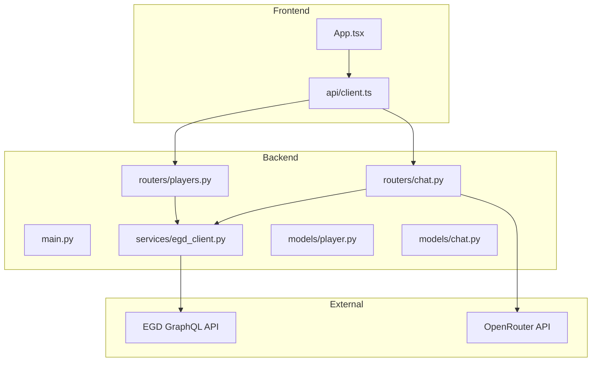
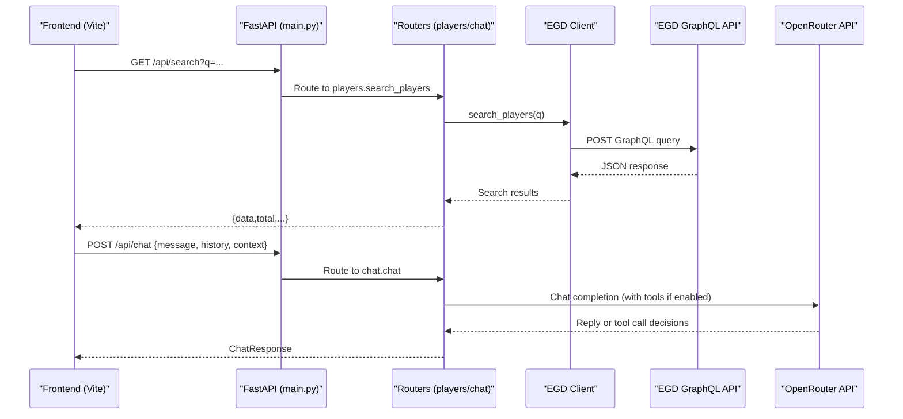
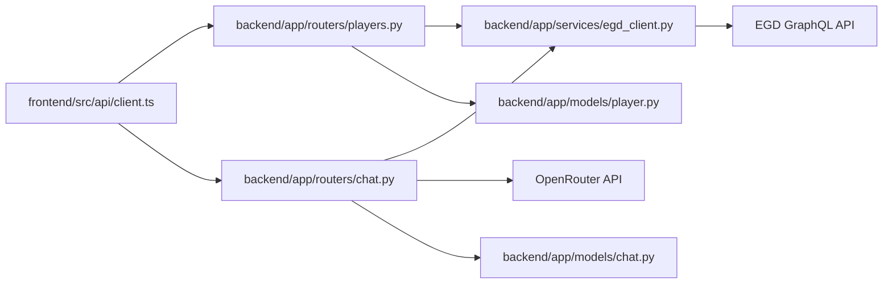

# Development Guide

<cite>
**Referenced Files in This Document**
- [Makefile](file://Makefile)
- [README.md](file://README.md)
- [backend/app/main.py](file://backend/app/main.py)
- [backend/requirements.txt](file://backend/requirements.txt)
- [frontend/package.json](file://frontend/package.json)
- [frontend/vite.config.ts](file://frontend/vite.config.ts)
- [scripts/explore_api.py](file://scripts/explore_api.py)
- [scripts/explore_player.py](file://scripts/explore_player.py)
- [backend/app/routers/players.py](file://backend/app/routers/players.py)
- [backend/app/routers/chat.py](file://backend/app/routers/chat.py)
- [backend/app/services/egd_client.py](file://backend/app/services/egd_client.py)
- [backend/app/models/player.py](file://backend/app/models/player.py)
- [backend/app/models/chat.py](file://backend/app/models/chat.py)
- [frontend/src/api/client.ts](file://frontend/src/api/client.ts)
- [frontend/src/App.tsx](file://frontend/src/App.tsx)
- [frontend/.oxlintrc.json](file://frontend/.oxlintrc.json)
- [docs/ARCHITECTURE.md](file://docs/ARCHITECTURE.md)
- [docs/EGD_API.md](file://docs/EGD_API.md)
</cite>

## Table of Contents
1. Introduction
2. Project Structure
3. Core Components
4. Architecture Overview
5. Detailed Component Analysis
6. Dependency Analysis
7. Performance Considerations
8. Troubleshooting Guide
9. Contribution Guidelines and Best Practices
10. Conclusion

## Introduction
This guide explains how to develop, debug, test, and extend the GoNow application. It covers the development workflow using Makefile commands, hot reload configuration for both frontend and backend, debugging techniques, testing strategies, API exploration utilities, code style guidelines, pull request process, and best practices for extending the application.

## Project Structure
GoNow is a full-stack app with:
- Backend: FastAPI (Python), serving REST endpoints that proxy EGD GraphQL calls and provide an agentic chat route.
- Frontend: React + TypeScript + Vite, consuming the backend API and rendering player data and charts.
- Scripts: Python utilities to explore the EGD API directly.
- Docs: Architecture and API references.

**Diagram sources**
- [frontend/src/App.tsx:1-37](file://frontend/src/App.tsx#L1-L37)
- [frontend/src/api/client.ts:1-86](file://frontend/src/api/client.ts#L1-L86)
- [backend/app/main.py:1-42](file://backend/app/main.py#L1-L42)
- [backend/app/routers/players.py:1-107](file://backend/app/routers/players.py#L1-L107)
- [backend/app/routers/chat.py:1-95](file://backend/app/routers/chat.py#L1-L95)
- [backend/app/services/egd_client.py:1-197](file://backend/app/services/egd_client.py#L1-L197)
- [backend/app/models/player.py:1-60](file://backend/app/models/player.py#L1-L60)
- [backend/app/models/chat.py:1-21](file://backend/app/models/chat.py#L1-L21)

**Section sources**
- [README.md:57-90](file://README.md#L57-L90)
- [docs/ARCHITECTURE.md:43-81](file://docs/ARCHITECTURE.md#L43-L81)

## Core Components
- Backend entrypoint mounts routers and configures CORS.
- Player routes implement search and detail endpoints, transforming EGD responses into client-friendly shapes.
- Chat route exposes an AI assistant endpoint; it can integrate with tool-calling flows via services.
- EGD client encapsulates GraphQL queries and provides caching.
- Pydantic models define request/response contracts on the backend.
- Frontend Axios client defines typed interfaces and helper functions for API calls.
- App sets up routing and global query cache settings.

Key responsibilities:
- Routing and request validation: [backend/app/routers/players.py:1-107](file://backend/app/routers/players.py#L1-L107), [backend/app/routers/chat.py:1-95](file://backend/app/routers/chat.py#L1-L95)
- Data access and caching: [backend/app/services/egd_client.py:1-197](file://backend/app/services/egd_client.py#L1-L197)
- Models: [backend/app/models/player.py:1-60](file://backend/app/models/player.py#L1-L60), [backend/app/models/chat.py:1-21](file://backend/app/models/chat.py#L1-L21)
- Frontend API client: [frontend/src/api/client.ts:1-86](file://frontend/src/api/client.ts#L1-L86)
- App shell and routing: [frontend/src/App.tsx:1-37](file://frontend/src/App.tsx#L1-L37)

**Section sources**
- [backend/app/main.py:14-31](file://backend/app/main.py#L14-L31)
- [backend/app/routers/players.py:8-41](file://backend/app/routers/players.py#L8-L41)
- [backend/app/routers/chat.py:9-24](file://backend/app/routers/chat.py#L9-L24)
- [backend/app/services/egd_client.py:11-42](file://backend/app/services/egd_client.py#L11-L42)
- [frontend/src/api/client.ts:59-85](file://frontend/src/api/client.ts#L59-L85)
- [frontend/src/App.tsx:18-36](file://frontend/src/App.tsx#L18-L36)

## Architecture Overview
The frontend communicates with the backend over HTTP. The backend proxies EGD GraphQL requests and optionally integrates with OpenRouter for AI-powered chat.

**Diagram sources**
- [backend/app/main.py:20-31](file://backend/app/main.py#L20-L31)
- [backend/app/routers/players.py:8-41](file://backend/app/routers/players.py#L8-L41)
- [backend/app/routers/chat.py:9-24](file://backend/app/routers/chat.py#L9-L24)
- [backend/app/services/egd_client.py:21-42](file://backend/app/services/egd_client.py#L21-L42)
- [docs/EGD_API.md:1-20](file://docs/EGD_API.md#L1-L20)

## Detailed Component Analysis

### Development Workflow and Hot Reload
- Install dependencies:
  - Backend venv and pip install from requirements.
  - Frontend npm install.
- Start servers:
  - Both: backend on port 8000 with auto-reload, frontend on port 5173 with Vite dev server.
  - Individual: start backend or frontend only.
- Stop servers: kill background processes by window title.
- Build production assets: build frontend dist.
- Clean artifacts: remove node_modules, dist, and venv.

Relevant commands are defined in the Makefile and documented in the README.

Hot reload configuration:
- Backend: Uvicorn runs with --reload flag.
- Frontend: Vite dev server provides instant refresh.

Environment variables:
- Configure EGD token and optional OpenRouter key/model in backend/.env.

**Section sources**
- [Makefile:1-54](file://Makefile#L1-L54)
- [README.md:101-122](file://README.md#L101-L122)
- [backend/app/main.py:20-27](file://backend/app/main.py#L20-L27)
- [frontend/vite.config.ts:1-8](file://frontend/vite.config.ts#L1-L8)
- [backend/requirements.txt:1-6](file://backend/requirements.txt#L1-L6)
- [frontend/package.json:6-11](file://frontend/package.json#L6-L11)

### Debugging Techniques

Backend debugging:
- Use Uvicorn’s reload mode to restart automatically on changes.
- Inspect logs in the terminal where the backend runs.
- Validate schema and interactive docs at the root path.

Frontend debugging:
- Use browser DevTools Network tab to inspect requests to http://localhost:8000/api.
- Check console errors and React DevTools for component state.
- Ensure CORS allows localhost:5173.

API exploration scripts:
- Explore EGD authentication and sample queries.
- Fetch a specific player’s rating evolution and save outputs.

**Section sources**
- [backend/app/main.py:34-41](file://backend/app/main.py#L34-L41)
- [scripts/explore_api.py:1-214](file://scripts/explore_api.py#L1-L214)
- [scripts/explore_player.py:1-170](file://scripts/explore_player.py#L1-L170)

### Testing Strategies
- Unit tests:
  - Backend: Test router handlers and service methods with mocked EGD responses.
  - Frontend: Test API client wrappers and hooks with mock axios responses.
- Integration tests:
  - Spin up the FastAPI test client and assert endpoint responses.
  - Verify CORS headers and error codes.
- Contract tests:
  - Keep frontend types aligned with backend Pydantic models.
- Linting and type checks:
  - Run frontend linter and TypeScript checks before committing.

[No sources needed since this section provides general guidance]

### Utility Scripts for API Exploration
- explore_api.py:
  - Tests authentication and performs sample searches and detailed lookups.
  - Saves JSON outputs to scripts/output for inspection.
- explore_player.py:
  - Finds a player by name or PIN and prints rating evolution summary.
  - Saves raw responses to scripts/output.

Usage:
- Set EGD_API_TOKEN environment variable or rely on default fallback in scripts.
- Run scripts from repository root or within scripts directory.

**Section sources**
- [scripts/explore_api.py:1-214](file://scripts/explore_api.py#L1-L214)
- [scripts/explore_player.py:1-170](file://scripts/explore_player.py#L1-L170)

### Code Style Guidelines
- Frontend linting rules are configured via oxlint.
- Enforce React rules and export conventions.
- Use TypeScript strictness and consistent formatting.

Run linting:
- Frontend: use npm script to run the linter.

**Section sources**
- [frontend/.oxlintrc.json:1-9](file://frontend/.oxlintrc.json#L1-L9)
- [frontend/package.json:6-11](file://frontend/package.json#L6-L11)

### Pull Request Process
- Create a feature branch from main.
- Ensure all local checks pass:
  - Backend: ensure imports resolve and no runtime errors.
  - Frontend: run linter and build locally.
- Update documentation if you change APIs or behavior.
- Include clear commit messages describing intent and impact.
- Open a PR with a concise description and link related issues.

[No sources needed since this section doesn't analyze specific files]

### Best Practices for Extending the Application
- Add new endpoints under appropriate routers and keep request/response shapes consistent with models.
- Centralize external API calls in services to reuse caching and error handling.
- Keep environment-specific configuration in .env and document required variables.
- Prefer async patterns for I/O-bound operations.
- Maintain small, focused components and hooks on the frontend.
- Align frontend types with backend models to prevent drift.

**Section sources**
- [backend/app/services/egd_client.py:11-42](file://backend/app/services/egd_client.py#L11-L42)
- [backend/app/models/player.py:1-60](file://backend/app/models/player.py#L1-L60)
- [backend/app/models/chat.py:1-21](file://backend/app/models/chat.py#L1-L21)
- [frontend/src/api/client.ts:7-57](file://frontend/src/api/client.ts#L7-L57)

## Dependency Analysis
High-level dependency relationships:
- Frontend depends on backend API surface.
- Backend routers depend on services for data access.
- Services depend on external EGD API and optionally OpenRouter.
- Models define shared contracts between routers and clients.

**Diagram sources**
- [frontend/src/api/client.ts:1-86](file://frontend/src/api/client.ts#L1-L86)
- [backend/app/routers/players.py:1-107](file://backend/app/routers/players.py#L1-L107)
- [backend/app/routers/chat.py:1-95](file://backend/app/routers/chat.py#L1-L95)
- [backend/app/services/egd_client.py:1-197](file://backend/app/services/egd_client.py#L1-L197)
- [backend/app/models/player.py:1-60](file://backend/app/models/player.py#L1-L60)
- [backend/app/models/chat.py:1-21](file://backend/app/models/chat.py#L1-L21)

**Section sources**
- [docs/ARCHITECTURE.md:83-99](file://docs/ARCHITECTURE.md#L83-L99)

## Performance Considerations
- Backend caching:
  - In-memory TTL-based cache reduces repeated EGD calls.
- Pagination and limits:
  - Respect pagination parameters to avoid large payloads.
- Frontend caching:
  - TanStack Query staleTime and retry options reduce redundant network requests.
- External API timeouts:
  - Ensure reasonable timeouts for EGD and OpenRouter calls.

**Section sources**
- [backend/app/services/egd_client.py:18-42](file://backend/app/services/egd_client.py#L18-L42)
- [frontend/src/App.tsx:9-16](file://frontend/src/App.tsx#L9-L16)

## Troubleshooting Guide
Common issues and resolutions:
- CORS errors:
  - Ensure frontend origin is allowed in backend CORS settings.
- Missing environment variables:
  - Confirm EGD_API_TOKEN and optional OPENROUTER_API_KEY are set in backend/.env.
- Port conflicts:
  - Change ports in Makefile or dev commands if 8000 or 5173 are occupied.
- API errors:
  - Use explore scripts to validate EGD connectivity and tokens.
- Frontend build/lint failures:
  - Run linter and fix reported issues before committing.

**Section sources**
- [backend/app/main.py:20-27](file://backend/app/main.py#L20-L27)
- [scripts/explore_api.py:1-214](file://scripts/explore_api.py#L1-L214)
- [scripts/explore_player.py:1-170](file://scripts/explore_player.py#L1-L170)
- [frontend/.oxlintrc.json:1-9](file://frontend/.oxlintrc.json#L1-L9)

## Contribution Guidelines and Best Practices
- Follow established folder structure and naming conventions.
- Keep routers thin and delegate logic to services.
- Define and enforce request/response models.
- Document new endpoints and update API reference when necessary.
- Use environment variables for secrets and configuration.
- Write tests for critical paths and edge cases.
- Keep commits atomic and descriptive.

**Section sources**
- [backend/app/routers/players.py:1-107](file://backend/app/routers/players.py#L1-L107)
- [backend/app/routers/chat.py:1-95](file://backend/app/routers/chat.py#L1-L95)
- [backend/app/services/egd_client.py:1-197](file://backend/app/services/egd_client.py#L1-L197)
- [docs/EGD_API.md:1-20](file://docs/EGD_API.md#L1-L20)

## Conclusion
You now have a complete guide to developing, debugging, testing, and extending GoNow. Use the Makefile commands to bootstrap your environment, leverage the exploration scripts to understand the EGD API, follow the style and contribution guidelines, and apply the best practices to maintain a clean, scalable codebase.