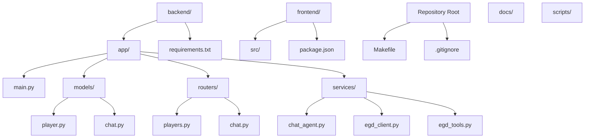
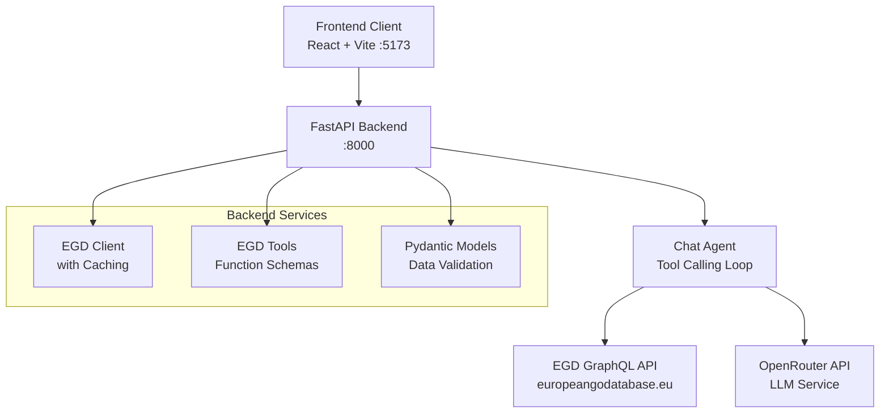
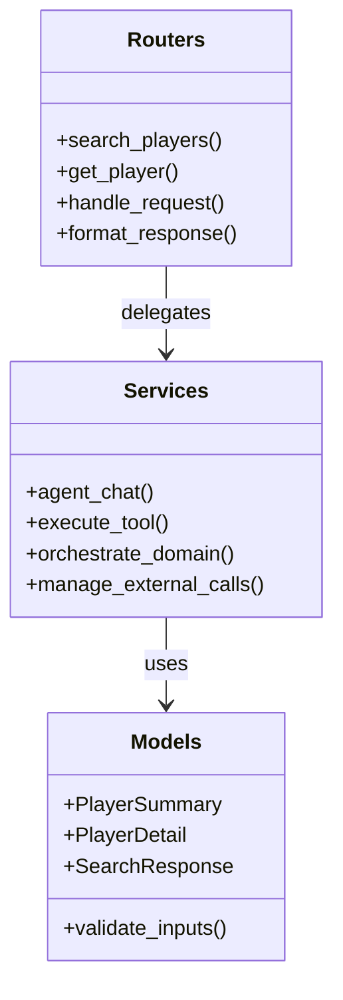
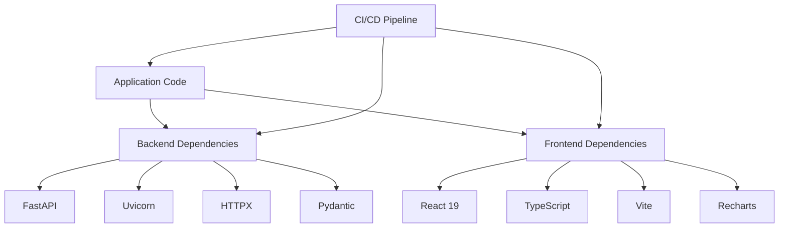

# Development Guidelines

<cite>
**Referenced Files in This Document**
- [Makefile](file://Makefile)
- [.gitignore](file://.gitignore)
- [README.md](file://README.md)
- [backend/app/main.py](file://backend/app/main.py)
- [backend/requirements.txt](file://backend/requirements.txt)
- [backend/app/models/player.py](file://backend/app/models/player.py)
- [backend/app/routers/players.py](file://backend/app/routers/players.py)
- [backend/app/services/chat_agent.py](file://backend/app/services/chat_agent.py)
</cite>

## Update Summary
**Changes Made**
- Added comprehensive Makefile development workflow documentation with all available targets
- Enhanced project structure documentation showing complete backend organization with routers, services, and models
- Updated contribution workflow section with standardized development practices
- Added detailed environment configuration based on actual .env requirements
- Expanded testing framework documentation aligned with current project setup

## Table of Contents
1. [Introduction](#introduction)
2. [Project Structure](#project-structure)
3. [Development Workflow](#development-workflow)
4. [Core Components](#core-components)
5. [Architecture Overview](#architecture-overview)
6. [Detailed Component Analysis](#detailed-component-analysis)
7. [Dependency Management](#dependency-management)
8. [Environment Configuration](#environment-configuration)
9. [Testing Framework](#testing-framework)
10. [Code Quality and Standards](#code-quality-and-standards)
11. [Performance Considerations](#performance-considerations)
12. [Troubleshooting Guide](#troubleshooting-guide)
13. [Conclusion](#conclusion)
14. [Appendices](#appendices)

## Introduction
This document provides comprehensive development guidelines for the GoNow project. It covers coding standards, file naming conventions, project structure organization, contribution workflow, version control practices, code review processes, debugging strategies, logging best practices, monitoring approaches, deployment procedures, environment configuration, infrastructure requirements, security considerations, vulnerability scanning, compliance requirements, troubleshooting guides, performance profiling and optimization techniques, and testing framework setup and conventions across all layers.

The repository now features a standardized development workflow with Makefile targets, a complete backend organization with routers, services, and models, and enhanced project documentation. The guidelines below reflect the current mature state of the GoNow full-stack application.

## Project Structure
The GoNow project follows a well-organized full-stack architecture:



**Diagram sources**
- [Makefile:1-54](file://Makefile#L1-L54)
- [backend/app/main.py:1-42](file://backend/app/main.py#L1-L42)
- [backend/app/models/player.py:1-60](file://backend/app/models/player.py#L1-L60)
- [backend/app/routers/players.py:1-107](file://backend/app/routers/players.py#L1-L107)
- [backend/app/services/chat_agent.py:1-154](file://backend/app/services/chat_agent.py#L1-L154)

**Section sources**
- [README.md:57-90](file://README.md#L57-L90)
- [Makefile:1-54](file://Makefile#L1-L54)

## Development Workflow
The project uses a standardized development workflow centered around Makefile targets for consistent development experience across different environments.

### Quick Start Commands
```bash
make install     # Create venv + install all dependencies (BE & FE)
make dev         # Start both backend (:8000) and frontend (:5173)
make stop        # Kill both servers
```

### Available Make Targets

| Command | Description | Target Type |
|---------|-------------|-------------|
| `make help` | Show all available commands | Help |
| `make install` | Install backend (venv) + frontend (npm) deps | Installation |
| `make install-be` | Create venv and install backend dependencies | Installation |
| `make install-fe` | Install frontend npm dependencies | Installation |
| `make dev` | Start both BE + FE in separate windows | Development |
| `make dev-be` | Start backend only (foreground) | Development |
| `make dev-fe` | Start frontend only (foreground) | Development |
| `make stop` | Kill all GoNow dev servers | Process Management |
| `make build` | Build frontend for production | Build |
| `make clean` | Remove venv, node_modules, dist | Cleanup |

### Development Environment Setup
The Makefile handles:
- Python virtual environment creation and management
- Backend dependency installation via pip
- Frontend dependency installation via npm
- Concurrent development server startup
- Cross-platform process management (Windows-specific taskkill integration)

**Section sources**
- [Makefile:1-54](file://Makefile#L1-L54)
- [README.md:101-122](file://README.md#L101-L122)

## Core Components
The backend follows a layered architecture with clear separation of concerns:

### Models Layer (`backend/app/models/`)
Pure domain definitions and Pydantic response schemas:
- **player.py**: Player data structures including `PlayerSummary`, `TournamentInfo`, `PlacementInfo`, `PlayerDetail`, and `SearchResponse`
- **chat.py**: Chat request/response models for AI interactions

### Routers Layer (`backend/app/routers/`)
Thin controllers that handle HTTP requests and delegate to services:
- **players.py**: Player-related endpoints (`/api/search`, `/api/player/{pin}`, etc.)
- **chat.py**: Agentic chat endpoint (`/api/chat`)

### Services Layer (`backend/app/services/`)
Rich business logic and external integrations:
- **chat_agent.py**: OpenRouter tool-calling agent loop implementation
- **egd_client.py**: European Go Database API client with caching
- **egd_tools.py**: EGD operations exposed as OpenAI-compatible tool schemas

### Application Entry Point
- **main.py**: FastAPI application initialization, CORS configuration, router mounting, and health check endpoints

**Section sources**
- [backend/app/models/player.py:1-60](file://backend/app/models/player.py#L1-L60)
- [backend/app/routers/players.py:1-107](file://backend/app/routers/players.py#L1-L107)
- [backend/app/services/chat_agent.py:1-154](file://backend/app/services/chat_agent.py#L1-L154)
- [backend/app/main.py:1-42](file://backend/app/main.py#L1-L42)

## Architecture Overview
GoNow implements a modern full-stack architecture with agentic AI capabilities:



**Diagram sources**
- [backend/app/main.py:14-31](file://backend/app/main.py#L14-L31)
- [backend/app/services/chat_agent.py:30-41](file://backend/app/services/chat_agent.py#L30-L41)
- [backend/app/routers/players.py:8-40](file://backend/app/routers/players.py#L8-L40)

## Detailed Component Analysis

### Backend Package Organization
The backend follows strict module boundaries:

#### Models Module
- Pure domain definitions without business logic
- Pydantic models for request/response validation
- Type-safe data contracts between components

#### Routers Module  
- Thin controllers handling HTTP concerns
- Input validation using FastAPI Query parameters
- Error handling and response formatting
- Delegation to service layer for business logic

#### Services Module
- Rich business logic implementation
- External API integration (EGD, OpenRouter)
- Tool execution orchestration
- Caching and performance optimizations



**Diagram sources**
- [backend/app/models/player.py:6-60](file://backend/app/models/player.py#L6-L60)
- [backend/app/routers/players.py:8-107](file://backend/app/routers/players.py#L8-L107)
- [backend/app/services/chat_agent.py:30-154](file://backend/app/services/chat_agent.py#L30-L154)

### Contribution Workflow and Version Control Practices
Standardized development workflow with Makefile-driven processes:

#### Branching Strategy
- **main**: Stable release branch
- **develop**: Integration branch for features  
- **feature/***: Feature branches derived from develop
- **hotfix/***: Hotfixes derived from main
- **release/***: Release preparation branches

#### Commit Hygiene
- Use clear, imperative commit messages
- Keep commits atomic and self-contained
- Reference issue numbers when applicable
- Follow conventional commit format

#### Pull Request Process
- Provide context, motivation, and test coverage notes
- Ensure all Makefile targets pass (`make install`, `make dev`)
- Verify both backend and frontend functionality
- Request reviews from at least one maintainer

**Section sources**
- [Makefile:1-54](file://Makefile#L1-L54)

### Code Review Process
Automated quality gates and manual review checklist:

#### Automated Checks
- Linting: Python (flake8/black), TypeScript (Oxlint)
- Type checking: Pydantic models, TypeScript compilation
- Tests: Unit tests, integration tests, API endpoint tests
- Security scans: Dependency vulnerability checks

#### Review Checklist
- Correctness and edge cases covered
- Readability and maintainability
- Performance implications considered
- Security posture reviewed
- Documentation updated if needed
- Makefile targets still functional

#### Feedback Etiquette
- Be constructive and specific
- Suggest alternatives rather than just pointing out issues
- Focus on code quality and team consistency

### Debugging Strategies
Structured debugging approach for full-stack development:

#### Backend Debugging
- Structured logging with correlation IDs
- FastAPI debug mode with automatic reload
- Interactive debugging with breakpoints
- API testing with curl or Postman

#### Frontend Debugging  
- React DevTools for component inspection
- Network tab for API call analysis
- Console logging with structured formats
- Source maps for TypeScript debugging

#### Cross-Component Debugging
- Request tracing from frontend to backend
- Shared correlation IDs for distributed debugging
- Log aggregation and centralized monitoring

### Logging Best Practices
Consistent logging patterns across the stack:

#### Backend Logging
- Structured JSON logs with timestamps
- Contextual metadata without sensitive data
- Proper log levels (DEBUG, INFO, WARN, ERROR)
- Request correlation IDs for tracing

#### Frontend Logging
- User action tracking
- Error boundary logging
- Performance metrics collection
- Analytics event tracking

### Monitoring Approaches
Comprehensive observability strategy:

#### Metrics Collection
- API latency and throughput metrics
- Error rates and exception tracking
- Resource utilization (CPU, memory, disk)
- Business KPIs (user engagement, feature usage)

#### Alerting and Dashboards
- Threshold-based alerts for anomalies
- Real-time dashboards for system health
- Business metric visualization
- Incident response automation

**Section sources**
- [backend/app/main.py:34-42](file://backend/app/main.py#L34-L42)
- [backend/app/services/chat_agent.py:1-154](file://backend/app/services/chat_agent.py#L1-L154)

### Deployment Procedures
Production-ready deployment pipeline:

#### Build Process
- Pin dependencies and produce reproducible artifacts
- Generate SBOM and checksums
- Multi-stage Docker builds with minimal base images
- Image vulnerability scanning

#### Containerization
- Separate containers for backend and frontend
- Health check endpoints for orchestration
- Resource limits and readiness probes
- Secret management via environment variables

#### Orchestration
- Blue/green or canary deployments
- Automated rollback on failure
- Load balancing and scaling policies
- Database migration strategies

### Environment Configuration
Centralized configuration management:

#### Environment Variables
All configuration lives in `backend/.env`:

| Variable | Description | Default | Required |
|----------|-------------|---------|----------|
| `EGD_API_TOKEN` | EGD GraphQL API bearer token | - | Yes |
| `OPENROUTER_API_KEY` | OpenRouter API key for AI chat | - | No |
| `CHAT_MODEL` | OpenRouter model ID for chat | `google/gemini-2.0-flash-001` | No |
| `CHAT_MAX_ITERATIONS` | Max tool-calling iterations per chat turn | `3` | No |

#### Model Options
- `google/gemini-2.0-flash-001` — Fast, cheap, supports tool calling (default)
- `openai/gpt-4o-mini` — Good balance of speed and quality  
- `anthropic/claude-3.5-sonnet` — Higher quality, slower/more expensive

#### Configuration Management
- Separate config from code
- Environment-specific configurations
- Secret rotation and audit trails
- Configuration validation on startup

**Section sources**
- [README.md:139-154](file://README.md#L139-L154)
- [backend/app/main.py:8-10](file://backend/app/main.py#L8-L10)

### Infrastructure Requirements
System requirements and dependencies:

#### Runtime Requirements
- **Python 3.14+** for backend
- **Node.js 18+** and npm for frontend
- **GNU Make** for development orchestration
- **Docker** (optional) for containerization

#### Database and Storage
- No persistent database required (stateless design)
- File-based caching for development
- Redis or similar for production caching

#### External Dependencies
- **EGD GraphQL API** access with valid token
- **OpenRouter API** for AI chat functionality
- Rate limiting and circuit breaker patterns

**Section sources**
- [backend/requirements.txt:1-6](file://backend/requirements.txt#L1-L6)
- [README.md:94-99](file://README.md#L94-L99)

### Security Considerations
Comprehensive security posture:

#### Input Validation and Sanitization
- Pydantic models for request validation
- Parameter sanitization in API endpoints
- SQL injection prevention (if using databases)
- XSS protection in frontend

#### Authentication and Authorization
- API key management for external services
- JWT tokens for user authentication (future)
- Role-based access control (RBAC)
- Session management and security headers

#### Least Privilege and Secrets Management
- Service account isolation
- Secret rotation policies
- Audit trails for sensitive operations
- Environment variable encryption

### Vulnerability Scanning and Compliance
Automated security scanning and compliance:

#### Static Analysis
- Python linting and type checking
- TypeScript compilation and linting
- Dependency vulnerability scanning
- Code quality metrics

#### Dynamic Analysis
- API endpoint security testing
- Penetration testing for staging environments
- DAST against deployed applications
- Security regression testing

#### Compliance Requirements
- GDPR compliance for user data
- SOC 2 controls for enterprise deployments
- Regular security audits and remediation tracking
- Evidence collection for compliance reporting

### Troubleshooting Guides
Common development issues and resolutions:

#### Environment Setup Issues
- **Missing Python/Node versions**: Use version managers (pyenv, nvm)
- **Permission errors**: Check file permissions and ownership
- **Port conflicts**: Change default ports in Makefile or environment
- **Network timeouts**: Configure proxy settings and firewall rules

#### Development Server Issues
- **Backend not starting**: Check `.env` file and API keys
- **Frontend build failures**: Clear cache and reinstall dependencies
- **CORS errors**: Verify allowed origins in backend configuration
- **Hot reload not working**: Check file watcher settings

#### Production Deployment Issues
- **Container startup failures**: Validate environment variables
- **Database connection problems**: Check network connectivity and credentials
- **Memory leaks**: Monitor resource usage and optimize queries
- **Scaling issues**: Tune worker pools and connection limits

### Performance Profiling and Optimization
Systematic performance improvement approach:

#### Profiling Tools
- **Backend**: cProfile, memory profilers, APM tools
- **Frontend**: Chrome DevTools, Lighthouse, WebPageTest
- **Database**: Query profiling and slow query logs
- **Network**: API response time analysis

#### Optimization Strategies
- **Caching**: Implement Redis caching for frequently accessed data
- **Database**: Optimize queries and add appropriate indexes
- **CDN**: Serve static assets through content delivery networks
- **Compression**: Enable gzip/brotli compression for responses

#### Concurrency and Scaling
- **Async I/O**: Leverage FastAPI's async capabilities
- **Connection pooling**: Optimize database and API connections
- **Load balancing**: Distribute traffic across multiple instances
- **Auto-scaling**: Configure horizontal scaling policies

### Testing Framework
Comprehensive testing strategy across all layers:

#### Unit Testing
- **Backend**: pytest with FastAPI test client
- **Frontend**: Jest with React Testing Library
- **Models**: Pydantic model validation tests
- **Services**: Mock external dependencies

#### Integration Testing
- **API Endpoints**: Full request/response cycle testing
- **Database Integration**: Test data persistence and queries
- **External APIs**: Mock EGD and OpenRouter responses
- **Cross-service Communication**: Test inter-service calls

#### End-to-End Testing
- **User Journeys**: Complete feature workflows
- **Browser Automation**: Playwright or Cypress for UI testing
- **Performance Testing**: Load and stress testing
- **Security Testing**: Vulnerability scanning and penetration testing

#### Test Coverage and Quality
- Minimum 80% code coverage requirement
- Automated test execution in CI/CD pipeline
- Test result reporting and trend analysis
- Regression testing for critical paths

**Section sources**
- [backend/app/models/player.py:1-60](file://backend/app/models/player.py#L1-L60)
- [backend/app/routers/players.py:1-107](file://backend/app/routers/players.py#L1-L107)

## Dependency Management
Current dependency structure and management:

### Backend Dependencies (`backend/requirements.txt`)
- **fastapi>=0.115**: High-performance web framework
- **uvicorn[standard]>=0.34**: ASGI server with standard extras
- **httpx>=0.28**: Modern HTTP client library
- **python-dotenv>=1.1**: Environment variable management
- **pydantic>=2.11**: Data validation and serialization

### Frontend Dependencies
- **React 19**: Latest React version with concurrent features
- **TypeScript**: Type safety and developer experience
- **Vite**: Fast build tool and development server
- **Recharts**: Chart visualization library
- **TanStack Query**: Data fetching and caching

### Dependency Management Best Practices
- Explicit version pinning in dependency manifests
- Regular updates and automated security advisories
- Clear separation between runtime and dev/test dependencies
- Lock files for reproducible builds



**Diagram sources**
- [backend/requirements.txt:1-6](file://backend/requirements.txt#L1-L6)
- [README.md:14-22](file://README.md#L14-L22)

**Section sources**
- [backend/requirements.txt:1-6](file://backend/requirements.txt#L1-L6)
- [README.md:14-22](file://README.md#L14-L22)

## Performance Considerations
Optimization strategies for production workloads:

### Backend Performance
- Profile early and often during development
- Benchmark critical paths and monitor regressions
- Prefer streaming for large payloads
- Use connection pooling and async I/O where appropriate
- Implement efficient caching strategies

### Frontend Performance
- Code splitting and lazy loading
- Image optimization and CDN usage
- Bundle size analysis and optimization
- Performance budget enforcement

### Database and API Performance
- Query optimization and indexing
- Connection pooling and retry policies
- Rate limiting and circuit breakers
- Response compression and caching

## Troubleshooting Guide
Systematic approach to problem resolution:

### Development Environment
- Reproduce locally with realistic data
- Capture logs and metrics around failures
- Isolate changes using bisecting commits
- Validate environment parity across stages

### Production Issues
- Monitor error rates and performance metrics
- Analyze logs and traces for patterns
- Roll back recent changes if necessary
- Scale resources temporarily if needed

### Common Patterns
- **Memory leaks**: Monitor heap usage and identify growing objects
- **Slow queries**: Analyze execution plans and add indexes
- **Network timeouts**: Tune timeout values and implement retries
- **Disk space**: Monitor usage and implement log rotation

## Conclusion
These development guidelines provide a comprehensive foundation for building, reviewing, deploying, and operating the GoNow project reliably and securely. The standardized Makefile workflow ensures consistent development experiences, while the layered backend architecture promotes maintainability and scalability. Adopt these practices incrementally as the codebase grows, ensuring consistency, quality, and maintainability across teams and environments.

The project's mature structure with clear separation of concerns, comprehensive testing strategies, and robust deployment procedures positions it well for continued growth and evolution.

## Appendices

### Appendix A: File Naming Conventions
- **Modules**: snake_case.py (Python)
- **Classes**: PascalCase (Python/TypeScript)
- **Functions and variables**: snake_case (Python), camelCase (TypeScript)
- **Tests**: *_test.py or test_*.py (Python), *.test.ts (TypeScript)
- **Config files**: kebab-case.env or YAML/JSON variants
- **Components**: PascalCase.tsx (React)

### Appendix B: Example Directory Layout
```
GoNow/
├── backend/
│   ├── app/
│   │   ├── models/          # Pydantic data models
│   │   ├── routers/         # FastAPI route handlers
│   │   ├── services/        # Business logic and external integrations
│   │   └── main.py          # Application entry point
│   ├── .venv/               # Python virtual environment
│   ├── requirements.txt     # Python dependencies
│   └── .env                 # Environment configuration
├── frontend/
│   ├── src/
│   │   ├── api/             # API client and types
│   │   ├── components/      # React components
│   │   ├── pages/           # Page components
│   │   ├── hooks/           # Custom React hooks
│   │   └── App.tsx          # Root component
│   └── package.json         # Node.js dependencies
├── scripts/                 # Utility and automation scripts
├── docs/                    # Project documentation
├── Makefile                 # Development orchestration
└── .gitignore              # Version control exclusions
```

### Appendix C: Makefile Target Reference
Complete reference for all available development commands:

| Category | Command | Description |
|----------|---------|-------------|
| **Help** | `make help` | Display all available commands |
| **Installation** | `make install` | Install all dependencies (backend + frontend) |
| | `make install-be` | Create Python venv and install backend dependencies |
| | `make install-fe` | Install frontend npm dependencies |
| **Development** | `make dev` | Start both backend and frontend servers |
| | `make dev-be` | Start backend development server only |
| | `make dev-fe` | Start frontend development server only |
| **Process Management** | `make stop` | Kill all running development servers |
| **Build** | `make build` | Build frontend for production deployment |
| **Cleanup** | `make clean` | Remove build artifacts and virtual environments |

### Appendix D: Environment Variables Reference
Complete list of configurable environment variables:

| Variable | Type | Default | Description |
|----------|------|---------|-------------|
| `EGD_API_TOKEN` | string | *(required)* | European Go Database API authentication token |
| `OPENROUTER_API_KEY` | string | *(optional)* | OpenRouter API key for AI chat functionality |
| `CHAT_MODEL` | string | `google/gemini-2.0-flash-001` | OpenRouter model identifier for chat responses |
| `CHAT_MAX_ITERATIONS` | integer | `3` | Maximum number of tool-calling iterations per conversation |

**Section sources**
- [README.md:139-154](file://README.md#L139-L154)
- [Makefile:1-54](file://Makefile#L1-L54)
- [.gitignore:1-39](file://.gitignore#L1-L39)