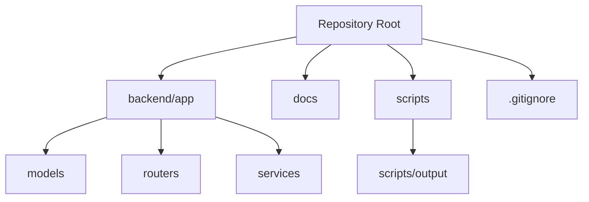
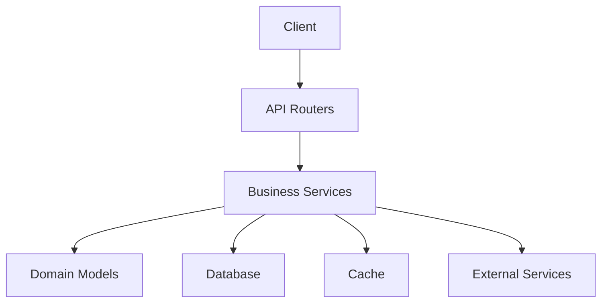
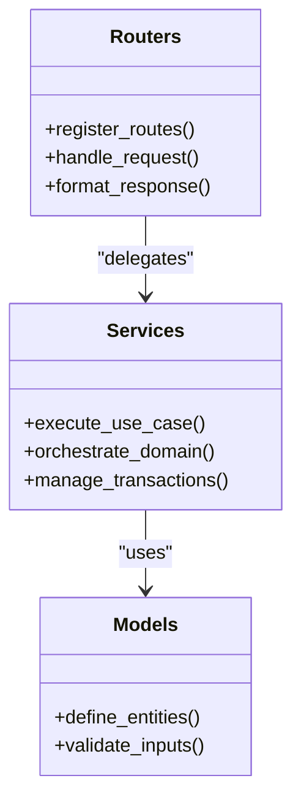
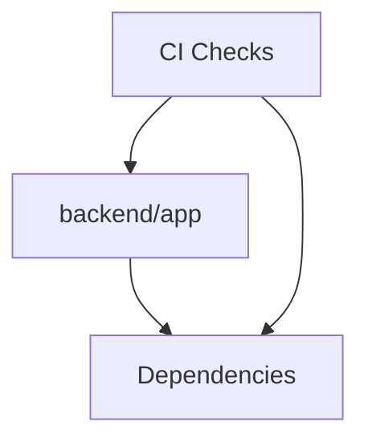

# Development Guidelines

<cite>
**Referenced Files in This Document**
- [.gitignore](file://.gitignore)
</cite>

## Table of Contents
1. [Introduction](#introduction)
2. [Project Structure](#project-structure)
3. [Core Components](#core-components)
4. [Architecture Overview](#architecture-overview)
5. [Detailed Component Analysis](#detailed-component-analysis)
6. [Dependency Analysis](#dependency-analysis)
7. [Performance Considerations](#performance-considerations)
8. [Troubleshooting Guide](#troubleshooting-guide)
9. [Conclusion](#conclusion)
10. [Appendices](#appendices)

## Introduction
This document provides comprehensive development guidelines for the GoNow project. It covers coding standards, file naming conventions, project structure organization, contribution workflow, version control practices, code review processes, debugging strategies, logging best practices, monitoring approaches, deployment procedures, environment configuration, infrastructure requirements, security considerations, vulnerability scanning, compliance requirements, troubleshooting guides, performance profiling and optimization techniques, and testing framework setup and conventions across all layers.

The repository currently exposes a minimal backend layout with Python package scaffolding and a .gitignore that defines local artifacts to exclude from version control. The guidelines below are designed to be adopted as the project evolves into a full application stack.

## Project Structure
At present, the repository contains:
- A backend scaffold organized by feature areas (models, routers, services).
- A .gitignore that excludes common local artifacts, environment files, IDE settings, OS-specific files, generated data, and logs.

Recommended top-level organization:
- backend/app: Python application package
  - models: Data models and persistence schemas
  - routers: HTTP route handlers and request/response mapping
  - services: Business logic and orchestration
- docs: Project documentation and runbooks
- scripts: Automation and utility scripts
- scripts/output: Generated outputs excluded from version control



**Diagram sources**
- [.gitignore:1-37](file://.gitignore#L1-L37)

**Section sources**
- [.gitignore:1-37](file://.gitignore#L1-L37)

## Core Components
As the project matures, organize core components within the backend/app package:
- Models: Define domain entities, validation rules, and database mappings.
- Routers: Implement API endpoints, input validation, error handling, and response formatting.
- Services: Encapsulate business logic, external integrations, and cross-cutting concerns.

Guidelines:
- Keep each module focused on a single responsibility.
- Prefer small, composable functions and classes over monolithic modules.
- Use explicit interfaces or abstract base classes where multiple implementations are expected.
- Centralize configuration access via a dedicated config module.

[No sources needed since this section provides general guidance]

## Architecture Overview
A recommended layered architecture for the backend:
- Presentation Layer (Routers): Accepts requests, validates inputs, delegates to services, formats responses.
- Application Layer (Services): Implements use cases, orchestrates domain operations, handles transactions.
- Domain Layer (Models): Encapsulates domain concepts, invariants, and persistence contracts.
- Infrastructure Layer: Database drivers, message brokers, external APIs, caching, and storage.



[No sources needed since this diagram shows conceptual architecture, not actual code structure]

## Detailed Component Analysis

### Backend Package Organization
Adopt consistent module boundaries:
- models: Pure domain definitions and persistence contracts.
- routers: Thin controllers that parse requests and call services.
- services: Rich business logic; avoid direct I/O except through repositories/clients.



[No sources needed since this diagram shows conceptual component relationships]

### Contribution Workflow and Version Control Practices
- Branching strategy:
  - main: Stable release branch.
  - develop: Integration branch for features.
  - feature/*: Feature branches derived from develop.
  - hotfix/*: Hotfixes derived from main.
  - release/*: Release preparation branches.
- Commit hygiene:
  - Use clear, imperative commit messages.
  - Keep commits atomic and self-contained.
  - Reference issue numbers when applicable.
- Pull requests:
  - Provide context, motivation, and test coverage notes.
  - Ensure CI passes before requesting reviews.
  - Request reviews from at least one maintainer.

[No sources needed since this section provides general guidance]

### Code Review Process
- Automated checks: Linting, type checking, tests, and security scans must pass.
- Review checklist:
  - Correctness and edge cases covered.
  - Readability and maintainability.
  - Performance implications considered.
  - Security posture reviewed.
  - Documentation updated if needed.
- Feedback etiquette:
  - Be constructive and specific.
  - Suggest alternatives rather than just pointing out issues.

[No sources needed since this section provides general guidance]

### Debugging Strategies
- Structured logging:
  - Include correlation IDs for request tracing.
  - Log contextual metadata without sensitive data.
- Local debugging:
  - Use breakpoints and interactive debuggers.
  - Enable verbose logs selectively for problematic flows.
- Remote debugging:
  - Securely expose debug ports only in controlled environments.
  - Rotate secrets and restrict access.

[No sources needed since this section provides general guidance]

### Logging Best Practices
- Levels:
  - DEBUG: Detailed diagnostic information.
  - INFO: Normal operational events.
  - WARN: Potentially harmful situations.
  - ERROR: Errors that prevent a function from completing.
- Content:
  - Avoid PII and secrets.
  - Include timestamps, service name, and trace IDs.
- Output:
  - Ship structured JSON logs to centralized collectors.

[No sources needed since this section provides general guidance]

### Monitoring Approaches
- Metrics:
  - Expose key KPIs (latency, throughput, error rates).
  - Instrument critical paths and external calls.
- Alerts:
  - Define thresholds for anomalies.
  - Route alerts to appropriate channels.
- Dashboards:
  - Visualize system health and business metrics.

[No sources needed since this section provides general guidance]

### Deployment Procedures
- Build:
  - Pin dependencies and produce reproducible artifacts.
  - Generate SBOM and checksums.
- Containerization:
  - Use multi-stage builds and minimal base images.
  - Scan images for vulnerabilities.
- Orchestration:
  - Define resource limits and readiness/liveness probes.
  - Manage secrets via secure vaults.
- Rollouts:
  - Use blue/green or canary deployments.
  - Automate rollback on failure.

[No sources needed since this section provides general guidance]

### Environment Configuration
- Configuration management:
  - Separate config from code.
  - Use environment variables and secret managers.
- Environments:
  - dev, staging, prod with distinct configurations.
- Secrets:
  - Never commit secrets; use .env.local ignored by version control.

**Section sources**
- [.gitignore:12-15](file://.gitignore#L12-L15)

### Infrastructure Requirements
- Runtime:
  - Supported language runtime versions.
  - Required system libraries.
- Databases and caches:
  - Version compatibility matrix.
  - Connection pooling and retry policies.
- External services:
  - Rate limits and circuit breakers.
  - Fallback behaviors.

[No sources needed since this section provides general guidance]

### Security Considerations
- Input validation and sanitization.
- Authentication and authorization enforcement.
- Least privilege for service accounts.
- Dependency vulnerability scanning and updates.
- Secret rotation and audit trails.

[No sources needed since this section provides general guidance]

### Vulnerability Scanning and Compliance
- Static analysis:
  - Integrate linters and SAST tools in CI.
- Dynamic analysis:
  - Run DAST against staging endpoints.
- Compliance:
  - Maintain evidence of controls.
  - Regular audits and remediation tracking.

[No sources needed since this section provides general guidance]

### Troubleshooting Guides
Common issues and resolutions:
- Missing environment variables:
  - Validate required keys exist and are non-empty.
- Dependency conflicts:
  - Lock versions and resolve incompatibilities.
- Network timeouts:
  - Tune timeouts and retries; check firewall rules.
- Disk space:
  - Monitor disk usage and rotate logs.

[No sources needed since this section provides general guidance]

### Performance Profiling and Optimization
- Profiling:
  - Use CPU and memory profilers to identify hotspots.
- Bottlenecks:
  - Optimize queries and reduce allocations.
- Caching:
  - Cache expensive computations and reads.
- Concurrency:
  - Tune worker pools and backpressure.

[No sources needed since this section provides general guidance]

### Testing Framework Setup and Conventions
- Unit tests:
  - Isolate logic with mocks and fakes.
  - Follow Arrange-Act-Assert pattern.
- Integration tests:
  - Spin up test databases and services.
  - Use fixtures and factories.
- End-to-end tests:
  - Validate user journeys in staging-like environments.
- Coverage:
  - Set minimum thresholds and report in CI.

[No sources needed since this section provides general guidance]

## Dependency Analysis
Current repository state indicates a minimal Python backend scaffold. As dependencies are added, ensure:
- Explicit version pinning in dependency manifests.
- Regular updates and automated security advisories.
- Clear separation between runtime and dev/test dependencies.



[No sources needed since this diagram shows conceptual dependency flow]

**Section sources**
- [.gitignore:1-37](file://.gitignore#L1-L37)

## Performance Considerations
- Profile early and often during development.
- Benchmark critical paths and regressions.
- Prefer streaming for large payloads.
- Use connection pooling and async I/O where appropriate.

[No sources needed since this section provides general guidance]

## Troubleshooting Guide
- Reproduce locally with realistic data.
- Capture logs and metrics around failures.
- Isolate changes using bisecting commits.
- Validate environment parity across stages.

[No sources needed since this section provides general guidance]

## Conclusion
These development guidelines provide a foundation for building, reviewing, deploying, and operating the GoNow project reliably and securely. Adopt them incrementally as the codebase grows, ensuring consistency, quality, and maintainability across teams and environments.

[No sources needed since this section summarizes without analyzing specific files]

## Appendices

### Appendix A: File Naming Conventions
- Modules: snake_case.py
- Classes: PascalCase
- Functions and variables: snake_case
- Tests: *_test.py or test_*.py
- Config files: kebab-case.env or YAML/JSON variants

[No sources needed since this section provides general guidance]

### Appendix B: Example Directory Layout
```
backend/app/
  models/
  routers/
  services/
docs/
scripts/
  output/
.gitignore
```

[No sources needed since this section provides general guidance]