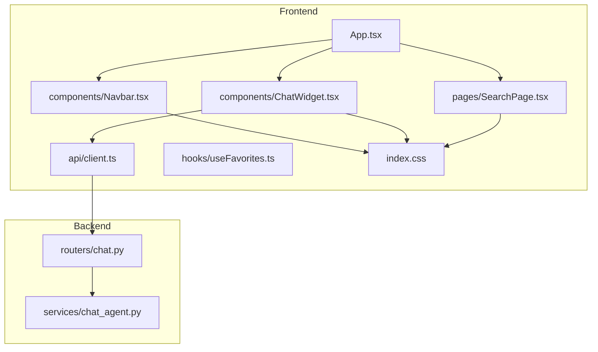
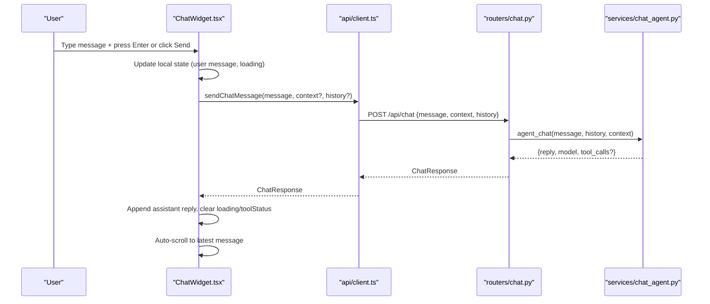
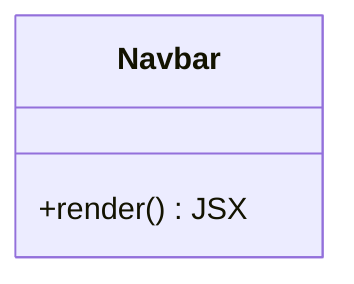
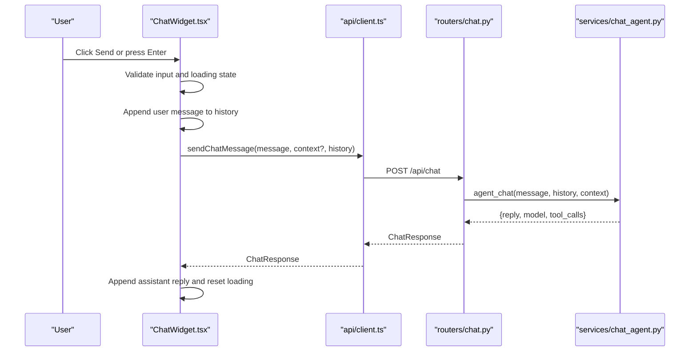
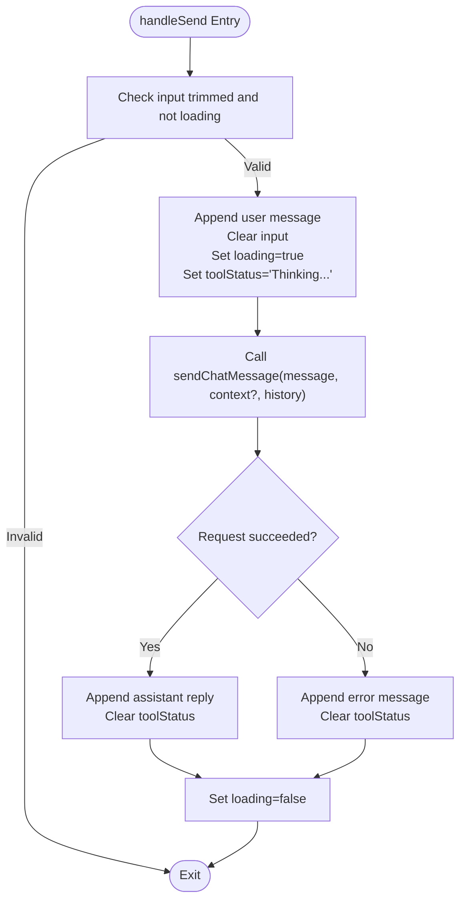
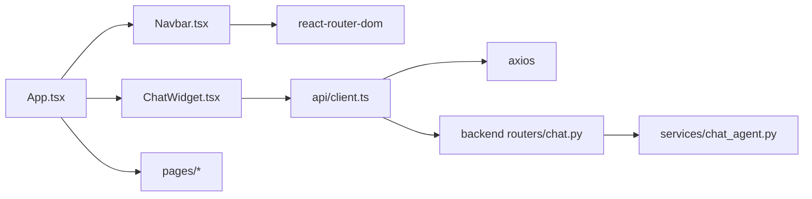

# Core Components

<cite>
**Referenced Files in This Document**
- [Navbar.tsx](file://frontend/src/components/Navbar.tsx)
- [ChatWidget.tsx](file://frontend/src/components/ChatWidget.tsx)
- [App.tsx](file://frontend/src/App.tsx)
- [client.ts](file://frontend/src/api/client.ts)
- [index.css](file://frontend/src/index.css)
- [SearchPage.tsx](file://frontend/src/pages/SearchPage.tsx)
- [useFavorites.ts](file://frontend/src/hooks/useFavorites.ts)
- [chat_agent.py](file://backend/app/services/chat_agent.py)
- [chat.py](file://backend/app/routers/chat.py)
</cite>

## Table of Contents
1. [Introduction](#introduction)
2. [Project Structure](#project-structure)
3. [Core Components](#core-components)
4. [Architecture Overview](#architecture-overview)
5. [Detailed Component Analysis](#detailed-component-analysis)
6. [Dependency Analysis](#dependency-analysis)
7. [Performance Considerations](#performance-considerations)
8. [Troubleshooting Guide](#troubleshooting-guide)
9. [Conclusion](#conclusion)
10. [Appendices](#appendices)

## Introduction
This document provides comprehensive documentation for the reusable UI components Navbar and ChatWidget. It covers component props, state management, event handling, integration patterns, navigation system implementation, chat widget functionality with AI integration, responsive design considerations, usage examples, customization options, and styling approaches. The goal is to make these components easy to understand, integrate, and extend across the application.

## Project Structure
The frontend organizes reusable UI logic into dedicated component files under src/components, integrates them at the app root via App.tsx, and uses a typed API client for backend communication. Global styles and theme variables are defined in index.css. Pages consume these components and provide page-specific behavior.

**Diagram sources**
- [App.tsx:18-36](file://frontend/src/App.tsx#L18-L36)
- [Navbar.tsx:1-35](file://frontend/src/components/Navbar.tsx#L1-35)
- [ChatWidget.tsx:1-150](file://frontend/src/components/ChatWidget.tsx#L1-150)
- [client.ts:74-85](file://frontend/src/api/client.ts#L74-L85)
- [chat.py:9-24](file://backend/app/routers/chat.py#L9-L24)
- [chat_agent.py:30-153](file://backend/app/services/chat_agent.py#L30-L153)

**Section sources**
- [App.tsx:18-36](file://frontend/src/App.tsx#L18-L36)
- [index.css:7-21](file://frontend/src/index.css#L7-L21)

## Core Components
- Navbar: A sticky top navigation bar with logo and links. Uses React Router’s NavLink for active state styling and inline CSS variables for theming.
- ChatWidget: A floating chat assistant that opens a chat window, manages conversation history, sends messages to the backend AI service, and renders user and assistant messages with quick prompts and loading indicators.

Key responsibilities:
- Navbar: Navigation rendering and active link highlighting.
- ChatWidget: Local state for open/close, input, messages, loading, tool status; keyboard and click events; API calls; auto-scroll; error handling.

**Section sources**
- [Navbar.tsx:1-35](file://frontend/src/components/Navbar.tsx#L1-35)
- [ChatWidget.tsx:1-150](file://frontend/src/components/ChatWidget.tsx#L1-150)

## Architecture Overview
The chat flow connects the ChatWidget to the backend chat router and agentic chat service. The frontend maintains message history and displays responses. The backend optionally executes tools (e.g., EGD queries) before returning a final answer.

**Diagram sources**
- [ChatWidget.tsx:16-37](file://frontend/src/components/ChatWidget.tsx#L16-L37)
- [client.ts:74-85](file://frontend/src/api/client.ts#L74-L85)
- [chat.py:9-24](file://backend/app/routers/chat.py#L9-L24)
- [chat_agent.py:30-153](file://backend/app/services/chat_agent.py#L30-L153)

## Detailed Component Analysis

### Navbar
- Purpose: Provide global navigation with active link highlighting and Go-themed branding.
- Props: None (stateless).
- State: None.
- Event Handling: Relies on React Router’s NavLink for routing and active style injection.
- Styling: Inline styles using CSS variables from index.css for consistent theming.
- Integration: Rendered once in App.tsx above Routes.

Usage example:
- Import and render <Navbar /> inside your layout or App shell.

Customization options:
- Add more NavLink entries by duplicating existing link blocks.
- Adjust colors and spacing via CSS variables in index.css or by overriding inline styles.

Responsive considerations:
- The nav container centers content and uses flexbox; consider adding a mobile menu for small screens if needed.

**Section sources**
- [Navbar.tsx:1-35](file://frontend/src/components/Navbar.tsx#L1-35)
- [Navbar.tsx:37-94](file://frontend/src/components/Navbar.tsx#L37-L94)
- [index.css:7-21](file://frontend/src/index.css#L7-L21)
- [App.tsx:23-23](file://frontend/src/App.tsx#L23-L23)

#### Class Diagram

**Diagram sources**
- [Navbar.tsx:1-35](file://frontend/src/components/Navbar.tsx#L1-35)

### ChatWidget
- Purpose: Floating chat assistant integrated with AI backend for Go analytics.
- Props: None (stateless).
- State:
  - isOpen: boolean controlling visibility.
  - input: string for current message text.
  - messages: array of ChatMessage objects representing conversation history.
  - loading: boolean indicating pending request.
  - toolStatus: string showing intermediate tool execution status.
- Effects:
  - Auto-scrolls to bottom when messages change.
- Events:
  - Click FAB to open chat.
  - Close button to hide chat.
  - Input onChange updates input state.
  - Keyboard Enter triggers send (Shift+Enter not handled here).
  - Quick prompt buttons set input value.
  - Send button triggers handleSend.
- Data Flow:
  - On send, append user message locally, set loading and toolStatus, call sendChatMessage with message, optional context, and current history.
  - On success, append assistant reply; on error, append an error message.
  - Clear loading and toolStatus in finally block.
- Styling:
  - Fixed-position floating action button and chat window.
  - Uses CSS variables for background, borders, and text colors.
  - Includes animations for tool indicator dot.

Integration pattern:
- Place <ChatWidget /> at the root level so it overlays all pages.
- Optionally pass context from the current page to tailor AI responses.

Usage example:
- Import and render <ChatWidget /> in App.tsx.

Customization options:
- Modify quickPrompts to guide users.
- Adjust sizes, colors, and positioning via inline styles or extracted CSS classes.
- Extend toolStatus display to show detailed tool names.

Accessibility notes:
- Ensure focus management when opening/closing the chat window.
- Provide aria-labels for interactive elements.

**Section sources**
- [ChatWidget.tsx:1-150](file://frontend/src/components/ChatWidget.tsx#L1-150)
- [ChatWidget.tsx:152-240](file://frontend/src/components/ChatWidget.tsx#L152-L240)
- [client.ts:48-57](file://frontend/src/api/client.ts#L48-L57)
- [client.ts:74-85](file://frontend/src/api/client.ts#L74-L85)
- [index.css:44-47](file://frontend/src/index.css#L44-L47)

#### Sequence Diagram

**Diagram sources**
- [ChatWidget.tsx:16-37](file://frontend/src/components/ChatWidget.tsx#L16-L37)
- [client.ts:74-85](file://frontend/src/api/client.ts#L74-L85)
- [chat.py:9-24](file://backend/app/routers/chat.py#L9-L24)
- [chat_agent.py:30-153](file://backend/app/services/chat_agent.py#L30-L153)

#### Flowchart

**Diagram sources**
- [ChatWidget.tsx:16-37](file://frontend/src/components/ChatWidget.tsx#L16-L37)

### Navigation System Implementation
- Router: BrowserRouter wraps the app and defines routes for Search, Profile, and Favorites.
- Active Links: NavLink applies active styles based on current route.
- Layout: Navbar is placed above Routes; ChatWidget is fixed at the root overlay.

Usage example:
- Define new routes in App.tsx and add corresponding NavLink entries in Navbar.

**Section sources**
- [App.tsx:18-36](file://frontend/src/App.tsx#L18-L36)
- [Navbar.tsx:11-31](file://frontend/src/components/Navbar.tsx#L11-L31)

### Chat Widget Functionality with AI Integration
- Frontend:
  - Maintains conversation history and sends it with each request.
  - Displays tool status while waiting for backend processing.
- Backend:
  - ChatRouter receives requests and delegates to agent_chat.
  - Agent loop calls OpenRouter with tools; executes tool results and loops until final response.
  - Returns reply, model name, and tool call log.

Integration points:
- API client base URL configured for local development.
- Optional context parameter can be passed from page-level data to inform AI responses.

**Section sources**
- [client.ts:1-5](file://frontend/src/api/client.ts#L1-L5)
- [client.ts:74-85](file://frontend/src/api/client.ts#L74-L85)
- [chat.py:9-24](file://backend/app/routers/chat.py#L9-L24)
- [chat_agent.py:30-153](file://backend/app/services/chat_agent.py#L30-L153)

### Responsive Design Considerations
- Navbar:
  - Uses flexbox and centering; ensure adequate padding and font sizes for smaller screens.
- ChatWidget:
  - Fixed position and dimensions may overlap content on narrow viewports; consider adjusting width/height or switching to full-screen mode on mobile.
- Global Styles:
  - CSS variables support consistent theming; media queries can adapt typography and spacing.

[No sources needed since this section provides general guidance]

## Dependency Analysis
- Navbar depends on react-router-dom for navigation and active styling.
- ChatWidget depends on React hooks and the API client for messaging.
- API client depends on axios and defines typed interfaces for search, player details, and chat.
- App orchestrates routing and providers (React Query), and mounts Navbar and ChatWidget.

**Diagram sources**
- [Navbar.tsx:1-1](file://frontend/src/components/Navbar.tsx#L1-L1)
- [ChatWidget.tsx:1-2](file://frontend/src/components/ChatWidget.tsx#L1-L2)
- [client.ts:1-5](file://frontend/src/api/client.ts#L1-L5)
- [App.tsx:1-7](file://frontend/src/App.tsx#L1-L7)
- [chat.py:1-5](file://backend/app/routers/chat.py#L1-L5)
- [chat_agent.py:1-8](file://backend/app/services/chat_agent.py#L1-L8)

**Section sources**
- [client.ts:7-57](file://frontend/src/api/client.ts#L7-L57)
- [App.tsx:1-16](file://frontend/src/App.tsx#L1-L16)

## Performance Considerations
- Debounced search in SearchPage reduces unnecessary API calls.
- ChatWidget limits history length implicitly by sending only current history; backend agent also caps history to last 10 messages.
- Use React Query caching and staleTime to avoid redundant fetches for search and profile data.
- Avoid re-rendering heavy components by memoizing callbacks where appropriate.

[No sources needed since this section provides general guidance]

## Troubleshooting Guide
Common issues and resolutions:
- Chat not responding:
  - Verify backend .env includes OPENROUTER_API_KEY.
  - Confirm backend server is running and accessible at the configured baseURL.
- Network errors:
  - Check CORS settings and network connectivity.
  - Inspect browser console for axios errors.
- Tool status stuck:
  - Ensure backend agent completes within MAX_ITERATIONS; review logs for tool execution failures.
- Styling inconsistencies:
  - Confirm CSS variables are defined in index.css and not overridden elsewhere.

**Section sources**
- [chat_agent.py:42-48](file://backend/app/services/chat_agent.py#L42-L48)
- [client.ts:1-5](file://frontend/src/api/client.ts#L1-L5)

## Conclusion
The Navbar and ChatWidget components provide essential navigation and AI-powered assistance features. They are designed to be simple, themeable, and integrable across the application. By following the usage examples and customization options outlined here, you can extend their capabilities and maintain consistency in both behavior and appearance.

[No sources needed since this section summarizes without analyzing specific files]

## Appendices

### Usage Examples
- Navbar:
  - Import and render in App.tsx to enable site-wide navigation.
- ChatWidget:
  - Mount at the root to overlay all pages; optionally pass context from page state to tailor AI responses.

**Section sources**
- [App.tsx:23-31](file://frontend/src/App.tsx#L23-L31)

### Customization Options
- Colors and themes:
  - Override CSS variables in index.css for wood tones, slate backgrounds, and stone gradients.
- Layout adjustments:
  - Modify inline styles in components for spacing, sizing, and positioning.
- Behavior extensions:
  - Add more quick prompts in ChatWidget.
  - Introduce additional navigation items in Navbar.

**Section sources**
- [index.css:7-21](file://frontend/src/index.css#L7-L21)
- [ChatWidget.tsx:46-50](file://frontend/src/components/ChatWidget.tsx#L46-L50)
- [Navbar.tsx:11-31](file://frontend/src/components/Navbar.tsx#L11-L31)

### Styling Approaches
- Inline styles:
  - Used in components for localized styling and dynamic active states.
- CSS variables:
  - Centralized theming for consistent look-and-feel across components.
- Utility classes:
  - Shared classes like search-input and stone-badge promote reuse.

**Section sources**
- [Navbar.tsx:37-94](file://frontend/src/components/Navbar.tsx#L37-L94)
- [ChatWidget.tsx:152-240](file://frontend/src/components/ChatWidget.tsx#L152-L240)
- [index.css:72-126](file://frontend/src/index.css#L72-L126)