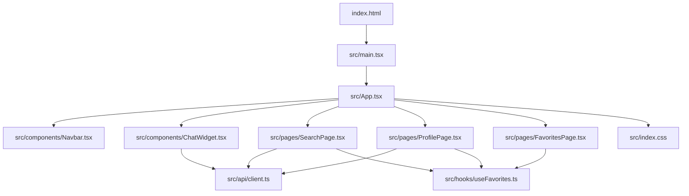
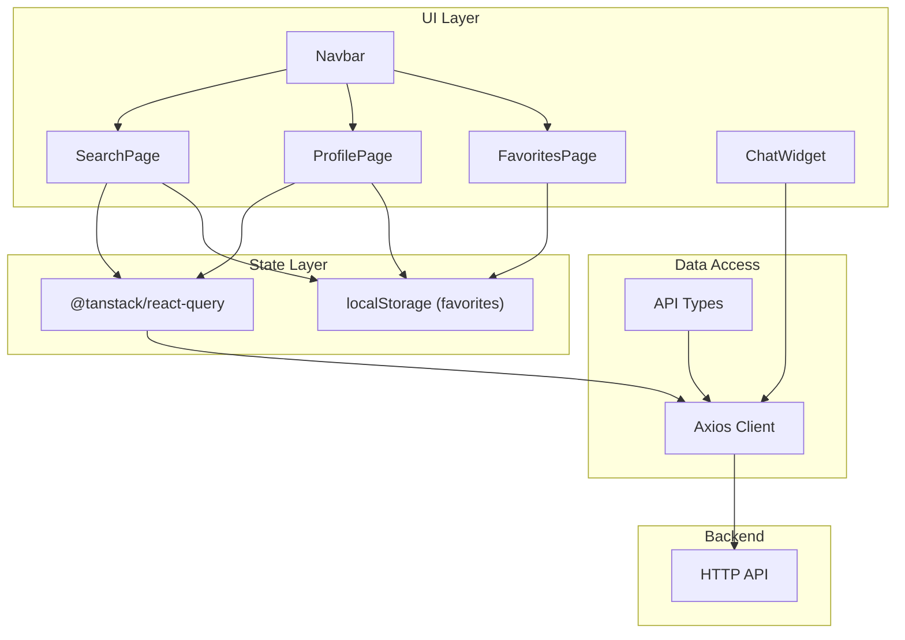
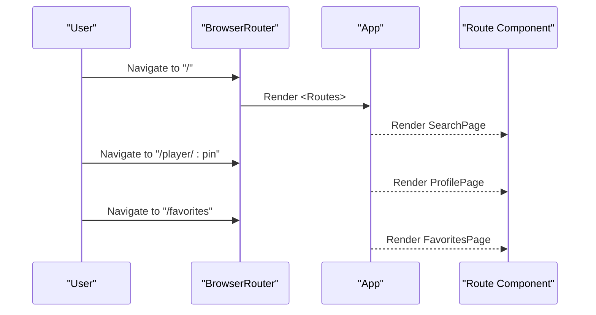
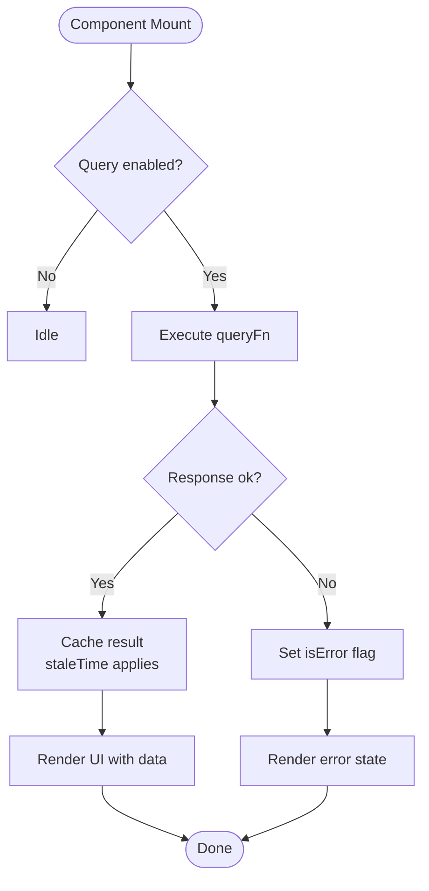
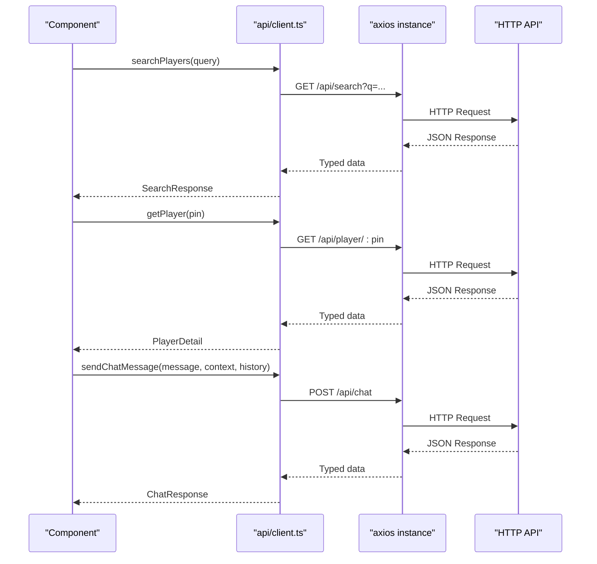
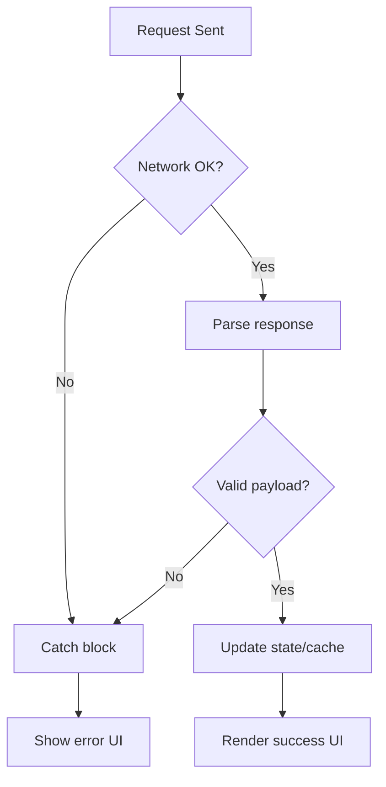
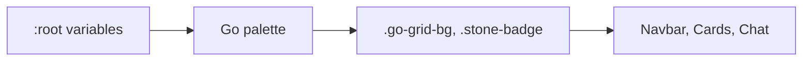
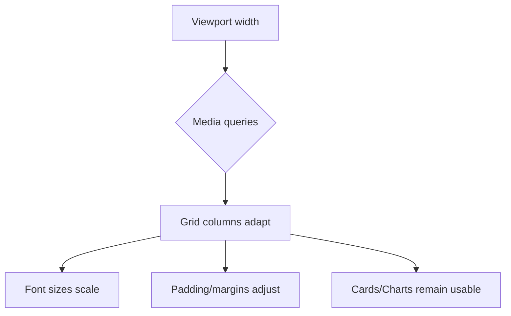
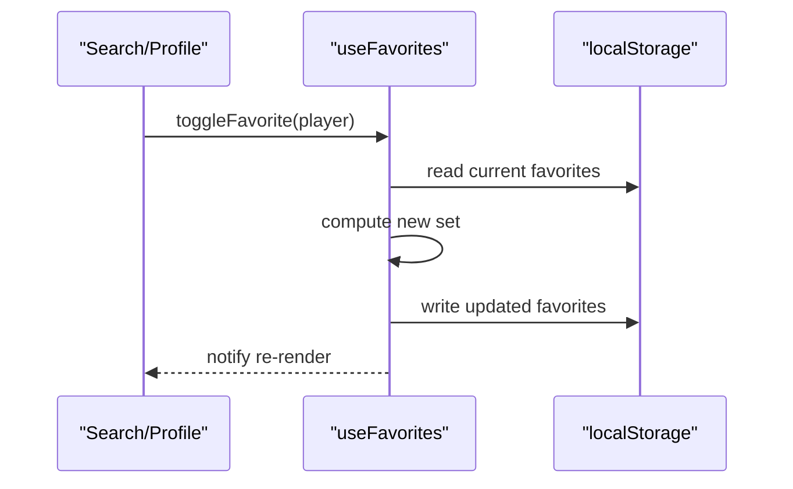
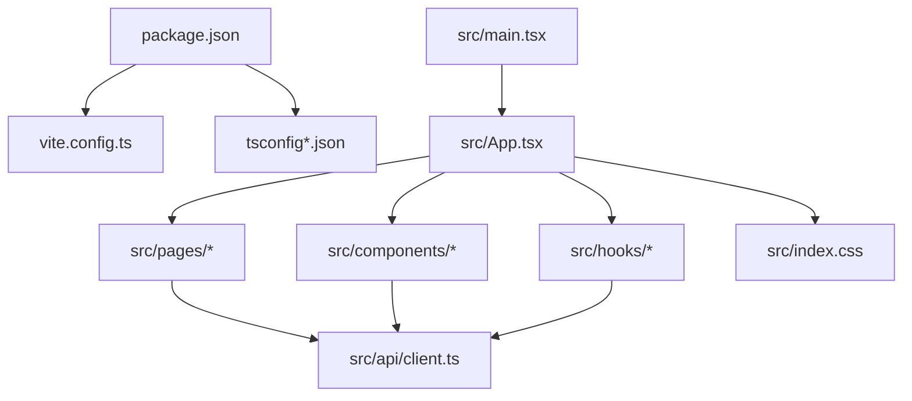

# Frontend Documentation

<cite>
**Referenced Files in This Document**
- [package.json](file://frontend/package.json)
- [vite.config.ts](file://frontend/vite.config.ts)
- [tsconfig.json](file://frontend/tsconfig.json)
- [tsconfig.app.json](file://frontend/tsconfig.app.json)
- [index.html](file://frontend/index.html)
- [main.tsx](file://frontend/src/main.tsx)
- [App.tsx](file://frontend/src/App.tsx)
- [client.ts](file://frontend/src/api/client.ts)
- [Navbar.tsx](file://frontend/src/components/Navbar.tsx)
- [ChatWidget.tsx](file://frontend/src/components/ChatWidget.tsx)
- [SearchPage.tsx](file://frontend/src/pages/SearchPage.tsx)
- [ProfilePage.tsx](file://frontend/src/pages/ProfilePage.tsx)
- [FavoritesPage.tsx](file://frontend/src/pages/FavoritesPage.tsx)
- [useFavorites.ts](file://frontend/src/hooks/useFavorites.ts)
- [index.css](file://frontend/src/index.css)
</cite>

## Table of Contents
1. Introduction
2. Project Structure
3. Core Components
4. Architecture Overview
5. Detailed Component Analysis
6. Dependency Analysis
7. Performance Considerations
8. Troubleshooting Guide
9. Conclusion

## Introduction
This document provides comprehensive frontend documentation for the React TypeScript application. It covers component hierarchy, routing configuration, state management using TanStack Query and local storage, API client implementation, error handling strategies, responsive design patterns, Go-themed styling system, build configuration with Vite, TypeScript setup, and development workflow.

## Project Structure
The frontend is organized by feature areas:
- Entry points and app shell
  - HTML entry and root mounting
  - App bootstrap and providers
- Routing and pages
  - Search, Profile, Favorites
- Shared UI components
  - Navbar, ChatWidget
- Data layer
  - API client and types
  - Local favorites persistence hook
- Styling and theming
  - Global CSS variables and utilities
- Build and tooling
  - Vite config, TypeScript configs, scripts



**Diagram sources**
- [index.html:10-12](file://frontend/index.html#L10-L12)
- [main.tsx:1-11](file://frontend/src/main.tsx#L1-L11)
- [App.tsx:1-37](file://frontend/src/App.tsx#L1-L37)
- [Navbar.tsx:1-94](file://frontend/src/components/Navbar.tsx#L1-L94)
- [ChatWidget.tsx:1-240](file://frontend/src/components/ChatWidget.tsx#L1-L240)
- [SearchPage.tsx:1-240](file://frontend/src/pages/SearchPage.tsx#L1-L240)
- [ProfilePage.tsx:1-375](file://frontend/src/pages/ProfilePage.tsx#L1-L375)
- [FavoritesPage.tsx:1-103](file://frontend/src/pages/FavoritesPage.tsx#L1-L103)
- [client.ts:1-86](file://frontend/src/api/client.ts#L1-L86)
- [useFavorites.ts:1-49](file://frontend/src/hooks/useFavorites.ts#L1-L49)
- [index.css:1-313](file://frontend/src/index.css#L1-L313)

**Section sources**
- [index.html:1-14](file://frontend/index.html#L1-L14)
- [main.tsx:1-11](file://frontend/src/main.tsx#L1-L11)
- [App.tsx:1-37](file://frontend/src/App.tsx#L1-L37)

## Core Components
- App shell and providers
  - Provides QueryClient for data fetching and caching via TanStack Query
  - Configures BrowserRouter and top-level routes
  - Wraps content with a global background and layout container
- Navigation
  - Sticky header with logo and links; active link highlighting
- Pages
  - Search: debounced search input, results grid, favorite toggle
  - Profile: player details, rating evolution chart, tournament history table
  - Favorites: list of saved players with quick navigation
- Chat assistant
  - Floating chat widget with message history and loading indicators
- Data hooks
  - useFavorites: persisted favorites in localStorage with add/remove/toggle helpers

Key responsibilities and interactions are illustrated below.

```mermaid
classDiagram
class App {
+QueryClientProvider
+BrowserRouter
+Routes
}
class Navbar {
+NavLink items
+Active styles
}
class SearchPage {
+debounced query
+useQuery search
+favorites integration
}
class ProfilePage {
+useQuery player
+chart data
+tournament table
}
class FavoritesPage {
+favorites list
+remove actions
}
class ChatWidget {
+messages state
+sendChatMessage
+loading & errors
}
class ApiClient {
+searchPlayers()
+getPlayer()
+sendChatMessage()
}
class UseFavorites {
+favorites
+addFavorite()
+removeFavorite()
+isFavorite()
+toggleFavorite()
}
App --> Navbar : "renders"
App --> SearchPage : "route /"
App --> ProfilePage : "route /player/ : pin"
App --> FavoritesPage : "route /favorites"
App --> ChatWidget : "renders"
SearchPage --> ApiClient : "fetches"
ProfilePage --> ApiClient : "fetches"
ChatWidget --> ApiClient : "sends messages"
SearchPage --> UseFavorites : "uses"
ProfilePage --> UseFavorites : "uses"
FavoritesPage --> UseFavorites : "uses"
```

**Diagram sources**
- [App.tsx:1-37](file://frontend/src/App.tsx#L1-L37)
- [Navbar.tsx:1-94](file://frontend/src/components/Navbar.tsx#L1-L94)
- [SearchPage.tsx:1-240](file://frontend/src/pages/SearchPage.tsx#L1-L240)
- [ProfilePage.tsx:1-375](file://frontend/src/pages/ProfilePage.tsx#L1-L375)
- [FavoritesPage.tsx:1-103](file://frontend/src/pages/FavoritesPage.tsx#L1-L103)
- [ChatWidget.tsx:1-240](file://frontend/src/components/ChatWidget.tsx#L1-L240)
- [client.ts:1-86](file://frontend/src/api/client.ts#L1-L86)
- [useFavorites.ts:1-49](file://frontend/src/hooks/useFavorites.ts#L1-L49)

**Section sources**
- [App.tsx:9-36](file://frontend/src/App.tsx#L9-L36)
- [Navbar.tsx:3-35](file://frontend/src/components/Navbar.tsx#L3-L35)
- [SearchPage.tsx:7-148](file://frontend/src/pages/SearchPage.tsx#L7-L148)
- [ProfilePage.tsx:11-239](file://frontend/src/pages/ProfilePage.tsx#L11-L239)
- [FavoritesPage.tsx:4-63](file://frontend/src/pages/FavoritesPage.tsx#L4-L63)
- [ChatWidget.tsx:4-150](file://frontend/src/components/ChatWidget.tsx#L4-L150)
- [client.ts:59-85](file://frontend/src/api/client.ts#L59-L85)
- [useFavorites.ts:6-48](file://frontend/src/hooks/useFavorites.ts#L6-L48)

## Architecture Overview
The application follows a layered architecture:
- Presentation layer: React components (pages and shared UI)
- State layer: TanStack Query for server state and local storage for favorites
- Data access layer: Axios-based API client with typed interfaces
- Styling layer: CSS custom properties and utility classes for Go theme



**Diagram sources**
- [App.tsx:1-37](file://frontend/src/App.tsx#L1-L37)
- [SearchPage.tsx:1-240](file://frontend/src/pages/SearchPage.tsx#L1-L240)
- [ProfilePage.tsx:1-375](file://frontend/src/pages/ProfilePage.tsx#L1-L375)
- [FavoritesPage.tsx:1-103](file://frontend/src/pages/FavoritesPage.tsx#L1-L103)
- [ChatWidget.tsx:1-240](file://frontend/src/components/ChatWidget.tsx#L1-L240)
- [client.ts:1-86](file://frontend/src/api/client.ts#L1-L86)
- [useFavorites.ts:1-49](file://frontend/src/hooks/useFavorites.ts#L1-L49)

## Detailed Component Analysis

### Routing Configuration
- Routes defined at the app level:
  - Home search page
  - Player profile with dynamic segment
  - Favorites listing
- Router provider wraps the entire app to enable navigation across components.



**Diagram sources**
- [App.tsx:18-36](file://frontend/src/App.tsx#L18-L36)

**Section sources**
- [App.tsx:18-36](file://frontend/src/App.tsx#L18-L36)

### Data Fetching with TanStack Query
- SearchPage uses a debounced query key to avoid excessive requests.
- ProfilePage fetches player detail by PIN and prepares chart data.
- Default QueryClient options include retry and staleTime.



**Diagram sources**
- [App.tsx:9-16](file://frontend/src/App.tsx#L9-L16)
- [SearchPage.tsx:13-23](file://frontend/src/pages/SearchPage.tsx#L13-L23)
- [ProfilePage.tsx:16-20](file://frontend/src/pages/ProfilePage.tsx#L16-L20)

**Section sources**
- [App.tsx:9-16](file://frontend/src/App.tsx#L9-L16)
- [SearchPage.tsx:18-23](file://frontend/src/pages/SearchPage.tsx#L18-L23)
- [ProfilePage.tsx:16-20](file://frontend/src/pages/ProfilePage.tsx#L16-L20)

### API Client Implementation
- Centralized Axios instance with base URL.
- Typed interfaces for request/response payloads.
- Functions for searching players, fetching player details, and sending chat messages.



**Diagram sources**
- [client.ts:3-5](file://frontend/src/api/client.ts#L3-L5)
- [client.ts:59-85](file://frontend/src/api/client.ts#L59-L85)

**Section sources**
- [client.ts:1-86](file://frontend/src/api/client.ts#L1-L86)

### Error Handling Strategies
- Search and Profile pages expose isLoading and isError states from queries to render user-friendly feedback.
- ChatWidget catches network or processing errors and displays a friendly message.
- Global defaults configure minimal retries to reduce noise while still providing resilience.



**Diagram sources**
- [SearchPage.tsx:70-81](file://frontend/src/pages/SearchPage.tsx#L70-L81)
- [ProfilePage.tsx:22-42](file://frontend/src/pages/ProfilePage.tsx#L22-L42)
- [ChatWidget.tsx:24-36](file://frontend/src/components/ChatWidget.tsx#L24-L36)
- [App.tsx:9-16](file://frontend/src/App.tsx#L9-L16)

**Section sources**
- [SearchPage.tsx:70-81](file://frontend/src/pages/SearchPage.tsx#L70-L81)
- [ProfilePage.tsx:22-42](file://frontend/src/pages/ProfilePage.tsx#L22-L42)
- [ChatWidget.tsx:24-36](file://frontend/src/components/ChatWidget.tsx#L24-L36)
- [App.tsx:9-16](file://frontend/src/App.tsx#L9-L16)

### Go-Themed Styling System
- CSS custom properties define wood, stone, slate, and neutral tones.
- Utility classes provide consistent visual tokens:
  - Grid background pattern reminiscent of a Go board
  - Stone badges for grades with black/white variants
  - Card hover effects and smooth transitions
- Components apply both inline styles and utility classes for cohesive theming.



**Diagram sources**
- [index.css:7-21](file://frontend/src/index.css#L7-L21)
- [index.css:32-38](file://frontend/src/index.css#L32-L38)
- [index.css:102-126](file://frontend/src/index.css#L102-L126)
- [Navbar.tsx:37-93](file://frontend/src/components/Navbar.tsx#L37-L93)
- [SearchPage.tsx:179-239](file://frontend/src/pages/SearchPage.tsx#L179-L239)
- [ChatWidget.tsx:152-239](file://frontend/src/components/ChatWidget.tsx#L152-L239)

**Section sources**
- [index.css:7-21](file://frontend/src/index.css#L7-L21)
- [index.css:32-38](file://frontend/src/index.css#L32-L38)
- [index.css:102-126](file://frontend/src/index.css#L102-L126)
- [Navbar.tsx:37-93](file://frontend/src/components/Navbar.tsx#L37-L93)
- [SearchPage.tsx:179-239](file://frontend/src/pages/SearchPage.tsx#L179-L239)
- [ChatWidget.tsx:152-239](file://frontend/src/components/ChatWidget.tsx#L152-L239)

### Responsive Design Patterns
- Fluid grids using auto-fill minmax for cards and stats.
- Flexible containers with max-width and centered margins.
- Media queries adjust font sizes and spacing for smaller screens.
- Sticky navbar and floating chat ensure usability on mobile.



**Diagram sources**
- [SearchPage.tsx:211-214](file://frontend/src/pages/SearchPage.tsx#L211-L214)
- [ProfilePage.tsx:325-328](file://frontend/src/pages/ProfilePage.tsx#L325-L328)
- [index.css:229-232](file://frontend/src/index.css#L229-L232)
- [index.css:281-285](file://frontend/src/index.css#L281-L285)

**Section sources**
- [SearchPage.tsx:211-214](file://frontend/src/pages/SearchPage.tsx#L211-L214)
- [ProfilePage.tsx:325-328](file://frontend/src/pages/ProfilePage.tsx#L325-L328)
- [index.css:229-232](file://frontend/src/index.css#L229-L232)
- [index.css:281-285](file://frontend/src/index.css#L281-L285)

### Favorites Persistence Hook
- Persists favorites array to localStorage under a stable key.
- Provides memoized operations to add, remove, check, and toggle favorites.
- Used by Search and Profile pages to manage user preferences.



**Diagram sources**
- [useFavorites.ts:6-48](file://frontend/src/hooks/useFavorites.ts#L6-L48)
- [SearchPage.tsx:109-115](file://frontend/src/pages/SearchPage.tsx#L109-L115)
- [ProfilePage.tsx:93-96](file://frontend/src/pages/ProfilePage.tsx#L93-L96)

**Section sources**
- [useFavorites.ts:6-48](file://frontend/src/hooks/useFavorites.ts#L6-L48)
- [SearchPage.tsx:109-115](file://frontend/src/pages/SearchPage.tsx#L109-L115)
- [ProfilePage.tsx:93-96](file://frontend/src/pages/ProfilePage.tsx#L93-L96)

## Dependency Analysis
Frontend dependencies include React, React Router, TanStack Query, Axios, Recharts, and Vite tooling. The following diagram shows runtime relationships between major modules.



**Diagram sources**
- [package.json:12-28](file://frontend/package.json#L12-L28)
- [vite.config.ts:1-8](file://frontend/vite.config.ts#L1-L8)
- [tsconfig.json:1-8](file://frontend/tsconfig.json#L1-L8)
- [tsconfig.app.json:1-27](file://frontend/tsconfig.app.json#L1-L27)
- [main.tsx:1-11](file://frontend/src/main.tsx#L1-L11)
- [App.tsx:1-37](file://frontend/src/App.tsx#L1-L37)
- [client.ts:1-86](file://frontend/src/api/client.ts#L1-L86)
- [index.css:1-313](file://frontend/src/index.css#L1-L313)

**Section sources**
- [package.json:1-30](file://frontend/package.json#L1-L30)
- [vite.config.ts:1-8](file://frontend/vite.config.ts#L1-L8)
- [tsconfig.json:1-8](file://frontend/tsconfig.json#L1-L8)
- [tsconfig.app.json:1-27](file://frontend/tsconfig.app.json#L1-L27)

## Performance Considerations
- Debounced search reduces unnecessary API calls during typing.
- TanStack Query caching and staleTime minimize redundant requests.
- Memoization for derived chart data avoids recomputation on renders.
- Efficient list rendering with stable keys improves update performance.
- Minimal retry policy prevents excessive backoff loops.

## Troubleshooting Guide
- Network connectivity issues
  - Ensure backend is reachable at the configured base URL.
  - Verify CORS policies if running cross-origin.
- Empty or incorrect responses
  - Validate API contract matches typed interfaces.
  - Inspect query keys and parameters for typos.
- Favorites not persisting
  - Confirm localStorage availability and quota.
  - Check for JSON parse errors during initialization.
- Chat widget errors
  - Review catch blocks and fallback messages.
  - Validate message payload structure.

**Section sources**
- [client.ts:3-5](file://frontend/src/api/client.ts#L3-L5)
- [SearchPage.tsx:70-81](file://frontend/src/pages/SearchPage.tsx#L70-L81)
- [ProfilePage.tsx:22-42](file://frontend/src/pages/ProfilePage.tsx#L22-L42)
- [ChatWidget.tsx:24-36](file://frontend/src/components/ChatWidget.tsx#L24-L36)
- [useFavorites.ts:7-14](file://frontend/src/hooks/useFavorites.ts#L7-L14)

## Conclusion
The frontend combines a clean React component architecture with TanStack Query for robust server state management and a cohesive Go-themed design system. The modular structure, clear routing, and thoughtful error handling create a maintainable and user-friendly experience. Vite and TypeScript provide a fast, type-safe development workflow.