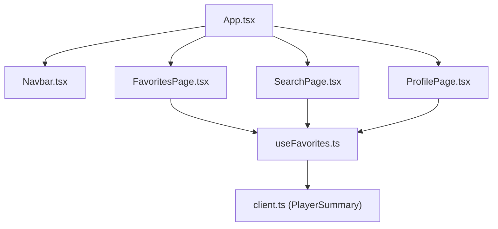
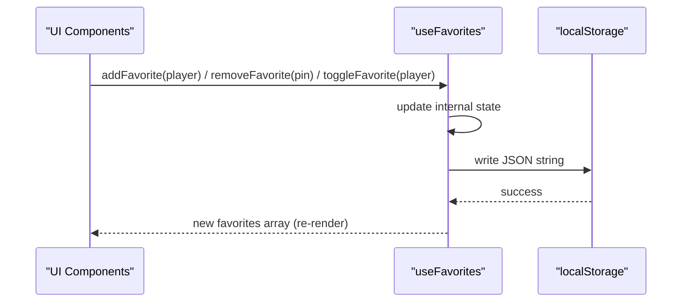
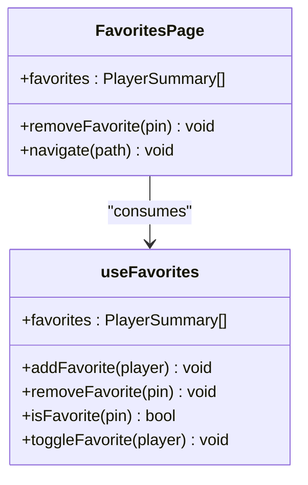
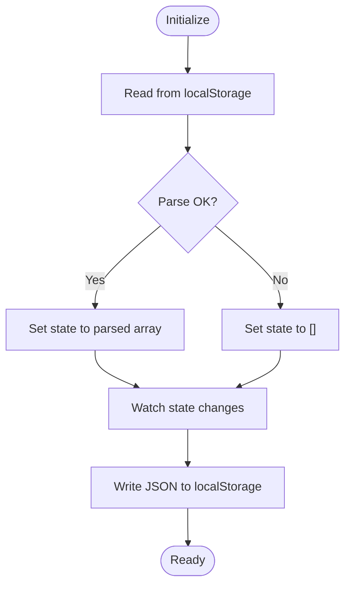
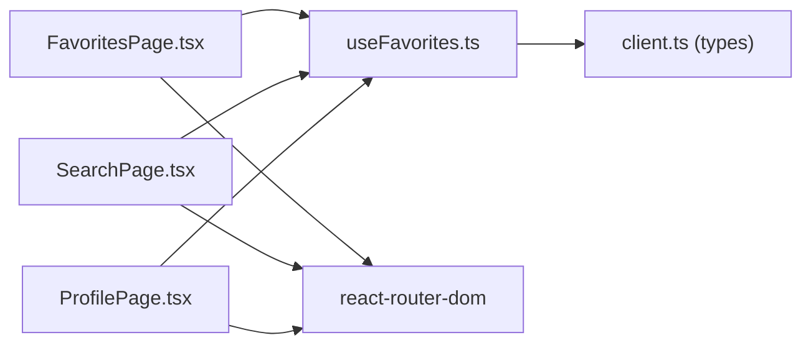

# FavoritesPage Component

<cite>
**Referenced Files in This Document**
- [FavoritesPage.tsx](file://frontend/src/pages/FavoritesPage.tsx)
- [useFavorites.ts](file://frontend/src/hooks/useFavorites.ts)
- [client.ts](file://frontend/src/api/client.ts)
- [Navbar.tsx](file://frontend/src/components/Navbar.tsx)
- [App.tsx](file://frontend/src/App.tsx)
- [SearchPage.tsx](file://frontend/src/pages/SearchPage.tsx)
- [ProfilePage.tsx](file://frontend/src/pages/ProfilePage.tsx)
</cite>

## Table of Contents
1. [Introduction](#introduction)
2. [Project Structure](#project-structure)
3. [Core Components](#core-components)
4. [Architecture Overview](#architecture-overview)
5. [Detailed Component Analysis](#detailed-component-analysis)
6. [Dependency Analysis](#dependency-analysis)
7. [Performance Considerations](#performance-considerations)
8. [Troubleshooting Guide](#troubleshooting-guide)
9. [Conclusion](#conclusion)

## Introduction
This document explains the FavoritesPage component and the surrounding favorites management system. It covers how favorites are persisted to localStorage, how the player list is displayed, and how removal works. It also details integration with the useFavorites hook for state management, data synchronization across components, and local storage operations. Finally, it includes examples of CRUD operations, error handling strategies for storage failures, and performance considerations for large favorite lists.

## Project Structure
The favorites feature spans a small set of files:
- A page that renders the favorites list and empty state
- A custom React hook that manages favorites state and persistence
- Types defining the player summary shape used by favorites
- Navigation links to reach the favorites page
- Other pages that add or toggle favorites

**Diagram sources**
- [App.tsx:18-36](file://frontend/src/App.tsx#L18-L36)
- [Navbar.tsx:12-30](file://frontend/src/components/Navbar.tsx#L12-L30)
- [FavoritesPage.tsx:1-63](file://frontend/src/pages/FavoritesPage.tsx#L1-L63)
- [SearchPage.tsx:1-20](file://frontend/src/pages/SearchPage.tsx#L1-L20)
- [ProfilePage.tsx:1-20](file://frontend/src/pages/ProfilePage.tsx#L1-L20)
- [useFavorites.ts:1-49](file://frontend/src/hooks/useFavorites.ts#L1-L49)
- [client.ts:7-17](file://frontend/src/api/client.ts#L7-L17)

**Section sources**
- [App.tsx:18-36](file://frontend/src/App.tsx#L18-L36)
- [Navbar.tsx:12-30](file://frontend/src/components/Navbar.tsx#L12-L30)
- [FavoritesPage.tsx:1-63](file://frontend/src/pages/FavoritesPage.tsx#L1-L63)
- [useFavorites.ts:1-49](file://frontend/src/hooks/useFavorites.ts#L1-L49)
- [client.ts:7-17](file://frontend/src/api/client.ts#L7-L17)

## Core Components
- FavoritesPage: Renders the favorites list, handles navigation to player profiles, and provides an empty state with quick access to search.
- useFavorites: Manages favorites state, persists to localStorage, and exposes add/remove/toggle/isFavorite utilities.
- PlayerSummary type: Defines the shape of a player object stored as a favorite.

Key responsibilities:
- FavoritesPage focuses on presentation and user actions (remove, navigate).
- useFavorites centralizes state and persistence logic, ensuring consistency across all consumers.
- The shared type ensures consistent data structures across components.

**Section sources**
- [FavoritesPage.tsx:1-63](file://frontend/src/pages/FavoritesPage.tsx#L1-L63)
- [useFavorites.ts:1-49](file://frontend/src/hooks/useFavorites.ts#L1-L49)
- [client.ts:7-17](file://frontend/src/api/client.ts#L7-L17)

## Architecture Overview
The favorites system follows a unidirectional data flow:
- Consumers call functions from useFavorites to mutate state.
- useFavorites updates its internal state and persists changes to localStorage.
- All consumers re-render with the latest favorites list.

**Diagram sources**
- [useFavorites.ts:6-48](file://frontend/src/hooks/useFavorites.ts#L6-L48)

## Detailed Component Analysis

### FavoritesPage
Responsibilities:
- Reads favorites via useFavorites.
- Displays an empty state when no favorites exist, including a button to navigate to search.
- Renders a grid of player cards with grade badge, name, country code, PIN, rating, tournaments, club, and a “View Profile” indicator.
- Provides a remove action per card.
- Navigates to a player profile when a card is clicked.

User interactions:
- Clicking a card navigates to the player’s profile route.
- Clicking the remove button removes the player from favorites.
- Empty state includes a “Search Players” button that navigates to the home/search route.

Data display:
- Uses the grade field to determine whether to show a black or white stone badge for Dan/Kyū distinction.
- Shows optional fields like rating, totalTournaments, and club if present.

Error handling:
- No explicit try/catch around localStorage here; errors are handled within the hook.

Accessibility and UX:
- Remove button stops event propagation to avoid triggering card navigation.
- Clear visual hierarchy with title, count, and grid layout.

Quick access navigation:
- Empty state provides direct navigation to search.
- Cards provide direct navigation to player profiles.

Empty state handling:
- When favorites.length equals zero, shows a friendly message and a CTA to search players.

Styling:
- Inline styles define container, title, count, grid, card, stats, and buttons.

**Section sources**
- [FavoritesPage.tsx:1-63](file://frontend/src/pages/FavoritesPage.tsx#L1-L63)
- [FavoritesPage.tsx:65-103](file://frontend/src/pages/FavoritesPage.tsx#L65-L103)

#### FavoritesPage Class Diagram

**Diagram sources**
- [FavoritesPage.tsx:1-63](file://frontend/src/pages/FavoritesPage.tsx#L1-L63)
- [useFavorites.ts:6-48](file://frontend/src/hooks/useFavorites.ts#L6-L48)

### useFavorites Hook
Responsibilities:
- Initializes state from localStorage safely.
- Persists favorites to localStorage whenever the state changes.
- Exposes:
  - addFavorite: adds a player if not already present.
  - removeFavorite: removes a player by pin.
  - isFavorite: checks presence by pin.
  - toggleFavorite: convenience method to add or remove based on current state.

Persistence strategy:
- Storage key is constant.
- On initialization, reads from localStorage and parses JSON; falls back to an empty array on parse errors.
- On any state change, writes the entire favorites array back to localStorage as a JSON string.

State synchronization:
- Because all consumers read from the same hook instance provided by React context, changes propagate instantly across components.

Error handling:
- Initialization wraps localStorage.getItem and JSON.parse in try/catch to prevent crashes if storage is corrupted.
- Writes to localStorage are synchronous and may throw if quota exceeded or storage disabled; consider wrapping in try/catch for robustness.

Complexity:
- addFavorite: O(n) due to duplicate check.
- removeFavorite: O(n) due to filter.
- isFavorite: O(n).
- toggleFavorite: O(n) due to isFavorite plus add/remove.

Optimization opportunities:
- Maintain a Set of pins for O(1) lookups while keeping an ordered array for rendering.
- Batch writes or debounce writes for very large lists.

**Section sources**
- [useFavorites.ts:1-49](file://frontend/src/hooks/useFavorites.ts#L1-L49)

#### useFavorites Flowchart

**Diagram sources**
- [useFavorites.ts:6-18](file://frontend/src/hooks/useFavorites.ts#L6-L18)

### Integration Points Across Components
- Navbar: Provides quick access to the Favorites page via a link.
- SearchPage: Allows adding/removing favorites directly from search results using toggleFavorite and isFavorite.
- ProfilePage: Allows toggling favorites from a player’s profile view.

These integrations ensure that favorites are consistent everywhere in the app.

**Section sources**
- [Navbar.tsx:12-30](file://frontend/src/components/Navbar.tsx#L12-L30)
- [SearchPage.tsx:1-20](file://frontend/src/pages/SearchPage.tsx#L1-L20)
- [ProfilePage.tsx:1-20](file://frontend/src/pages/ProfilePage.tsx#L1-L20)

## Dependency Analysis
- FavoritesPage depends on:
  - useFavorites for state and mutations
  - react-router-dom for navigation
- useFavorites depends on:
  - React hooks (useState, useEffect, useCallback)
  - localStorage API
  - PlayerSummary type from client.ts
- SearchPage and ProfilePage depend on:
  - useFavorites for add/remove/toggle
  - react-query for fetching player data
  - react-router-dom for navigation

**Diagram sources**
- [FavoritesPage.tsx:1-6](file://frontend/src/pages/FavoritesPage.tsx#L1-L6)
- [SearchPage.tsx:1-12](file://frontend/src/pages/SearchPage.tsx#L1-L12)
- [ProfilePage.tsx:1-15](file://frontend/src/pages/ProfilePage.tsx#L1-L15)
- [useFavorites.ts:1-4](file://frontend/src/hooks/useFavorites.ts#L1-L4)
- [client.ts:7-17](file://frontend/src/api/client.ts#L7-L17)

**Section sources**
- [FavoritesPage.tsx:1-6](file://frontend/src/pages/FavoritesPage.tsx#L1-L6)
- [SearchPage.tsx:1-12](file://frontend/src/pages/SearchPage.tsx#L1-L12)
- [ProfilePage.tsx:1-15](file://frontend/src/pages/ProfilePage.tsx#L1-L15)
- [useFavorites.ts:1-4](file://frontend/src/hooks/useFavorites.ts#L1-L4)
- [client.ts:7-17](file://frontend/src/api/client.ts#L7-L17)

## Performance Considerations
- Rendering many favorites:
  - Use stable keys (pin) to minimize re-renders.
  - Consider virtualization for very large lists if needed.
- State operations:
  - addFavorite and removeFavorite are O(n); for large lists, maintain a Set of pins for O(1) checks and keep an array for rendering order.
- LocalStorage writes:
  - Synchronous writes can block the main thread; consider debouncing or batching writes if frequent updates occur.
- Parsing overhead:
  - Initialize once and cache the result; avoid repeated parsing.
- Memory usage:
  - Keep only necessary fields in favorites to reduce payload size.

[No sources needed since this section provides general guidance]

## Troubleshooting Guide
Common issues and resolutions:
- Corrupted localStorage data:
  - The hook initializes with try/catch and falls back to an empty array. If users see missing favorites, clear browser storage or reset the key.
- Quota exceeded:
  - Writing too much data to localStorage can fail. Consider trimming old entries or moving to IndexedDB for large datasets.
- Storage disabled:
  - In private browsing or restricted environments, localStorage may be unavailable. Wrap writes in try/catch and degrade gracefully.
- Stale UI after removal:
  - Ensure removeFavorite is called and state updates trigger re-renders. Verify that event handlers stop propagation where needed to avoid unintended navigation.

Operational tips:
- Validate JSON before writing to localStorage to avoid corruption.
- Log errors during localStorage operations for diagnostics.
- Provide user feedback when favorites cannot be saved.

**Section sources**
- [useFavorites.ts:6-18](file://frontend/src/hooks/useFavorites.ts#L6-L18)

## Conclusion
The FavoritesPage integrates cleanly with the useFavorites hook to deliver a responsive, persistent favorites experience. The hook centralizes state and persistence, ensuring consistency across Search and Profile views. For improved scalability, consider optimizing lookup operations and write patterns for large lists, and enhance error handling around localStorage operations.