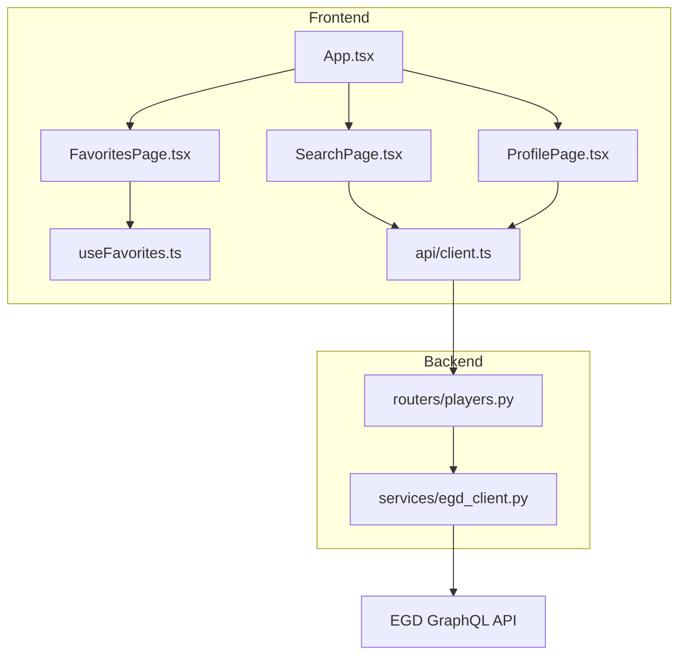
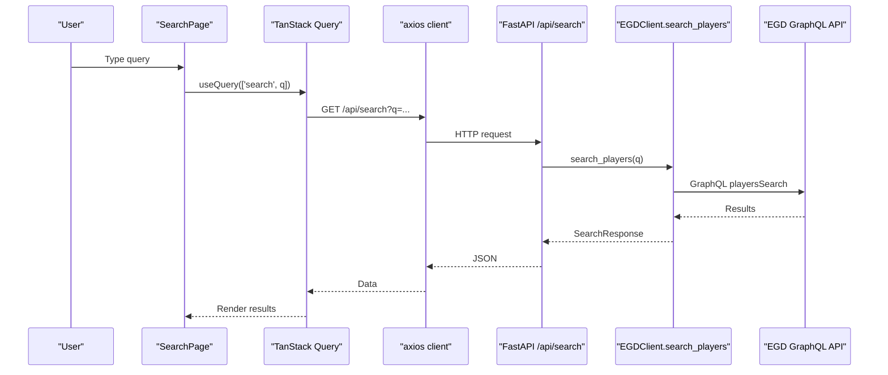
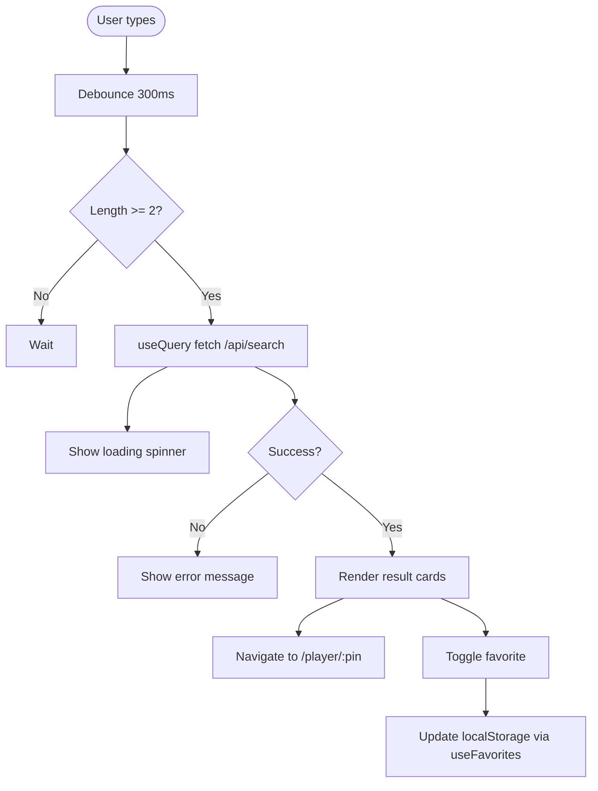
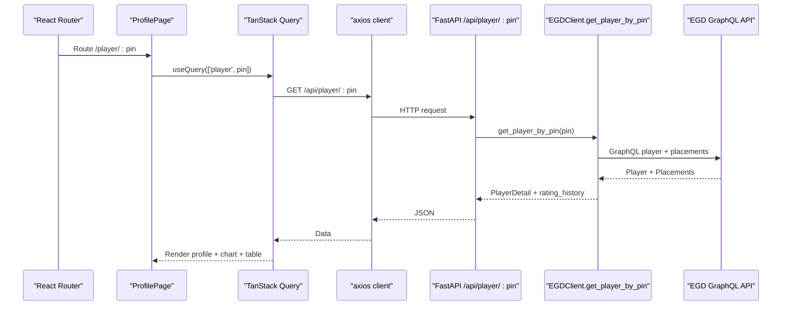
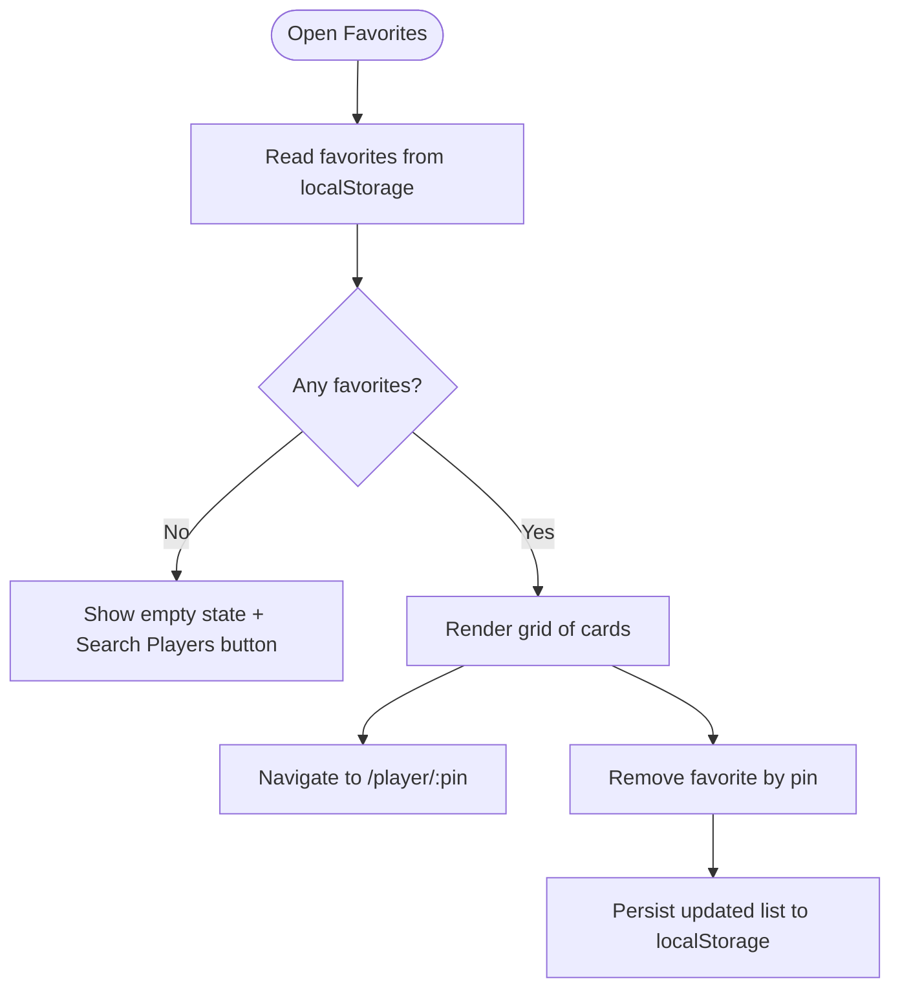
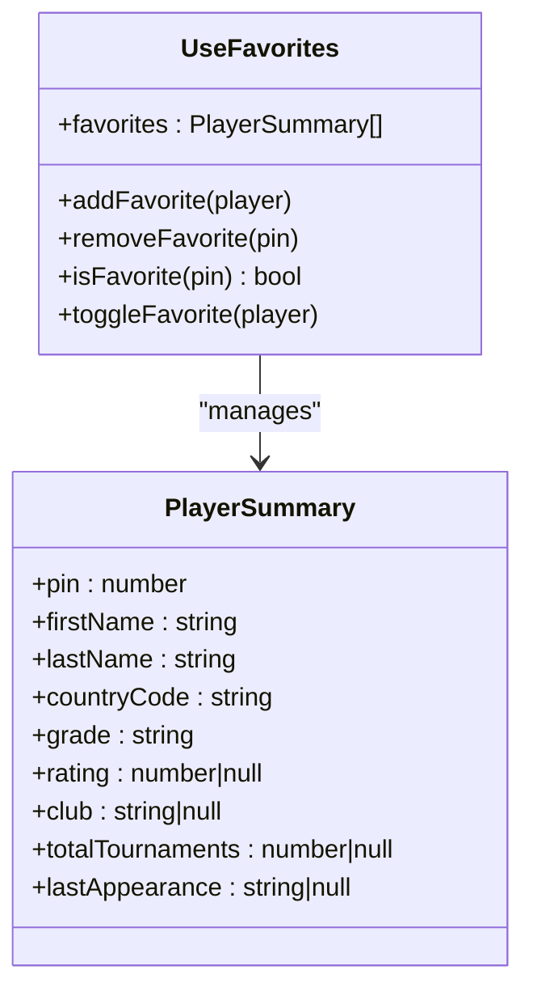
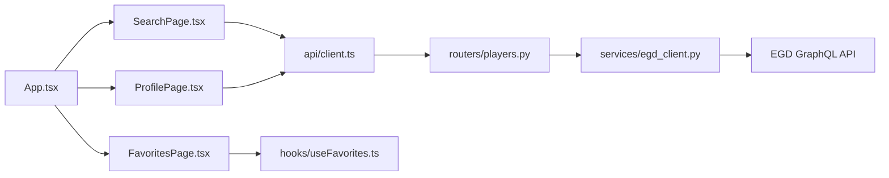

# Page Components

<cite>
**Referenced Files in This Document**
- [SearchPage.tsx](file://frontend/src/pages/SearchPage.tsx)
- [ProfilePage.tsx](file://frontend/src/pages/ProfilePage.tsx)
- [FavoritesPage.tsx](file://frontend/src/pages/FavoritesPage.tsx)
- [useFavorites.ts](file://frontend/src/hooks/useFavorites.ts)
- [client.ts](file://frontend/src/api/client.ts)
- [App.tsx](file://frontend/src/App.tsx)
- [players.py](file://backend/app/routers/players.py)
- [egd_client.py](file://backend/app/services/egd_client.py)
</cite>

## Table of Contents
1. [Introduction](#introduction)
2. [Project Structure](#project-structure)
3. [Core Components](#core-components)
4. [Architecture Overview](#architecture-overview)
5. [Detailed Component Analysis](#detailed-component-analysis)
6. [Dependency Analysis](#dependency-analysis)
7. [Performance Considerations](#performance-considerations)
8. [Troubleshooting Guide](#troubleshooting-guide)
9. [Conclusion](#conclusion)

## Introduction
This document provides detailed documentation for the main page components: SearchPage, ProfilePage, and FavoritesPage. It explains how search with typo-tolerant matching works, how player profiles display rating charts, and how favorites are managed with local storage. It also covers data fetching patterns, error handling, loading states, user interaction flows, chart implementations, pagination support, and integration points between frontend and backend services.

## Project Structure
The pages live under the frontend source tree and use React Router for navigation, TanStack Query for caching and background data fetching, and Recharts for visualizations. The backend exposes FastAPI routes that proxy to the European Go Database (EGD) GraphQL API.

**Diagram sources**
- [App.tsx:18-36](file://frontend/src/App.tsx#L18-L36)
- [SearchPage.tsx:1-20](file://frontend/src/pages/SearchPage.tsx#L1-L20)
- [ProfilePage.tsx:1-20](file://frontend/src/pages/ProfilePage.tsx#L1-L20)
- [FavoritesPage.tsx:1-10](file://frontend/src/pages/FavoritesPage.tsx#L1-L10)
- [useFavorites.ts:1-10](file://frontend/src/hooks/useFavorites.ts#L1-L10)
- [client.ts:1-10](file://frontend/src/api/client.ts#L1-L10)
- [players.py:1-10](file://backend/app/routers/players.py#L1-L10)
- [egd_client.py:1-10](file://backend/app/services/egd_client.py#L1-L10)

**Section sources**
- [App.tsx:18-36](file://frontend/src/App.tsx#L18-L36)

## Core Components
- SearchPage: Provides a search input with debounced queries, displays results in a grid, supports adding/removing favorites inline, and navigates to player profiles.
- ProfilePage: Loads a player by PIN, shows stats, renders a rating evolution chart using Recharts, and lists tournament history.
- FavoritesPage: Displays all favorite players persisted in local storage, allows removal, and navigates to individual profiles.
- useFavorites hook: Manages favorites state with localStorage persistence and provides add/remove/toggle/isFavorite utilities.
- API client: Axios-based client exposing typed functions for searching players and fetching player details.

Key responsibilities:
- Data fetching via TanStack Query with query keys and caching.
- Error and loading states per component.
- Local storage integration for favorites.
- Chart rendering for rating evolution.

**Section sources**
- [SearchPage.tsx:1-240](file://frontend/src/pages/SearchPage.tsx#L1-L240)
- [ProfilePage.tsx:1-375](file://frontend/src/pages/ProfilePage.tsx#L1-L375)
- [FavoritesPage.tsx:1-103](file://frontend/src/pages/FavoritesPage.tsx#L1-L103)
- [useFavorites.ts:1-49](file://frontend/src/hooks/useFavorites.ts#L1-L49)
- [client.ts:1-86](file://frontend/src/api/client.ts#L1-L86)

## Architecture Overview
The application follows a layered architecture:
- UI layer: React components for Search, Profile, and Favorites.
- State/data layer: TanStack Query for server state; custom hook for client-side favorites.
- API layer: Axios client calling FastAPI endpoints.
- Backend layer: FastAPI routes delegating to an EGD GraphQL client with internal caching.

**Diagram sources**
- [SearchPage.tsx:18-23](file://frontend/src/pages/SearchPage.tsx#L18-L23)
- [client.ts:59-62](file://frontend/src/api/client.ts#L59-L62)
- [players.py:8-40](file://backend/app/routers/players.py#L8-L40)
- [egd_client.py:44-70](file://backend/app/services/egd_client.py#L44-L70)

## Detailed Component Analysis

### SearchPage
Responsibilities:
- Debounce user input to avoid excessive requests.
- Trigger search when the query length is at least two characters.
- Display loading, error, and no-results states.
- Show result cards with grade, rating, tournaments, club, and country flag.
- Allow toggling favorites directly from the card.
- Navigate to the profile page on card click.

Data fetching pattern:
- Uses TanStack Query with a stable query key ['search', debouncedQuery].
- Enables fetching only when the query meets minimum length.
- Stale time set to cache recent searches.

Error handling:
- Shows a friendly error message if the query fails.
- No-results guidance suggests trying different spelling or PIN.

User interactions:
- Clear button resets both local and debounced query.
- Favorite toggle updates local favorites without refetching.

Pagination:
- The API returns pagination metadata; current implementation does not implement infinite scroll or next-page controls.

Typo tolerance:
- Provided by the backend’s EGD GraphQL search endpoint, which performs fuzzy name matching.

**Diagram sources**
- [SearchPage.tsx:13-23](file://frontend/src/pages/SearchPage.tsx#L13-L23)
- [SearchPage.tsx:70-81](file://frontend/src/pages/SearchPage.tsx#L70-L81)
- [SearchPage.tsx:83-146](file://frontend/src/pages/SearchPage.tsx#L83-L146)
- [useFavorites.ts:36-45](file://frontend/src/hooks/useFavorites.ts#L36-L45)

**Section sources**
- [SearchPage.tsx:1-240](file://frontend/src/pages/SearchPage.tsx#L1-L240)
- [client.ts:59-62](file://frontend/src/api/client.ts#L59-L62)
- [players.py:8-40](file://backend/app/routers/players.py#L8-L40)
- [egd_client.py:44-70](file://backend/app/services/egd_client.py#L44-L70)

### ProfilePage
Responsibilities:
- Load player details by PIN parameter.
- Display header with photo or grade badge, name, meta info, and favorite toggle.
- Show stat cards for grade, rating, delta, proposed grade, tournaments, and rank.
- Render a rating evolution chart with area and line layers, peak reference line, and tooltip.
- Present a table of tournament history with computed deltas.

Data fetching pattern:
- Uses TanStack Query with key ['player', pin] and enables only when pin exists.
- Converts route param to number before calling getPlayer.

Chart implementation:
- Uses Recharts ComposedChart with Area and Line series.
- Computes chart data from rating_history entries where rating_after is present.
- Adds a ReferenceLine for peak rating and a custom tooltip showing tournament details and rating change.

Error handling:
- Renders an error view with a back-to-search action when load fails or data is missing.

User interactions:
- Back arrow navigates to previous page.
- Favorite button toggles state and persists to localStorage.

**Diagram sources**
- [ProfilePage.tsx:16-20](file://frontend/src/pages/ProfilePage.tsx#L16-L20)
- [client.ts:64-67](file://frontend/src/api/client.ts#L64-L67)
- [players.py:43-80](file://backend/app/routers/players.py#L43-L80)
- [egd_client.py:72-118](file://backend/app/services/egd_client.py#L72-L118)

**Section sources**
- [ProfilePage.tsx:1-375](file://frontend/src/pages/ProfilePage.tsx#L1-L375)
- [client.ts:64-67](file://frontend/src/api/client.ts#L64-L67)
- [players.py:43-80](file://backend/app/routers/players.py#L43-L80)
- [egd_client.py:72-118](file://backend/app/services/egd_client.py#L72-L118)

### FavoritesPage
Responsibilities:
- Display empty state with call-to-action when no favorites exist.
- Render a grid of favorite player cards with grade, rating, tournaments, and club.
- Provide remove actions and navigation to each player’s profile.

State management:
- Reads favorites from useFavorites hook backed by localStorage.
- Removes favorites by pin and re-renders accordingly.

User interactions:
- Clicking a card navigates to the player profile.
- Remove button deletes the entry from local storage.

**Diagram sources**
- [FavoritesPage.tsx:4-22](file://frontend/src/pages/FavoritesPage.tsx#L4-L22)
- [FavoritesPage.tsx:24-62](file://frontend/src/pages/FavoritesPage.tsx#L24-L62)
- [useFavorites.ts:27-29](file://frontend/src/hooks/useFavorites.ts#L27-L29)

**Section sources**
- [FavoritesPage.tsx:1-103](file://frontend/src/pages/FavoritesPage.tsx#L1-L103)
- [useFavorites.ts:1-49](file://frontend/src/hooks/useFavorites.ts#L1-L49)

### useFavorites Hook
Responsibilities:
- Initialize favorites from localStorage safely.
- Persist changes to localStorage on state updates.
- Provide add, remove, toggle, and isFavorite operations.

Data structure:
- Stores an array of PlayerSummary objects keyed by pin.

Persistence:
- Uses a dedicated storage key and JSON serialization.

**Diagram sources**
- [useFavorites.ts:6-48](file://frontend/src/hooks/useFavorites.ts#L6-L48)
- [client.ts:7-17](file://frontend/src/api/client.ts#L7-L17)

**Section sources**
- [useFavorites.ts:1-49](file://frontend/src/hooks/useFavorites.ts#L1-L49)
- [client.ts:7-17](file://frontend/src/api/client.ts#L7-L17)

### API Client and Types
Responsibilities:
- Create an Axios instance with base URL.
- Export typed interfaces for responses and requests.
- Implement searchPlayers and getPlayer functions.

Types:
- PlayerSummary, SearchResponse, RatingHistoryEntry, PlayerDetail, ChatMessage, ChatResponse.

Integration:
- Used by SearchPage and ProfilePage for data fetching.

**Section sources**
- [client.ts:1-86](file://frontend/src/api/client.ts#L1-L86)

### Backend Integration
Responsibilities:
- Expose REST endpoints for search and player detail.
- Transform EGD GraphQL responses into consistent shapes.
- Support numeric PIN direct lookup in search.

Typo tolerance:
- Provided by EGD GraphQL playersSearch, which performs fuzzy matching.

Pagination:
- SearchResponse includes currentPage and hasMorePages; current UI does not implement pagination controls.

**Section sources**
- [players.py:8-40](file://backend/app/routers/players.py#L8-L40)
- [players.py:43-80](file://backend/app/routers/players.py#L43-L80)
- [egd_client.py:44-70](file://backend/app/services/egd_client.py#L44-L70)
- [egd_client.py:72-118](file://backend/app/services/egd_client.py#L72-L118)

## Dependency Analysis
High-level dependencies across modules:

**Diagram sources**
- [App.tsx:18-36](file://frontend/src/App.tsx#L18-L36)
- [SearchPage.tsx:1-10](file://frontend/src/pages/SearchPage.tsx#L1-L10)
- [ProfilePage.tsx:1-10](file://frontend/src/pages/ProfilePage.tsx#L1-L10)
- [FavoritesPage.tsx:1-6](file://frontend/src/pages/FavoritesPage.tsx#L1-L6)
- [client.ts:1-10](file://frontend/src/api/client.ts#L1-L10)
- [players.py:1-10](file://backend/app/routers/players.py#L1-L10)
- [egd_client.py:1-10](file://backend/app/services/egd_client.py#L1-L10)

**Section sources**
- [App.tsx:18-36](file://frontend/src/App.tsx#L18-L36)
- [client.ts:1-10](file://frontend/src/api/client.ts#L1-L10)
- [players.py:1-10](file://backend/app/routers/players.py#L1-L10)
- [egd_client.py:1-10](file://backend/app/services/egd_client.py#L1-L10)

## Performance Considerations
- Debounced search reduces network calls during typing.
- TanStack Query caches results with configurable staleTime and retry settings.
- Backend EGD client uses an in-memory cache with TTL to reduce external API calls.
- Charts compute derived data with useMemo to avoid unnecessary recalculations.
- Avoid rendering large tables without virtualization; consider pagination for extensive histories.

[No sources needed since this section provides general guidance]

## Troubleshooting Guide
Common issues and resolutions:
- Network errors during search or profile load:
  - Verify backend availability and CORS configuration.
  - Check browser console for axios errors and ensure baseURL is correct.
- Empty search results:
  - Ensure query length meets minimum threshold.
  - Try searching by exact PIN if available.
- Favorites not persisting:
  - Confirm localStorage is enabled and not blocked by privacy settings.
  - Validate JSON parsing and storage key usage.
- Chart not displaying:
  - Ensure rating_history contains entries with valid rating_after values.
  - Check Recharts responsive container sizing.

**Section sources**
- [SearchPage.tsx:70-81](file://frontend/src/pages/SearchPage.tsx#L70-L81)
- [ProfilePage.tsx:33-42](file://frontend/src/pages/ProfilePage.tsx#L33-L42)
- [useFavorites.ts:7-18](file://frontend/src/hooks/useFavorites.ts#L7-L18)

## Conclusion
The three main pages provide a cohesive experience for discovering and tracking European Go players. Search leverages typo-tolerant backend matching, profiles visualize rating evolution with interactive charts, and favorites offer persistent local management. The architecture cleanly separates concerns across UI, state, API, and backend layers, enabling maintainability and scalability. Future enhancements could include pagination controls, more robust error boundaries, and performance optimizations for large datasets.