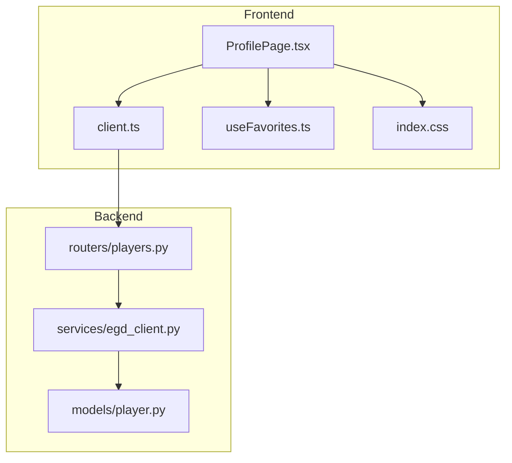
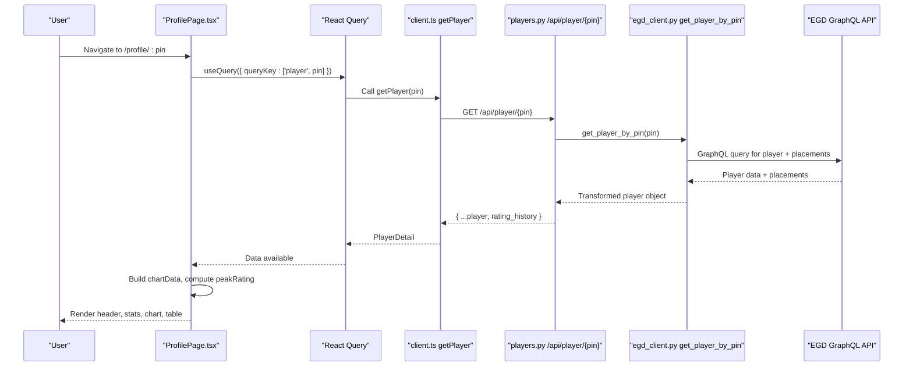
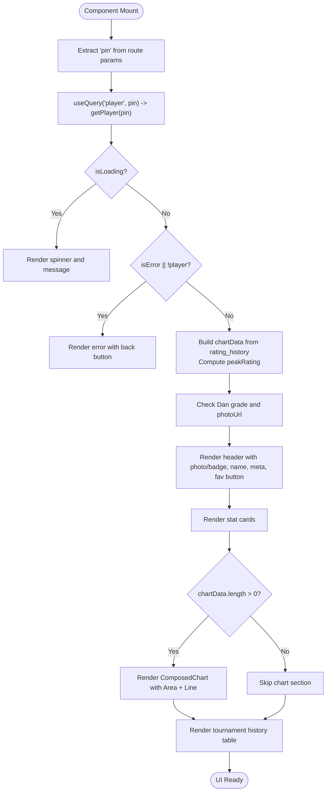
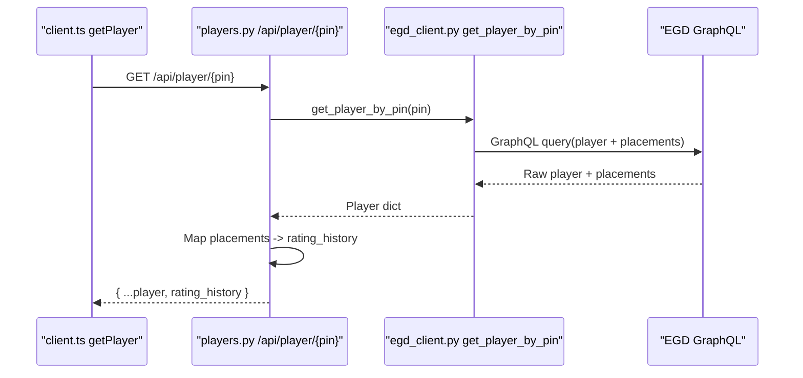
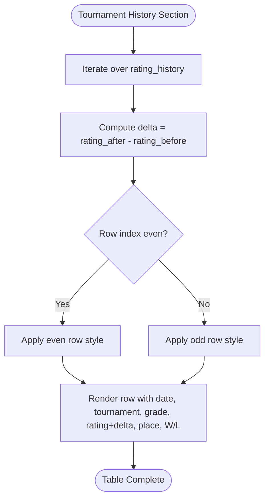
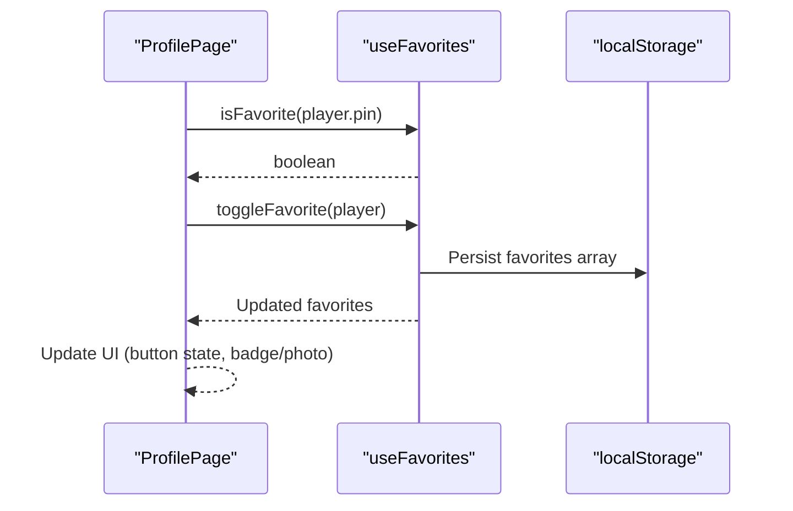
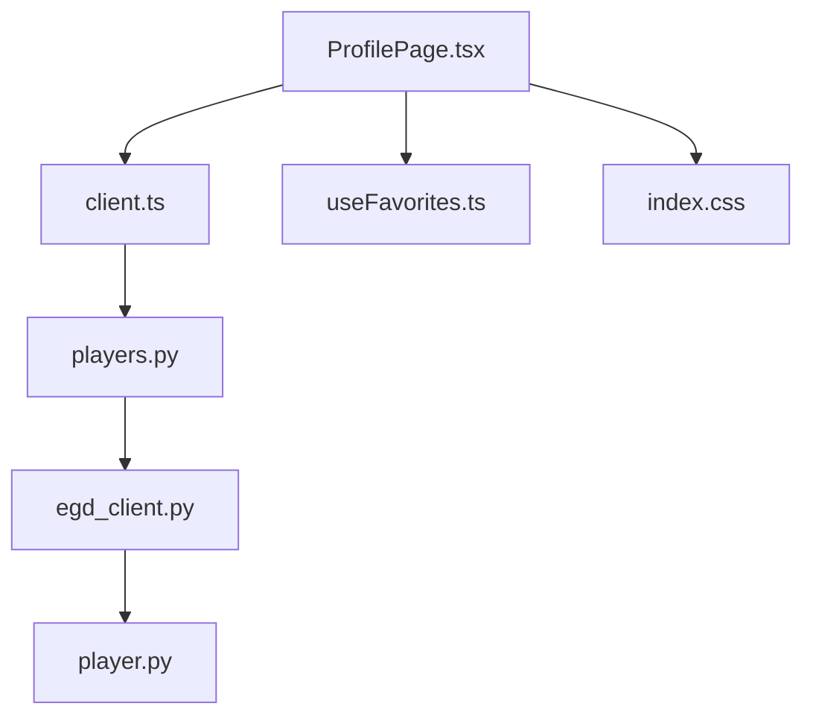

# ProfilePage Component

<cite>
**Referenced Files in This Document**
- [ProfilePage.tsx](file://frontend/src/pages/ProfilePage.tsx)
- [client.ts](file://frontend/src/api/client.ts)
- [players.py](file://backend/app/routers/players.py)
- [egd_client.py](file://backend/app/services/egd_client.py)
- [player.py](file://backend/app/models/player.py)
- [useFavorites.ts](file://frontend/src/hooks/useFavorites.ts)
- [index.css](file://frontend/src/index.css)
</cite>

## Table of Contents
1. [Introduction](#introduction)
2. [Project Structure](#project-structure)
3. [Core Components](#core-components)
4. [Architecture Overview](#architecture-overview)
5. [Detailed Component Analysis](#detailed-component-analysis)
6. [Dependency Analysis](#dependency-analysis)
7. [Performance Considerations](#performance-considerations)
8. [Troubleshooting Guide](#troubleshooting-guide)
9. [Conclusion](#conclusion)

## Introduction
This document provides comprehensive documentation for the ProfilePage component, which displays a Go player’s profile including biographical information, rating evolution charts using Recharts, tournament history, and game statistics. It explains data fetching patterns from the backend to the frontend, chart implementation details, responsive design considerations, error handling, loading states, and user interactions such as favoriting players and navigating between views.

## Project Structure
The ProfilePage is part of a React + TypeScript frontend that consumes a FastAPI backend. The backend integrates with an external GraphQL API (EGD) to retrieve player data.



**Diagram sources**
- [ProfilePage.tsx:1-30](file://frontend/src/pages/ProfilePage.tsx#L1-L30)
- [client.ts:64-72](file://frontend/src/api/client.ts#L64-L72)
- [players.py:43-80](file://backend/app/routers/players.py#L43-L80)
- [egd_client.py:72-118](file://backend/app/services/egd_client.py#L72-L118)
- [player.py:39-52](file://backend/app/models/player.py#L39-L52)
- [index.css:33-38](file://frontend/src/index.css#L33-L38)

**Section sources**
- [ProfilePage.tsx:1-30](file://frontend/src/pages/ProfilePage.tsx#L1-L30)
- [client.ts:1-86](file://frontend/src/api/client.ts#L1-L86)
- [players.py:1-107](file://backend/app/routers/players.py#L1-L107)
- [egd_client.py:1-197](file://backend/app/services/egd_client.py#L1-L197)
- [player.py:1-60](file://backend/app/models/player.py#L1-L60)
- [useFavorites.ts:1-49](file://frontend/src/hooks/useFavorites.ts#L1-L49)
- [index.css:1-313](file://frontend/src/index.css#L1-L313)

## Core Components
- ProfilePage: Displays player details, stats, rating evolution chart, and tournament history table. Handles loading and error states, favorites toggle, and navigation.
- RatingTooltip: Custom tooltip for interactive chart points showing tournament name, date, city, rating delta, placement, and W/L.
- StatCard: Reusable card for displaying key metrics like grade, rating, change, proposed grade, tournaments, and EGF rank.
- useFavorites hook: Manages local favorite list persisted in localStorage; supports add/remove/toggle and membership checks.
- API client: Provides functions to fetch player details and related data via REST endpoints.
- Backend routers and services: Transform EGD GraphQL responses into structured JSON for the frontend.

Key responsibilities:
- Data fetching: Uses React Query to fetch player details by PIN.
- Chart rendering: Builds chart data from rating_history and renders a ComposedChart with Area and Line series.
- User interaction: Favorites toggle updates UI state and persists locally; back navigation uses router.
- Error and loading states: Shows spinner while loading and error message with navigation on failure.

**Section sources**
- [ProfilePage.tsx:11-239](file://frontend/src/pages/ProfilePage.tsx#L11-L239)
- [ProfilePage.tsx:253-274](file://frontend/src/pages/ProfilePage.tsx#L253-L274)
- [ProfilePage.tsx:276-285](file://frontend/src/pages/ProfilePage.tsx#L276-L285)
- [useFavorites.ts:6-48](file://frontend/src/hooks/useFavorites.ts#L6-L48)
- [client.ts:64-72](file://frontend/src/api/client.ts#L64-L72)

## Architecture Overview
The ProfilePage orchestrates data retrieval and presentation across multiple layers:



**Diagram sources**
- [ProfilePage.tsx:16-20](file://frontend/src/pages/ProfilePage.tsx#L16-L20)
- [client.ts:64-67](file://frontend/src/api/client.ts#L64-L67)
- [players.py:43-80](file://backend/app/routers/players.py#L43-L80)
- [egd_client.py:72-118](file://backend/app/services/egd_client.py#L72-L118)

## Detailed Component Analysis

### ProfilePage Rendering Flow
The component performs these steps:
- Extracts route parameter pin and navigational utilities.
- Fetches player data using React Query with a cache key based on pin.
- Renders loading spinner during initial fetch.
- On error or missing data, shows an error view with a “Back to Search” button.
- Computes chart data from rating_history, filters entries with valid ratings, maps fields, and calculates peak rating.
- Determines if the player is a Dan grade and whether a photo URL exists.
- Renders header with photo or stone badge, name, metadata, and favorite toggle.
- Displays stat cards for grade, rating, change, proposed grade, tournaments, and EGF rank.
- Renders rating evolution chart when data is present.
- Renders tournament history table with computed deltas and color-coded changes.



**Diagram sources**
- [ProfilePage.tsx:11-20](file://frontend/src/pages/ProfilePage.tsx#L11-L20)
- [ProfilePage.tsx:22-42](file://frontend/src/pages/ProfilePage.tsx#L22-L42)
- [ProfilePage.tsx:44-67](file://frontend/src/pages/ProfilePage.tsx#L44-L67)
- [ProfilePage.tsx:69-239](file://frontend/src/pages/ProfilePage.tsx#L69-L239)

**Section sources**
- [ProfilePage.tsx:11-239](file://frontend/src/pages/ProfilePage.tsx#L11-L239)

### Data Fetching Patterns
- Frontend:
  - getPlayer(pin) calls GET /api/player/{pin}.
  - React Query caches results keyed by ['player', pin], enabling efficient re-fetching and memoization.
- Backend:
  - /api/player/{pin} retrieves player details and transforms placements into rating_history.
  - egd_client.get_player_by_pin queries EGD GraphQL for player and placements, then returns structured data.
- Types:
  - PlayerDetail includes deltaRating, proposedGrade, egfPlacement, rating_history, and optional biography.



**Diagram sources**
- [client.ts:64-67](file://frontend/src/api/client.ts#L64-L67)
- [players.py:43-80](file://backend/app/routers/players.py#L43-L80)
- [egd_client.py:72-118](file://backend/app/services/egd_client.py#L72-L118)

**Section sources**
- [client.ts:64-72](file://frontend/src/api/client.ts#L64-L72)
- [players.py:43-80](file://backend/app/routers/players.py#L43-L80)
- [egd_client.py:72-118](file://backend/app/services/egd_client.py#L72-L118)
- [player.py:39-52](file://backend/app/models/player.py#L39-L52)

### Chart Implementations (Recharts)
- Data preparation:
  - Filters entries where rating_after is not null.
  - Maps fields to chart-friendly structure including date, tournament, rating, ratingBefore, placement, grade, won, lost.
- Chart components:
  - ResponsiveContainer ensures responsiveness.
  - ComposedChart combines Area (gradient fill) and Line (monotone curve).
  - XAxis formats dates; YAxis auto domain.
  - Tooltip shows detailed info per data point.
  - ReferenceLine marks peak rating.
- Interactivity:
  - activeDot highlights hovered points.
  - Tooltip computes delta from ratingBefore and rating.
- Accessibility:
  - role="img" and aria-label provide context for screen readers.

```mermaid
classDiagram
class ChartDataPoint {
+string date
+string tournament
+number rating
+number|null ratingBefore
+number placement
+string grade
+number won
+number lost
+string? city
}
class RatingTooltip {
+active boolean
+payload { payload : ChartDataPoint }[]
+render() JSX
}
class StatCard {
+label string
+value string
+accent boolean
+valueColor string
+render() JSX
}
ChartDataPoint <.. RatingTooltip : "uses"
StatCard <.. ProfilePage : "used by"
```

**Diagram sources**
- [ProfilePage.tsx:241-251](file://frontend/src/pages/ProfilePage.tsx#L241-L251)
- [ProfilePage.tsx:253-274](file://frontend/src/pages/ProfilePage.tsx#L253-L274)
- [ProfilePage.tsx:276-285](file://frontend/src/pages/ProfilePage.tsx#L276-L285)

**Section sources**
- [ProfilePage.tsx:44-67](file://frontend/src/pages/ProfilePage.tsx#L44-L67)
- [ProfilePage.tsx:111-186](file://frontend/src/pages/ProfilePage.tsx#L111-L186)
- [ProfilePage.tsx:253-274](file://frontend/src/pages/ProfilePage.tsx#L253-L274)

### Tournament History Table
- Displays date, tournament name with optional city, grade, rating with delta, placement, and wins/losses.
- Delta calculation: rating_after - rating_before; color-coded positive/negative values.
- Alternating row styles improve readability.



**Diagram sources**
- [ProfilePage.tsx:189-236](file://frontend/src/pages/ProfilePage.tsx#L189-L236)

**Section sources**
- [ProfilePage.tsx:189-236](file://frontend/src/pages/ProfilePage.tsx#L189-L236)

### Biographical Information and Header
- Photo display: If biography.photo exists, show image; otherwise render a stone badge representing grade.
- Metadata: PIN, country code, club, and grade label.
- Favorite toggle: Updates local favorites and toggles button state.



**Diagram sources**
- [ProfilePage.tsx:65-97](file://frontend/src/pages/ProfilePage.tsx#L65-L97)
- [useFavorites.ts:6-48](file://frontend/src/hooks/useFavorites.ts#L6-L48)

**Section sources**
- [ProfilePage.tsx:65-97](file://frontend/src/pages/ProfilePage.tsx#L65-L97)
- [useFavorites.ts:6-48](file://frontend/src/hooks/useFavorites.ts#L6-L48)

### Navigation and User Interaction Patterns
- Back navigation: Button triggers navigate(-1) to return to previous page.
- Error recovery: “Back to Search” button navigates to root search page.
- Favorites: Toggle adds/removes player from favorites and persists to localStorage.

**Section sources**
- [ProfilePage.tsx:22-42](file://frontend/src/pages/ProfilePage.tsx#L22-L42)
- [ProfilePage.tsx:73-96](file://frontend/src/pages/ProfilePage.tsx#L73-L96)
- [useFavorites.ts:20-45](file://frontend/src/hooks/useFavorites.ts#L20-L45)

### Responsive Design Considerations
- Grid background pattern applied via go-grid-bg class.
- Stats grid uses auto-fill minmax columns for adaptability.
- Chart container uses ResponsiveContainer to scale width and height.
- Table wrapper enables horizontal scrolling on small screens.
- CSS variables define consistent theming and colors.

**Section sources**
- [ProfilePage.tsx:100-108](file://frontend/src/pages/ProfilePage.tsx#L100-L108)
- [ProfilePage.tsx:114-173](file://frontend/src/pages/ProfilePage.tsx#L114-L173)
- [ProfilePage.tsx:361-364](file://frontend/src/pages/ProfilePage.tsx#L361-L364)
- [index.css:33-38](file://frontend/src/index.css#L33-L38)

## Dependency Analysis
The following diagram illustrates dependencies among core files involved in the ProfilePage feature:



**Diagram sources**
- [ProfilePage.tsx:1-10](file://frontend/src/pages/ProfilePage.tsx#L1-L10)
- [client.ts:64-72](file://frontend/src/api/client.ts#L64-L72)
- [players.py:43-80](file://backend/app/routers/players.py#L43-L80)
- [egd_client.py:72-118](file://backend/app/services/egd_client.py#L72-L118)
- [player.py:39-52](file://backend/app/models/player.py#L39-L52)
- [index.css:33-38](file://frontend/src/index.css#L33-L38)

**Section sources**
- [ProfilePage.tsx:1-10](file://frontend/src/pages/ProfilePage.tsx#L1-L10)
- [client.ts:64-72](file://frontend/src/api/client.ts#L64-L72)
- [players.py:43-80](file://backend/app/routers/players.py#L43-L80)
- [egd_client.py:72-118](file://backend/app/services/egd_client.py#L72-L118)
- [player.py:39-52](file://backend/app/models/player.py#L39-L52)
- [index.css:33-38](file://frontend/src/index.css#L33-L38)

## Performance Considerations
- Caching:
  - React Query caches player data by query key, reducing redundant network requests.
  - Backend EGD client implements in-memory caching with TTL to minimize external API calls.
- Memoization:
  - useMemo used to compute chartData and peakRating, avoiding unnecessary recalculations.
- Rendering efficiency:
  - Conditional rendering of chart and table sections prevents unnecessary work when data is absent.
- Responsiveness:
  - ResponsiveContainer adapts chart dimensions to container size without manual recalculation.

[No sources needed since this section provides general guidance]

## Troubleshooting Guide
Common issues and resolutions:
- Missing player data:
  - Symptom: Error view displayed with “Failed to load player data.”
  - Cause: Network error or 404 from backend.
  - Resolution: Verify PIN validity and backend availability; use “Back to Search” to retry.
- Empty rating history:
  - Symptom: No chart rendered.
  - Cause: No entries with rating_after.
  - Resolution: Confirm backend returns placements; ensure filtering logic matches data schema.
- Incorrect grade badge:
  - Symptom: Stone badge shows incorrect grade.
  - Cause: Grade string parsing logic.
  - Resolution: Validate grade format and update detection logic accordingly.
- LocalStorage errors:
  - Symptom: Favorites not persisting.
  - Cause: Storage quota exceeded or corrupted data.
  - Resolution: Clear storage and re-add favorites; handle parse errors gracefully.

**Section sources**
- [ProfilePage.tsx:33-42](file://frontend/src/pages/ProfilePage.tsx#L33-L42)
- [ProfilePage.tsx:44-58](file://frontend/src/pages/ProfilePage.tsx#L44-L58)
- [useFavorites.ts:7-18](file://frontend/src/hooks/useFavorites.ts#L7-L18)

## Conclusion
The ProfilePage component effectively presents a player’s profile with robust data fetching, interactive charts, and clear user interactions. It leverages React Query for efficient caching, Recharts for rich visualizations, and a well-structured backend pipeline to transform external GraphQL data into a usable format. Error handling and loading states ensure a resilient user experience, while responsive design and accessibility features enhance usability across devices.