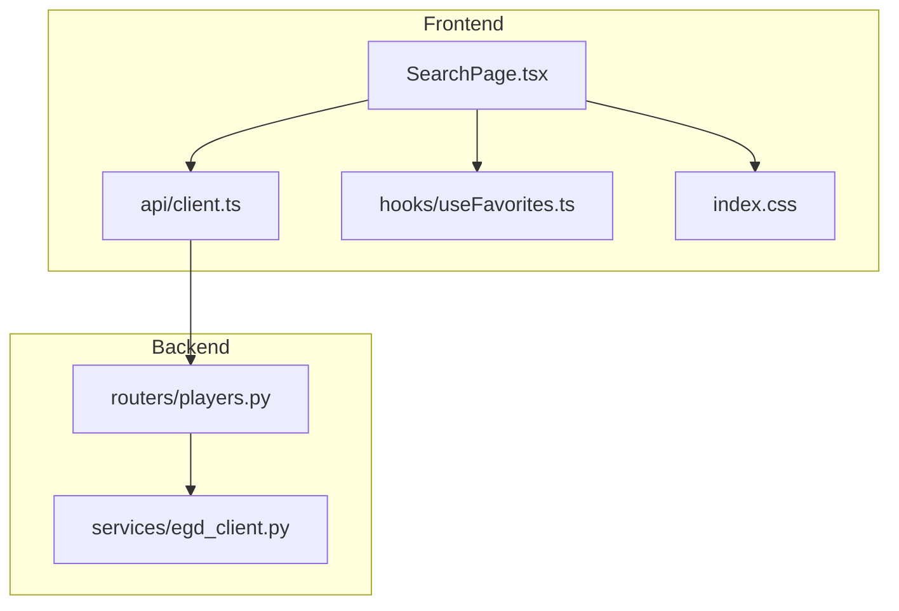
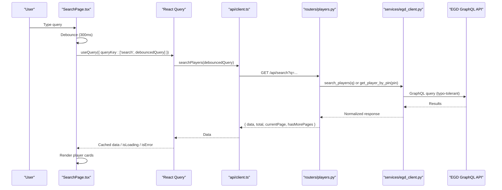
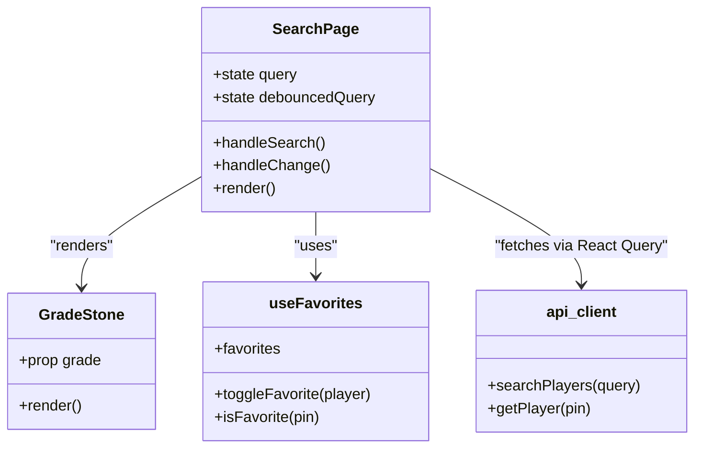
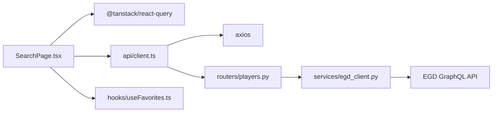

# SearchPage Component

<cite>
**Referenced Files in This Document**
- [SearchPage.tsx](file://frontend/src/pages/SearchPage.tsx)
- [client.ts](file://frontend/src/api/client.ts)
- [useFavorites.ts](file://frontend/src/hooks/useFavorites.ts)
- [players.py](file://backend/app/routers/players.py)
- [egd_client.py](file://backend/app/services/egd_client.py)
- [index.css](file://frontend/src/index.css)
- [ProfilePage.tsx](file://frontend/src/pages/ProfilePage.tsx)
</cite>

## Table of Contents
1. [Introduction](#introduction)
2. [Project Structure](#project-structure)
3. [Core Components](#core-components)
4. [Architecture Overview](#architecture-overview)
5. [Detailed Component Analysis](#detailed-component-analysis)
6. [Dependency Analysis](#dependency-analysis)
7. [Performance Considerations](#performance-considerations)
8. [Troubleshooting Guide](#troubleshooting-guide)
9. [Conclusion](#conclusion)

## Introduction
This document provides comprehensive documentation for the SearchPage component, focusing on:
- Typo-tolerant search behavior and how it is achieved end-to-end
- Debounced search implementation to reduce network requests
- Player result display with Go stone-styled grade badges and country flags
- React Query usage for data fetching, caching, error handling, and loading states
- Favorites integration using a local storage-backed hook
- Navigation from search results to player profiles
- Responsive grid layout for player cards

The goal is to make the system understandable for both technical and non-technical readers while providing precise references to source files.

## Project Structure
The Search feature spans frontend and backend layers:
- Frontend: SearchPage component orchestrates UI, debouncing, React Query, favorites, and navigation
- API client: Axios-based HTTP client with typed interfaces for search and player details
- Backend: FastAPI router that accepts search queries and delegates to an EGD GraphQL client
- EGD client: Caches GraphQL responses and performs typo-tolerant searches via the European Go Database API
- Styling: Shared CSS variables and animations for Go-themed visuals

**Diagram sources**
- [SearchPage.tsx:1-240](file://frontend/src/pages/SearchPage.tsx#L1-L240)
- [client.ts:1-86](file://frontend/src/api/client.ts#L1-L86)
- [useFavorites.ts:1-49](file://frontend/src/hooks/useFavorites.ts#L1-L49)
- [index.css:1-313](file://frontend/src/index.css#L1-L313)
- [players.py:1-107](file://backend/app/routers/players.py#L1-L107)
- [egd_client.py:1-197](file://backend/app/services/egd_client.py#L1-L197)

**Section sources**
- [SearchPage.tsx:1-240](file://frontend/src/pages/SearchPage.tsx#L1-L240)
- [client.ts:1-86](file://frontend/src/api/client.ts#L1-L86)
- [useFavorites.ts:1-49](file://frontend/src/hooks/useFavorites.ts#L1-L49)
- [index.css:1-313](file://frontend/src/index.css#L1-L313)
- [players.py:1-107](file://backend/app/routers/players.py#L1-L107)
- [egd_client.py:1-197](file://backend/app/services/egd_client.py#L1-L197)

## Core Components
- SearchPage: Manages input state, debouncing, React Query configuration, rendering results, and navigation
- API client: Defines typed interfaces and functions for searching players and fetching player details
- useFavorites: Local storage-backed hook for toggling favorites and checking favorite status
- Backend router: Accepts search queries, supports PIN-first lookup, and returns standardized search responses
- EGD client: Performs GraphQL queries with TTL-based caching and typo-tolerant name search

Key responsibilities:
- Debounce user input to avoid excessive requests
- Enable queries only when query length meets minimum threshold
- Cache search results for a configured time window
- Display loading and error states consistently
- Render player cards with grade visualization and country flags
- Integrate favorites without blocking UI

**Section sources**
- [SearchPage.tsx:1-240](file://frontend/src/pages/SearchPage.tsx#L1-L240)
- [client.ts:1-86](file://frontend/src/api/client.ts#L1-L86)
- [useFavorites.ts:1-49](file://frontend/src/hooks/useFavorites.ts#L1-L49)
- [players.py:1-107](file://backend/app/routers/players.py#L1-L107)
- [egd_client.py:1-197](file://backend/app/services/egd_client.py#L1-L197)

## Architecture Overview
End-to-end flow for a search request:

**Diagram sources**
- [SearchPage.tsx:13-23](file://frontend/src/pages/SearchPage.tsx#L13-L23)
- [client.ts:59-62](file://frontend/src/api/client.ts#L59-L62)
- [players.py:8-40](file://backend/app/routers/players.py#L8-L40)
- [egd_client.py:44-70](file://backend/app/services/egd_client.py#L44-L70)

## Detailed Component Analysis

### SearchPage Component
Responsibilities:
- Input handling and debouncing
- Query enabling and caching via React Query
- Rendering loading, error, no-results, and results states
- Navigating to player profile pages
- Integrating favorites toggle per card
- Visualizing grades with Go stone styling and displaying country flags

Debounced search:
- A 300ms timeout updates a debounced query state used by React Query
- Queries are enabled only when the debounced query length is at least 2 characters
- The form submission explicitly sets the debounced query to ensure immediate search on Enter

React Query configuration:
- queryKey includes the debounced query to differentiate cache entries
- staleTime is set to cache results for one minute
- isLoading and isError are used to show consistent feedback

Player result display:
- Results are rendered in a responsive grid
- Each card shows name, grade badge, country flag, rating, tournaments, and optional club
- Clicking a card navigates to the player profile route using the player’s PIN

Grade visualization:
- A GradeStone component renders a circular badge styled like a Go stone
- Dan grades render black stones; Kyū grades render white stones

Country flags:
- A mapping converts ISO country codes to Unicode flag emojis
- Fallback displays the code if not found

Favorites integration:
- Each card has a star button that toggles favorites via the useFavorites hook
- The icon reflects current favorite status

Responsive grid layout:
- Uses CSS Grid with auto-fill and minmax to adapt to screen width
- Card hover effects provide subtle interactivity

Error handling patterns:
- Displays a friendly error message when the search fails
- Shows a “no results” hint when the query yields zero matches after debounce

Examples:
- Search query handling: see input onChange and form onSubmit handlers
- Navigation to player profiles: onClick handler uses navigate with the player’s PIN
- Loading states: spinner and text shown during fetches

**Section sources**
- [SearchPage.tsx:1-240](file://frontend/src/pages/SearchPage.tsx#L1-L240)
- [index.css:32-136](file://frontend/src/index.css#L32-L136)

#### Class-like structure overview
While SearchPage is function-based, the following diagram highlights its internal components and relationships:

**Diagram sources**
- [SearchPage.tsx:1-240](file://frontend/src/pages/SearchPage.tsx#L1-L240)
- [client.ts:59-67](file://frontend/src/api/client.ts#L59-L67)
- [useFavorites.ts:1-49](file://frontend/src/hooks/useFavorites.ts#L1-L49)

### API Client
- Provides typed interfaces for PlayerSummary, SearchResponse, and PlayerDetail
- Implements searchPlayers to call the backend search endpoint with query parameter q
- Implements getPlayer to retrieve detailed player information including rating history

Caching strategy:
- React Query manages client-side caching based on queryKey and staleTime
- No explicit retry or refetchOnWindowFocus configuration is present in this file

Error handling:
- Errors propagate up to React Query’s isError state for UI handling

**Section sources**
- [client.ts:1-86](file://frontend/src/api/client.ts#L1-L86)

### Favorites Hook
- Persists favorites to localStorage under a stable key
- Provides add/remove/toggle operations and a fast isFavorite check
- Avoids duplicates by comparing player PINs

Integration points:
- Used in SearchPage to toggle favorites per card
- Also used in ProfilePage to reflect favorite status on the player detail page

**Section sources**
- [useFavorites.ts:1-49](file://frontend/src/hooks/useFavorites.ts#L1-L49)

### Backend Router
- Exposes GET /api/search with a required query string parameter
- If the query is numeric, attempts direct PIN lookup first for exact match
- Otherwise falls back to name search via the EGD client
- Returns a standardized response shape compatible with the frontend

Error handling:
- Wraps exceptions in HTTP 500 responses
- Ensures consistent JSON structure for the frontend

**Section sources**
- [players.py:1-107](file://backend/app/routers/players.py#L1-L107)

### EGD Client
- Encapsulates GraphQL communication with the European Go Database
- Implements TTL-based in-memory caching to reduce external calls
- Provides typo-tolerant search through the EGD GraphQL API
- Supports retrieving player details, games, and tournament histories

Typo tolerance:
- Achieved by the underlying EGD GraphQL search implementation
- The client simply forwards the search term and receives fuzzy-matched results

Caching:
- Internal dictionary keyed by query and variables with a 5-minute TTL
- Reduces load on the external API and improves performance

**Section sources**
- [egd_client.py:1-197](file://backend/app/services/egd_client.py#L1-L197)

### Styling and Responsive Layout
- CSS variables define a Go-inspired palette (wood tones, slate, stone colors)
- Grid background pattern simulates a Go board
- Animations include spin for loading indicators and fade-in for results
- Player cards have hover effects and accessible focus styles for the search input
- Responsive grid uses auto-fill and minmax to adapt across devices

**Section sources**
- [index.css:1-313](file://frontend/src/index.css#L1-L313)

## Dependency Analysis
High-level dependencies between modules:

**Diagram sources**
- [SearchPage.tsx:1-240](file://frontend/src/pages/SearchPage.tsx#L1-L240)
- [client.ts:1-86](file://frontend/src/api/client.ts#L1-L86)
- [useFavorites.ts:1-49](file://frontend/src/hooks/useFavorites.ts#L1-L49)
- [players.py:1-107](file://backend/app/routers/players.py#L1-L107)
- [egd_client.py:1-197](file://backend/app/services/egd_client.py#L1-L197)

**Section sources**
- [SearchPage.tsx:1-240](file://frontend/src/pages/SearchPage.tsx#L1-L240)
- [client.ts:1-86](file://frontend/src/api/client.ts#L1-L86)
- [useFavorites.ts:1-49](file://frontend/src/hooks/useFavorites.ts#L1-L49)
- [players.py:1-107](file://backend/app/routers/players.py#L1-L107)
- [egd_client.py:1-197](file://backend/app/services/egd_client.py#L1-L197)

## Performance Considerations
- Debouncing reduces unnecessary network requests during rapid typing
- Minimum query length prevents trivial searches
- React Query caching avoids redundant fetches within the staleTime window
- Backend TTL caching minimizes external API calls
- Responsive grid layout ensures efficient rendering across devices

[No sources needed since this section provides general guidance]

## Troubleshooting Guide
Common issues and resolutions:
- Network errors: The UI displays a clear error message when the search fails. Verify connectivity and backend availability.
- Empty results: When no players match, a helpful hint suggests trying different spellings or searching by PIN.
- PIN vs name search: Numeric inputs trigger direct PIN lookup first; otherwise, name search is performed.
- Favorites persistence: Ensure localStorage is available; the hook gracefully initializes with an empty list if parsing fails.
- Loading states: A spinner indicates active searches; confirm that queries are enabled only when the debounced query meets the minimum length.

**Section sources**
- [SearchPage.tsx:70-81](file://frontend/src/pages/SearchPage.tsx#L70-L81)
- [SearchPage.tsx:140-145](file://frontend/src/pages/SearchPage.tsx#L140-L145)
- [players.py:11-40](file://backend/app/routers/players.py#L11-L40)
- [useFavorites.ts:7-14](file://frontend/src/hooks/useFavorites.ts#L7-L14)

## Conclusion
The SearchPage component delivers a polished, efficient search experience:
- Typo-tolerant matching is provided by the EGD GraphQL API and surfaced through a clean backend interface
- Debouncing and React Query caching optimize performance and user experience
- Player cards combine Go-themed visuals with practical information and quick navigation
- Favorites integration offers persistent personalization without impacting responsiveness
- Responsive design ensures usability across devices

[No sources needed since this section summarizes without analyzing specific files]