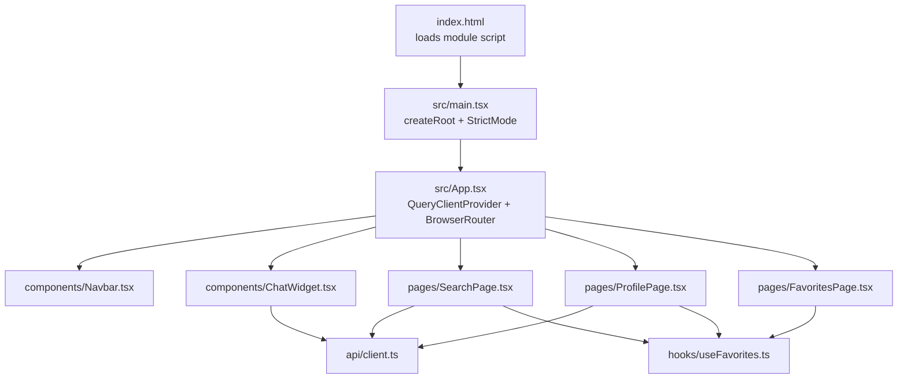
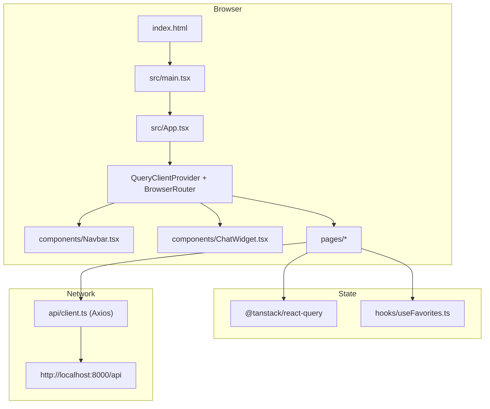
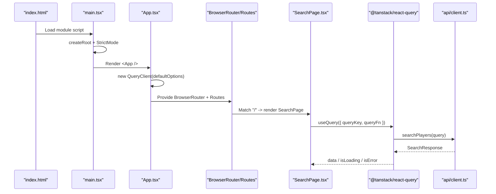
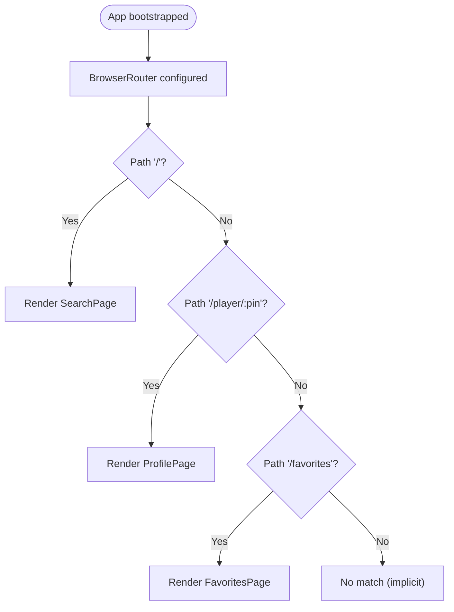
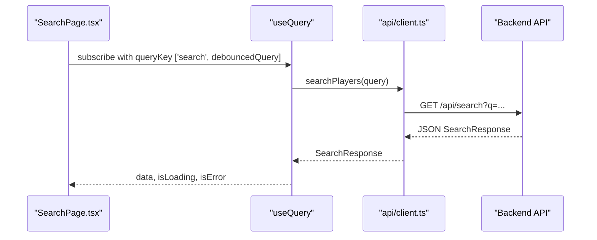
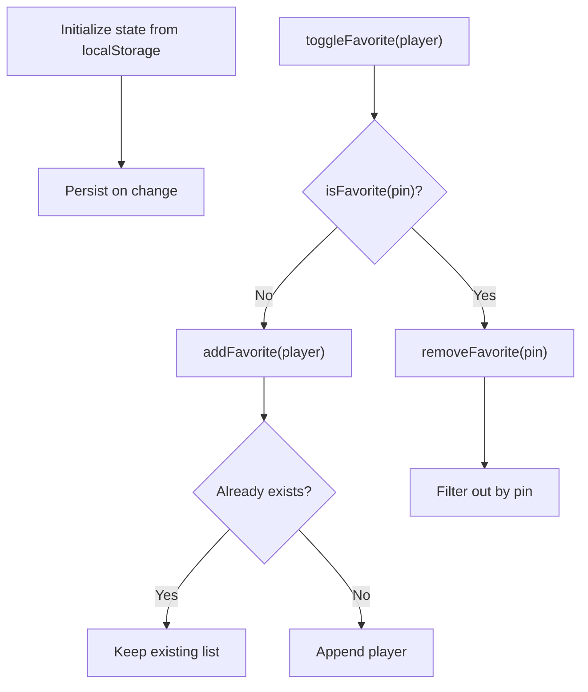
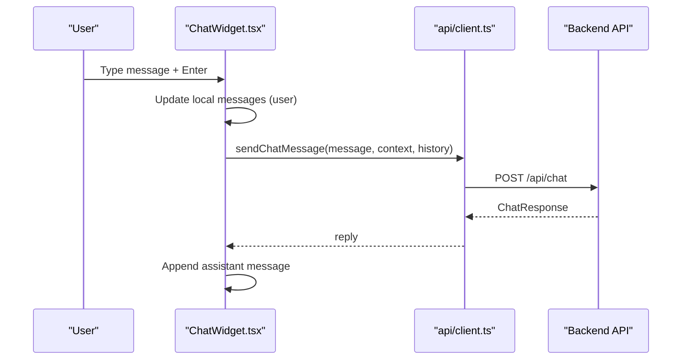
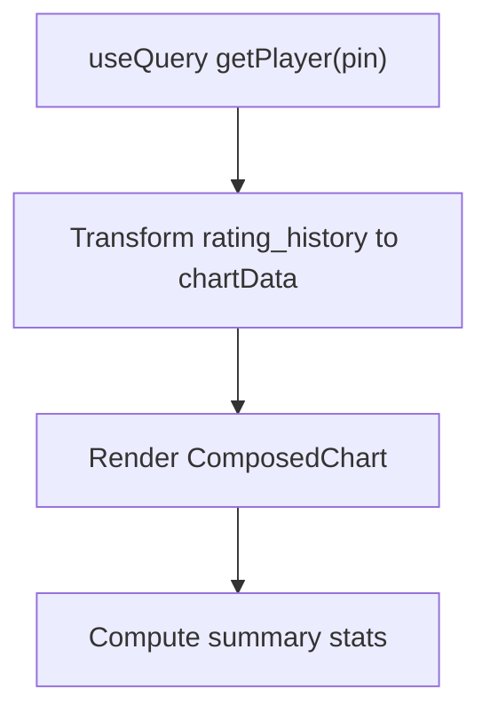
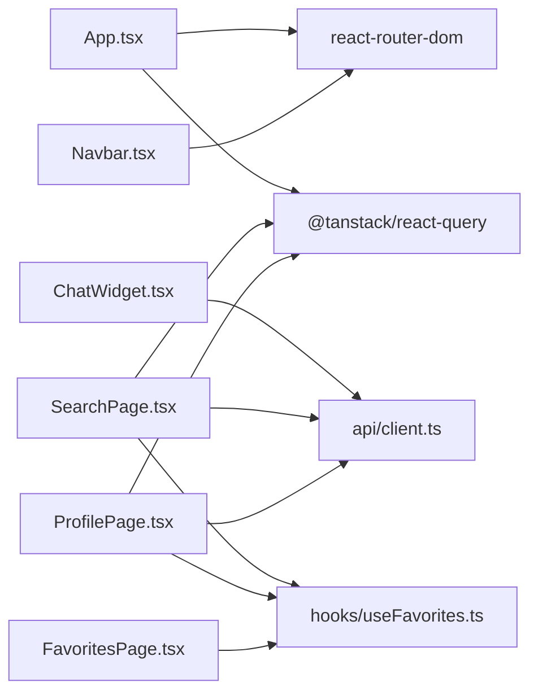

# React Application Structure

<cite>
**Referenced Files in This Document**
- [main.tsx](file://frontend/src/main.tsx)
- [App.tsx](file://frontend/src/App.tsx)
- [index.html](file://frontend/index.html)
- [vite.config.ts](file://frontend/vite.config.ts)
- [package.json](file://frontend/package.json)
- [tsconfig.json](file://frontend/tsconfig.json)
- [tsconfig.app.json](file://frontend/tsconfig.app.json)
- [tsconfig.node.json](file://frontend/tsconfig.node.json)
- [client.ts](file://frontend/src/api/client.ts)
- [Navbar.tsx](file://frontend/src/components/Navbar.tsx)
- [ChatWidget.tsx](file://frontend/src/components/ChatWidget.tsx)
- [SearchPage.tsx](file://frontend/src/pages/SearchPage.tsx)
- [ProfilePage.tsx](file://frontend/src/pages/ProfilePage.tsx)
- [FavoritesPage.tsx](file://frontend/src/pages/FavoritesPage.tsx)
- [useFavorites.ts](file://frontend/src/hooks/useFavorites.ts)
</cite>

## Table of Contents
1. Introduction
2. Project Structure
3. Core Components
4. Architecture Overview
5. Detailed Component Analysis
6. Dependency Analysis
7. Performance Considerations
8. Troubleshooting Guide
9. Conclusion

## Introduction
This document explains the React application structure and architecture for the frontend of the project. It covers the root App component setup, routing configuration with React Router 7, QueryClient initialization with TanStack Query, and the overall bootstrap process. It also documents the component hierarchy, provider patterns, core service initialization, Vite build configuration, TypeScript setup, and development environment configuration.

## Project Structure
The frontend is a modern React + TypeScript application built with Vite. The entry point renders the root App component inside React StrictMode. The App component configures global providers (TanStack Query), sets up client-side routing with React Router 7, and composes shared UI components and pages.



**Diagram sources**
- [index.html:1-14](file://frontend/index.html#L1-L14)
- [main.tsx:1-11](file://frontend/src/main.tsx#L1-L11)
- [App.tsx:1-37](file://frontend/src/App.tsx#L1-L37)
- [Navbar.tsx:1-94](file://frontend/src/components/Navbar.tsx#L1-L94)
- [ChatWidget.tsx:1-240](file://frontend/src/components/ChatWidget.tsx#L1-L240)
- [SearchPage.tsx:1-240](file://frontend/src/pages/SearchPage.tsx#L1-L240)
- [ProfilePage.tsx:1-375](file://frontend/src/pages/ProfilePage.tsx#L1-L375)
- [FavoritesPage.tsx:1-103](file://frontend/src/pages/FavoritesPage.tsx#L1-L103)
- [client.ts:1-86](file://frontend/src/api/client.ts#L1-L86)
- [useFavorites.ts:1-49](file://frontend/src/hooks/useFavorites.ts#L1-L49)

**Section sources**
- [index.html:1-14](file://frontend/index.html#L1-L14)
- [main.tsx:1-11](file://frontend/src/main.tsx#L1-L11)
- [App.tsx:1-37](file://frontend/src/App.tsx#L1-L37)

## Core Components
- Root bootstrap:
  - The HTML file defines the root DOM node and loads the module entry.
  - The entry script creates the React root and wraps App in StrictMode.
- Global providers:
  - QueryClient is instantiated once at the top level and provided via QueryClientProvider.
  - Routing is enabled by wrapping the app with BrowserRouter.
- Shared layout:
  - A sticky Navbar provides navigation links across routes.
  - A floating ChatWidget offers an assistant interface that calls the backend chat endpoint.
- Pages:
  - SearchPage performs debounced search queries using TanStack Query and navigates to player profiles.
  - ProfilePage fetches detailed player data, displays stats, and visualizes rating evolution.
  - FavoritesPage lists locally persisted favorites and allows removal.

Key responsibilities:
- Data fetching and caching are centralized through TanStack Query hooks in pages.
- Client HTTP requests are encapsulated in a typed API client.
- Local state for favorites is managed via a custom hook with localStorage persistence.

**Section sources**
- [index.html:1-14](file://frontend/index.html#L1-L14)
- [main.tsx:1-11](file://frontend/src/main.tsx#L1-L11)
- [App.tsx:1-37](file://frontend/src/App.tsx#L1-L37)
- [Navbar.tsx:1-94](file://frontend/src/components/Navbar.tsx#L1-L94)
- [ChatWidget.tsx:1-240](file://frontend/src/components/ChatWidget.tsx#L1-L240)
- [SearchPage.tsx:1-240](file://frontend/src/pages/SearchPage.tsx#L1-L240)
- [ProfilePage.tsx:1-375](file://frontend/src/pages/ProfilePage.tsx#L1-L375)
- [FavoritesPage.tsx:1-103](file://frontend/src/pages/FavoritesPage.tsx#L1-L103)
- [client.ts:1-86](file://frontend/src/api/client.ts#L1-L86)
- [useFavorites.ts:1-49](file://frontend/src/hooks/useFavorites.ts#L1-L49)

## Architecture Overview
The application follows a layered approach:
- Presentation layer: React components and pages.
- State management: TanStack Query for server state; local state for UI and favorites.
- Networking: Axios-based API client with typed interfaces.
- Routing: React Router 7 with route elements mapped to page components.
- Build tooling: Vite with React plugin and TypeScript.



**Diagram sources**
- [index.html:1-14](file://frontend/index.html#L1-L14)
- [main.tsx:1-11](file://frontend/src/main.tsx#L1-L11)
- [App.tsx:1-37](file://frontend/src/App.tsx#L1-L37)
- [client.ts:1-86](file://frontend/src/api/client.ts#L1-L86)
- [useFavorites.ts:1-49](file://frontend/src/hooks/useFavorites.ts#L1-L49)
- [SearchPage.tsx:1-240](file://frontend/src/pages/SearchPage.tsx#L1-L240)
- [ProfilePage.tsx:1-375](file://frontend/src/pages/ProfilePage.tsx#L1-L375)
- [ChatWidget.tsx:1-240](file://frontend/src/components/ChatWidget.tsx#L1-L240)

## Detailed Component Analysis

### Bootstrap and Provider Setup
- index.html defines the root element and loads the module entry.
- main.tsx mounts the React tree with createRoot and wraps App in StrictMode.
- App.tsx:
  - Instantiates QueryClient with default options (e.g., retry count and stale time).
  - Provides QueryClientProvider around the entire app.
  - Wraps content with BrowserRouter and declares Routes mapping to page components.
  - Renders shared Navbar and ChatWidget alongside routed content.



**Diagram sources**
- [index.html:1-14](file://frontend/index.html#L1-L14)
- [main.tsx:1-11](file://frontend/src/main.tsx#L1-L11)
- [App.tsx:1-37](file://frontend/src/App.tsx#L1-L37)
- [SearchPage.tsx:1-240](file://frontend/src/pages/SearchPage.tsx#L1-L240)
- [client.ts:1-86](file://frontend/src/api/client.ts#L1-L86)

**Section sources**
- [index.html:1-14](file://frontend/index.html#L1-L14)
- [main.tsx:1-11](file://frontend/src/main.tsx#L1-L11)
- [App.tsx:1-37](file://frontend/src/App.tsx#L1-L37)

### Routing Configuration (React Router 7)
- Routes are defined within App.tsx:
  - "/" maps to SearchPage.
  - "/player/:pin" maps to ProfilePage.
  - "/favorites" maps to FavoritesPage.
- Navigation:
  - Navbar uses NavLink for active styling and navigation.
  - Pages use useNavigate for programmatic navigation.



**Diagram sources**
- [App.tsx:1-37](file://frontend/src/App.tsx#L1-L37)
- [Navbar.tsx:1-94](file://frontend/src/components/Navbar.tsx#L1-L94)
- [SearchPage.tsx:1-240](file://frontend/src/pages/SearchPage.tsx#L1-L240)
- [ProfilePage.tsx:1-375](file://frontend/src/pages/ProfilePage.tsx#L1-L375)
- [FavoritesPage.tsx:1-103](file://frontend/src/pages/FavoritesPage.tsx#L1-L103)

**Section sources**
- [App.tsx:1-37](file://frontend/src/App.tsx#L1-L37)
- [Navbar.tsx:1-94](file://frontend/src/components/Navbar.tsx#L1-L94)

### QueryClient Initialization and Usage
- QueryClient is created once with default options including retry and staleTime.
- Pages consume server state via useQuery:
  - SearchPage uses a debounced query key and enables queries only when input length meets a threshold.
  - ProfilePage fetches player details keyed by URL parameter pin.

```mermaid
classDiagram
class QueryClient {
+defaultOptions
+queries.retry
+queries.staleTime
}
class SearchPage {
+useQuery({ queryKey, queryFn, enabled, staleTime })
}
class ProfilePage {
+useQuery({ queryKey, queryFn, enabled })
}
class APIClient {
+searchPlayers()
+getPlayer()
}
SearchPage --> QueryClient : "uses"
ProfilePage --> QueryClient : "uses"
SearchPage --> APIClient : "calls"
ProfilePage --> APIClient : "calls"
```

**Diagram sources**
- [App.tsx:1-37](file://frontend/src/App.tsx#L1-L37)
- [SearchPage.tsx:1-240](file://frontend/src/pages/SearchPage.tsx#L1-L240)
- [ProfilePage.tsx:1-375](file://frontend/src/pages/ProfilePage.tsx#L1-L375)
- [client.ts:1-86](file://frontend/src/api/client.ts#L1-L86)

**Section sources**
- [App.tsx:1-37](file://frontend/src/App.tsx#L1-L37)
- [SearchPage.tsx:1-240](file://frontend/src/pages/SearchPage.tsx#L1-L240)
- [ProfilePage.tsx:1-375](file://frontend/src/pages/ProfilePage.tsx#L1-L375)

### API Client and Data Models
- The API client centralizes HTTP configuration and exports typed functions for:
  - Searching players
  - Fetching player details
  - Sending chat messages
- Interfaces define request/response shapes for type safety across the app.



**Diagram sources**
- [SearchPage.tsx:1-240](file://frontend/src/pages/SearchPage.tsx#L1-L240)
- [client.ts:1-86](file://frontend/src/api/client.ts#L1-L86)

**Section sources**
- [client.ts:1-86](file://frontend/src/api/client.ts#L1-L86)

### Favorites Hook (Local State Persistence)
- useFavorites manages a list of favorite players persisted to localStorage.
- Exposes add/remove/toggle/isFavorite operations and returns current favorites.



**Diagram sources**
- [useFavorites.ts:1-49](file://frontend/src/hooks/useFavorites.ts#L1-L49)

**Section sources**
- [useFavorites.ts:1-49](file://frontend/src/hooks/useFavorites.ts#L1-L49)

### Chat Widget Flow
- ChatWidget maintains local message history and sends user messages to the backend chat endpoint.
- Displays loading indicators and error fallbacks.



**Diagram sources**
- [ChatWidget.tsx:1-240](file://frontend/src/components/ChatWidget.tsx#L1-L240)
- [client.ts:1-86](file://frontend/src/api/client.ts#L1-L86)

**Section sources**
- [ChatWidget.tsx:1-240](file://frontend/src/components/ChatWidget.tsx#L1-L240)
- [client.ts:1-86](file://frontend/src/api/client.ts#L1-L86)

### Profile Page Data Visualization
- ProfilePage fetches player detail and transforms rating_history into chart data.
- Uses Recharts to visualize rating evolution and highlights peak rating.



**Diagram sources**
- [ProfilePage.tsx:1-375](file://frontend/src/pages/ProfilePage.tsx#L1-L375)

**Section sources**
- [ProfilePage.tsx:1-375](file://frontend/src/pages/ProfilePage.tsx#L1-L375)

## Dependency Analysis
High-level dependencies among modules:



**Diagram sources**
- [App.tsx:1-37](file://frontend/src/App.tsx#L1-L37)
- [Navbar.tsx:1-94](file://frontend/src/components/Navbar.tsx#L1-L94)
- [ChatWidget.tsx:1-240](file://frontend/src/components/ChatWidget.tsx#L1-L240)
- [SearchPage.tsx:1-240](file://frontend/src/pages/SearchPage.tsx#L1-L240)
- [ProfilePage.tsx:1-375](file://frontend/src/pages/ProfilePage.tsx#L1-L375)
- [FavoritesPage.tsx:1-103](file://frontend/src/pages/FavoritesPage.tsx#L1-L103)
- [client.ts:1-86](file://frontend/src/api/client.ts#L1-L86)
- [useFavorites.ts:1-49](file://frontend/src/hooks/useFavorites.ts#L1-L49)

**Section sources**
- [package.json:1-30](file://frontend/package.json#L1-L30)

## Performance Considerations
- Debounced search reduces unnecessary network requests during typing.
- TanStack Query caching and staleTime minimize redundant fetches.
- Memoization in ProfilePage avoids recomputing chart data on unrelated re-renders.
- Using StrictMode aids in detecting side effects early during development.

[No sources needed since this section provides general guidance]

## Troubleshooting Guide
- Network connectivity:
  - Ensure the backend is running at the configured base URL.
  - Verify CORS policies if serving from a different origin.
- Query issues:
  - Confirm query keys match expected parameters (e.g., pin type conversion).
  - Check enabled conditions to avoid premature queries.
- Local storage:
  - If favorites do not persist, verify browser storage permissions and JSON serialization.
- Build and dev:
  - Use the provided scripts to run dev server, build, lint, and preview.

**Section sources**
- [client.ts:1-86](file://frontend/src/api/client.ts#L1-L86)
- [SearchPage.tsx:1-240](file://frontend/src/pages/SearchPage.tsx#L1-L240)
- [ProfilePage.tsx:1-375](file://frontend/src/pages/ProfilePage.tsx#L1-L375)
- [useFavorites.ts:1-49](file://frontend/src/hooks/useFavorites.ts#L1-L49)
- [package.json:1-30](file://frontend/package.json#L1-L30)

## Conclusion
The frontend is structured around a clear separation of concerns: a minimal bootstrap, global providers for state and routing, typed API interactions, and focused page components. TanStack Query handles server state efficiently, while a lightweight favorites hook persists user preferences locally. Vite and TypeScript provide a fast, type-safe development experience.

[No sources needed since this section summarizes without analyzing specific files]

## Appendices

### Vite Build Configuration
- Uses the official React plugin.
- Minimal configuration exposes standard Vite behavior suitable for React apps.

**Section sources**
- [vite.config.ts:1-8](file://frontend/vite.config.ts#L1-L8)
- [package.json:1-30](file://frontend/package.json#L1-L30)

### TypeScript Setup
- Root tsconfig references separate configs for app and Node environments.
- App config targets ES2023, uses bundler module resolution, JSX transform, and strict lint-related flags.
- Node config targets ES2023 with nodenext module resolution for build-time tooling.

**Section sources**
- [tsconfig.json:1-8](file://frontend/tsconfig.json#L1-L8)
- [tsconfig.app.json:1-27](file://frontend/tsconfig.app.json#L1-L27)
- [tsconfig.node.json:1-24](file://frontend/tsconfig.node.json#L1-L24)

### Development Environment Scripts
- Available scripts include dev, build, lint, and preview.
- Linting uses oxlint; building runs TypeScript then Vite.

**Section sources**
- [package.json:1-30](file://frontend/package.json#L1-L30)