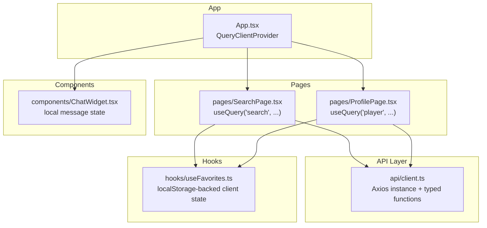
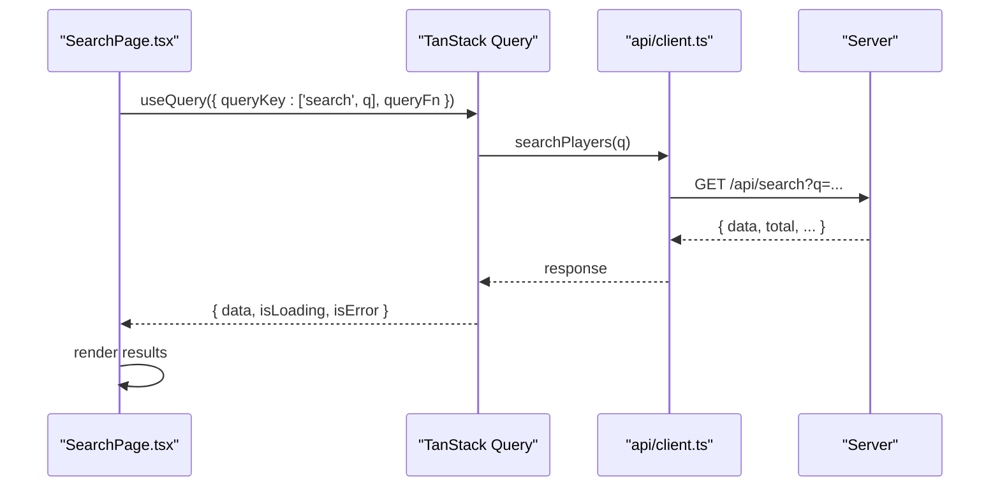
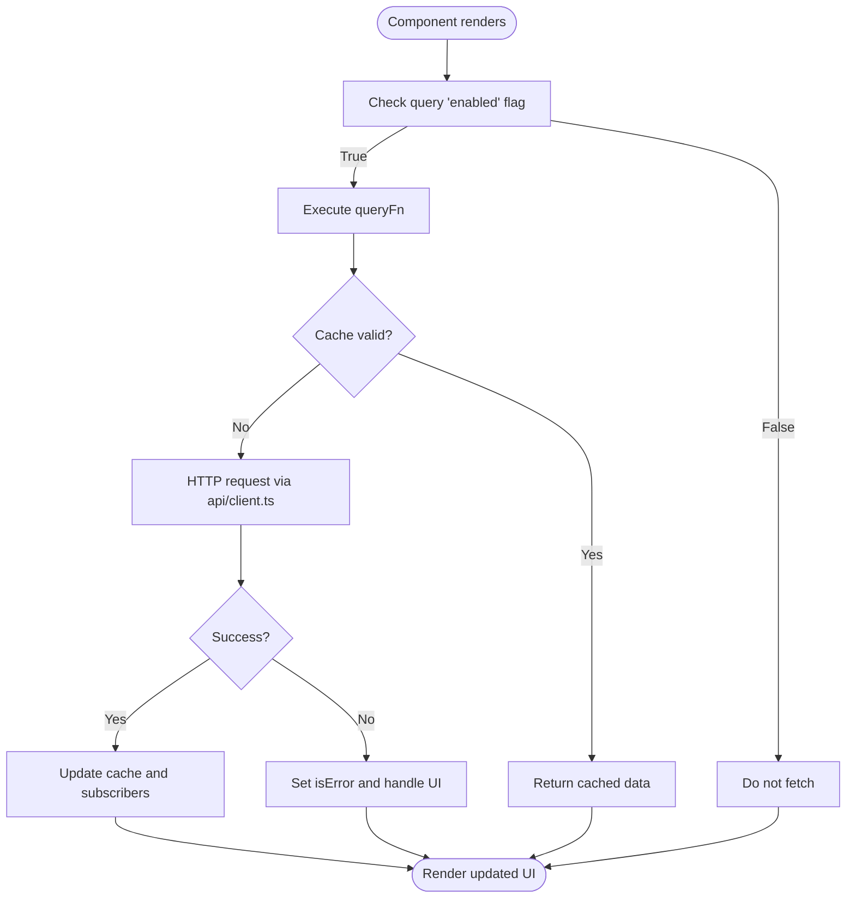
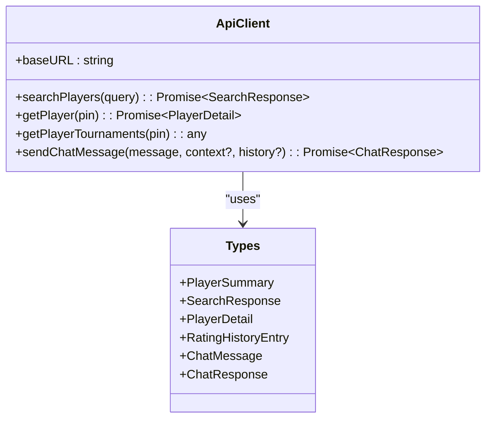
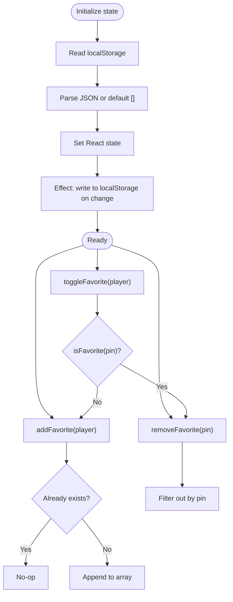
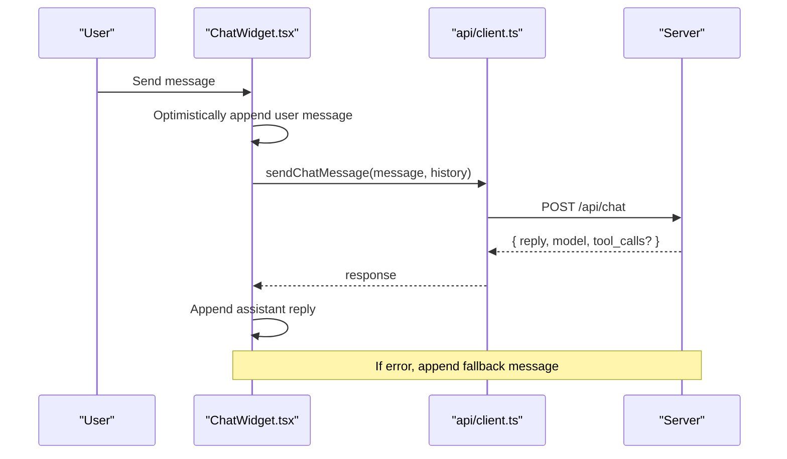
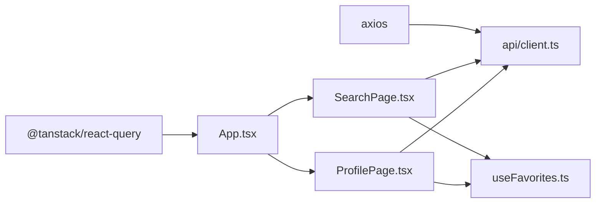

# State Management

<cite>
**Referenced Files in This Document**
- [App.tsx](file://frontend/src/App.tsx)
- [client.ts](file://frontend/src/api/client.ts)
- [useFavorites.ts](file://frontend/src/hooks/useFavorites.ts)
- [SearchPage.tsx](file://frontend/src/pages/SearchPage.tsx)
- [ProfilePage.tsx](file://frontend/src/pages/ProfilePage.tsx)
- [ChatWidget.tsx](file://frontend/src/components/ChatWidget.tsx)
- [package.json](file://frontend/package.json)
</cite>

## Table of Contents
1. [Introduction](#introduction)
2. [Project Structure](#project-structure)
3. [Core Components](#core-components)
4. [Architecture Overview](#architecture-overview)
5. [Detailed Component Analysis](#detailed-component-analysis)
6. [Dependency Analysis](#dependency-analysis)
7. [Performance Considerations](#performance-considerations)
8. [Troubleshooting Guide](#troubleshooting-guide)
9. [Conclusion](#conclusion)

## Introduction
This document explains the state management approach used in the frontend:
- Server state is managed with TanStack Query (React Query), providing caching, background refetching, and declarative data fetching.
- Client state for favorites is implemented via a custom hook that persists to localStorage.
- The API client is configured with Axios and centralized in a single module.
- Error handling strategies are applied at both the query level and component level.
- Caching policies include global defaults and per-query overrides.
- Additional sections cover query invalidation patterns, optimistic updates, and performance optimization techniques.

## Project Structure
The relevant parts of the frontend structure for state management:
- App-level configuration of TanStack Query
- Centralized Axios client and typed API functions
- Custom hook for client-side favorites with localStorage persistence
- Pages using useQuery for server state
- A chat widget demonstrating local mutation-like behavior without TanStack mutations

**Diagram sources**
- [App.tsx:1-37](file://frontend/src/App.tsx#L1-L37)
- [client.ts:1-86](file://frontend/src/api/client.ts#L1-L86)
- [useFavorites.ts:1-49](file://frontend/src/hooks/useFavorites.ts#L1-L49)
- [SearchPage.tsx:1-240](file://frontend/src/pages/SearchPage.tsx#L1-L240)
- [ProfilePage.tsx:1-375](file://frontend/src/pages/ProfilePage.tsx#L1-L375)
- [ChatWidget.tsx:1-240](file://frontend/src/components/ChatWidget.tsx#L1-L240)

**Section sources**
- [App.tsx:1-37](file://frontend/src/App.tsx#L1-L37)
- [client.ts:1-86](file://frontend/src/api/client.ts#L1-L86)
- [useFavorites.ts:1-49](file://frontend/src/hooks/useFavorites.ts#L1-L49)
- [SearchPage.tsx:1-240](file://frontend/src/pages/SearchPage.tsx#L1-L240)
- [ProfilePage.tsx:1-375](file://frontend/src/pages/ProfilePage.tsx#L1-L375)
- [ChatWidget.tsx:1-240](file://frontend/src/components/ChatWidget.tsx#L1-L240)

## Core Components
- TanStack Query setup and defaults
  - A QueryClient is created with default options including retry count and staleTime.
  - QueryClientProvider wraps the app to provide the client globally.
- Axios-based API client
  - A single axios instance is configured with a baseURL.
  - Typed functions encapsulate HTTP calls for search, player details, tournaments, and chat.
- Favorites client state hook
  - A custom hook manages an array of favorite players persisted to localStorage.
  - Provides add/remove/toggle/isFavorite utilities.

Key responsibilities:
- Server state: Search results and player profiles are fetched and cached by TanStack Query.
- Client state: Favorites are maintained locally and synchronized with localStorage.
- API layer: All network requests go through the Axios client with consistent error propagation.

**Section sources**
- [App.tsx:9-16](file://frontend/src/App.tsx#L9-L16)
- [client.ts:1-86](file://frontend/src/api/client.ts#L1-L86)
- [useFavorites.ts:1-49](file://frontend/src/hooks/useFavorites.ts#L1-L49)

## Architecture Overview
The application separates concerns between server state (TanStack Query), client state (custom hook), and API access (Axios). Queries are declared in pages; mutations are not currently used but can be integrated alongside the existing client.

**Diagram sources**
- [SearchPage.tsx:18-23](file://frontend/src/pages/SearchPage.tsx#L18-L23)
- [client.ts:59-62](file://frontend/src/api/client.ts#L59-L62)

## Detailed Component Analysis

### TanStack Query Configuration and Usage
- Global defaults
  - Retry policy and staleTime are set at the QueryClient level.
- Per-query overrides
  - Search uses a longer staleTime to reduce network churn during typing.
  - Player profile queries rely on enabled flags to avoid unnecessary fetches when route params are missing.

**Diagram sources**
- [App.tsx:9-16](file://frontend/src/App.tsx#L9-L16)
- [SearchPage.tsx:18-23](file://frontend/src/pages/SearchPage.tsx#L18-L23)
- [ProfilePage.tsx:16-20](file://frontend/src/pages/ProfilePage.tsx#L16-L20)
- [client.ts:59-67](file://frontend/src/api/client.ts#L59-L67)

**Section sources**
- [App.tsx:9-16](file://frontend/src/App.tsx#L9-L16)
- [SearchPage.tsx:18-23](file://frontend/src/pages/SearchPage.tsx#L18-L23)
- [ProfilePage.tsx:16-20](file://frontend/src/pages/ProfilePage.tsx#L16-L20)

### Axios API Client
- Base URL configuration
  - All endpoints are prefixed with a base URL.
- Typed interfaces
  - Strongly-typed request/response models ensure type safety across components.
- Functions
  - searchPlayers, getPlayer, getPlayerTournaments, sendChatMessage encapsulate HTTP verbs and payloads.

**Diagram sources**
- [client.ts:1-86](file://frontend/src/api/client.ts#L1-L86)

**Section sources**
- [client.ts:1-86](file://frontend/src/api/client.ts#L1-L86)

### useFavorites Hook (Client State with localStorage)
Responsibilities:
- Initialize favorites from localStorage safely.
- Persist favorites to localStorage on changes.
- Provide immutable update helpers: add, remove, toggle, check membership.

**Diagram sources**
- [useFavorites.ts:1-49](file://frontend/src/hooks/useFavorites.ts#L1-L49)

Usage examples:
- Search page toggles favorites inline.
- Profile page toggles favorites from the detail view.

**Section sources**
- [useFavorites.ts:1-49](file://frontend/src/hooks/useFavorites.ts#L1-L49)
- [SearchPage.tsx:109-115](file://frontend/src/pages/SearchPage.tsx#L109-L115)
- [ProfilePage.tsx:93-96](file://frontend/src/pages/ProfilePage.tsx#L93-L96)

### Chat Widget (Local Mutation-like Behavior)
The chat widget demonstrates a pattern similar to mutations:
- Local optimistic update by appending user messages immediately.
- Async call to sendChatMessage.
- On success, append assistant reply.
- On failure, append an error message.

**Diagram sources**
- [ChatWidget.tsx:16-37](file://frontend/src/components/ChatWidget.tsx#L16-L37)
- [client.ts:74-85](file://frontend/src/api/client.ts#L74-L85)

**Section sources**
- [ChatWidget.tsx:16-37](file://frontend/src/components/ChatWidget.tsx#L16-L37)
- [client.ts:74-85](file://frontend/src/api/client.ts#L74-L85)

## Dependency Analysis
- TanStack Query is provided at the app root and consumed by pages.
- Axios is the sole HTTP client, abstracted behind typed functions.
- The favorites hook is independent of TanStack Query and operates purely on client state.

**Diagram sources**
- [package.json:12-19](file://frontend/package.json#L12-L19)
- [App.tsx:1-37](file://frontend/src/App.tsx#L1-L37)
- [client.ts:1-86](file://frontend/src/api/client.ts#L1-L86)
- [SearchPage.tsx:1-240](file://frontend/src/pages/SearchPage.tsx#L1-L240)
- [ProfilePage.tsx:1-375](file://frontend/src/pages/ProfilePage.tsx#L1-L375)
- [useFavorites.ts:1-49](file://frontend/src/hooks/useFavorites.ts#L1-L49)

**Section sources**
- [package.json:12-19](file://frontend/package.json#L12-L19)
- [App.tsx:1-37](file://frontend/src/App.tsx#L1-L37)
- [client.ts:1-86](file://frontend/src/api/client.ts#L1-L86)
- [SearchPage.tsx:1-240](file://frontend/src/pages/SearchPage.tsx#L1-L240)
- [ProfilePage.tsx:1-375](file://frontend/src/pages/ProfilePage.tsx#L1-L375)
- [useFavorites.ts:1-49](file://frontend/src/hooks/useFavorites.ts#L1-L49)

## Performance Considerations
- Debounced search input reduces query frequency during typing.
- Per-query staleTime extends cache validity for search results.
- Global retry limits prevent excessive retries on transient failures.
- Memoization in profile page minimizes re-renders for derived chart data.

Recommendations:
- Use queryKey arrays consistently to enable precise invalidation.
- Consider adding gcTime to control how long unused caches remain in memory.
- For large lists, consider pagination or virtualization if needed.

[No sources needed since this section provides general guidance]

## Troubleshooting Guide
Common issues and strategies:
- Network errors
  - Queries expose isError; pages show user-friendly error states.
  - Global retry is limited; adjust retry options if needed.
- Empty or partial data
  - Use enabled flags to avoid fetching before required parameters exist.
  - Guard against nulls in UI rendering.
- Local storage parsing errors
  - The favorites hook catches parse exceptions and falls back to an empty array.

Operational tips:
- Inspect query keys to verify correct invalidation targets.
- Log query status (isLoading, isError) to diagnose timing issues.
- Validate localStorage size and content if favorites behave unexpectedly.

**Section sources**
- [SearchPage.tsx:77-81](file://frontend/src/pages/SearchPage.tsx#L77-L81)
- [ProfilePage.tsx:33-42](file://frontend/src/pages/ProfilePage.tsx#L33-L42)
- [useFavorites.ts:8-14](file://frontend/src/hooks/useFavorites.ts#L8-L14)

## Conclusion
The application cleanly separates server state (TanStack Query) from client state (favorites hook). The Axios client centralizes API access with strong typing. Caching policies are defined globally and overridden per query where appropriate. Error handling is visible at both the query and component levels. While mutations are not yet integrated into TanStack Query, the chat widget demonstrates a practical pattern for optimistic updates and error recovery that can be adapted to useQueryClient or useMutation in the future.