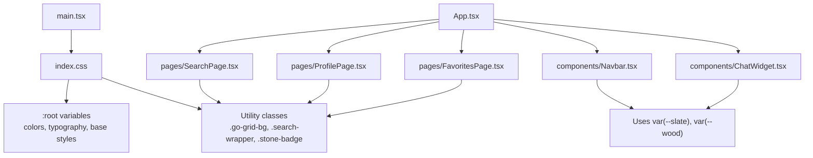
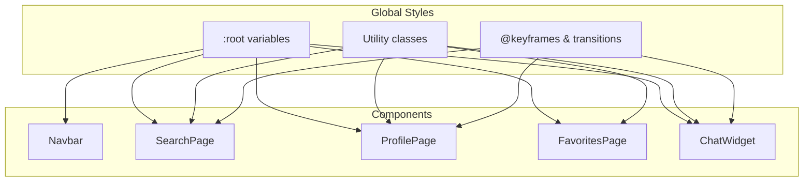
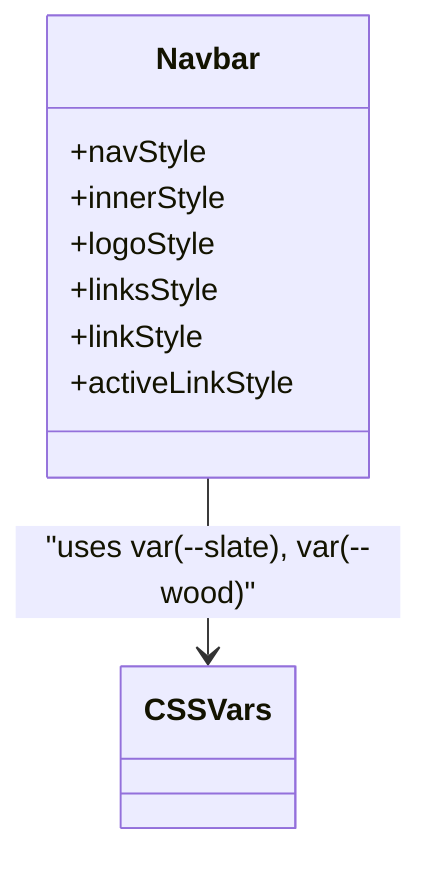
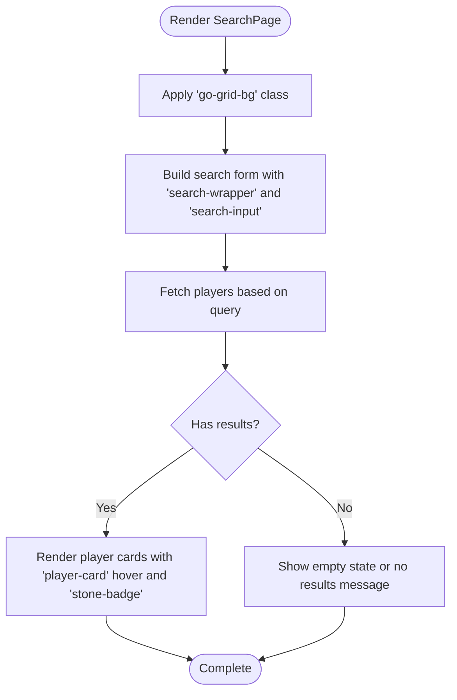
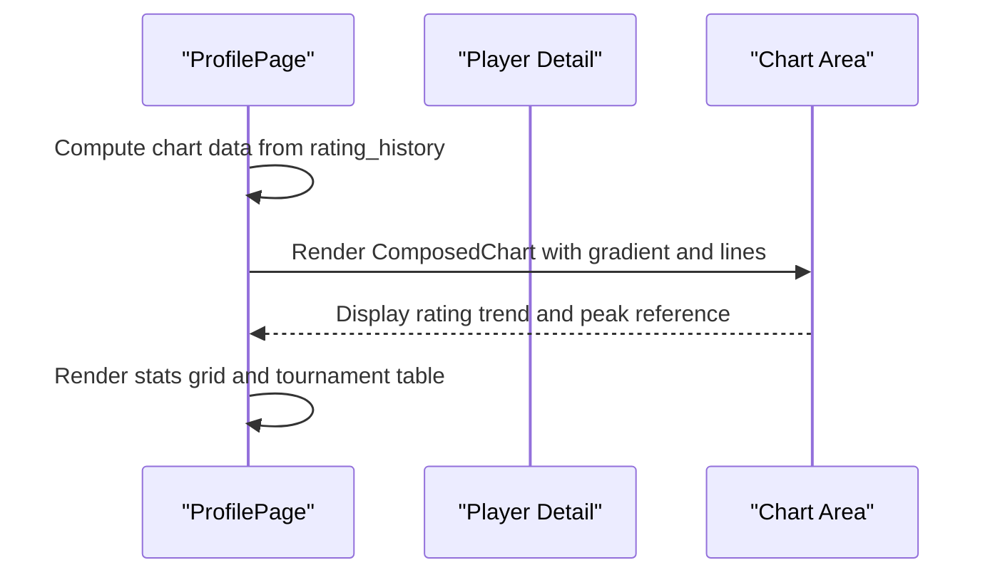
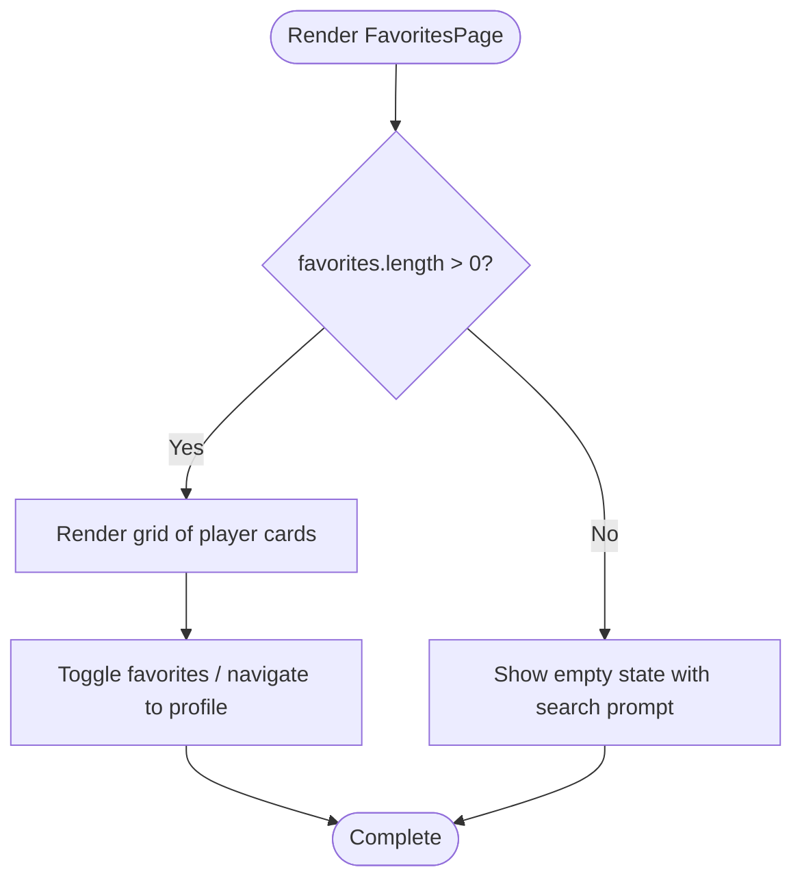
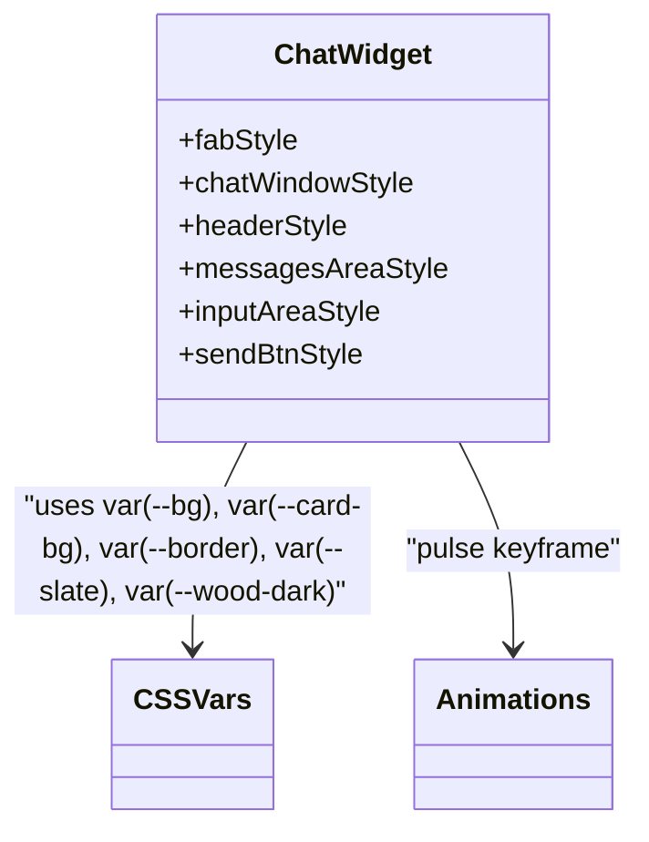
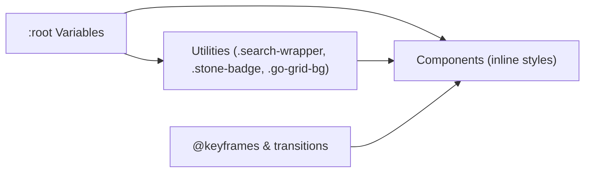

# Styling and Theming

<cite>
**Referenced Files in This Document**
- [index.css](file://frontend/src/index.css)
- [App.tsx](file://frontend/src/App.tsx)
- [main.tsx](file://frontend/src/main.tsx)
- [Navbar.tsx](file://frontend/src/components/Navbar.tsx)
- [ChatWidget.tsx](file://frontend/src/components/ChatWidget.tsx)
- [SearchPage.tsx](file://frontend/src/pages/SearchPage.tsx)
- [ProfilePage.tsx](file://frontend/src/pages/ProfilePage.tsx)
- [FavoritesPage.tsx](file://frontend/src/pages/FavoritesPage.tsx)
</cite>

## Table of Contents
1. [Introduction](#introduction)
2. [Project Structure](#project-structure)
3. [Core Components](#core-components)
4. [Architecture Overview](#architecture-overview)
5. [Detailed Component Analysis](#detailed-component-analysis)
6. [Dependency Analysis](#dependency-analysis)
7. [Performance Considerations](#performance-considerations)
8. [Troubleshooting Guide](#troubleshooting-guide)
9. [Conclusion](#conclusion)
10. [Appendices](#appendices)

## Introduction
This document explains the Go-themed styling system used across the frontend application. It covers CSS custom properties (variables), responsive design patterns, theme customization options, color scheme, typography system, layout patterns, and component styling approaches. It also provides guidance on how to extend the theme, create new styles, and maintain consistency throughout the application.

The styling approach combines:
- A global stylesheet with CSS custom properties for colors, typography, and UI tokens
- Utility classes for shared behaviors (search inputs, badges, grid backgrounds, animations)
- Inline React styles for component-specific layout and state-driven visuals
- Reusable visual motifs inspired by Go stones and board aesthetics

## Project Structure
Styling is primarily centralized in a single global stylesheet and complemented by inline styles within components. The entry point imports the global stylesheet so that variables and utilities are available app-wide.

**Diagram sources**
- [main.tsx:1-11](file://frontend/src/main.tsx#L1-L11)
- [index.css:7-30](file://frontend/src/index.css#L7-L30)
- [index.css:32-57](file://frontend/src/index.css#L32-L57)
- [index.css:71-100](file://frontend/src/index.css#L71-L100)
- [index.css:102-136](file://frontend/src/index.css#L102-L136)
- [App.tsx:1-37](file://frontend/src/App.tsx#L1-L37)
- [Navbar.tsx:37-93](file://frontend/src/components/Navbar.tsx#L37-L93)
- [SearchPage.tsx:36-147](file://frontend/src/pages/SearchPage.tsx#L36-L147)
- [ProfilePage.tsx:69-237](file://frontend/src/pages/ProfilePage.tsx#L69-L237)
- [FavoritesPage.tsx:24-62](file://frontend/src/pages/FavoritesPage.tsx#L24-L62)
- [ChatWidget.tsx:52-149](file://frontend/src/components/ChatWidget.tsx#L52-L149)

**Section sources**
- [main.tsx:1-11](file://frontend/src/main.tsx#L1-L11)
- [index.css:7-30](file://frontend/src/index.css#L7-L30)
- [index.css:32-57](file://frontend/src/index.css#L32-L57)
- [index.css:71-100](file://frontend/src/index.css#L71-L100)
- [index.css:102-136](file://frontend/src/index.css#L102-L136)
- [App.tsx:1-37](file://frontend/src/App.tsx#L1-L37)

## Core Components
This section documents the foundational building blocks of the styling system.

### Color Scheme and Tokens
- Primary palette includes wood tones, slate accents, stone black/white, and neutral text/backgrounds.
- Semantic tokens include background, card background, border, and text variants.
- These tokens are defined as CSS custom properties under :root and consumed globally.

Key token categories:
- Wood family: light, default, dark
- Slate family: base and lighter variant
- Stone family: black and white
- Text and background: primary text, light text, page background, card background
- Borders and accent

Usage examples across components:
- Navigation uses slate background and wood accent for active states
- Cards use card background and border tokens
- Badges use stone-black or stone-white depending on grade type

**Section sources**
- [index.css:7-21](file://frontend/src/index.css#L7-L21)
- [Navbar.tsx:37-93](file://frontend/src/components/Navbar.tsx#L37-L93)
- [SearchPage.tsx:179-239](file://frontend/src/pages/SearchPage.tsx#L179-L239)
- [ProfilePage.tsx:287-374](file://frontend/src/pages/ProfilePage.tsx#L287-L374)
- [FavoritesPage.tsx:65-102](file://frontend/src/pages/FavoritesPage.tsx#L65-L102)
- [ChatWidget.tsx:152-239](file://frontend/src/components/ChatWidget.tsx#L152-L239)

### Typography System
- Global font stack prioritizes system fonts for performance and readability.
- Heading tokens define heading font family and weight; body text sets base size and line height.
- Monospace token is used for code-like elements.
- Responsive adjustments reduce font sizes on smaller screens.

Typical usage:
- Headings apply heading token and adjust spacing
- Body text inherits from root settings
- Code and counters use monospace token

**Section sources**
- [index.css:23-30](file://frontend/src/index.css#L23-L30)
- [index.css:215-232](file://frontend/src/index.css#L215-L232)
- [index.css:270-294](file://frontend/src/index.css#L270-L294)
- [index.css:299-312](file://frontend/src/index.css#L299-L312)

### Layout Patterns
- Grid background pattern simulates a Go board using linear gradients.
- Card-based layouts with consistent padding, borders, and subtle shadows.
- Flexbox and CSS Grid used for navigation, search form, and result grids.
- Sticky header for navigation.

Common patterns:
- Container max-width with centered margins
- Responsive grid columns via auto-fill minmax
- Hover elevation effects on cards

**Section sources**
- [index.css:32-38](file://frontend/src/index.css#L32-L38)
- [SearchPage.tsx:36-147](file://frontend/src/pages/SearchPage.tsx#L36-L147)
- [SearchPage.tsx:211-214](file://frontend/src/pages/SearchPage.tsx#L211-L214)
- [ProfilePage.tsx:325-336](file://frontend/src/pages/ProfilePage.tsx#L325-L336)
- [FavoritesPage.tsx:77-84](file://frontend/src/pages/FavoritesPage.tsx#L77-L84)

### Component Styling Approaches
- Shared utility classes:
  - Search input and wrapper with focus ring
  - Stone badge for grades with black/white variants
  - Player card hover effect
- Inline styles for component-specific layout and dynamic states:
  - Active link highlighting in navbar
  - Floating action button and chat window layout
  - Chart area and table styling in profile view

**Section sources**
- [index.css:71-100](file://frontend/src/index.css#L71-L100)
- [index.css:102-136](file://frontend/src/index.css#L102-L136)
- [Navbar.tsx:37-93](file://frontend/src/components/Navbar.tsx#L37-L93)
- [ChatWidget.tsx:152-239](file://frontend/src/components/ChatWidget.tsx#L152-L239)
- [ProfilePage.tsx:287-374](file://frontend/src/pages/ProfilePage.tsx#L287-L374)

### Animations and Micro-interactions
- Keyframes: spin (loading), pulse (status dot), fadeIn (results), stoneDrop (optional).
- Transitions: card hover elevation, focus-within border and shadow changes.
- Usage:
  - Loading spinner in search and profile pages
  - Pulsing indicator in chat widget tool status
  - Fade-in animation for results list

**Section sources**
- [index.css:40-57](file://frontend/src/index.css#L40-L57)
- [index.css:97-100](file://frontend/src/index.css#L97-L100)
- [index.css:128-136](file://frontend/src/index.css#L128-L136)
- [SearchPage.tsx:200-204](file://frontend/src/pages/SearchPage.tsx#L200-L204)
- [ChatWidget.tsx:219-223](file://frontend/src/components/ChatWidget.tsx#L219-L223)

## Architecture Overview
The styling architecture centers on a global stylesheet providing tokens and utilities, while components layer inline styles for precise control and interactivity.

**Diagram sources**
- [index.css:7-21](file://frontend/src/index.css#L7-L21)
- [index.css:32-57](file://frontend/src/index.css#L32-L57)
- [index.css:71-100](file://frontend/src/index.css#L71-L100)
- [index.css:102-136](file://frontend/src/index.css#L102-L136)
- [Navbar.tsx:37-93](file://frontend/src/components/Navbar.tsx#L37-L93)
- [SearchPage.tsx:36-147](file://frontend/src/pages/SearchPage.tsx#L36-L147)
- [ProfilePage.tsx:69-237](file://frontend/src/pages/ProfilePage.tsx#L69-L237)
- [FavoritesPage.tsx:24-62](file://frontend/src/pages/FavoritesPage.tsx#L24-L62)
- [ChatWidget.tsx:52-149](file://frontend/src/components/ChatWidget.tsx#L52-L149)

## Detailed Component Analysis

### Navbar
- Uses slate background and wood accent for branding and active links.
- Implements sticky positioning and compact inner container.
- Active link state toggles background tint and accent color.

**Diagram sources**
- [Navbar.tsx:37-93](file://frontend/src/components/Navbar.tsx#L37-L93)
- [index.css:7-21](file://frontend/src/index.css#L7-L21)

**Section sources**
- [Navbar.tsx:1-94](file://frontend/src/components/Navbar.tsx#L1-L94)

### SearchPage
- Applies go-grid-bg for board-like background.
- Uses search-wrapper and search-input utilities for consistent input behavior.
- Displays player cards with hover elevation and stone badges for grades.

**Diagram sources**
- [index.css:32-38](file://frontend/src/index.css#L32-L38)
- [index.css:71-100](file://frontend/src/index.css#L71-L100)
- [index.css:102-136](file://frontend/src/index.css#L102-L136)
- [SearchPage.tsx:36-147](file://frontend/src/pages/SearchPage.tsx#L36-L147)

**Section sources**
- [SearchPage.tsx:1-240](file://frontend/src/pages/SearchPage.tsx#L1-L240)

### ProfilePage
- Presents stats grid and rating evolution chart.
- Uses card background and border tokens for containers.
- Integrates chart elements styled with wood-dark accent lines and dots.

**Diagram sources**
- [ProfilePage.tsx:44-58](file://frontend/src/pages/ProfilePage.tsx#L44-L58)
- [ProfilePage.tsx:111-186](file://frontend/src/pages/ProfilePage.tsx#L111-L186)
- [index.css:7-21](file://frontend/src/index.css#L7-L21)

**Section sources**
- [ProfilePage.tsx:1-375](file://frontend/src/pages/ProfilePage.tsx#L1-L375)

### FavoritesPage
- Lists favorite players using the same card and badge conventions.
- Provides remove actions and quick navigation to profiles.

**Diagram sources**
- [FavoritesPage.tsx:24-62](file://frontend/src/pages/FavoritesPage.tsx#L24-L62)
- [index.css:102-136](file://frontend/src/index.css#L102-L136)

**Section sources**
- [FavoritesPage.tsx:1-103](file://frontend/src/pages/FavoritesPage.tsx#L1-L103)

### ChatWidget
- Floating action button styled like a Go stone.
- Chat window uses card background, border, and slate header.
- Tool status indicator uses pulsing animation.

**Diagram sources**
- [ChatWidget.tsx:152-239](file://frontend/src/components/ChatWidget.tsx#L152-L239)
- [index.css:7-21](file://frontend/src/index.css#L7-L21)
- [index.css:44-47](file://frontend/src/index.css#L44-L47)

**Section sources**
- [ChatWidget.tsx:1-240](file://frontend/src/components/ChatWidget.tsx#L1-L240)

## Dependency Analysis
Styling dependencies flow from global tokens to utilities and then to components. Components may also depend on animations and micro-interaction classes.

**Diagram sources**
- [index.css:7-21](file://frontend/src/index.css#L7-L21)
- [index.css:32-57](file://frontend/src/index.css#L32-L57)
- [index.css:71-100](file://frontend/src/index.css#L71-L100)
- [index.css:102-136](file://frontend/src/index.css#L102-L136)
- [Navbar.tsx:37-93](file://frontend/src/components/Navbar.tsx#L37-L93)
- [SearchPage.tsx:36-147](file://frontend/src/pages/SearchPage.tsx#L36-L147)
- [ProfilePage.tsx:69-237](file://frontend/src/pages/ProfilePage.tsx#L69-L237)
- [FavoritesPage.tsx:24-62](file://frontend/src/pages/FavoritesPage.tsx#L24-L62)
- [ChatWidget.tsx:52-149](file://frontend/src/components/ChatWidget.tsx#L52-L149)

**Section sources**
- [index.css:7-21](file://frontend/src/index.css#L7-L21)
- [index.css:32-57](file://frontend/src/index.css#L32-L57)
- [index.css:71-100](file://frontend/src/index.css#L71-L100)
- [index.css:102-136](file://frontend/src/index.css#L102-L136)
- [Navbar.tsx:37-93](file://frontend/src/components/Navbar.tsx#L37-L93)
- [SearchPage.tsx:36-147](file://frontend/src/pages/SearchPage.tsx#L36-L147)
- [ProfilePage.tsx:69-237](file://frontend/src/pages/ProfilePage.tsx#L69-L237)
- [FavoritesPage.tsx:24-62](file://frontend/src/pages/FavoritesPage.tsx#L24-L62)
- [ChatWidget.tsx:52-149](file://frontend/src/components/ChatWidget.tsx#L52-L149)

## Performance Considerations
- Prefer CSS custom properties over repeated hardcoded values to minimize style recalculation.
- Use utility classes for common patterns to avoid duplicating inline styles.
- Keep animations lightweight; prefer transform and opacity for smooth compositing.
- Limit heavy inline style objects; extract recurring patterns into CSS where possible.
- Ensure responsive breakpoints are minimal and targeted to reduce media query overhead.

## Troubleshooting Guide
- Missing global import: If variables or utilities are not applied, ensure the global stylesheet is imported at the application entry point.
- Variable overrides: Multiple :root definitions can cause unexpected token values; consolidate variable declarations.
- Class conflicts: Verify that utility classes are not overridden by more specific selectors.
- Animation issues: Confirm that keyframes are defined and referenced correctly in components.
- Focus states: For interactive elements, ensure focus-within rules are applied to wrappers when needed.

**Section sources**
- [main.tsx:1-11](file://frontend/src/main.tsx#L1-L11)
- [index.css:7-21](file://frontend/src/index.css#L7-L21)
- [index.css:97-100](file://frontend/src/index.css#L97-L100)
- [index.css:40-57](file://frontend/src/index.css#L40-L57)

## Conclusion
The Go-themed styling system leverages a cohesive set of CSS custom properties, reusable utility classes, and targeted inline styles to deliver a consistent, accessible, and extensible interface. By centralizing tokens and patterns, the application maintains visual harmony across components while allowing flexibility for state-driven and component-specific styling. Following the guidelines here will help you extend themes, introduce new components, and preserve consistency.

## Appendices

### How to Extend the Theme
- Add new tokens under :root for colors, spacing, or typography.
- Create utility classes for frequently used combinations (e.g., buttons, badges).
- Reference tokens in inline styles via var() to keep components theme-aware.
- Maintain a naming convention aligned with semantic roles (e.g., --accent, --text-light).

**Section sources**
- [index.css:7-21](file://frontend/src/index.css#L7-L21)
- [index.css:71-100](file://frontend/src/index.css#L71-L100)
- [index.css:102-136](file://frontend/src/index.css#L102-L136)

### Creating New Styles Consistently
- Prefer utility classes for shared behaviors (inputs, badges, cards).
- Use grid and flex patterns already established in pages and components.
- Apply animations sparingly and consistently with existing keyframes.
- Test responsiveness across breakpoints and ensure tokens adapt gracefully.

**Section sources**
- [SearchPage.tsx:36-147](file://frontend/src/pages/SearchPage.tsx#L36-L147)
- [ProfilePage.tsx:69-237](file://frontend/src/pages/ProfilePage.tsx#L69-L237)
- [FavoritesPage.tsx:24-62](file://frontend/src/pages/FavoritesPage.tsx#L24-L62)
- [ChatWidget.tsx:52-149](file://frontend/src/components/ChatWidget.tsx#L52-L149)