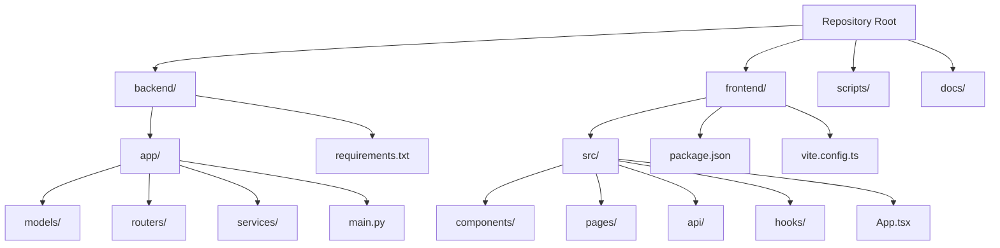
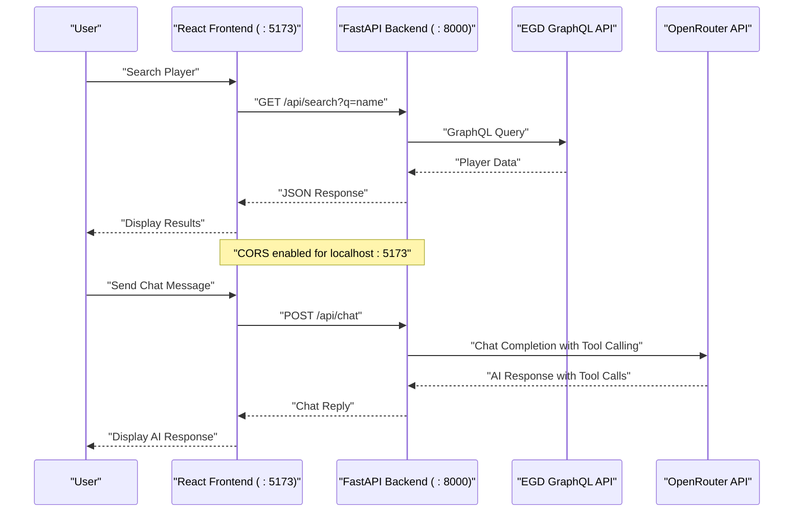
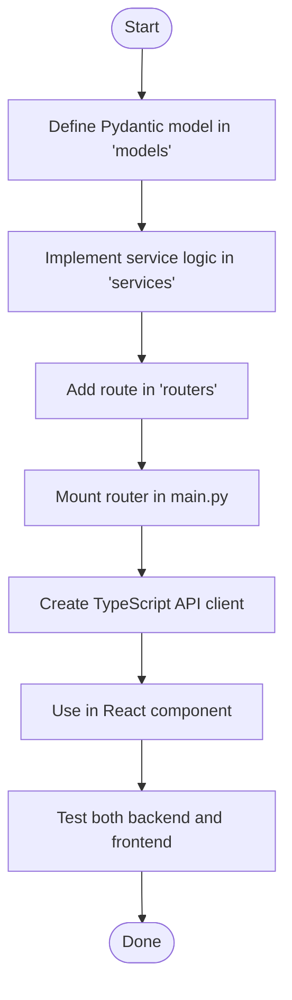

# Getting Started

<cite>
**Referenced Files in This Document**
- [README.md](file://README.md)
- [Makefile](file://Makefile)
- [.gitignore](file://.gitignore)
- [backend/requirements.txt](file://backend/requirements.txt)
- [frontend/package.json](file://frontend/package.json)
- [backend/app/main.py](file://backend/app/main.py)
- [backend/app/routers/players.py](file://backend/app/routers/players.py)
- [backend/app/models/player.py](file://backend/app/models/player.py)
- [backend/app/services/chat_agent.py](file://backend/app/services/chat_agent.py)
- [frontend/src/App.tsx](file://frontend/src/App.tsx)
- [frontend/src/api/client.ts](file://frontend/src/api/client.ts)
- [frontend/vite.config.ts](file://frontend/vite.config.ts)
</cite>

## Update Summary
**Changes Made**
- Updated installation instructions to use new Makefile-based build system with standardized commands
- Modified virtual environment setup to use backend/.venv path consistently
- Enhanced configuration documentation with comprehensive .env variable setup including CHAT_MODEL options and CHAT_MAX_ITERATIONS settings
- Modernized development workflow with Make targets replacing manual setup processes
- Updated all command examples to use Makefile commands for consistency
- Added detailed environment variable documentation with model options and configuration defaults
- Improved troubleshooting section with Makefile-specific guidance and common setup issues

## Table of Contents
1. [Introduction](#introduction)
2. [Project Structure](#project-structure)
3. [Core Components](#core-components)
4. [Architecture Overview](#architecture-overview)
5. [Environment Setup and Installation](#environment-setup-and-installation)
6. [Development Workflow](#development-workflow)
7. [First API Endpoint Tutorial](#first-api-endpoint-tutorial)
8. [Testing Setup](#testing-setup)
9. [Common Development Patterns](#common-development-patterns)
10. [Troubleshooting Guide](#troubleshooting-guide)
11. [Conclusion](#conclusion)
12. [Appendices](#appendices)

## Introduction
This guide helps you set up and run the GoNow full-stack web application, configure your development environment, and create your first API endpoint. The application consists of a FastAPI backend that proxies European Go Database (EGD) API calls and a React frontend for player search, profile viewing, and AI-powered chat assistance. It covers Python and Node.js setup, virtual environments, dependency management, a step-by-step tutorial for building endpoints with service-layer logic and data models, common development workflow patterns, and testing setup for both backend and frontend. The content is designed to be beginner-friendly while providing enough technical depth for experienced developers to quickly understand the full-stack structure and start contributing.

## Project Structure
The repository follows a conventional full-stack layout with separate backend and frontend directories:



**Backend Components:**
- `backend/app`: FastAPI application package containing core modules
  - `models/`: Pydantic data models and schemas
  - `routers/`: HTTP route definitions and API endpoints
  - `services/`: Business logic implementations and external API clients
- `backend/requirements.txt`: Python dependencies
- `backend/.venv`: Virtual environment (created by Makefile)

**Frontend Components:**
- `frontend/src`: React application source code
  - `components/`: Reusable UI components (Navbar, ChatWidget)
  - `pages/`: Page components (SearchPage, ProfilePage, FavoritesPage)
  - `api/`: Axios API client and TypeScript interfaces
  - `hooks/`: Custom React hooks (useFavorites)
- `frontend/package.json`: Node.js dependencies and scripts
- `frontend/vite.config.ts`: Vite build configuration

**Shared Resources:**
- `scripts/`: API exploration utilities and helper scripts
- `docs/`: Architecture and API documentation
- `.gitignore`: Excludes local artifacts, environment files, and IDE folders

**Section sources**
- [README.md:57-90](file://README.md#L57-L90)
- [.gitignore:1-40](file://.gitignore#L1-L40)

## Core Components
The application follows a clear separation of concerns across layers:

**Backend Layer:**
- **Routers**: Define HTTP endpoints and map requests to handlers
- **Services**: Encapsulate business logic used by routers
- **Models**: Represent data structures and validation rules using Pydantic

**Frontend Layer:**
- **Components**: Reusable UI elements and page layouts
- **Pages**: Route-specific components with business logic
- **API Client**: Centralized HTTP communication with backend
- **Hooks**: Custom React hooks for state management and side effects

These components interact through clear boundaries: routers accept requests, call services, and return responses using model-defined shapes. The frontend communicates with the backend through a typed API client.

## Architecture Overview
A typical request flow in the full-stack application:



**Updated** The architecture now includes both backend and frontend servers with CORS configuration for cross-origin requests and enhanced chat functionality with tool calling capabilities.

**Diagram sources**
- [backend/app/main.py:20-27](file://backend/app/main.py#L20-L27)
- [frontend/src/api/client.ts:3-5](file://frontend/src/api/client.ts#L3-L5)

## Environment Setup and Installation

### Prerequisites
Before starting, ensure you have the following installed:
- **Python 3.14+** for the backend
- **Node.js 18+** and npm for the frontend
- **GNU Make** (comes with Git Bash on Windows)
- **Git** for version control

### Quick Start with Makefile
The easiest way to get started is using the provided Makefile commands:

```bash
# Install all dependencies (creates venv and installs npm packages)
make install

# Start both backend and frontend servers
make dev

# Or start them individually
make dev-be  # Backend only
make dev-fe  # Frontend only
```

### Manual Setup Process

#### Backend Setup
```bash
cd backend
python -m venv .venv
# Windows: .venv\Scripts\activate
# macOS/Linux: source .venv/bin/activate

pip install -r requirements.txt

# Create .env file with your EGD API token and optional AI configuration
echo "EGD_TOKEN=your_token_here" > .env
echo "OPENROUTER_API_KEY=your_openrouter_key_here" >> .env
echo "CHAT_MODEL=google/gemini-2.0-flash-001" >> .env
echo "CHAT_MAX_ITERATIONS=3" >> .env

# Start the development server
uvicorn app.main:app --reload
```

The backend will be available at [http://localhost:8000](http://localhost:8000) with API docs at [http://localhost:8000/docs](http://localhost:8000/docs).

#### Frontend Setup
```bash
cd frontend
npm install
npm run dev
```

The frontend will be available at [http://localhost:5173](http://localhost:5173).

**Section sources**
- [README.md:92-137](file://README.md#L92-L137)
- [Makefile:9-36](file://Makefile#L9-L36)
- [backend/requirements.txt:1-6](file://backend/requirements.txt#L1-L6)
- [frontend/package.json:6-11](file://frontend/package.json#L6-L11)

## Development Workflow

### Using Make Commands
The Makefile provides convenient commands for common development tasks:

| Command | Description |
|---------|-------------|
| `make help` | Show available commands |
| `make install` | Install all dependencies |
| `make install-be` | Install backend dependencies |
| `make install-fe` | Install frontend dependencies |
| `make dev` | Start both servers (Windows background processes) |
| `make dev-be` | Start backend only |
| `make dev-fe` | Start frontend only |
| `make stop` | Kill all running servers |
| `make build` | Build frontend for production |
| `make clean` | Remove build artifacts and venv |

### Development Server Configuration
- **Backend**: Runs on port 8000 with auto-reload enabled
- **Frontend**: Runs on port 5173 with hot module replacement
- **CORS**: Configured to allow requests from localhost:5173 and localhost:3000

### Environment Variables
Create a `.env` file in the `backend/` directory:

```env
# Required for EGD API access
EGD_TOKEN=your_egd_api_token_here

# Optional: Enable AI chat functionality
OPENROUTER_API_KEY=your_openrouter_api_key_here

# AI Chat Configuration
CHAT_MODEL=google/gemini-2.0-flash-001
CHAT_MAX_ITERATIONS=3
```

**Updated** The backend automatically loads environment variables from `backend/.env` using python-dotenv. The virtual environment is now managed in `backend/.venv` when using the Makefile. Available CHAT_MODEL options include `google/gemini-2.0-flash-001` (default), `openai/gpt-4o-mini`, and `anthropic/claude-3.5-sonnet`.

**Section sources**
- [Makefile:1-54](file://Makefile#L1-L54)
- [backend/app/main.py:8-10](file://backend/app/main.py#L8-L10)
- [backend/app/main.py:20-27](file://backend/app/main.py#L20-L27)
- [backend/app/services/chat_agent.py:10-11](file://backend/app/services/chat_agent.py#L10-L11)

## First API Endpoint Tutorial

### Goal: Create a Simple Search Endpoint
We'll walk through creating a player search endpoint that demonstrates the full stack interaction.

#### Step 1: Define Data Models
Create or extend Pydantic models in `backend/app/models/`:

```python
# In backend/app/models/player.py
class PlayerSummary(BaseModel):
    pin: int
    firstName: str
    lastName: str
    countryCode: str
    grade: str
    rating: Optional[int] = None
```

#### Step 2: Implement Service Logic
Create or extend service functions in `backend/app/services/`:

```python
# In backend/app/services/egd_client.py
async def search_players(query: str):
    """Search players via EGD GraphQL API"""
    # Implementation details...
```

#### Step 3: Register API Route
Add the endpoint in `backend/app/routers/players.py`:

```python
@router.get("/search")
async def search_players(q: str = Query(..., min_length=1)):
    """Search players by name or PIN."""
    result = await egd_client.search_players(q)
    return result
```

#### Step 4: Mount Router in Application
Ensure the router is included in `backend/app/main.py`:

```python
from app.routers import players
app.include_router(players.router)
```

#### Step 5: Create Frontend API Client
Define TypeScript interfaces and API functions in `frontend/src/api/client.ts`:

```typescript
export interface PlayerSummary {
  pin: number;
  firstName: string;
  lastName: string;
  // ... other fields
}

export async function searchPlayers(query: string): Promise<SearchResponse> {
  const res = await api.get<SearchResponse>('/search', { params: { q: query } });
  return res.data;
}
```

#### Step 6: Use in Frontend Component
Import and use the API function in your React component:

```typescript
import { searchPlayers } from './api/client';

// In your component
const handleSearch = async (query: string) => {
  const results = await searchPlayers(query);
  // Handle results...
};
```

#### Step 7: Test the Endpoint
- Backend: Visit http://localhost:8000/docs to test via Swagger UI
- Frontend: Use the search functionality in the browser at http://localhost:5173



**Diagram sources**
- [backend/app/models/player.py:6-16](file://backend/app/models/player.py#L6-L16)
- [backend/app/routers/players.py:8-40](file://backend/app/routers/players.py#L8-L40)
- [frontend/src/api/client.ts:59-62](file://frontend/src/api/client.ts#L59-L62)

**Section sources**
- [backend/app/models/player.py:1-60](file://backend/app/models/player.py#L1-L60)
- [backend/app/routers/players.py:1-107](file://backend/app/routers/players.py#L1-L107)
- [frontend/src/api/client.ts:1-86](file://frontend/src/api/client.ts#L1-L86)

## Testing Setup

### Backend Testing with pytest
Install testing dependencies and create test files:

```bash
# Install testing dependencies
pip install pytest pytest-asyncio httpx

# Create tests directory structure
mkdir tests
touch tests/__init__.py
touch tests/test_players.py
```

Example test structure:
```python
# tests/test_players.py
import pytest
from fastapi.testclient import TestClient
从 app.main import app

client = TestClient(app)

def test_search_endpoint():
    response = client.get("/api/search?q=test")
    assert response.status_code == 200
    assert "data" in response.json()
```

### Frontend Testing with Vitest
The frontend uses Vitest for testing. Install and configure:

```bash
# Install testing dependencies
npm install --save-dev vitest @testing-library/react @testing-library/jest-dom

# Add test script to package.json
# "test": "vitest"
```

Example test structure:
```typescript
// src/components/__tests__/Navbar.test.tsx
import { render, screen } from '@testing-library/react';
import Navbar from '../Navbar';

describe('Navbar', () => {
  it('renders navigation links', () => {
    render(<Navbar />);
    expect(screen.getByText('Search')).toBeInTheDocument();
    expect(screen.getByText('Favorites')).toBeInTheDocument();
  });
});
```

### Running Tests
```bash
# Backend tests
pytest tests/

# Frontend tests
npm test
```

**Section sources**
- [backend/app/main.py:14-18](file://backend/app/main.py#L14-L18)

## Common Development Patterns

### Feature Branches and Git Workflow
- Create feature branches: `git checkout -b feature/new-player-search`
- Keep commits small and focused
- Use conventional commit messages
- Pull request reviews before merging

### Code Organization
- **Backend**: Follow MVC pattern with clear separation between routers, services, and models
- **Frontend**: Organize by feature with co-located components, hooks, and API calls
- **Configuration**: Keep environment variables in `.env` files (never committed)

### Error Handling
- Use consistent error responses across all endpoints
- Implement proper logging for debugging
- Handle network errors gracefully in the frontend

### Performance Considerations
- Use async/await for database and external API calls
- Implement caching strategies where appropriate
- Optimize bundle size for frontend builds

## Troubleshooting Guide

### Common Issues and Solutions

**Port Conflicts**
- Backend: Change port in Makefile or uvicorn command if 8000 is in use
- Frontend: Vite automatically finds available ports if 5173 is occupied

**CORS Errors**
- Ensure frontend is running on allowed origins (localhost:5173 or localhost:3000)
- Check CORS configuration in `backend/app/main.py`

**Missing Dependencies**
- Backend: `make install-be` or `pip install -r backend/requirements.txt`
- Frontend: `make install-fe` or `npm install` in frontend directory

**Environment Variables**
- Verify `.env` file exists in `backend/` directory
- Ensure `EGD_TOKEN` is properly configured
- For AI chat features, verify `OPENROUTER_API_KEY` is set
- Restart backend server after changing environment variables

**Virtual Environment Issues**
- Backend venv location: `backend/.venv`
- Activate venv: `backend/.venv/Scripts/activate` (Windows) or `source backend/.venv/bin/activate` (macOS/Linux)
- Recreate venv: `make clean && make install-be`

**Import Errors**
- Confirm module paths align with project structure
- Check that virtual environment is activated for backend development
- Verify TypeScript compilation for frontend changes

**Build Issues**
- Clean build artifacts: `make clean`
- Reinstall dependencies: `make install`
- Clear npm cache if needed: `npm cache clean --force`

**Development Server Issues**
- Stop all servers: `make stop`
- Restart individual servers: `make dev-be` or `make dev-fe`
- Check logs in terminal windows for error details

**Makefile Commands Not Working**
- Ensure you're in the repository root directory
- On Windows, use Git Bash or PowerShell with Make support
- Alternative: Run commands directly from the README.md

**AI Chat Configuration Issues**
- Verify `OPENROUTER_API_KEY` is set in `backend/.env`
- Check `CHAT_MODEL` value matches available OpenRouter models
- Adjust `CHAT_MAX_ITERATIONS` if experiencing timeout issues
- Test chat endpoint at `/api/chat` via Swagger UI

**Section sources**
- [backend/app/main.py:20-27](file://backend/app/main.py#L20-L27)
- [Makefile:38-53](file://Makefile#L38-L53)
- [backend/app/services/chat_agent.py:42-48](file://backend/app/services/chat_agent.py#L42-L48)

## Conclusion
You now have the essentials to set up and develop the GoNow full-stack application. With both backend and frontend environments configured, you can create new features, implement API endpoints, and build user interfaces. The modular architecture separates concerns across routers, services, models, components, and pages, making it easy to maintain and extend. Remember to follow the established patterns for code organization, error handling, and testing to keep the codebase clean and maintainable as it grows.

## Appendices

### Quick Reference Checklist
- ✅ Python 3.14+ and Node.js 18+ installed
- ✅ GNU Make available (comes with Git Bash on Windows)
- ✅ Virtual environment created and activated (backend/.venv)
- ✅ All dependencies installed (`make install`)
- ✅ Environment variables configured (`.env` file in backend/)
- ✅ Both development servers running
- ✅ First API endpoint created and tested
- ✅ Basic tests written and passing

### Useful Commands
```bash
# Development
make dev          # Start both servers
make dev-be       # Backend only
make dev-fe       # Frontend only

# Building
make build        # Production build
npm run build     # Frontend build only

# Maintenance
make clean        # Clean artifacts
make stop         # Stop servers
```

### API Endpoints Reference
- `GET /api/search?q=query` - Search players
- `GET /api/player/{pin}` - Get player details
- `GET /api/player/{pin}/tournaments` - Get tournament history
- `POST /api/chat` - Send chat message
- `GET /docs` - Interactive API documentation

### Environment Variables Reference
| Variable | Description | Default | Required |
|----------|-------------|---------|----------|
| `EGD_TOKEN` | EGD GraphQL API bearer token | - | Yes |
| `OPENROUTER_API_KEY` | OpenRouter API key for AI chat | - | No |
| `CHAT_MODEL` | OpenRouter model ID for chat | `google/gemini-2.0-flash-001` | No |
| `CHAT_MAX_ITERATIONS` | Max tool-calling iterations per chat turn | `3` | No |

**Available CHAT_MODEL Options:**
- `google/gemini-2.0-flash-001` — Fast, cheap, supports tool calling (default)
- `openai/gpt-4o-mini` — Good balance of speed and quality
- `anthropic/claude-3.5-sonnet` — Higher quality, slower/more expensive

**Section sources**
- [README.md:139-154](file://README.md#L139-L154)
- [backend/app/routers/players.py:8-106](file://backend/app/routers/players.py#L8-L106)
- [backend/app/services/chat_agent.py:10-11](file://backend/app/services/chat_agent.py#L10-L11)