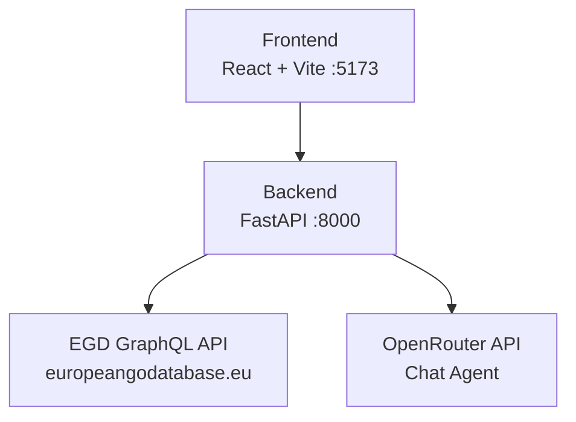

# Getting Started

<cite>
**Referenced Files in This Document**
- [README.md](file://README.md)
- [Makefile](file://Makefile)
- [backend/requirements.txt](file://backend/requirements.txt)
- [frontend/package.json](file://frontend/package.json)
- [backend/app/main.py](file://backend/app/main.py)
- [backend/app/services/egd_client.py](file://backend/app/services/egd_client.py)
- [docs/ARCHITECTURE.md](file://docs/ARCHITECTURE.md)
- [docs/EGD_API.md](file://docs/EGD_API.md)
</cite>

## Table of Contents
1. [Introduction](#introduction)
2. [Prerequisites](#prerequisites)
3. [Environment Setup](#environment-setup)
4. [Installation](#installation)
5. [Development Commands](#development-commands)
6. [Project Structure Overview](#project-structure-overview)
7. [Quick Start Examples](#quick-start-examples)
8. [Troubleshooting Guide](#troubleshooting-guide)
9. [Conclusion](#conclusion)

## Introduction
GoNow is a full-stack web application for tracking European Go players’ progress over time. It provides player search, detailed profiles, rating evolution charts, favorites management, and an agentic AI chat assistant that can look up real player data on the fly using the European Go Database (EGD) GraphQL API. The frontend runs with React and Vite, while the backend uses Python FastAPI to proxy EGD calls and orchestrate tool-calling via OpenRouter.

## Prerequisites
Ensure your development machine meets these requirements before proceeding:
- Python 3.14+
- Node.js 18+ and npm
- GNU Make (comes with Git Bash on Windows)
- An EGD API token (Bearer token) configured in the backend environment file

These prerequisites are documented in the project’s main README.

**Section sources**
- [README.md:94-99](file://README.md#L94-L99)

## Environment Setup
You must configure the backend environment variables before running the application. All configuration lives in `backend/.env`.

Required and optional variables:
- EGD_API_TOKEN: Bearer token for the EGD GraphQL API (required)
- OPENROUTER_API_KEY: Key for OpenRouter (optional; chat disabled if empty)
- CHAT_MODEL: Model ID for chat (default provided by the app)
- CHAT_MAX_ITERATIONS: Max tool-calling iterations per chat turn (default provided by the app)

Where these values come from:
- EGD API endpoint and authentication details are defined in the EGD API documentation.
- The backend loads `.env` at startup and reads the token from the environment.

Important notes:
- The backend proxies all EGD API calls to keep the token server-side.
- The frontend communicates with the backend over HTTP; CORS is configured to allow local development origins.

**Section sources**
- [README.md:139-154](file://README.md#L139-L154)
- [docs/EGD_API.md:1-22](file://docs/EGD_API.md#L1-L22)
- [backend/app/main.py:8-10](file://backend/app/main.py#L8-L10)
- [backend/app/main.py:20-27](file://backend/app/main.py#L20-L27)
- [backend/app/services/egd_client.py:12-17](file://backend/app/services/egd_client.py#L12-L17)

## Installation
Choose either the Makefile-based setup or manual setup.

### Using the Makefile (recommended)
Run the following commands from the repository root:
- make install: Create a Python virtual environment and install backend dependencies, then install frontend npm dependencies
- make dev: Start both backend (:8000) and frontend (:5173) servers
- make stop: Kill both servers

The Makefile orchestrates creating the venv, installing dependencies, and launching servers in separate windows on Windows.

**Section sources**
- [README.md:101-122](file://README.md#L101-L122)
- [Makefile:10-21](file://Makefile#L10-L21)
- [Makefile:23-36](file://Makefile#L23-L36)
- [Makefile:39-43](file://Makefile#L39-L43)

### Manual Setup (without Make)
Backend:
- Create a virtual environment inside the backend directory
- Install backend dependencies from requirements.txt
- Start the FastAPI server with Uvicorn on port 8000

Frontend:
- In a separate terminal, navigate to the frontend directory
- Install npm dependencies
- Start the Vite development server

This approach mirrors what the Makefile does under the hood.

**Section sources**
- [README.md:124-137](file://README.md#L124-L137)
- [backend/requirements.txt:1-6](file://backend/requirements.txt#L1-L6)
- [frontend/package.json:6-11](file://frontend/package.json#L6-L11)

## Development Commands
All available commands are exposed via the Makefile. Use them to manage installation, run development servers, build, and clean artifacts.

- make help: Show all available commands
- make install: Install backend (venv) + frontend (npm) dependencies
- make install-be: Create venv and install backend dependencies
- make install-fe: Install frontend npm dependencies
- make dev: Start both BE + FE in separate windows
- make dev-be: Start backend only (foreground)
- make dev-fe: Start frontend only (foreground)
- make stop: Kill all GoNow dev servers
- make build: Build frontend for production
- make clean: Remove venv, node_modules, dist

These commands are designed to streamline local development across both layers.

**Section sources**
- [README.md:109-122](file://README.md#L109-L122)
- [Makefile:4-7](file://Makefile#L4-L7)
- [Makefile:10-21](file://Makefile#L10-L21)
- [Makefile:23-36](file://Makefile#L23-L36)
- [Makefile:39-43](file://Makefile#L39-L43)
- [Makefile:46-53](file://Makefile#L46-L53)

## Project Structure Overview
At a high level:
- Backend (FastAPI):
  - Entry point and middleware configuration
  - Routers for player endpoints and chat
  - Services for EGD client and chat agent
  - Pydantic models for requests/responses
- Frontend (React + Vite):
  - API client and TypeScript types
  - Components, pages, hooks, and theme styles
- Scripts and docs for exploration and architecture references

The architecture diagram shows how the frontend talks to the backend, which proxies EGD GraphQL calls and optionally integrates with OpenRouter for agentic chat.

**Diagram sources**
- [docs/ARCHITECTURE.md:7-33](file://docs/ARCHITECTURE.md#L7-L33)
- [README.md:24-53](file://README.md#L24-L53)

**Section sources**
- [README.md:57-90](file://README.md#L57-L90)
- [docs/ARCHITECTURE.md:43-81](file://docs/ARCHITECTURE.md#L43-L81)

## Quick Start Examples
After completing environment setup and installation:

- Start both servers:
  - make dev
  - Or manually start backend and frontend as described above

- Access the application:
  - Frontend: http://localhost:5173
  - Backend API docs: http://localhost:8000/docs
  - Health check: http://localhost:8000/health

- Try core features:
  - Player Search: Use the search page to find players by name or PIN
  - Player Profiles: View detailed info, grade/rating, and tournament history
  - Favorites: Save favorite players (stored locally in browser)
  - Agentic Chat: Ask questions about players; the chat assistant may call EGD tools to fetch live data

If you need to stop the servers:
- make stop

**Section sources**
- [README.md:101-107](file://README.md#L101-L107)
- [README.md:194-203](file://README.md#L194-L203)
- [backend/app/main.py:34-41](file://backend/app/main.py#L34-L41)

## Troubleshooting Guide
Common setup issues and resolutions:

- Missing EGD API token:
  - Ensure EGD_API_TOKEN is set in backend/.env
  - The backend reads this variable at startup and includes it in requests to EGD

- Port conflicts:
  - Backend defaults to port 8000; frontend defaults to port 5173
  - If ports are in use, stop existing processes or adjust startup commands

- CORS errors from the frontend:
  - The backend allows localhost:5173 and localhost:3000 by default
  - Ensure the frontend is served from one of these origins during development

- Dependencies not installed:
  - Re-run make install or perform manual setup steps for backend and frontend

- Stale build artifacts:
  - Run make clean to remove venv, node_modules, and dist directories, then reinstall

- Chat not working:
  - Set OPENROUTER_API_KEY in backend/.env
  - Verify CHAT_MODEL and CHAT_MAX_ITERATIONS are configured as needed

For additional context on the EGD API and authentication, refer to the EGD API reference.

**Section sources**
- [backend/app/main.py:20-27](file://backend/app/main.py#L20-L27)
- [backend/app/services/egd_client.py:12-17](file://backend/app/services/egd_client.py#L12-L17)
- [docs/EGD_API.md:1-22](file://docs/EGD_API.md#L1-L22)
- [Makefile:46-53](file://Makefile#L46-L53)
- [README.md:139-154](file://README.md#L139-L154)

## Conclusion
You now have everything needed to set up, install, and run GoNow locally. Configure your EGD API token, install dependencies via the Makefile or manually, and start the development servers. Explore player search, profiles, favorites, and the agentic chat assistant. For deeper insights into architecture and design decisions, consult the architecture and agent design documents.