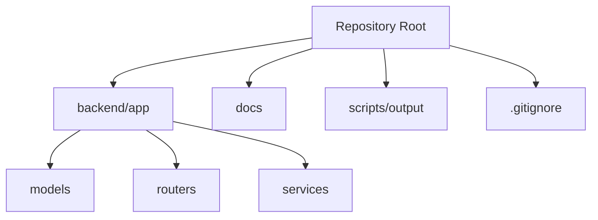
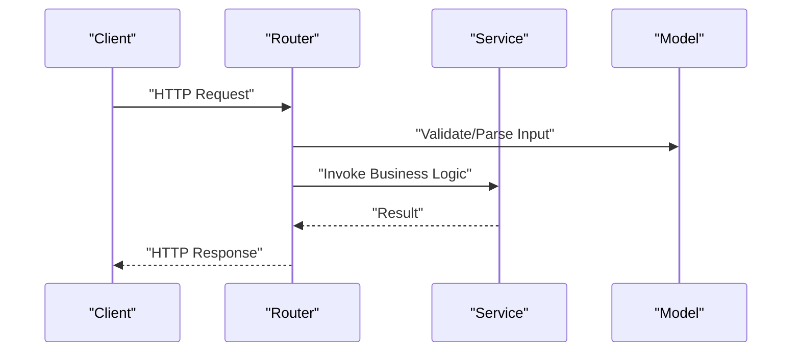
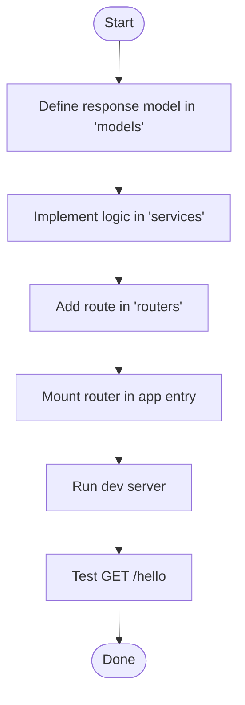
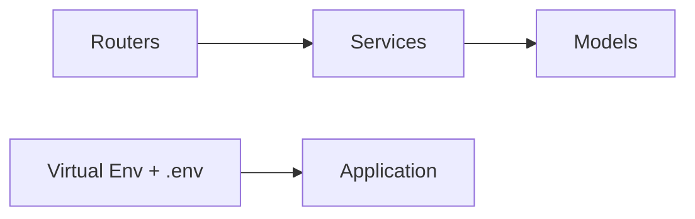

# Getting Started

<cite>
**Referenced Files in This Document**
- [.gitignore](file://.gitignore)
</cite>

## Table of Contents
1. [Introduction](#introduction)
2. [Project Structure](#project-structure)
3. [Core Components](#core-components)
4. [Architecture Overview](#architecture-overview)
5. [Detailed Component Analysis](#detailed-component-analysis)
6. [Dependency Analysis](#dependency-analysis)
7. [Performance Considerations](#performance-considerations)
8. [Troubleshooting Guide](#troubleshooting-guide)
9. [Conclusion](#conclusion)
10. [Appendices](#appendices)

## Introduction
This guide helps you set up and run the GoNow backend application, configure your development environment, and create your first API endpoint. It covers Python setup, virtual environments, basic project initialization, a step-by-step tutorial for building a simple route with service-layer logic and data models, common development workflow patterns, and a minimal testing setup. The content is designed to be beginner-friendly while providing enough technical depth for experienced developers to quickly understand the structure and start contributing.

## Project Structure
The repository follows a conventional backend layout:
- backend/app: Application package containing core modules
  - models: Data models and schemas
  - routers: HTTP route definitions
  - services: Business logic implementations
- docs: Documentation assets
- scripts/output: Generated artifacts (ignored by default)
- .gitignore: Excludes local artifacts, environment files, and IDE folders

[No sources needed since this diagram shows conceptual structure]

**Section sources**
- [.gitignore:1-37](file://.gitignore#L1-L37)

## Core Components
- Routers: Define HTTP endpoints and map requests to handlers.
- Services: Encapsulate business logic used by routers.
- Models: Represent data structures and validation rules.

These components interact through clear boundaries: routers accept requests, call services, and return responses using model-defined shapes.

[No sources needed since this section provides general guidance]

## Architecture Overview
A typical request flow:
- Client sends an HTTP request to a router.
- Router validates input and delegates to a service.
- Service executes business logic and returns results.
- Router formats and returns the response.

[No sources needed since this diagram shows conceptual workflow]

## Detailed Component Analysis

### Environment Setup and Installation
- Install Python (recommended 3.10+).
- Create a virtual environment in the repository root or within backend:
  - Windows: python -m venv .venv
  - macOS/Linux: python3 -m venv .venv
- Activate the environment:
  - Windows: .venv\Scripts\activate
  - macOS/Linux: source .venv/bin/activate
- Install dependencies (if provided):
  - pip install -r requirements.txt
- Initialize configuration:
  - Copy any provided example env file to .env and fill values.
  - Ensure .env is not committed (.gitignore excludes it).

Notes:
- The .gitignore excludes .env, .venv, __pycache__, dist/build, and logs, keeping your workspace clean.

**Section sources**
- [.gitignore:1-37](file://.gitignore#L1-L37)

### First API Endpoint Tutorial
Goal: Create a simple GET /hello endpoint that returns a greeting.

Step-by-step:
1. Define a data model for the response shape in backend/app/models.
   - Use a Pydantic-like model to represent the response fields and types.
2. Implement service logic in backend/app/services.
   - Create a function that computes the result based on inputs.
3. Register a route in backend/app/routers.
   - Map GET /hello to a handler that calls the service and returns the model.
4. Mount the router in the application entry point (e.g., FastAPI app).
   - Include the router so the endpoint becomes available.
5. Run the server and test the endpoint.
   - Start the dev server and hit http://localhost:8000/hello.

[No sources needed since this diagram shows conceptual workflow]

### Common Development Workflow Patterns
- Feature branches: Create a branch per feature; keep commits small and focused.
- Pre-commit checks: Lint and type-check before pushing.
- Local testing: Run tests against the activated virtual environment.
- Configuration management: Keep secrets in .env; never commit sensitive files.
- Logging: Use structured logging and avoid writing logs to tracked directories.

[No sources needed since this section provides general guidance]

### Basic Testing Setup
- Use pytest for unit and integration tests.
- Place tests alongside features or under a tests directory.
- Use fixtures for shared setup and mocks for external dependencies.
- Example targets:
  - Unit tests for service functions.
  - Route-level tests using a test client.
  - Model validation tests.

[No sources needed since this section provides general guidance]

## Dependency Analysis
- Internal coupling:
  - Routers depend on services.
  - Services may depend on models.
- External dependencies:
  - Web framework (e.g., FastAPI), ORM (e.g., SQLAlchemy), validation (Pydantic), testing (pytest).
- Environment isolation:
  - Virtual environments and .gitignore ensure consistent and clean setups.

[No sources needed since this diagram shows conceptual relationships]

## Performance Considerations
- Prefer async I/O where possible for database and external calls.
- Cache frequently accessed data at the service layer.
- Validate inputs early to reduce downstream work.
- Profile hot paths and add targeted optimizations.

[No sources needed since this section provides general guidance]

## Troubleshooting Guide
- Port conflicts: Change the port if 8000 is already in use.
- Missing dependencies: Reinstall from requirements.txt inside the activated virtual environment.
- Environment variables: Verify .env exists and contains required keys; ensure it is not committed.
- Import errors: Confirm module paths align with backend/app structure.
- Permission issues: On Unix/macOS, ensure scripts are executable if applicable.

[No sources needed since this section provides general guidance]

## Conclusion
You now have the essentials to set up the GoNow backend, create your first endpoint, and follow a productive development workflow. As you expand the codebase, keep concerns separated across routers, services, and models, and rely on tests and environment isolation to maintain quality and stability.

## Appendices

### Quick Reference Checklist
- Python installed and virtual environment created.
- Dependencies installed.
- .env configured and ignored by Git.
- First endpoint added and tested locally.
- Tests written and passing.

[No sources needed since this section provides general guidance]