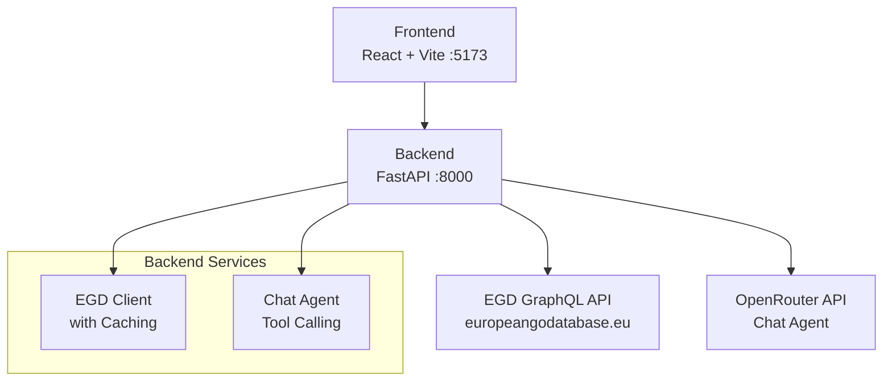

# Getting Started

<cite>
**Referenced Files in This Document**
- [README.md](file://README.md)
- [Makefile](file://Makefile)
- [backend/requirements.txt](file://backend/requirements.txt)
- [frontend/package.json](file://frontend/package.json)
- [backend/app/main.py](file://backend/app/main.py)
- [backend/app/services/egd_client.py](file://backend/app/services/egd_client.py)
- [docs/ARCHITECTURE.md](file://docs/ARCHITECTURE.md)
- [docs/EGD_API.md](file://docs/EGD_API.md)
</cite>

## Update Summary
**Changes Made**
- Updated Prerequisites section with detailed Windows-specific GNU Make installation instructions
- Enhanced Environment Setup section with comprehensive variable configuration details
- Expanded Installation section with both Makefile and manual setup options
- Added complete Development Commands reference table
- Improved Project Structure Overview with detailed component descriptions
- Enhanced Quick Start Examples with step-by-step instructions
- Comprehensive Troubleshooting Guide covering common setup issues

## Table of Contents
1. [Introduction](#introduction)
2. [Prerequisites](#prerequisites)
3. [Environment Setup](#environment-setup)
4. [Installation](#installation)
5. [Development Commands](#development-commands)
6. [Project Structure Overview](#project-structure-overview)
7. [Quick Start Examples](#quick-start-examples)
8. [Troubleshooting Guide](#troubleshooting-guide)
9. [Conclusion](#conclusion)

## Introduction
GoNow is a full-stack web application for tracking European Go players' progress over time. It provides player search, detailed profiles, rating evolution charts, favorites management, and an agentic AI chat assistant that can look up real player data on the fly using the European Go Database (EGD) GraphQL API. The frontend runs with React and Vite, while the backend uses Python FastAPI to proxy EGD calls and orchestrate tool-calling via OpenRouter.

## Prerequisites
Ensure your development machine meets these requirements before proceeding:

### Core Requirements
- **Python 3.14+** - Required for the FastAPI backend
- **Node.js 18+** and npm - Required for the React frontend
- **GNU Make** - Build automation tool for development commands
- **EGD API Token** - Bearer token for European Go Database access

### Windows-Specific GNU Make Installation

**Option 1: Using winget (Windows Package Manager)**
```bash
winget install --id GnuWin32.Make
```

**Option 2: Using Git Bash**
Git Bash includes GNU Make by default, so no additional installation is needed if you're using Git Bash as your terminal.

**PATH Configuration Troubleshooting:**
After installing GNU Make, you may need to restart your terminal (or IDE) for the PATH to update. If `make` is not recognized, run this first:
```bash
set PATH=%PATH%;C:\Program Files (x86)\GnuWin32\bin
```

To make the PATH change permanent, add the GnuWin32 bin directory to your system PATH environment variables through Windows System Properties.

**Section sources**
- [README.md:94-104](file://README.md#L94-L104)

## Environment Setup
You must configure the backend environment variables before running the application. All configuration lives in `backend/.env`.

### Required and Optional Variables

| Variable | Description | Default | Required |
|----------|-------------|---------|----------|
| `EGD_API_TOKEN` | Bearer token for the EGD GraphQL API | *(required)* | ✅ Yes |
| `OPENROUTER_API_KEY` | Key for OpenRouter AI service | *(optional)* | ❌ No |
| `CHAT_MODEL` | Model ID for chat functionality | `google/gemini-2.0-flash-001` | ❌ No |
| `CHAT_MAX_ITERATIONS` | Max tool-calling iterations per chat turn | `3` | ❌ No |

### Where These Values Come From

**EGD API Token:**
- Obtain from the European Go Database admin panel at europeangodatabase.eu
- Navigate to the Developer tab to create a new token
- Recommended scope: `read` access only

**OpenRouter API Key:**
- Sign up at openrouter.ai to get an API key
- Chat functionality will be disabled if this key is not provided

**Chat Model Configuration:**
- Multiple models are supported including Google Gemini, OpenAI GPT, and Anthropic Claude
- Default model is optimized for speed and cost-effectiveness

### Important Notes
- The backend proxies all EGD API calls to keep the token server-side and secure
- The frontend communicates with the backend over HTTP; CORS is configured to allow local development origins
- Environment variables are loaded automatically when the backend starts

**Section sources**
- [README.md:144-159](file://README.md#L144-L159)
- [docs/EGD_API.md:9-21](file://docs/EGD_API.md#L9-L21)
- [backend/app/main.py:8-10](file://backend/app/main.py#L8-L10)
- [backend/app/main.py:20-27](file://backend/app/main.py#L20-L27)
- [backend/app/services/egd_client.py:22-27](file://backend/app/services/egd_client.py#L22-L27)

## Installation
Choose either the Makefile-based setup (recommended) or manual setup.

### Using the Makefile (Recommended)

Run the following commands from the repository root:

```bash
make install     # Create venv + install all dependencies (BE & FE)
make dev         # Start both backend (:8000) and frontend (:5173)
make stop        # Kill both servers
```

The Makefile orchestrates creating the Python virtual environment, installing backend dependencies, installing frontend npm dependencies, and launching servers in separate windows on Windows.

### Manual Setup (Without Make)

#### Backend Setup
```bash
cd backend
python -m venv .venv
.venv\Scripts\pip install -r requirements.txt
.venv\Scripts\python -m uvicorn app.main:app --reload --port 8000
```

#### Frontend Setup
In a separate terminal:
```bash
cd frontend
npm install
npm run dev
```

This approach mirrors what the Makefile does under the hood, giving you more control over individual components.

**Section sources**
- [README.md:106-142](file://README.md#L106-L142)
- [Makefile:10-21](file://Makefile#L10-L21)
- [Makefile:23-36](file://Makefile#L23-L36)
- [Makefile:39-43](file://Makefile#L39-L43)
- [backend/requirements.txt:1-6](file://backend/requirements.txt#L1-L6)
- [frontend/package.json:6-11](file://frontend/package.json#L6-L11)

## Development Commands
All available commands are exposed via the Makefile. Use them to manage installation, run development servers, build, and clean artifacts.

### Command Reference Table

| Command | Description | Usage |
|---------|-------------|-------|
| `make help` | Show all available commands | Get command overview |
| `make install` | Install backend (venv) + frontend (npm) deps | Complete setup |
| `make install-be` | Create venv and install backend dependencies | Backend only |
| `make install-fe` | Install frontend npm dependencies | Frontend only |
| `make dev` | Start both BE + FE in separate windows | Full development |
| `make dev-be` | Start backend only (foreground) | Backend debugging |
| `make dev-fe` | Start frontend only (foreground) | Frontend debugging |
| `make stop` | Kill all GoNow dev servers | Clean shutdown |
| `make build` | Build frontend for production | Production deployment |
| `make clean` | Remove venv, node_modules, dist | Fresh start |

These commands are designed to streamline local development across both layers and handle platform-specific differences automatically.

**Section sources**
- [README.md:114-127](file://README.md#L114-L127)
- [Makefile:4-7](file://Makefile#L4-L7)
- [Makefile:10-21](file://Makefile#L10-L21)
- [Makefile:23-36](file://Makefile#L23-L36)
- [Makefile:39-43](file://Makefile#L39-L43)
- [Makefile:46-53](file://Makefile#L46-L53)

## Project Structure Overview
At a high level, GoNow follows a modern full-stack architecture:

### Backend (FastAPI)
- **Entry Point**: `main.py` - FastAPI app initialization, CORS configuration, router mounting
- **Routers**: RESTful endpoints for player search, profiles, and agentic chat
- **Services**: 
  - EGD client with caching for external API calls
  - Chat agent implementation with tool calling
  - Tool definitions for OpenRouter integration
- **Models**: Pydantic schemas for request/response validation

### Frontend (React + Vite)
- **API Client**: Axios-based client with TypeScript types
- **Components**: Reusable UI components with Go-themed styling
- **Pages**: Feature-specific page components (Search, Profile, Favorites)
- **Hooks**: Custom React hooks for state management
- **Theme**: CSS custom properties with Go-inspired design tokens

### Architecture Flow


**Diagram sources**
- [docs/ARCHITECTURE.md:7-33](file://docs/ARCHITECTURE.md#L7-L33)
- [README.md:24-53](file://README.md#L24-L53)

**Section sources**
- [README.md:57-90](file://README.md#L57-L90)
- [docs/ARCHITECTURE.md:43-81](file://docs/ARCHITECTURE.md#L43-L81)

## Quick Start Examples
After completing environment setup and installation:

### Starting the Application
```bash
# Option 1: Using Makefile (recommended)
make dev

# Option 2: Manual startup
# Terminal 1 - Backend
cd backend && .venv\Scripts\python -m uvicorn app.main:app --reload --port 8000

# Terminal 2 - Frontend  
cd frontend && npm run dev
```

### Accessing the Application
- **Frontend**: http://localhost:5173
- **Backend API Documentation**: http://localhost:8000/docs
- **Health Check**: http://localhost:8000/health

### Exploring Core Features

#### Player Search
1. Navigate to the search page
2. Enter a player name or EGD PIN
3. Browse search results with basic player information

#### Player Profiles
1. Click on any player from search results
2. View detailed profile including photo, grade, rating history
3. Explore tournament history and performance metrics

#### Favorites Management
1. Click the heart icon on any player card
2. Access favorites from the navigation menu
3. Manage your saved players list (stored locally in browser)

#### Agentic Chat Assistant
1. Click the floating chat widget in the bottom-right corner
2. Ask questions about players or Go-related topics
3. Watch as the AI assistant autonomously calls EGD tools to fetch real data
4. Receive comprehensive answers based on live database information

### Stopping the Servers
```bash
make stop
```

**Section sources**
- [README.md:106-112](file://README.md#L106-L112)
- [README.md:194-203](file://README.md#L194-L203)
- [backend/app/main.py:34-41](file://backend/app/main.py#L34-L41)

## Troubleshooting Guide
Common setup issues and their resolutions:

### Missing EGD API Token
**Problem**: Backend returns authentication errors when accessing EGD data
**Solution**: 
- Ensure `EGD_API_TOKEN` is set in `backend/.env`
- Verify the token has proper read permissions
- Restart the backend after updating the environment file

### Port Conflicts
**Problem**: Applications fail to start due to port usage
**Solution**:
- Backend defaults to port 8000; frontend defaults to port 5173
- Stop existing processes using these ports or adjust startup commands
- Check for other applications running on these ports

### CORS Errors from Frontend
**Problem**: Frontend cannot communicate with backend
**Solution**:
- Backend allows `localhost:5173`, `localhost:5174`, `localhost:5175`, and `localhost:3000` by default
- Ensure the frontend is served from one of these origins during development
- Add additional origins to the CORS configuration if needed

### Dependencies Not Installed
**Problem**: Import errors or missing module errors
**Solution**:
- Run `make install` to install all dependencies
- For manual setup, ensure both backend and frontend dependencies are installed
- Clear and reinstall dependencies if corruption is suspected

### Stale Build Artifacts
**Problem**: Changes not reflected after updates
**Solution**:
- Run `make clean` to remove `venv`, `node_modules`, and `dist` directories
- Reinstall dependencies with `make install`
- Restart both servers

### Chat Functionality Not Working
**Problem**: Chat assistant doesn't respond or shows errors
**Solution**:
- Set `OPENROUTER_API_KEY` in `backend/.env`
- Verify `CHAT_MODEL` and `CHAT_MAX_ITERATIONS` are configured correctly
- Check OpenRouter API key validity and account status

### GNU Make Not Recognized (Windows)
**Problem**: `make` command not found in Windows terminal
**Solution**:
- Install GNU Make via `winget install --id GnuWin32.Make`
- Restart terminal or IDE after installation
- Add PATH: `set PATH=%PATH%;C:\Program Files (x86)\GnuWin32\bin`
- Consider using Git Bash which includes Make by default

### Python Virtual Environment Issues
**Problem**: Python commands not working in venv
**Solution**:
- Activate the virtual environment: `.venv\Scripts\activate`
- Ensure correct Python version (3.14+) is being used
- Recreate virtual environment if corrupted

For additional context on the EGD API and authentication, refer to the EGD API reference documentation.

**Section sources**
- [backend/app/main.py:20-27](file://backend/app/main.py#L20-L27)
- [backend/app/services/egd_client.py:22-27](file://backend/app/services/egd_client.py#L22-L27)
- [docs/EGD_API.md:9-21](file://docs/EGD_API.md#L9-L21)
- [Makefile:46-53](file://Makefile#L46-L53)
- [README.md:144-159](file://README.md#L144-L159)

## Conclusion
You now have everything needed to set up, install, and run GoNow locally. Configure your EGD API token, install dependencies via the Makefile or manually, and start the development servers. Explore player search, profiles, favorites, and the agentic chat assistant. For deeper insights into architecture and design decisions, consult the architecture and agent design documents.

The project provides a comprehensive foundation for European Go player tracking with modern web technologies and AI-powered features. Whether you're contributing to development or exploring the Go community data, GoNow offers an intuitive interface backed by robust technical architecture.