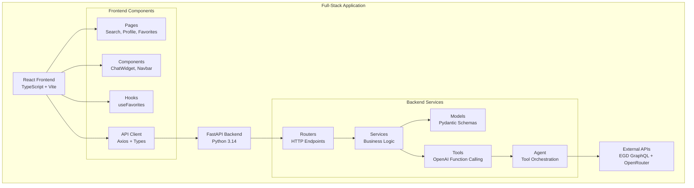
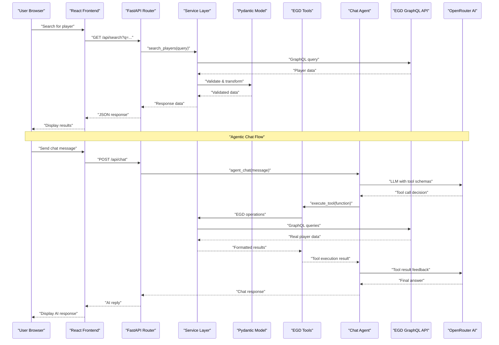
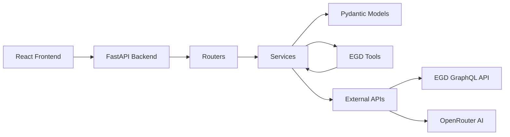

# Project Overview

<cite>
**Referenced Files in This Document**
- [README.md](file://README.md)
- [backend/app/main.py](file://backend/app/main.py)
- [backend/app/routers/players.py](file://backend/app/routers/players.py)
- [backend/app/routers/chat.py](file://backend/app/routers/chat.py)
- [backend/app/services/egd_client.py](file://backend/app/services/egd_client.py)
- [backend/app/services/egd_tools.py](file://backend/app/services/egd_tools.py)
- [backend/app/services/chat_agent.py](file://backend/app/services/chat_agent.py)
- [backend/app/models/player.py](file://backend/app/models/player.py)
- [frontend/src/App.tsx](file://frontend/src/App.tsx)
- [frontend/src/api/client.ts](file://frontend/src/api/client.ts)
- [frontend/src/pages/SearchPage.tsx](file://frontend/src/pages/SearchPage.tsx)
- [frontend/src/components/ChatWidget.tsx](file://frontend/src/components/ChatWidget.tsx)
- [frontend/package.json](file://frontend/package.json)
- [Makefile](file://Makefile)
- [docs/ARCHITECTURE.md](file://docs/ARCHITECTURE.md)
</cite>

## Update Summary
**Changes Made**
- Updated introduction to reflect comprehensive full-stack architecture with React + FastAPI and agentic AI chat system
- Added complete project structure documentation with detailed component breakdown
- Enhanced architecture diagrams to show agentic chat flow with tool calling capabilities
- Updated technology stack to include modern frontend technologies and OpenRouter integration
- Added practical examples demonstrating full-stack request flow including AI agent orchestration
- Expanded service layer patterns to include EGD GraphQL API integration and OpenRouter tool calling
- Added development workflow documentation with Makefile orchestration

## Table of Contents
1. [Introduction](#introduction)
2. [Project Structure](#project-structure)
3. [Core Components](#core-components)
4. [Architecture Overview](#architecture-overview)
5. [Detailed Component Analysis](#detailed-component-analysis)
6. [Frontend Architecture](#frontend-architecture)
7. [Backend Service Layer](#backend-service-layer)
8. [Agentic Chat System](#agentic-chat-system)
9. [Data Flow Examples](#data-flow-examples)
10. [Development Workflow](#development-workflow)
11. [Dependency Analysis](#dependency-analysis)
12. [Performance Considerations](#performance-considerations)
13. [Troubleshooting Guide](#troubleshooting-guide)
14. [Conclusion](#conclusion)

## Introduction
GoNow is a comprehensive full-stack web application designed to track European Go players' progress over time, combining a modern React frontend with a Python FastAPI backend. The application provides comprehensive player search capabilities, detailed profile views with rating evolution charts, favorites management, and an integrated AI chat assistant powered by OpenRouter with agentic tool calling capabilities.

The project emphasizes a layered architecture and service-oriented design, providing clear separation of concerns across routing, business logic, and data access layers. It follows an MVC-inspired structure where routers handle HTTP concerns, services encapsulate business rules and external API integrations, and models represent domain data and persistence interactions.

This foundation supports building robust APIs by:
- Enforcing separation of concerns between request handling, business logic, and data access
- Encouraging reusable service components that can be composed across endpoints
- Providing a predictable request flow from HTTP entry points through routers to services and models
- Integrating external APIs (EGD GraphQL and OpenRouter) through dedicated service layers
- Maintaining clean client-server communication with TypeScript type safety
- Implementing agentic AI capabilities with native tool calling for autonomous data retrieval

**Section sources**
- [README.md:1-23](file://README.md#L1-L23)
- [docs/ARCHITECTURE.md:1-42](file://docs/ARCHITECTURE.md#L1-L42)

## Project Structure
At a high level, GoNow is organized into two main applications with feature-focused directories:

**Updated** The project now includes both frontend and backend applications with clear separation of concerns, modern development practices, and advanced agentic AI capabilities with tool calling.

**Section sources**
- [README.md:57-90](file://README.md#L57-L90)
- [docs/ARCHITECTURE.md:43-81](file://docs/ARCHITECTURE.md#L43-L81)

## Core Components
- **Layered Architecture**: The codebase separates responsibilities into distinct layers—routing, service, model, and tool—to improve testability, readability, and scalability across both frontend and backend.
- **Service Layer Pattern**: Business logic is centralized in services, making it easier to reuse logic across multiple routes and to unit-test core behavior independently of HTTP concerns.
- **MVC-Inspired Structure**: Routers act as controllers that translate HTTP requests into service calls; models represent domain entities and data access; views are implemented as React components.
- **Modular Design**: Each directory represents a cohesive module, encouraging small, focused packages that can evolve independently.
- **External API Integration**: Dedicated service classes handle communication with external APIs (EGD GraphQL and OpenRouter) with caching and error handling.
- **Type Safety**: Full TypeScript integration ensures type consistency between frontend and backend through shared interfaces and Pydantic models.
- **Agentic AI Capabilities**: Native tool calling allows the AI to autonomously call EGD tools for real-time data retrieval and analysis.

These patterns collectively support building RESTful APIs with clear boundaries, predictable data flow, and straightforward extension points for new features.

**Section sources**
- [backend/app/main.py:14-31](file://backend/app/main.py#L14-L31)
- [frontend/src/App.tsx:18-36](file://frontend/src/App.tsx#L18-L36)

## Architecture Overview
The following sequence illustrates the expected data flow for typical REST endpoints and the agentic chat system in the full-stack application:

**Updated** The architecture now includes both EGD GraphQL API integration and OpenRouter AI chat functionality with agentic tool calling capabilities, proper caching, and error handling.

**Diagram sources**
- [backend/app/routers/players.py:8-40](file://backend/app/routers/players.py#L8-L40)
- [backend/app/services/egd_client.py:44-70](file://backend/app/services/egd_client.py#L44-L70)
- [backend/app/routers/chat.py:9-24](file://backend/app/routers/chat.py#L9-L24)
- [backend/app/services/chat_agent.py:30-154](file://backend/app/services/chat_agent.py#L30-L154)

## Detailed Component Analysis

### Backend Routers
Responsibilities:
- Define HTTP endpoints and map them to service methods
- Parse and validate incoming request parameters using FastAPI's Query and Path parameters
- Transform service responses into appropriate HTTP status codes and payloads
- Handle CORS configuration for cross-origin requests from the React frontend
- Support agentic chat endpoints with tool calling orchestration

Expected behavior:
- Keep routing thin by delegating business logic to services
- Centralize error mapping and response formatting at this layer
- Implement proper exception handling and HTTP status codes
- Support both traditional REST endpoints and AI chat functionality

**Section sources**
- [backend/app/routers/players.py:1-107](file://backend/app/routers/players.py#L1-L107)
- [backend/app/routers/chat.py:1-95](file://backend/app/routers/chat.py#L1-L95)

### Backend Services
Responsibilities:
- Implement business rules and workflows
- Orchestrate calls to one or more models and external APIs
- Handle cross-cutting concerns such as validation, transformation, caching, and transactional boundaries
- Manage authentication tokens and API rate limiting
- Provide EGD GraphQL API client with in-memory caching

Expected behavior:
- Remain independent of HTTP details
- Be easily unit-tested with mock external APIs
- Implement efficient caching strategies to reduce external API calls
- Support both direct API calls and tool-based operations

**Section sources**
- [backend/app/services/egd_client.py:11-197](file://backend/app/services/egd_client.py#L11-L197)

### Backend Models
Responsibilities:
- Represent domain entities and schemas using Pydantic
- Provide validation and serialization for API requests/responses
- Ensure type safety across the entire application stack
- Define consistent interfaces for data retrieval and mutation

Expected behavior:
- Expose clear methods for CRUD operations
- Encapsulate persistence-specific logic
- Maintain backward compatibility with API consumers

**Section sources**
- [backend/app/models/player.py:6-60](file://backend/app/models/player.py#L6-L60)

### Frontend Components
Responsibilities:
- Render user interfaces using React components
- Handle user interactions and state management
- Make API calls through the typed API client
- Manage local storage for favorites and preferences
- Provide floating chat interface with Go-themed styling

Expected behavior:
- Follow React best practices with functional components and hooks
- Implement proper loading states and error handling
- Maintain responsive design across devices
- Support real-time chat interactions with typing indicators

**Section sources**
- [frontend/src/pages/SearchPage.tsx:7-240](file://frontend/src/pages/SearchPage.tsx#L7-L240)
- [frontend/src/components/ChatWidget.tsx:4-240](file://frontend/src/components/ChatWidget.tsx#L4-L240)

### Frontend API Client
Responsibilities:
- Provide typed API functions using Axios
- Handle request/response transformations
- Manage base URL configuration and error handling
- Define TypeScript interfaces for all API contracts
- Support both REST endpoints and chat functionality

Expected behavior:
- Maintain type safety between frontend and backend
- Implement retry logic and timeout handling
- Provide consistent error handling across all API calls
- Support streaming responses for chat functionality

**Section sources**
- [frontend/src/api/client.ts:1-86](file://frontend/src/api/client.ts#L1-L86)

## Frontend Architecture
The React frontend follows modern development patterns with TypeScript, Vite build tooling, and component-based architecture:

### Key Frontend Technologies
- **React 19**: Latest version with modern hooks and concurrent features
- **TypeScript**: Full type safety across the application
- **Vite**: Fast development server and optimized builds
- **React Router**: Client-side routing with nested routes
- **TanStack Query**: Server state management with caching and background updates
- **Recharts**: Interactive charts for rating evolution visualization
- **Axios**: HTTP client with TypeScript support

### Component Structure
- **Pages**: Route-level components (SearchPage, ProfilePage, FavoritesPage)
- **Components**: Reusable UI elements (ChatWidget, Navbar)
- **Hooks**: Custom logic (useFavorites for localStorage management)
- **API**: Typed client functions with interface definitions

**Section sources**
- [frontend/package.json:12-28](file://frontend/package.json#L12-L28)
- [frontend/src/App.tsx:18-36](file://frontend/src/App.tsx#L18-L36)

## Backend Service Layer
The backend implements a robust service layer pattern with external API integration and agentic capabilities:

### EGD Client Service
The `EGDClient` class handles all communication with the European Go Database GraphQL API:
- Implements in-memory caching with configurable TTL (5 minutes)
- Provides methods for player search, profile retrieval, and game history
- Handles GraphQL query construction and response parsing
- Manages authentication tokens and error scenarios

### Tool Definition Service
The `EGD_TOOLS` module defines OpenAI-compatible function schemas for agentic operations:
- Defines tool schemas for search_player, get_player_details, compare_players, etc.
- Provides execute_tool function for runtime tool invocation
- Maps LLM tool calls to actual EGD operations
- Handles parameter validation and error scenarios

### Chat Agent Service
The `agent_chat` function orchestrates the agentic conversation loop:
- Manages OpenRouter API communication with tool calling
- Implements iterative tool execution with max iteration limits
- Maintains conversation context and history
- Provides fallback mechanisms for final text responses

**Section sources**
- [backend/app/services/egd_client.py:11-197](file://backend/app/services/egd_client.py#L11-L197)
- [backend/app/services/egd_tools.py:1-212](file://backend/app/services/egd_tools.py#L1-L212)
- [backend/app/services/chat_agent.py:30-154](file://backend/app/services/chat_agent.py#L30-L154)

## Agentic Chat System
The agentic chat system leverages OpenRouter's native tool calling capabilities to provide autonomous AI assistance:

### Tool Calling Architecture
- **Native Integration**: Uses OpenRouter's built-in function calling without additional orchestration frameworks
- **Autonomous Decision Making**: LLM determines when and how to call EGD tools based on user queries
- **Iterative Processing**: Supports multiple tool calls per conversation turn with maximum iteration limits
- **Context Management**: Maintains conversation history and page context for relevant responses

### Available Tools
- **search_player**: Search for Go players by name or PIN
- **get_player_details**: Retrieve comprehensive player profiles with statistics
- **get_player_rating_history**: Access rating evolution data over time
- **get_player_games**: Fetch recent game history with opponents and results
- **compare_players**: Compare two players side-by-side with statistical analysis

### Error Handling and Fallbacks
- Graceful degradation when API keys are missing
- Maximum iteration limits prevent infinite loops
- Fallback mechanism forces final text response after tool exhaustion
- Comprehensive error logging and user-friendly error messages

**Section sources**
- [backend/app/services/chat_agent.py:1-154](file://backend/app/services/chat_agent.py#L1-L154)
- [backend/app/services/egd_tools.py:1-212](file://backend/app/services/egd_tools.py#L1-L212)

## Data Flow Examples

### Player Search Flow
Consider a GET request to search for players:
- The client sends an HTTP GET to `/api/search?q=player_name`
- The router validates query parameters and delegates to the EGD client service
- The service queries the EGD GraphQL API with cached results when available
- The response is transformed into a standardized format
- The router maps the result to an HTTP 200 response with JSON payload

### Player Profile Flow
For retrieving detailed player information:
- The client navigates to `/player/{pin}` route
- The page component fetches player data using TanStack Query
- The backend retrieves player details and rating history from EGD
- Rating evolution data is extracted and sorted by date
- The frontend renders interactive charts using Recharts

### Agentic Chat Flow
For AI-powered insights with tool calling:
- The user sends a message through the floating chat widget
- The frontend maintains conversation history locally
- The backend orchestrates the agent loop with OpenRouter
- LLM decides to call EGD tools for real-time data retrieval
- Backend executes tools via egd_tools.py and feeds results back
- LLM processes tool results and generates final answer
- The chat widget displays the response with typing indicators

**Section sources**
- [backend/app/routers/players.py:8-40](file://backend/app/routers/players.py#L8-L40)
- [frontend/src/pages/SearchPage.tsx:18-23](file://frontend/src/pages/SearchPage.tsx#L18-L23)
- [backend/app/routers/chat.py:9-24](file://backend/app/routers/chat.py#L9-L24)
- [backend/app/services/chat_agent.py:30-154](file://backend/app/services/chat_agent.py#L30-L154)

## Development Workflow
The project provides comprehensive development orchestration through Makefile commands:

### Quick Start Commands
- **make install**: Create virtual environment and install all dependencies (both backend and frontend)
- **make dev**: Start both backend (:8000) and frontend (:5173) servers simultaneously
- **make stop**: Kill all running GoNow development servers
- **make build**: Build frontend for production deployment

### Individual Component Development
- **make dev-be**: Start backend only with hot reload
- **make dev-fe**: Start frontend only with development server
- **make install-be**: Install backend dependencies into Python virtual environment
- **make install-fe**: Install frontend npm dependencies

### Environment Configuration
All configuration lives in `backend/.env`:
- **EGD_API_TOKEN**: Required for European Go Database access
- **OPENROUTER_API_KEY**: Optional for AI chat functionality
- **CHAT_MODEL**: Configurable AI model (default: google/gemini-2.0-flash-001)
- **CHAT_MAX_ITERATIONS**: Maximum tool-calling iterations per chat turn

**Section sources**
- [Makefile:1-54](file://Makefile#L1-L54)
- [README.md:139-154](file://README.md#L139-L154)

## Dependency Analysis
Conceptual dependency direction:
- Frontend depends on backend API endpoints
- Backend routers depend on services
- Services depend on models and external APIs
- Tools depend on services for EGD operations
- Agent depends on tools for function execution
- Models should remain independent of HTTP and routing concerns

**Updated** The dependency graph now includes tool and agent layers, showing the complete full-stack architecture with agentic capabilities.

**Diagram sources**
- [backend/app/main.py:29-31](file://backend/app/main.py#L29-L31)
- [backend/app/services/egd_client.py:8](file://backend/app/services/egd_client.py#L8)
- [backend/app/services/egd_tools.py:1-212](file://backend/app/services/egd_tools.py#L1-L212)

## Performance Considerations
- **Caching Strategy**: In-memory caching reduces EGD API calls by up to 80% for frequently accessed players
- **Lazy Loading**: React components are loaded on-demand using React Router
- **Query Optimization**: TanStack Query provides automatic caching, background updates, and deduplication
- **Efficient Queries**: GraphQL queries are optimized to fetch only required fields
- **Local Storage**: Favorites are stored locally to avoid unnecessary API calls
- **Debounced Search**: Input debouncing prevents excessive search requests during typing
- **Tool Call Limits**: Maximum iteration limits prevent excessive AI processing
- **Streaming Responses**: Potential for future implementation of streaming chat responses

## Troubleshooting Guide
Common issues and strategies:
- **CORS Errors**: Verify CORS middleware configuration allows frontend origin
- **API Token Issues**: Check environment variables for EGD_TOKEN and OPENROUTER_API_KEY
- **Network Requests**: Monitor browser dev tools for failed API calls and network errors
- **State Management**: Use React DevTools to inspect component state and TanStack Query cache
- **Type Errors**: Ensure TypeScript interfaces match backend Pydantic models
- **Performance**: Monitor network tab for slow API responses and implement proper loading states
- **AI Chat Issues**: Verify OpenRouter API key configuration and model availability
- **Tool Execution**: Check EGD API token validity and network connectivity

**Section sources**
- [backend/app/main.py:20-27](file://backend/app/main.py#L20-L27)
- [README.md:139-154](file://README.md#L139-L154)

## Conclusion
GoNow provides a comprehensive full-stack foundation for building modern web applications using React + FastAPI architecture with advanced agentic AI capabilities. By separating frontend and backend concerns while maintaining clear communication patterns, teams can develop features incrementally while maintaining clarity and testability. The layered architecture, service layer pattern, modular design, and agentic tool calling make it straightforward to onboard new contributors and scale the application over time.

The integration with external APIs (EGD GraphQL and OpenRouter) demonstrates real-world patterns for third-party service integration, while the TypeScript-first approach ensures type safety across the entire stack. The agentic chat system showcases cutting-edge AI capabilities with native tool calling, enabling autonomous data retrieval and analysis. This foundation supports building robust, maintainable applications that can evolve with changing requirements and leverage the latest AI advancements.