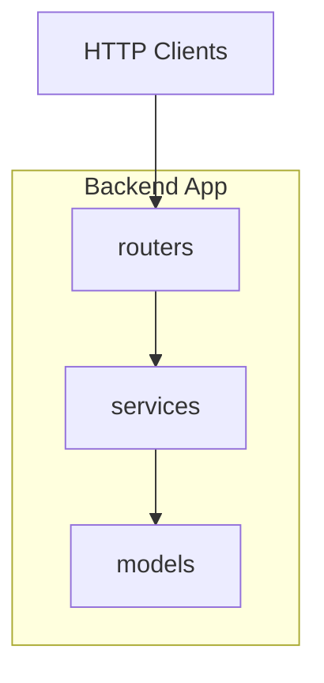
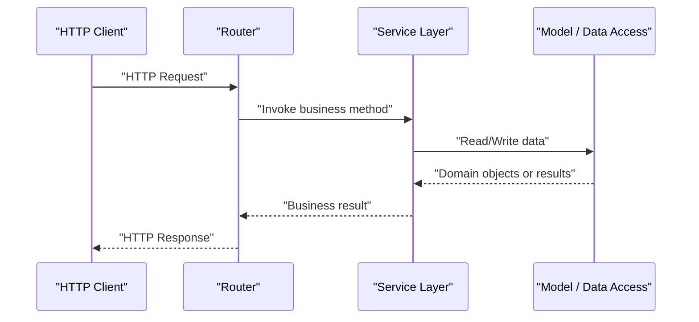
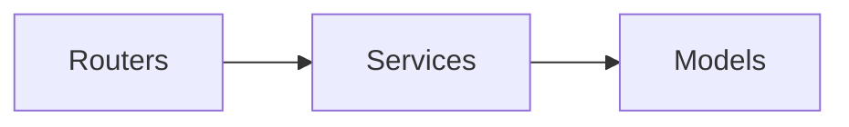

# Project Overview

<cite>
**Referenced Files in This Document**
- [.gitignore](file://.gitignore)
</cite>

## Table of Contents
1. [Introduction](#introduction)
2. [Project Structure](#project-structure)
3. [Core Components](#core-components)
4. [Architecture Overview](#architecture-overview)
5. [Detailed Component Analysis](#detailed-component-analysis)
6. [Dependency Analysis](#dependency-analysis)
7. [Performance Considerations](#performance-considerations)
8. [Troubleshooting Guide](#troubleshooting-guide)
9. [Conclusion](#conclusion)

## Introduction
GoNow is a Python backend application skeleton designed to help developers quickly scaffold modular, maintainable RESTful API services. It emphasizes a layered architecture and service-oriented design, providing clear separation of concerns across routing, business logic, and data access layers. The project follows an MVC-inspired structure where routers handle HTTP concerns, services encapsulate business rules, and models represent domain data and persistence interactions.

This foundation supports building robust APIs by:
- Enforcing separation of concerns between request handling, business logic, and data access
- Encouraging reusable service components that can be composed across endpoints
- Providing a predictable request flow from HTTP entry points through routers to services and models
- Keeping configuration and environment management simple via standard .env patterns

The repository includes a .gitignore file that outlines typical Python, Node, IDE, OS, and log artifacts to exclude from version control, indicating a modern development workflow with both backend and potential frontend tooling.

**Section sources**
- [.gitignore:1-36](file://.gitignore#L1-L36)

## Project Structure
At a high level, the backend app is organized into feature-focused directories:
- models: Data models and persistence-related code
- routers: HTTP route definitions and request/response mapping
- services: Business logic and orchestration layer

[No sources needed since this diagram shows conceptual structure]

## Core Components
- Layered Architecture: The codebase separates responsibilities into distinct layers—routing, service, and model—to improve testability, readability, and scalability.
- Service Layer Pattern: Business logic is centralized in services, making it easier to reuse logic across multiple routes and to unit-test core behavior independently of HTTP concerns.
- MVC-Inspired Structure: Routers act as controllers that translate HTTP requests into service calls; models represent domain entities and data access; views are not present in this backend-only skeleton.
- Modular Design: Each directory represents a cohesive module, encouraging small, focused packages that can evolve independently.

These patterns collectively support building RESTful APIs with clear boundaries, predictable data flow, and straightforward extension points for new features.

[No sources needed since this section provides general guidance]

## Architecture Overview
The following sequence illustrates the expected data flow for a typical REST endpoint:

[No sources needed since this diagram shows conceptual workflow]

## Detailed Component Analysis

### Routers
Responsibilities:
- Define HTTP endpoints and map them to service methods
- Parse and validate incoming request parameters
- Transform service responses into appropriate HTTP status codes and payloads

Expected behavior:
- Keep routing thin by delegating business logic to services
- Centralize error mapping and response formatting at this layer

[No sources needed since this section provides general guidance]

### Services
Responsibilities:
- Implement business rules and workflows
- Orchestrate calls to one or more models
- Handle cross-cutting concerns such as validation, transformation, and transactional boundaries

Expected behavior:
- Remain independent of HTTP details
- Be easily unit-tested with mock models

[No sources needed since this section provides general guidance]

### Models
Responsibilities:
- Represent domain entities and schemas
- Interact with storage backends (e.g., databases, external APIs)
- Provide consistent interfaces for data retrieval and mutation

Expected behavior:
- Expose clear methods for CRUD operations
- Encapsulate persistence-specific logic

[No sources needed since this section provides general guidance]

### Practical Example: End-to-End Data Flow
Consider a GET request to retrieve a resource:
- The client sends an HTTP GET to a router-defined path
- The router validates query/path parameters and delegates to a service method
- The service queries the model to fetch the entity
- The model returns a domain object
- The service applies any necessary transformations and returns the result
- The router maps the result to an HTTP 200 response with JSON payload

For a POST request to create a resource:
- The client sends an HTTP POST with a JSON body
- The router parses and validates the input
- The router invokes a service method to create the entity
- The service interacts with the model to persist the data
- The model confirms success and returns the created entity
- The router responds with an appropriate status (e.g., 201 Created) and representation

[No sources needed since this section provides general guidance]

## Dependency Analysis
Conceptual dependency direction:
- Routers depend on services
- Services depend on models
- Models should remain independent of HTTP and routing concerns

[No sources needed since this diagram shows conceptual dependencies]

## Performance Considerations
- Keep routers lightweight to minimize overhead per request
- Cache frequently accessed data at the service or model layer when appropriate
- Use efficient queries and batch operations in models to reduce I/O latency
- Avoid heavy computations in routers; delegate to services for better testability and caching opportunities

[No sources needed since this section provides general guidance]

## Troubleshooting Guide
Common issues and strategies:
- Misrouted requests: Verify router paths and parameter extraction align with client expectations
- Business logic errors: Add logging and assertions in services to trace state transitions
- Data access failures: Ensure models surface meaningful exceptions and handle connection errors gracefully
- Environment configuration: Confirm .env files are correctly loaded and validated before startup

[No sources needed since this section provides general guidance]

## Conclusion
GoNow provides a clean, modular foundation for building Python-based RESTful APIs using layered architecture and the service layer pattern. By separating routing, business logic, and data access, teams can develop features incrementally while maintaining clarity and testability. The MVC-inspired structure and modular design make it straightforward to onboard new contributors and scale the application over time.

[No sources needed since this section summarizes without analyzing specific files]