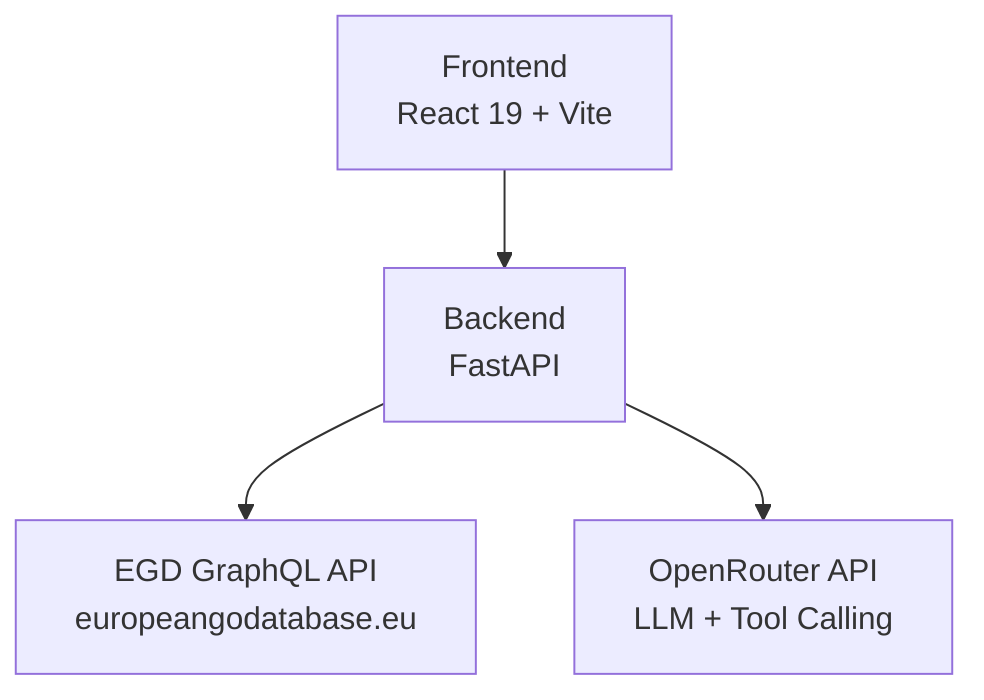
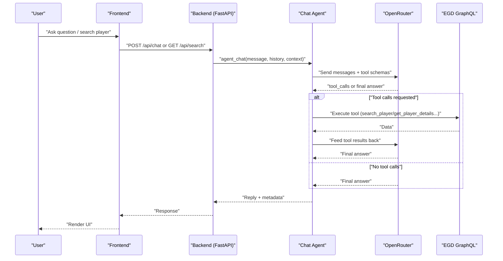
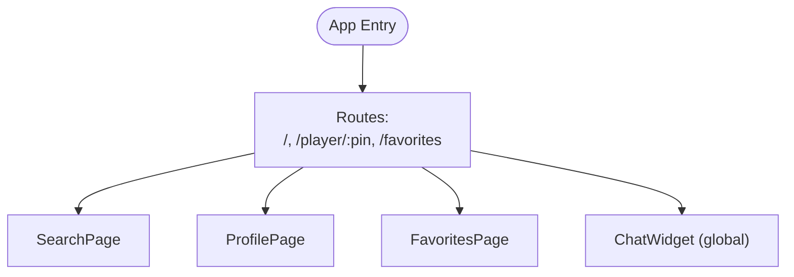
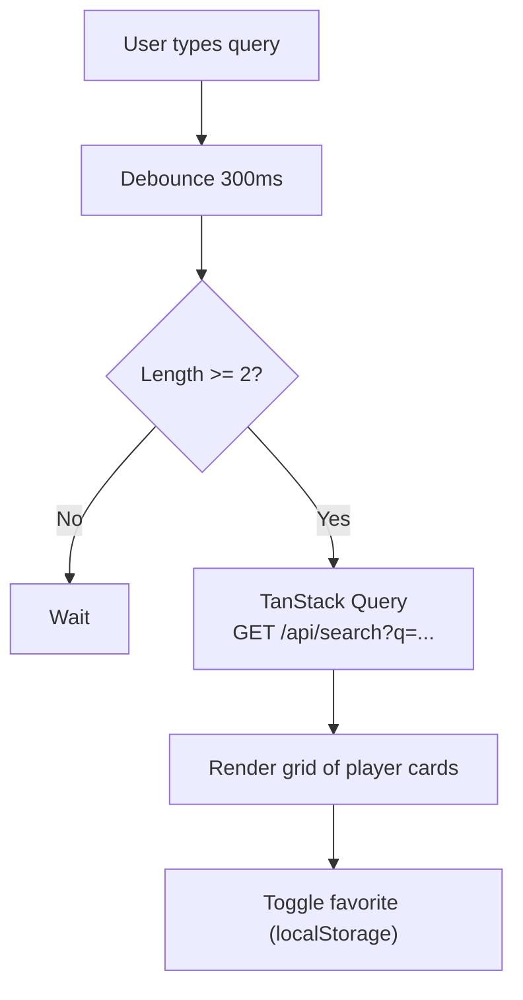
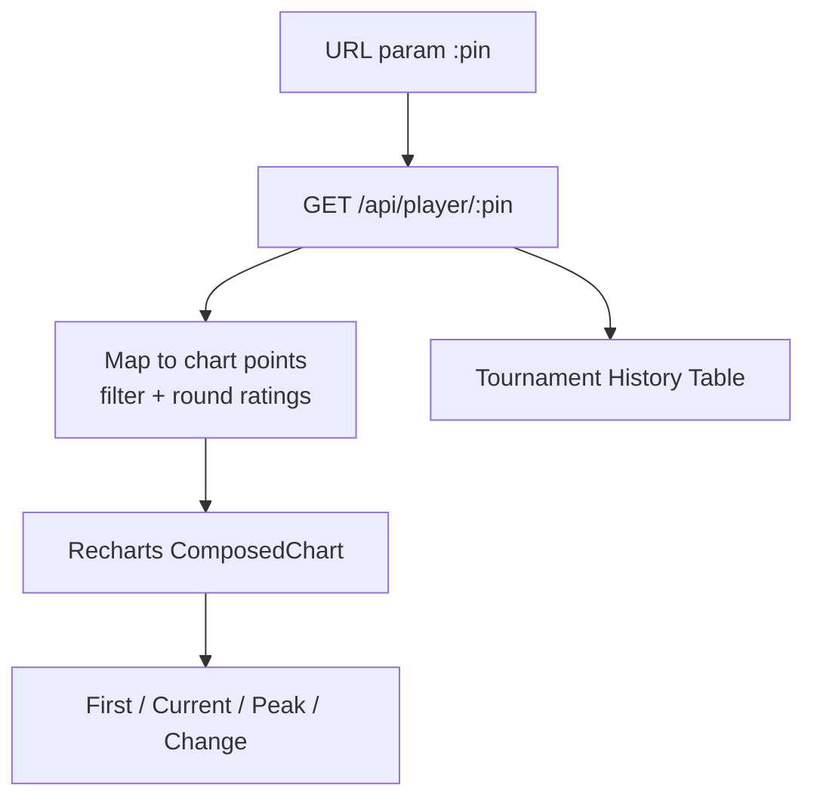
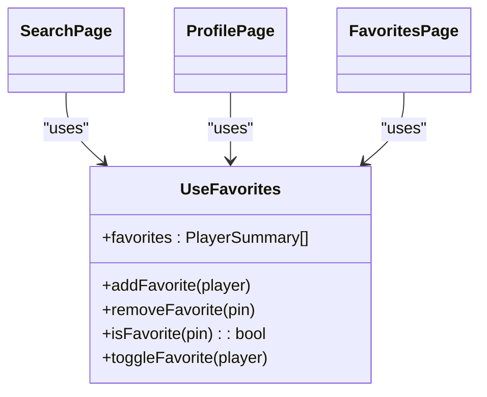
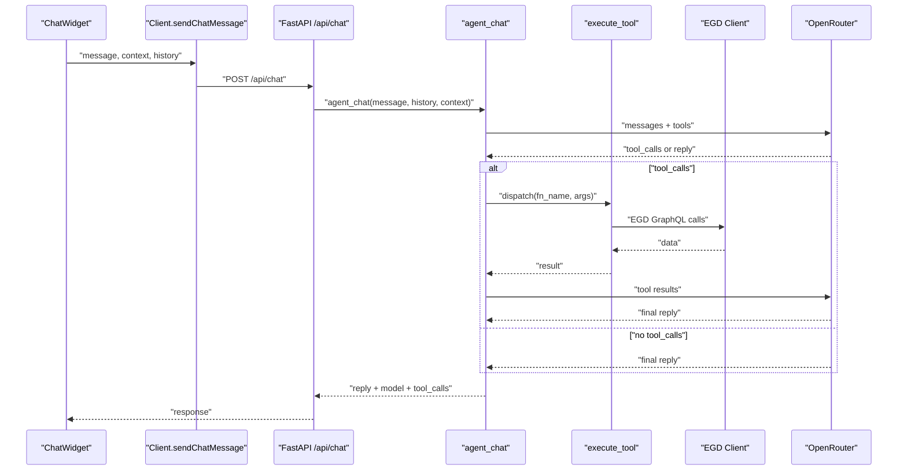
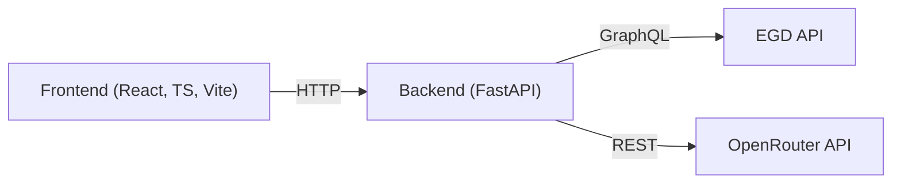

# Project Overview

<cite>
**Referenced Files in This Document**
- [README.md](file://README.md)
- [ARCHITECTURE.md](file://docs/ARCHITECTURE.md)
- [AGENT_DESIGN.md](file://docs/AGENT_DESIGN.md)
- [main.py](file://backend/app/main.py)
- [requirements.txt](file://backend/requirements.txt)
- [package.json](file://frontend/package.json)
- [App.tsx](file://frontend/src/App.tsx)
- [client.ts](file://frontend/src/api/client.ts)
- [SearchPage.tsx](file://frontend/src/pages/SearchPage.tsx)
- [ProfilePage.tsx](file://frontend/src/pages/ProfilePage.tsx)
- [FavoritesPage.tsx](file://frontend/src/pages/FavoritesPage.tsx)
- [useFavorites.ts](file://frontend/src/hooks/useFavorites.ts)
- [ChatWidget.tsx](file://frontend/src/components/ChatWidget.tsx)
- [chat.py](file://backend/app/routers/chat.py)
- [chat_agent.py](file://backend/app/services/chat_agent.py)
- [egd_client.py](file://backend/app/services/egd_client.py)
</cite>

## Table of Contents
1. Introduction
2. Project Structure
3. Core Components
4. Architecture Overview
5. Detailed Component Analysis
6. Dependency Analysis
7. Performance Considerations
8. Troubleshooting Guide
9. Conclusion

## Introduction
GoNow is a full-stack web application that helps Go players explore and track European Go player progress over time. It connects to the European Go Database (EGD) via GraphQL, provides an intuitive search and profile experience with rating evolution charts, supports local favorites management, and includes an AI-powered chat assistant that can autonomously look up real player data through tool calling. The platform serves both casual Go players who want quick insights and serious tournament participants who need detailed performance tracking and comparisons.

Key goals:
- Make EGD data accessible and actionable for all skill levels
- Provide fast, typo-tolerant player search and rich profile visualizations
- Enable persistent favorites without requiring accounts or servers
- Offer an agentic chat assistant grounded in live EGD data

Unique value proposition:
- A Go-themed, privacy-friendly interface focused on Europe’s Go community
- Real-time, server-side access to EGD data behind a secure backend proxy
- Native tool calling so the assistant reasons about when to query data and returns concise, contextual answers

Target audience:
- Casual players seeking quick stats and learning resources
- Club members and coaches monitoring player development
- Tournament participants analyzing trends and comparing peers

**Section sources**
- [README.md:1-20](file://README.md#L1-L20)
- [ARCHITECTURE.md:1-20](file://docs/ARCHITECTURE.md#L1-L20)

## Project Structure
The repository is organized into frontend and backend layers with clear separation of concerns:
- Frontend: React 19 + TypeScript app built with Vite, routing, state caching, and Recharts visualizations
- Backend: FastAPI service exposing REST endpoints, proxying EGD GraphQL calls, and orchestrating OpenRouter tool-calling for chat
- Shared docs: Architecture and agent design references

**Diagram sources**
- [ARCHITECTURE.md:7-33](file://docs/ARCHITECTURE.md#L7-L33)
- [README.md:26-53](file://README.md#L26-L53)

**Section sources**
- [README.md:57-90](file://README.md#L57-L90)
- [ARCHITECTURE.md:43-81](file://docs/ARCHITECTURE.md#L43-L81)

## Core Components
- Player Search: Typo-tolerant search by name or PIN with debounced queries and cached results
- Player Profiles: Detailed info including photo, grade, rating, proposed grade, and tournament history
- Rating Evolution Charts: Interactive charts showing rating changes across tournaments
- Favorites Management: Local storage-backed list of tracked players
- Agentic Chat Assistant: Floating widget that uses OpenRouter tool calling to fetch and summarize real EGD data

Technology stack highlights:
- Frontend: React 19, TypeScript, Vite, React Router, Recharts, TanStack Query
- Backend: Python 3.14, FastAPI, httpx, Pydantic
- Data Source: EGD GraphQL API v2026.02
- AI: OpenRouter API with native tool calling

**Section sources**
- [README.md:14-23](file://README.md#L14-L23)
- [package.json:12-19](file://frontend/package.json#L12-L19)
- [requirements.txt:1-6](file://backend/requirements.txt#L1-L6)
- [ARCHITECTURE.md:35-41](file://docs/ARCHITECTURE.md#L35-L41)

## Architecture Overview
GoNow follows a simple, robust architecture:
- The frontend communicates with the backend via HTTP
- The backend proxies all EGD GraphQL requests to keep tokens server-side
- The chat route delegates to an agent loop that uses OpenRouter’s native tool calling to decide when to call EGD tools, execute them server-side, and return final answers

**Diagram sources**
- [chat_agent.py:30-154](file://backend/app/services/chat_agent.py#L30-L154)
- [chat.py:9-24](file://backend/app/routers/chat.py#L9-L24)
- [README.md:26-53](file://README.md#L26-L53)

## Detailed Component Analysis

### Frontend Application Shell
- Provides routing, global query client configuration, and shared navigation
- Mounts pages for search, player profiles, and favorites
- Includes a floating chat widget available across routes

**Diagram sources**
- [App.tsx:18-36](file://frontend/src/App.tsx#L18-L36)

**Section sources**
- [App.tsx:1-37](file://frontend/src/App.tsx#L1-37)

### Player Search
- Debounced input reduces unnecessary network calls
- Uses TanStack Query for caching and error states
- Displays cards with grade stones, flags, ratings, and favorite toggles

**Diagram sources**
- [SearchPage.tsx:13-28](file://frontend/src/pages/SearchPage.tsx#L13-L28)
- [client.ts:59-62](file://frontend/src/api/client.ts#L59-L62)
- [useFavorites.ts:6-18](file://frontend/src/hooks/useFavorites.ts#L6-L18)

**Section sources**
- [SearchPage.tsx:1-148](file://frontend/src/pages/SearchPage.tsx#L1-148)
- [client.ts:59-62](file://frontend/src/api/client.ts#L59-L62)

### Player Profile and Rating Evolution
- Fetches detailed player data and builds chart-ready dataset
- Renders interactive Recharts composed chart with peak reference line and tooltips
- Shows tournament history table with deltas and placement

**Diagram sources**
- [ProfilePage.tsx:16-20](file://frontend/src/pages/ProfilePage.tsx#L16-L20)
- [ProfilePage.tsx:44-58](file://frontend/src/pages/ProfilePage.tsx#L44-L58)
- [client.ts:64-67](file://frontend/src/api/client.ts#L64-L67)

**Section sources**
- [ProfilePage.tsx:1-239](file://frontend/src/pages/ProfilePage.tsx#L1-L239)

### Favorites Management
- Persists favorites in localStorage with a custom hook
- Supports add/remove/toggle and presence checks
- Used across search and profile pages

**Diagram sources**
- [useFavorites.ts:6-48](file://frontend/src/hooks/useFavorites.ts#L6-L48)
- [SearchPage.tsx:10-12](file://frontend/src/pages/SearchPage.tsx#L10-L12)
- [ProfilePage.tsx:14](file://frontend/src/pages/ProfilePage.tsx#L14)
- [FavoritesPage.tsx:4-6](file://frontend/src/pages/FavoritesPage.tsx#L4-L6)

**Section sources**
- [useFavorites.ts:1-49](file://frontend/src/hooks/useFavorites.ts#L1-L49)
- [FavoritesPage.tsx:1-63](file://frontend/src/pages/FavoritesPage.tsx#L1-L63)

### Agentic Chat Assistant
- Floating widget sends user messages and maintains conversation history
- Backend agent loop uses OpenRouter’s native tool calling to decide when to call EGD tools
- Tools are executed server-side; results are fed back until a final answer is produced

**Diagram sources**
- [ChatWidget.tsx:16-37](file://frontend/src/components/ChatWidget.tsx#L16-L37)
- [client.ts:74-85](file://frontend/src/api/client.ts#L74-L85)
- [chat.py:9-24](file://backend/app/routers/chat.py#L9-L24)
- [chat_agent.py:30-154](file://backend/app/services/chat_agent.py#L30-L154)
- [egd_client.py:11-42](file://backend/app/services/egd_client.py#L11-L42)

**Section sources**
- [ChatWidget.tsx:1-150](file://frontend/src/components/ChatWidget.tsx#L1-150)
- [chat.py:1-25](file://backend/app/routers/chat.py#L1-L25)
- [chat_agent.py:1-154](file://backend/app/services/chat_agent.py#L1-L154)
- [AGENT_DESIGN.md:1-68](file://docs/AGENT_DESIGN.md#L1-L68)

## Dependency Analysis
High-level dependencies:
- Frontend depends on React ecosystem, Axios, TanStack Query, and Recharts
- Backend depends on FastAPI, httpx, Pydantic, and environment-driven config
- External services: EGD GraphQL API and OpenRouter

**Diagram sources**
- [package.json:12-19](file://frontend/package.json#L12-L19)
- [requirements.txt:1-6](file://backend/requirements.txt#L1-L6)
- [ARCHITECTURE.md:35-41](file://docs/ARCHITECTURE.md#L35-L41)

**Section sources**
- [package.json:1-30](file://frontend/package.json#L1-L30)
- [requirements.txt:1-6](file://backend/requirements.txt#L1-L6)

## Performance Considerations
- Debounced search reduces request volume
- TanStack Query caches responses and retries minimally
- Backend in-memory cache with TTL reduces repeated EGD calls
- Configurable model and iteration limits balance speed and cost for chat

[No sources needed since this section provides general guidance]

## Troubleshooting Guide
Common issues and resolutions:
- Missing API keys: Ensure OPENROUTER_API_KEY and EGD_API_TOKEN are set in backend .env
- CORS errors: Verify allowed origins include your dev frontend URL
- Chat disabled: If no key is present, the chat returns a friendly message indicating configuration is required
- Network timeouts: Increase timeout or check connectivity to external APIs

**Section sources**
- [main.py:20-27](file://backend/app/main.py#L20-L27)
- [chat.py:50-55](file://backend/app/routers/chat.py#L50-L55)
- [chat_agent.py:42-48](file://backend/app/services/chat_agent.py#L42-L48)

## Conclusion
GoNow delivers a focused, Go-themed analytics platform tailored to the European Go community. By combining a modern React frontend, a lightweight FastAPI backend, and an agentic chat assistant powered by OpenRouter, it offers powerful yet approachable features for players at all levels. Its architecture keeps sensitive credentials server-side, leverages efficient caching, and provides a clear path for future enhancements such as expanded tooling or advanced analysis capabilities.

[No sources needed since this section summarizes without analyzing specific files]